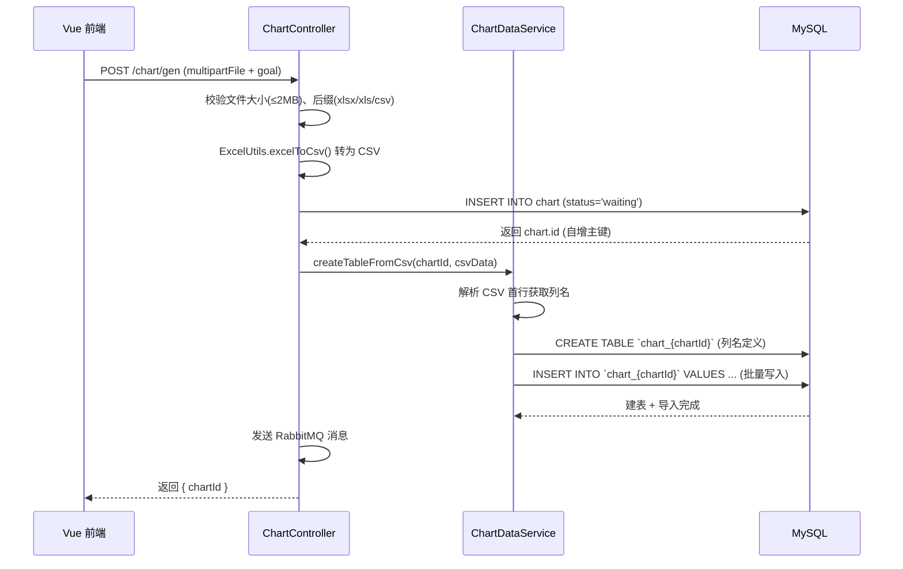

每个上传的 CSV/Excel 文件，都会在 MySQL 中拥有一张专属的数据库表。这种「一图表一表」的设计，既是数据隔离的基础保障，也是后续灵活查询、筛选与扩展的架构基石。本文将深入剖析这套动态分表策略的设计动机、实现机制与安全防护体系。

## 设计动机：为什么需要动态分表？

在 BI 系统的架构决策中，原始数据的存储方式直接影响系统的可维护性与查询性能。三种常见方案的对比如下：

| 方案 | 优势 | 劣势 | 适用场景 |
|------|------|------|----------|
| 全量存储在 chart 表的 chartData 字段中 | 实现简单，无额外表 | CSV 文本无法按列查询筛选；数据量增大后性能急剧下降；无法利用数据库索引 | 仅展示不做分析的简单场景 |
| 统一的大宽表存储所有图表数据 | 表结构固定，ORM 友好 | 列数不可控；不同图表的列名不同导致大量空值；数据隔离困难 | 数据格式高度统一的场景 |
| **一图表一表（本方案）** | 天然数据隔离；列名与原始数据一致；支持按列筛选、聚合查询；删除图表时连带清理 | 表数量随图表增长；需使用 JDBC 动态 SQL | 多租户、异构数据的 BI 系统 |

本系统选择了第三种方案。每个图表生成的原始数据，不再以文本形式躺在 `chart.chartData` 字段中，而是被解析为结构化的数据库表，表名格式为 `chart_{chartId}`，其中 `chartId` 是该图表在 `chart` 表中的自增主键。Sources: [ChartDataService.java](lunesnow-IntelligentBI-backend/src/main/java/com/lunesnow/service/ChartDataService.java#L23-L27), [ChartDataServiceImpl.java](lunesnow-IntelligentBI-backend/src/main/java/com/lunesnow/service/impl/ChartDataServiceImpl.java#L44-L46)

## 动态表创建流程

### 核心时序

下图展示了从文件上传到动态表创建完成的完整时序：



这个时序揭示了一个关键设计决策：**动态建表发生在消息入队之前，而非 AI 处理完成之后**。这意味着即使 AI 异步处理尚未开始，原始数据已经安全地落盘到独立的数据库表中，不会因为消息丢失或消费失败而丢失数据。Sources: [ChartController.java](lunesnow-IntelligentBI-backend/src/main/java/com/lunesnow/controller/ChartController.java#L281-L323)

### 解析 CSV 与列名提取

`createTableFromCsv` 方法接收两个参数：`chartId`（用于生成表名）和 `csvData`（ExcelUtils 转换后的 CSV 字符串）。处理过程分为三步：

**第一步：解析列名** — CSV 的第一行为表头，`parseColumns` 方法按逗号拆分后，依次经过空值过滤（排除空字符串和 `"null"` 文本）和列名消毒（`sanitizeColumnName`）两个阶段。消毒规则为：只保留字母、数字、下划线和中文，其余字符替换为下划线；若以数字开头则添加 `col_` 前缀；若结果为空则使用 `col_empty` 兜底。Sources: [ChartDataServiceImpl.java](lunesnow-IntelligentBI-backend/src/main/java/com/lunesnow/service/impl/ChartDataServiceImpl.java#L253-L275)

**第二步：动态建表** — `createTable` 方法使用 `JdbcTemplate.execute()` 执行原生 SQL。建表语句的列定义全部采用 `VARCHAR(255)` 类型，这是有意为之的简化设计：原始数据在落盘时不做类型推断，统一以字符串形式存储，保证了兼容性。表引擎固定为 `InnoDB`，字符集为 `utf8mb4`。Sources: [ChartDataServiceImpl.java](lunesnow-IntelligentBI-backend/src/main/java/com/lunesnow/service/impl/ChartDataServiceImpl.java#L203-L213)

**第三步：批量插入数据** — `insertData` 方法遍历 CSV 的剩余行（从第二行开始），使用参数化查询（`?` 占位符）逐行拼接批量 INSERT 语句。这里的关键技术选择是**参数化绑定而非字符串拼接**——所有数据值通过 `params` 列表传入 `jdbcTemplate.update(sql, params.toArray())`，由 MySQL JDBC 驱动来处理类型转义，从根本上杜绝了 SQL 注入。Sources: [ChartDataServiceImpl.java](lunesnow-IntelligentBI-backend/src/main/java/com/lunesnow/service/impl/ChartDataServiceImpl.java#L219-L249)

### 异常回滚与数据一致性

动态建表过程采用「失败即回滚」的策略。如果 `createTableFromCsv` 过程中任何一步抛出异常（包括列名解析失败、建表 SQL 异常、数据插入异常等），`catch` 块会立即调用 `dropTable(chartId)` 清理已创建的表，防止产生残缺的孤儿表。这与 `ChartController` 中的 `deleteChart` 方法形成了「创建时回滚清理、删除时主动清理」的双重保障。Sources: [ChartDataServiceImpl.java](lunesnow-IntelligentBI-backend/src/main/java/com/lunesnow/service/impl/ChartDataServiceImpl.java#L58-L80), [ChartController.java](lunesnow-IntelligentBI-backend/src/main/java/com/lunesnow/controller/ChartController.java#L85-L97)

## 数据查询与筛选体系

### 接口路由映射

动态表的数据查询通过三个 RESTful 端点暴露给前端：

| 端点 | 方法 | 功能 | 核心实现 |
|------|------|------|----------|
| `/chart/get/data/{chartId}` | GET | 查询图表全部原始数据 | `jdbcTemplate.queryForList("SELECT * FROM chart_{id}")` |
| `/chart/get/data/{chartId}/filter` | POST | 带筛选条件查询 | 遍历 filters Map 拼接 LIKE 条件 |
| `/chart/get/data/{chartId}/column/{columnName}` | GET | 获取某列唯一值 | `SELECT DISTINCT col FROM chart_{id}` |

所有数据查询端点都要求**用户身份验证**和**数据归属校验**——只有图表所有者或管理员才有权访问。Sources: [ChartController.java](lunesnow-IntelligentBI-backend/src/main/java/com/lunesnow/controller/ChartController.java#L434-L529)

### 筛选功能的 SQL 注入防御

`getTableDataWithFilter` 方法展示了多层防御的经典实践。当前端传入 `filters`（一个 `Map<String, String>`，key 为列名，value 为筛选关键字）时，服务端会执行以下校验：

1. **白名单校验** — 通过 `getTableColumns(tableName)` 从 `information_schema.COLUMNS` 中查询实际的列名集合，然后将前端传入的列名与之比对，不在白名单中的列名直接跳过
2. **参数化查询** — 筛选值通过 `?` 占位符传入，即使包含恶意的 SQL 片段也不会被解释执行
3. **LIKE 模糊匹配** — 使用 `LIKE ?` 配合 `%value%` 模式，在安全的前提下提供灵活的文本搜索能力

这种「白名单列名 + 参数化值」的组合模式，既保证了列名层面的灵活查询，又杜绝了 SQL 注入的风险。Sources: [ChartDataServiceImpl.java](lunesnow-IntelligentBI-backend/src/main/java/com/lunesnow/service/impl/ChartDataServiceImpl.java#L124-L157)

## 表生命周期管理

### 创建与删除的对称性

动态表的生命周期与 `chart` 表中的记录严格绑定：

```
图表创建 → chart 表 INSERT → chart_{id} 表 CREATE
图表删除 → chart 表 DELETE → chart_{id} 表 DROP
图表重试 → 复用已有 chart_{id} 表（数据已存在）
```

删除操作在 `ChartController.deleteChart` 中实现：首先校验当前用户是否为图表所有者或管理员，然后依次调用 `chartDataService.dropTable(id)` 删除动态表，最后调用 `chartService.removeById(id)` 删除 chart 记录。这种顺序保证了一旦动态表删除失败，chart 记录不会被删除，系统仍处于可重试的一致状态。Sources: [ChartController.java](lunesnow-IntelligentBI-backend/src/main/java/com/lunesnow/controller/ChartController.java#L85-L97)

### 表存在性检查

`isTableExists` 方法通过查询 `information_schema.tables` 来判断表是否存在，而不是直接执行 `SELECT * FROM chart_{id}` 并通过异常来推断。这种设计避免了不必要的异常抛出的性能开销，也使控制流更加清晰。Sources: [ChartDataServiceImpl.java](lunesnow-IntelligentBI-backend/src/main/java/com/lunesnow/service/impl/ChartDataServiceImpl.java#L317-L323)

## 安全纵深防御体系

动态分表场景下的安全风险主要集中在 SQL 注入和越权访问两个维度。系统的防御体系如下：

```mermaid
flowchart LR
    subgraph 输入层
        A1[文件上传] --> A2[大小校验 ≤2MB]
        A2 --> A3[后缀白校验 xlsx/xls/csv]
    end
    
    subgraph 建表层
        B1[CSV 列名解析] --> B2[列名消毒 sanitizeColumnName]
        B2 --> B3[仅保留字母/数字/下划线/中文]
        B3 --> B4[DROP IF EXISTS 回滚清理]
    end
    
    subgraph 查询层
        C1[列名白名单校验] --> C2[information_schema 查询]
        C2 --> C3[参数化占位符 ?]
        C3 --> C4[LIKE 模糊匹配绑定]
    end
    
    subgraph 权限层
        D1[用户身份认证] --> D2[数据归属校验]
        D2 --> D3[所有者/管理员 二选一]
    end
    
    A3 --> B1
    B4 --> C1
    C4 --> D1
```



这种分层防御确保了一旦某一层的防护被绕过，后续的防御层仍然能够阻止攻击。特别值得注意的是列名消毒在列名层面的前置防御，与白名单校验在后置防御上的互补关系——即便列名消毒存在未覆盖的边缘情况，白名单校验也能在查询阶段拦截非法列名。Sources: [ChartDataServiceImpl.java](lunesnow-IntelligentBI-backend/src/main/java/com/lunesnow/service/impl/ChartDataServiceImpl.java#L265-L275)

## 架构权衡与优化方向

当前方案在以下方面做出了明确的权衡：

**统一 VARCHAR(255) 类型** — 放弃了对数值类型、日期类型的精准建模，换取了建表流程的简单可靠和类型兼容性。代价是丧失了数据库层面的数值排序和日期函数能力，数据类型的转换工作被推到了应用层或前端 ECharts 渲染层。如果未来需要支持更复杂的聚合查询（如 SUM、AVG），可以考虑在 `createTable` 阶段增加类型推断逻辑。

**JdbcTemplate 直连 vs MyBatis-Plus** — 由于动态表的列名在编译时未知，无法像 `chart` 表那样使用 MyBatis-Plus 的实体映射。代码中通过 `jdbcTemplate.queryForList` 返回 `List<Map<String, Object>>` 这种无模型的松散结构，由上层调用方按需处理。这是动态 Schema 场景下的常见选择，在灵活性上做出了正确取舍。

**表数量增长管理** — 每个图表对应一张独立表，当系统运行多年后，数据库中的表数量可能达到数千甚至上万张。虽然 MySQL 在表数量上的支持能力很强（InnoDB 理论上支持数亿张表），但过高的表数量会影响 `SHOW TABLES` 等管理操作的性能。建议在后续版本中增加归档机制，将长期未访问的图表数据迁移至冷存储或归档表中。

**关联阅读**：数据从文件上传到动态建表的完整链路，请参见[完整数据流水线](6-wan-zheng-shu-ju-liu-shui-xian-cong-shang-chuan-csv-excel-dao-echarts-tu-biao-de-quan-lian-lu-zhui-zong)；SQL 注入防护的另一道防线（排序字段校验），请参见[SQL 注入防护](13-sql-zhu-ru-fang-hu-lie-ming-bai-ming-dan-xiao-yan-yu-an-quan-cha-xun-gou-jian)；控制器中触发动态建表的完整上下文，请参见[图表生成控制器](7-tu-biao-sheng-cheng-kong-zhi-qi-wen-jian-xiao-yan-dong-tai-jian-biao-ren-wu-xian-liu-yu-yi-bu-ti-jiao)。