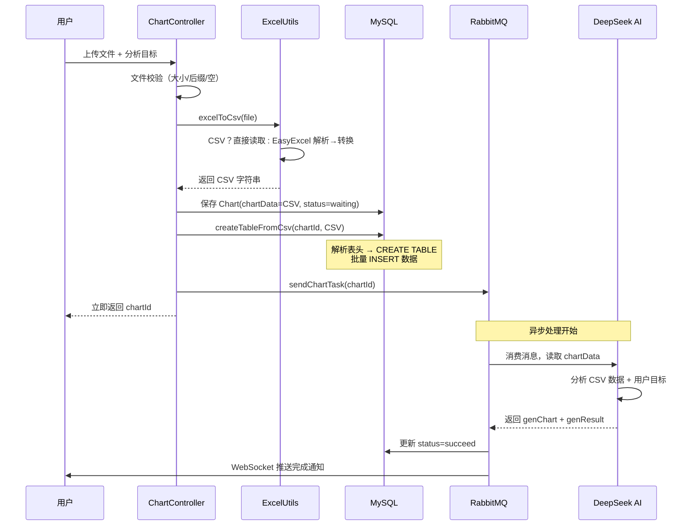

在智能 BI 系统中，文件解析是数据流水线的第一道关卡。用户上传的 Excel（`.xlsx`/`.xls`）或 CSV 文件需要被解析为统一的中间格式，才能同时满足两个下游需求：存入 MySQL 动态表供前端查询筛选，以及作为原始数据传递给 DeepSeek AI 生成 ECharts 配置。本文深入拆解基于 **EasyExcel + Apache POI** 的解析引擎、CSV 统一格式转换策略，以及从文件头到数据库落地的全链路设计。

Sources: [ExcelUtils.java](lunesnow-IntelligentBI-backend/src/main/java/com/lunesnow/utils/ExcelUtils.java#L1-L81), [ChartDataServiceImpl.java](lunesnow-IntelligentBI-backend/src/main/java/com/lunesnow/service/impl/ChartDataServiceImpl.java#L1-L327)

## 一、架构定位：文件解析在数据流水线中的角色

在完整的图表生成数据流中，文件解析位于**控制器层校验之后的第一个处理节点**。下图展示了文件从上传到持久化的完整环节：

```mermaid
flowchart TD
    A[用户上传文件<br/>MultipartFile] --> B{文件校验}
    B --> |后缀校验| C[允许 xlsx/xls/csv]
    B --> |大小校验| D[最大 2MB]
    B --> |空文件校验| E[拒绝空内容]
    C --> F[ExcelUtils.excelToCsv]
    D --> F
    E --> F
    F --> G{文件类型判断}
    G --> |CSV 文件| H[UTF-8 字节直接读取]
    G --> |Excel 文件| I[EasyExcel 流式解析<br/>doReadSync 同步读取]
    H --> J[统一 CSV 字符串]
    I --> J
    J --> K[存入 Chart.chartData<br/>供 AI 消费]
    J --> L[ChartDataService<br/>createTableFromCsv]
    L --> M[解析表头→构建 CREATE TABLE]
    M --> N[数据行 → 批量 INSERT]
    N --> O[动态表 chart_{id}<br/>供前端查询/筛选]
```

文件解析的核心产出是一个**统一的 CSV 字符串**：CSV 文件直接读取字节内容，Excel 文件则先通过 EasyExcel 解析为 `List<Map<Integer, String>>`，再手动拼接为 CSV 格式。这种设计保证了上游调用方（控制器层）只需处理一种数据格式，而不需关注底层文件类型的差异。

Sources: [ChartController.java](lunesnow-IntelligentBI-backend/src/main/java/com/lunesnow/controller/ChartController.java#L241-L290), [ExcelUtils.java](lunesnow-IntelligentBI-backend/src/main/java/com/lunesnow/utils/ExcelUtils.java#L14-L81)

## 二、EasyExcel 解析引擎：核心能力与配置要点

### 2.1 依赖选型：为什么选择 EasyExcel

项目使用 **EasyExcel 3.1.1**（com.alibaba:easyexcel）作为 Excel 解析引擎，同时依赖 **Apache POI**（EasyExcel 的底层依赖）处理 OOXML 格式。相比直接使用 POI，EasyExcel 的优势体现在：

| 对比维度 | EasyExcel | 原生 POI |
|---------|-----------|----------|
| 内存模型 | 流式读取（SAX），逐行解析 | DOM 模式，整个文档加载到内存 |
| 大文件处理 | 百 MB 文件仅需数十 MB 堆内存 | 大文件易触发 OOM |
| API 简洁度 | 链式调用，一行完成读取配置 | 需要 Workbook→Sheet→Row→Cell 手动迭代 |
| 注解支持 | `@ExcelProperty` 映射 POJO | 需手动 Cell 类型判断 |

对于智能 BI 场景，用户上传的 Excel 文件通常列数不多（几十列以内）但行数可能较多（数万行），EasyExcel 的流式读取恰好契合这一需求模式。

Sources: [pom.xml](lunesnow-IntelligentBI-backend/pom.xml#L99-L102)

### 2.2 EasyExcel 读取配置深度解析

`ExcelUtils.excelToCsv` 方法中的 EasyExcel 调用链是一条典型的**同步读取配置**：

```java
data = EasyExcel.read(multipartFile.getInputStream())  // ① 输入流
        .excelType(ExcelTypeEnum.XLSX)                  // ② 指定 Excel 类型
        .sheet()                                        // ③ 读取第一个工作表
        .headRowNumber(0)                               // ④ 表头行号
        .doReadSync();                                  // ⑤ 同步读取全部数据
```

每个环节的设计意图：

**① 输入流**：从 `MultipartFile.getInputStream()` 获取，而非直接读取文件到内存。这使得文件可以从 HTTP 请求流中直接消费，避免先将整个文件写入磁盘再读取的两阶段开销。

**② `excelType(ExcelTypeEnum.XLSX)`**：这里指定为 XLSX。但需要注意，EasyExcel 支持自动检测格式（不显式指定时根据文件后缀推断）。当前代码硬编码为 XLSX 意味着**仅支持 .xlsx 格式的 Excel**，.xls（老版 HSSFWorkbook）虽然被允许上传，但解析时可能因类型不匹配而触发异常捕获逻辑。

**③ `.sheet()`**：无参调用表示读取**第一个工作表**。如果用户上传的多工作表 Excel 仅第一个 sheet 有数据，这是合理默认值。但若数据分布在后续 sheet，当前策略会漏读。

**④ `headRowNumber(0)`**：这是一个关键的配置参数——**指定表头从第 0 行开始**。在 EasyExcel 中，设置 `headRowNumber(0)` 的含义是：不将任何行视为表头，所有行（包括第一行）都作为数据行读取。这导致返回的 `List<Map<Integer, String>>` 中，**索引 0 的数据行实际上是 Excel 的第一行（列名行）**。

**⑤ `doReadSync()`**：同步读取所有数据到内存中的 `List`。EasyExcel 也支持 `doReadAll()` 配合 `ReadListener` 的异步逐行消费模式，但当前需求是将整个数据集转换为 CSV 字符串，因此同步读取更简单直接。

Sources: [ExcelUtils.java](lunesnow-IntelligentBI-backend/src/main/java/com/lunesnow/utils/ExcelUtils.java#L35-L48)

### 2.3 返回值结构：Map<Integer, String> 的含义

`EasyExcel.read().doReadSync()` 返回 `List<Map<Integer, String>>`，这是一个**按行组织的二维结构**：

```
[
  {0: "日期",   1: "月份",  2: "产品类别", 3: "地区", 4: "销售额",  5: "成本",   6: "利润"},   // data.get(0) — 表头行
  {0: "2024-01-01", 1: "一月", 2: "电子产品", 3: "北京", 4: "125000", 5: "75000", 6: "50000"}, // data.get(1) — 数据行
  {0: "2024-01-05", 1: "一月", 2: "电子产品", 3: "上海", 4: "98000",  5: "58800", 6: "39200"}, // data.get(2)
  ...
]
```

- **外层 List**的索引表示行号（从 0 开始）
- **内层 Map 的 Integer 键**表示列号（从 0 开始）
- **String 值**是 EasyExcel 自动将单元格内容转换为字符串后的结果

这种以数字索引为键的结构是**无 Schema 的原始表示**，列名本身也是数据的一部分（位于第一行）。这与 `@ExcelProperty` 注解映射到 POJO 的方式形成对比——后者需要预定义 Java 类的字段结构，灵活性较低。

Sources: [ExcelUtils.java](lunesnow-IntelligentBI-backend/src/main/java/com/lunesnow/utils/ExcelUtils.java#L50-L67)

## 三、CSV 格式转换：从结构化数据到文本的编码策略

### 3.1 转换算法

将从 EasyExcel 读取的 `List<Map<Integer, String>>` 转换为 CSV 字符串的算法分为两步：

**第一步**：提取表头行（`data.get(0)`），将 Map 的 values 用逗号拼接，后加换行符。
```java
LinkedHashMap<Integer, String> headMap = (LinkedHashMap<Integer, String>) data.get(0);
stringBuilder.append(String.join(",", headMap.values())).append("\n");
```

**第二步**：从第 2 行开始（`i = 1`），逐行提取 values 并拼接。
```java
for (int i = 1; i < data.size(); i++) {
    LinkedHashMap<Integer, String> rowMap = (LinkedHashMap<Integer, String>) data.get(i);
    stringBuilder.append(String.join(",", rowMap.values())).append("\n");
}
```

这里使用 `LinkedHashMap` 强制转换，**保证了列的顺序与 Excel 中一致**——这是 CSV 格式的语义要求：每一列的位置对应表头的顺序。

### 3.2 CSV 处理的边界情况

| 边界场景 | 当前处理策略 | 潜在风险 |
|---------|-------------|---------|
| 单元格值含逗号 | 直接拼接，不做转义 | 下游解析时列错位 |
| 单元格值含换行符 | 直接拼接 | CSV 行结构损坏 |
| 单元格值为空 | 空字符串写入 | 可接受 |
| 空行 | 不跳过（空行会产生空字符串行） | 插入数据库时被 `line.isEmpty()` 跳过 |
| 列数不一致的行 | 按列索引取值，不足部分后续补充 | 在 insertData 阶段按 `columns.size()` 截断/补 null |

当前实现中 CSV 转换**未进行标准的 RFC 4180 转义**（如双引号包裹含逗号的值），这意味着如果原始 Excel 中存在 `"北京,上海"` 这样的内容，产出的 CSV 会被误解为两列。这是一个**已知的优化空间**。

Sources: [ExcelUtils.java](lunesnow-IntelligentBI-backend/src/main/java/com/lunesnow/utils/ExcelUtils.java#L60-L79), [ChartDataServiceImpl.java](lunesnow-IntelligentBI-backend/src/main/java/com/lunesnow/service/impl/ChartDataServiceImpl.java#L119-L134)

## 四、CSV 文件的直接读取

对于后缀为 `.csv` 的文件，`excelToCsv` 方法采取**完全不同的路径**：

```java
if (isCsv) {
    String content = new String(multipartFile.getBytes(), "UTF-8");
    if (content.trim().isEmpty()) {
        throw new BusinessException(ErrorCode.PARAMS_ERROR, "CSV 文件内容为空，请检查文件");
    }
    return content;
}
```

CSV 文件不经过 EasyExcel，直接以 **UTF-8 编码读取字节内容**并原样返回。这种策略的假设是 CSV 文件已经是逗号分隔的文本格式，无需再转换。这里有三个设计细节值得注意：

**硬编码 UTF-8 编码**：`new String(bytes, "UTF-8")` 明确指定字符集，避免了平台默认编码不一致导致的乱码问题。但这也意味着如果用户上传的是 GBK 编码的 CSV（中文 Windows 系统常见），解析结果会出现乱码。更健壮的做法是尝试检测 BOM（Byte Order Mark）或使用 `CharsetDetector`。

**空内容校验**：在返回前检查 `trim().isEmpty()`，拒绝完全空白的 CSV 文件。但需要注意，CSV 文件可能只有表头没有数据行——这种场景是否视为合法，取决于业务定义。当前代码会通过校验并返回仅有表头的 CSV。

**内容直接存储**：返回的 CSV 字符串后续会完整存入 Chart 实体的 `chartData` 字段，这意味着**原始文件内容被完整保留**，即使后续 AI 生成失败，也可以通过 `retry` 接口重新提交而无需用户再次上传文件。

Sources: [ExcelUtils.java](lunesnow-IntelligentBI-backend/src/main/java/com/lunesnow/utils/ExcelUtils.java#L18-L31), [ChartController.java](lunesnow-IntelligentBI-backend/src/main/java/com/lunesnow/controller/ChartController.java#L378-L399)

## 五、从 CSV 到 MySQL 动态表：列名清洗与数据落地

`ChartDataServiceImpl.createTableFromCsv()` 方法接收 CSV 字符串后，执行**解析 → 建表 → 插入**三阶段操作。

### 5.1 列名解析：安全清洗策略

```java
private List<String> parseColumns(String headerLine) {
    return Arrays.stream(headerLine.split(","))
            .map(String::trim)
            .filter(s -> s != null && !s.isEmpty() && !"null".equalsIgnoreCase(s))
            .map(ChartDataServiceImpl::sanitizeColumnName)
            .collect(Collectors.toList());
}
```

列名校验器 `sanitizeColumnName` 执行以下清洗规则：

| 规则 | 示例 | 结果 |
|------|------|------|
| 移除特殊字符（非字母、数字、下划线、中文） | `"销售(额)"` | `"销售_额_"` |
| 前导数字加前缀 | `"2024收入"` | `"col_2024收入"` |
| 完全为空时提供默认名 | `""` | `"col_empty"` |
| 过滤 null 字符串 | `"null"` | 被剔除 |

这种清洗策略是**SQL 注入防御的第一道防线**：通过白名单方式只允许安全的字符作为列名，从根本上杜绝了恶意列名（如 `1; DROP TABLE users--`）的可能性。

Sources: [ChartDataServiceImpl.java](lunesnow-IntelligentBI-backend/src/main/java/com/lunesnow/service/impl/ChartDataServiceImpl.java#L228-L260)

### 5.2 动态建表：统一列类型

建表语句统一使用 `VARCHAR(255)` 作为所有列的数据类型：

```sql
CREATE TABLE IF NOT EXISTS `chart_123456` (
    `日期` VARCHAR(255),
    `月份` VARCHAR(255),
    `产品类别` VARCHAR(255),
    `销售额` VARCHAR(255),
    `成本` VARCHAR(255),
    `利润` VARCHAR(255)
) ENGINE=InnoDB DEFAULT CHARSET=utf8mb4
```

**选择 VARCHAR(255) 的考量**：

- **通用性**：原始数据来自 Excel/CSV，所有值都是文本格式，统一为字符串最安全
- **避免类型推断错误**：如果某列大部分是数字但偶尔有文本（如 `"N/A"`），声明为数值类型会导致入库失败
- **支持中文列名**：使用 `utf8mb4` 字符集确保中文列名和数据正常存储
- **长度限制**：255 是 MySQL VARCHAR 的常见上限，超出部分会被截断（当前实现中未显式处理截断）

但这种设计的**代价**是：所有数据都以字符串形式存储，前端做数值排序或聚合时需要在应用层或 SQL 层做类型转换（`CAST(销售额 AS DECIMAL)`）。

Sources: [ChartDataServiceImpl.java](lunesnow-IntelligentBI-backend/src/main/java/com/lunesnow/service/impl/ChartDataServiceImpl.java#L204-L216)

### 5.3 数据插入：批量参数化

`insertData` 方法使用 **JDBC 批量参数化查询**来插入数据：

```java
StringBuilder sql = new StringBuilder("INSERT INTO `" + tableName + "` (...) VALUES ");
// 为每一行生成 (?, ?, ?, ...) 占位符
List<Object> params = new ArrayList<>();
// VALUES (?, ?, ?), (?, ?, ?), ...
jdbcTemplate.update(sql.toString(), params.toArray());
```

关键设计点：
- **列名使用反引号包裹**：防止列名与 MySQL 关键字冲突
- **所有值通过 `?` 占位符参数化**：防止 SQL 注入（列名虽然在拼接中，但已通过 `sanitizeColumnName` 清洗；列值通过占位符确保安全）
- **单条 SQL 批量插入**：将多行数据合并为一条 INSERT 语句，相比逐行插入大幅减少数据库交互次数
- **列数不匹配处理**：如果某行数据列数少于表头列数，缺失列补 `null`；多于表头列数的部分被忽略

一个潜在风险是当数据量较大（数千行）时，单条 INSERT 可能超过 MySQL 的 `max_allowed_packet`（默认 4MB），会触发 `Packet for query is too large` 错误。生产环境需考虑**分批插入**策略。

Sources: [ChartDataServiceImpl.java](lunesnow-IntelligentBI-backend/src/main/java/com/lunesnow/service/impl/ChartDataServiceImpl.java#L218-L260)

## 六、错误处理与容错机制

整个文件解析链路的错误处理分为三个层级：

### 6.1 Excel 解析层

```java
catch (Exception e) {
    String msg = e.getMessage();
    if (msg != null && msg.contains("not a valid OOXML")) {
        throw new BusinessException(ErrorCode.PARAMS_ERROR, "文件格式损坏或不是有效的 Excel 文件");
    }
    throw new BusinessException(ErrorCode.PARAMS_ERROR, "Excel 文件读取失败，请确认文件格式正确");
}
```

EasyExcel 抛出的异常被统一捕获并转化为业务异常。特别地，`"not a valid OOXML"` 错误被单独识别——这通常发生在用户将 CSV 文件重命名为 `.xlsx` 后缀时，EasyExcel 尝试用 OOXML 解析器读取纯文本内容导致。

### 6.2 数据库操作层

`createTableFromCsv` 方法的异常处理更为精细：

| 异常特征 | 识别条件 | 用户提示 |
|---------|---------|---------|
| 行数据过大 | `"Row size too large"` | "数据列数过多或内容过长" |
| 重复列名 | `"Duplicate column name"` | "文件中存在重复的列名" |
| 表头为空 | `columns.isEmpty()` 主动判断 | "文件表头为空" |
| 其他异常 | 兜底 catch | "数据导入失败，请检查文件格式" |

所有异常情况下都会执行 `dropTable(chartId)` 清理已创建的表，避免留下空表或部分数据的脏表。

Sources: [ChartDataServiceImpl.java](lunesnow-IntelligentBI-backend/src/main/java/com/lunesnow/service/impl/ChartDataServiceImpl.java#L38-L70)

### 6.3 控制器层校验

在进入解析逻辑前，`ChartController.getChartByAI` 方法已执行四道前置校验：

```
文件大小 > 2MB → 拒绝
文件大小为 0 → 拒绝
文件后缀不在 [xlsx, xls, csv] → 拒绝
图表名称或分析目标为空 → 拒绝
```

这些前置校验确保只有格式合法的文件才会进入后续的解析流程，减少了不必要的资源消耗。

Sources: [ChartController.java](lunesnow-IntelligentBI-backend/src/main/java/com/lunesnow/controller/ChartController.java#L247-L268)

## 七、数据流全景串联

理解文件解析的下游消费方，有助于把握整个设计的意义：



这个流程中，CSV 字符串扮演了**双重角色**：既作为 AI 分析的数据输入（通过 `chartData` 字段），又作为动态表的数据源（通过 `createTableFromCsv`）。这种"一份数据，两个用途"的设计，避免了为 AI 和数据库分别维护不同格式的数据副本。

Sources: [ChartController.java](lunesnow-IntelligentBI-backend/src/main/java/com/lunesnow/controller/ChartController.java#L270-L305), [ChartMessageConsumer.java](lunesnow-IntelligentBI-backend/src/main/java/com/lunesnow/mq/ChartMessageConsumer.java#L80-L118)

## 八、总结与优化方向

### 设计亮点

- **统一中间格式**：无论输入是 Excel 还是 CSV，都转换为统一的 CSV 字符串，简化后续处理逻辑
- **安全的列名清洗**：`sanitizeColumnName` 通过字符白名单机制，从源头防止 SQL 注入
- **参数化批量插入**：使用 JDBC 占位符和批量 VALUES，兼顾安全性与写入性能
- **完善的错误分层**：控制器层捕获格式问题 → 工具类捕获解析问题 → 服务层捕获数据库问题，用户能得到精准的错误提示
- **异步非阻塞**：文件解析同步完成后立即返回，耗时的 AI 分析通过消息队列异步执行

### 可优化空间

| 问题 | 当前行为 | 优化建议 |
|------|---------|---------|
| CSV 转义缺失 | 含逗号/换行符的值导致列错位 | 实现 RFC 4180 规范：值含分隔符时用双引号包裹 |
| 仅支持 XLSX | .xls 文件虽然允许上传但解析可能失败 | 使用 `ExcelTypeEnum.XLS` 或自动检测格式 |
| 编码硬编码 | CSV 固定 UTF-8，GBK 文件乱码 | 添加 BOM 检测或使用 `Tika` 自动检测字符集 |
| 大数据量插入 | 单条 INSERT 可能超 `max_allowed_packet` | 按 500 行一批拆分插入 |
| 列类型单一 | 全部 VARCHAR(255) | 可增加类型推断：纯数字列用 DECIMAL，日期列用 DATE |
| 仅第一个 Sheet | 多 Sheet 文件只有第一个被处理 | 可遍历所有非空 Sheet，或让用户选择 |

### 延伸阅读

理解文件解析后，推荐按以下顺序继续阅读相关模块：

- **[完整数据流水线：从上传 CSV/Excel 到 ECharts 图表的全链路追踪](6-wan-zheng-shu-ju-liu-shui-xian-cong-shang-chuan-csv-excel-dao-echarts-tu-biao-de-quan-lian-lu-zhui-zong)**：将文件解析放到更宏观的流水线视角中理解
- **[动态数据分表策略：按图表 ID 自动建表与数据隔离](11-dong-tai-shu-ju-fen-biao-ce-lue-an-tu-biao-id-zi-dong-jian-biao-yu-shu-ju-ge-chi)**：深入 `createTableFromCsv` 背后的分表设计哲学
- **[SQL 注入防护：列名白名单校验与安全查询构建](13-sql-zhu-ru-fang-hu-lie-ming-bai-ming-dan-xiao-yan-yu-an-quan-cha-xun-gou-jian)**：了解列名清洗之外的更多安全防护手段
- **[DeepSeek AI 集成：Prompt 工程与 ECharts 配置智能生成](9-deepseek-ai-ji-cheng-prompt-gong-cheng-yu-echarts-pei-zhi-zhi-neng-sheng-cheng)**：查看 CSV 数据如何被 AI 消费并转化为可视化图表