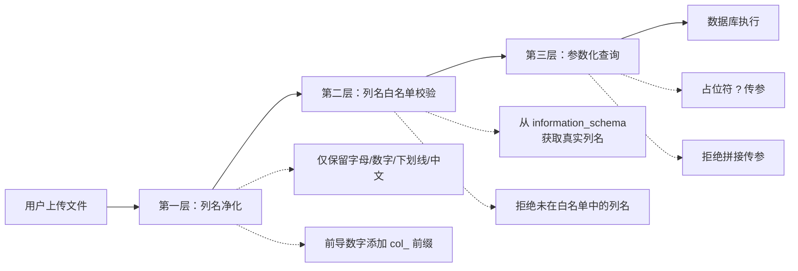
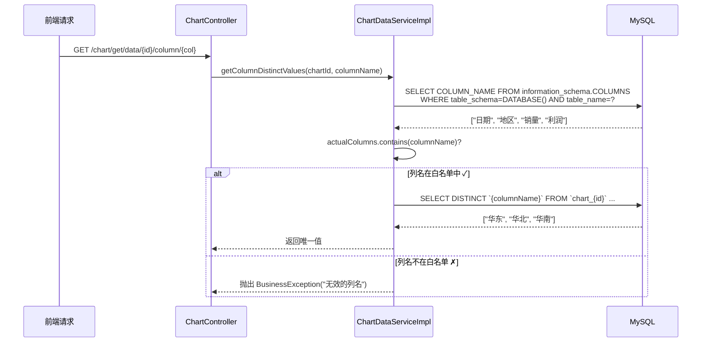
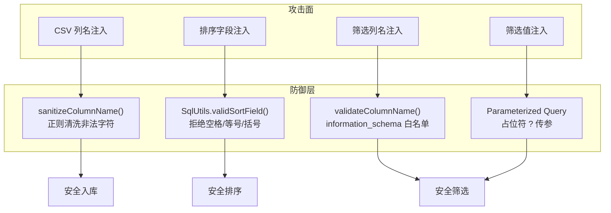

在智能 BI 系统中，用户上传的 Excel/CSV 文件会被动态解析为数据库表，同时前端支持对图表数据进行排序、筛选和列值查询。由于列名来源于用户上传的文件、筛选条件中的列名由前端传入，这些环节天然成为 SQL 注入攻击的潜在入口。本页解析系统如何通过**列名净化 + 白名单校验 + 参数化查询**三层防线，确保动态 SQL 构建过程的安全性。

---

## 三层防御架构

系统采用纵深防御策略，将 SQL 注入防护拆分为三个阶段，覆盖从数据入口到查询执行的完整链路：



**第一层——列名净化**发生在将 CSV 列名映射为数据库字段名时，通过正则清洗移除非法的 SQL 字符。**第二层——白名单校验**发生在构建查询 SQL 时，以数据库真实列名集合作为白名单，拒绝一切未注册的列名。**第三层——参数化查询**用于数据值部分，确保用户提供的数据不会逃逸为 SQL 语法结构。

---

## 第一层：列名净化——从源头切断 SQL 注入

当用户上传 Excel/CSV 文件时，系统调用 `ExcelUtils.excelToCsv()` 将文件内容转换为 CSV 格式字符串，随后 `ChartDataServiceImpl.createTableFromCsv()` 解析 CSV 的第一行作为列名。`parseColumns()` 方法对每个列名执行清洗操作：

```mermaid
flowchart TB
    A[CSV 第一行: "销量(件), 日期, 2024数据"] --> B[按逗号分割]
    B --> C[trim 去空白符]
    C --> D[过滤空值和 "null" 字符串]
    D --> E[sanitizeColumnName]
    
    E --> F{"销量(件)"}
    F --> G[正则替换: [^a-zA-Z0-9_\\u4e00-\\u9fa5] → _]
    G --> H["销量_件_"]
    
    E --> I{"2024数据"}
    I --> J[前导数字? 加 col_ 前缀]
    J --> K["col_2024数据"]
```

核心的清洗方法 `sanitizeColumnName()` 使用正则表达式 `[^a-zA-Z0-9_\\u4e00-\\u9fa5]` 替换所有非字母、非数字、非下划线、非中文字符为下划线 `_`：

```java
private static String sanitizeColumnName(String name) {
    // 去掉所有非字母数字下划线的字符
    String cleaned = name.replaceAll("[^a-zA-Z0-9_\\u4e00-\\u9fa5]", "_");
    // 去掉前导数字
    if (cleaned.matches("^\\d.*")) {
        cleaned = "col_" + cleaned;
    }
    // 确保不为空
    if (cleaned.isEmpty()) {
        cleaned = "col_empty";
    }
    return cleaned;
}
```

**这个环节如何阻止 SQL 注入？** 假设恶意用户将列名设置为 `x; DROP TABLE chart_1; --`，经过清洗后所有特殊字符（空格、分号、连字符、方括号、点号等）都会被替换为 `_`，最终列名变为 `x_DROP_TABLE_chart_1_`，不再具备 SQL 语法破坏能力。同样地，`CREATE TABLE` 语句中所有列名都被反引号包裹（`` `column_name` ``），进一步确保列名不会被解析为 SQL 关键字。

Sources: [ChartDataServiceImpl.java](lunesnow-IntelligentBI-backend/src/main/java/com/lunesnow/service/impl/ChartDataServiceImpl.java#L246-L268)

---

## 第二层：列名白名单校验——在查询时二次确认

列名净化仅在创建表时生效，但系统暴露了三个与动态数据相关的 HTTP 接口，这些接口允许前端传入列名参数。如果仅依赖第一层净化，无法防御中间人篡改请求或在后续迭代中引入的新查询路径。为此，系统在数据查询阶段实现了**基于 `information_schema` 的列名白名单校验**。

### 白名单的获取与校验流程

三个数据查询接口各自触发白名单校验，但核心逻辑统一收敛在 `validateColumnName()` 和 `getTableColumns()` 两个私有方法中：



`getTableColumns()` 从 MySQL 的元数据表 `information_schema.COLUMNS` 中获取指定表的真实列名列表：

```java
private List<String> getTableColumns(String tableName) {
    String sql = "SELECT COLUMN_NAME FROM information_schema.COLUMNS " +
            "WHERE table_schema = DATABASE() AND table_name = ?";
    List<Map<String, Object>> result = jdbcTemplate.queryForList(sql, tableName);
    return result.stream()
            .map(row -> row.get("COLUMN_NAME").toString())
            .collect(Collectors.toList());
}
```

注意此查询本身使用了**参数化占位符 `?`** 来传入 `tableName`，防止表名拼接引入注入风险。返回的列名列表即为该表当前时刻的**列名白名单**——只有存在于这张表中的列名才能被用于查询。

### 三种业务场景的校验实践

| 数据接口 | 白名单校验方式 | 校验位置 | 拒绝行为 |
|---|---|---|---|
| `getColumnDistinctValues()` | 调用 `validateColumnName()` 直接校验 | 列名参数传入时 | 抛出 `BusinessException`，返回 400 错误 |
| `getTableDataWithFilter()` | 遍历 filter Map，逐个检查列名 | 构建 WHERE 子句时 | 记录 `warn` 日志，跳过该条件 |
| `getTableData()` | 不涉及列名参数 | 无校验需求 | — |

`getColumnDistinctValues()` 的校验最为严格——列名一旦不匹配，整个请求失败；`getTableDataWithFilter()` 的校验则更为容忍——不合法的列名仅被忽略，不影响其他合法条件：

```java
// 构建 WHERE 条件——白名单校验
for (Map.Entry<String, String> entry : filters.entrySet()) {
    if (entry.getValue() != null && !entry.getValue().isEmpty()) {
        // 校验列名白名单，防止 SQL 注入
        if (!actualColumns.contains(entry.getKey())) {
            log.warn("忽略无效的筛选列名: {}", entry.getKey());
            continue;
        }
        conditions.add("`" + entry.getKey() + "` LIKE ?");
        params.add("%" + entry.getValue() + "%");
    }
}
```

**与其他安全机制的协作关系**：白名单校验之上，还有两层保障保障。一是 `ChartController` 中的**权限校验**（`userService.getLoginUser` + 图表归属判断），二是 URL 路径中的 `chartId` 本身来自服务端生成的图表 ID，而非用户任意指定——这三个数据接口均通过 `@PathVariable` 获取 `chartId`，且需验证请求用户对该图表的拥有权。

Sources: [ChartDataServiceImpl.java](lunesnow-IntelligentBI-backend/src/main/java/com/lunesnow/service/impl/ChartDataServiceImpl.java#L172-L195), [ChartDataServiceImpl.java](lunesnow-IntelligentBI-backend/src/main/java/com/lunesnow/service/impl/ChartDataServiceImpl.java#L289-L296)

---

## 第三层：参数化查询（JdbcTemplate）——值域注入的最终防线

列名白名单解决了 SQL 语法结构中的"列标识符"侧信道，但查询条件中的**值域**（如 WHERE 子句右侧的比对值）仍可能被注入。系统在这部分统一使用 Spring 的 `JdbcTemplate`，借助其**参数化查询**能力（PreparedStatement 的 `?` 占位符机制），确保数据值永远以字符串字面量形式传入，不会与 SQL 语法发生交叉。

两种典型的参数化查询范式：

```java
// 模式 A：查询列唯一值——列名用反引号包裹，值不涉及用户输入
String sql = "SELECT DISTINCT `" + columnName + "` FROM `" + tableName + 
             "` WHERE `" + columnName + "` IS NOT NULL ORDER BY `" + columnName + "`";
jdbcTemplate.queryForList(sql);
// 此处 columnName 已经过白名单校验，tableName 由系统生成

// 模式 B：筛选数据——值通过占位符传入
String condition = "`" + entry.getKey() + "` LIKE ?";
params.add("%" + entry.getValue() + "%");
jdbcTemplate.queryForList(sql.toString(), params.toArray());
// entry.getValue() 是用户输入，通过 ? 占位符安全传递
```

在数据插入环节，同样严格遵循参数化模式。`insertData()` 方法构建的 INSERT 语句中，VALUES 部分全部使用 `?` 占位符，用户数据通过 `params.toArray()` 数组批量传入：

```java
for (int j = 0; j < columns.size(); j++) {
    if (j > 0) { placeholder.append(", "); }
    placeholder.append("?");
    params.add(j < values.length ? values[j].trim() : null);
}
```

这确保了即使 CSV 数据单元格中包含 `' OR '1'='1` 这样的 SQL 注入载荷，该字符串也只会作为普通文本存储到数据库中，而不会被执行。

Sources: [ChartDataServiceImpl.java](lunesnow-IntelligentBI-backend/src/main/java/com/lunesnow/service/impl/ChartDataServiceImpl.java#L219-L242)

---

## 补充防线：排序字段校验与表名安全

### 排序字段注入防护

在 `ChartServiceImpl.getQueryWrapper()` 中，排序字段来自查询请求，直接拼接进 MyBatis Plus 的 `orderBy` 子句。系统通过 `SqlUtils.validSortField()` 进行前置校验，拒绝包含空格、等号、括号的字段名：

```java
public static boolean validSortField(String sortField) {
    if (StringUtils.isBlank(sortField)) {
        return false;
    }
    return !StringUtils.containsAny(sortField, "=", "(", ")", " ");
}
```

该方法的校验逻辑基于对 SQL 注入惯用模式的观察：`=` 常用于构造 `'1'='1'` 恒真条件，`(` 和 `)` 用于函数调用或子查询，` `（空格）用于分隔 SQL 关键词。禁止这些字符即阻止了排序字段变成可执行的 SQL 语句片段。

调用的上下文如下：

```java
queryWrapper.orderBy(SqlUtils.validSortField(sortField), 
    CommonConstant.SORT_ORDER_ASC.equals(sortOrder), sortField);
```

当 `validSortField` 返回 `false` 时，`orderBy` 方法的第一个参数为 `false`，意味着"不添加排序条件"，系统静默忽略非法排序请求，而非抛出异常让攻击者观察到验证逻辑的存在。

Sources: [SqlUtils.java](lunesnow-IntelligentBI-backend/src/main/java/com/lunesnow/utils/SqlUtils.java#L13-L24), [ChartServiceImpl.java](lunesnow-IntelligentBI-backend/src/main/java/com/lunesnow/service/impl/ChartServiceImpl.java#L67-L98)

### 表名安全机制

动态表以 `chart_{chartId}` 格式命名，其中 `chartId` 是数据库自增或雪花算法生成的 Long 型数字，并非来自用户输入。虽然 `createTable` 和 `insertData` 方法在拼接 SQL 时将表名直接拼入（而非参数化），但因其来源安全可控，不会构成注入风险。此外，`createTable` 语句使用 `CREATE TABLE IF NOT EXISTS`，杜绝了同名表覆盖的可能性。

---

## 防御体系总览

将上述所有机制整合，系统在 SQL 注入防护上形成了"入口净化 + 查询拦截 + 传参隔离"的纵深体系：



| 攻击类型 | 防护机制 | 验证强度 | 失效兜底 |
|---|---|---|---|
| CSV 列名包含 SQL 关键词 | 正则净化 + 反引号包裹 | 强 | 建表 SQL 中列名被反引号包围，不会解析为关键词 |
| 排序字段注入 | `validSortField()` 字符黑名单 | 中 | 校验失败时静默忽略排序，不抛出错误信息 |
| 筛选 API 传入恶意列名 | `information_schema` 白名单 | 强 | 非法列名被跳过或请求被拒绝 |
| 筛选值 SQL 注入 | `?` 占位符参数化 | 强 | JDBC PreparedStatement 保证值域隔离 |

---

## 下一步阅读

- [完整数据流水线：从上传 CSV/Excel 到 ECharts 图表的全链路追踪](6-wan-zheng-shu-ju-liu-shui-xian-cong-shang-chuan-csv-excel-dao-echarts-tu-biao-de-quan-lian-lu-zhui-zong) — 了解数据从上传到入库的完整路径
- [Excel/CSV 文件解析：EasyExcel 读取与 CSV 格式转换](12-excel-csv-wen-jian-jie-xi-easyexcel-du-qu-yu-csv-ge-shi-zhuan-huan) — 深入文件解析的底层实现
- [动态数据分表策略：按图表 ID 自动建表与数据隔离](11-dong-tai-shu-ju-fen-biao-ce-lue-an-tu-biao-id-zi-dong-jian-biao-yu-shu-ju-ge-chi) — 了解动态表创建与生命周期管理
- [安全最佳实践：BCrypt 密码哈希、Session 鉴权、三级容错渲染与防爬虫](24-an-quan-zui-jia-shi-jian-bcrypt-mi-ma-ha-xi-session-jian-quan-san-ji-rong-cuo-xuan-ran-yu-fang-pa-chong) — 系统性了解项目的全貌安全策略