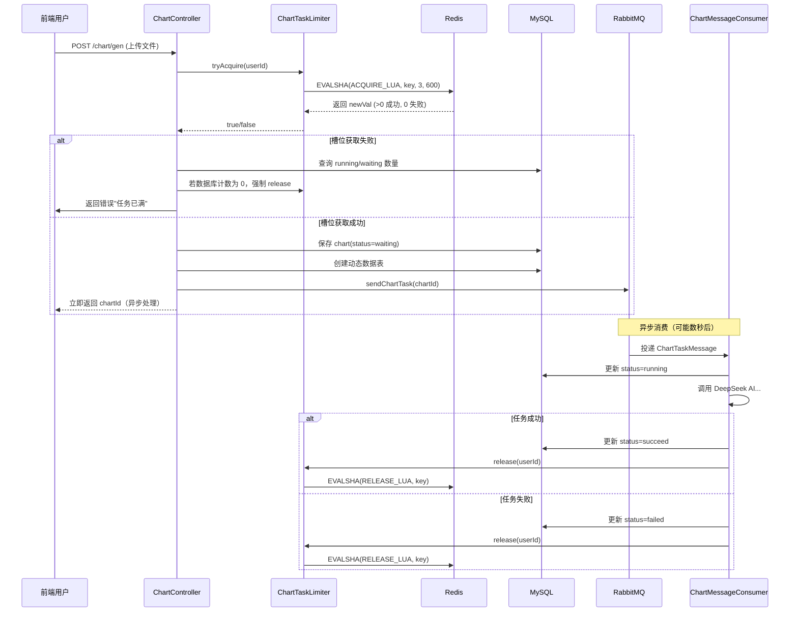

本文深入剖析系统中用于限制每用户并发图表任务数量的核心组件——`ChartTaskLimiter`。该组件通过 **Redis Lua 原子脚本** 实现了 check-and-increment/decrement 操作的不可分割性，从根本上消除了传统 "get → check → set" 模式中因时序交错导致的竞态条件（race condition）。同时配合 TTL 自动过期与降级容错机制，在分布式场景下提供了轻量级、高可用的并发槽位管理方案。

## 问题背景：竞态条件的根源

在智能 BI 系统的图表生成流程中，每个用户同时只能有最多 3 个任务在执行（running/waiting 状态）。这个限制的核心意图是防止单个用户通过并发请求抢占线程池和 AI 服务资源，保障系统的公平性。然而，**在多线程甚至分布式环境下，简单的 "查询 → 判断 → 更新" 三段式操作存在天然的竞态窗口**。

假设两个并发请求同时执行以下伪代码：

```
// 线程 A 和线程 B 同时执行
current = redis.get(key);        // 同时读到 current = 2
if (current < MAX_TASKS) {       // 两个线程都满足条件
    redis.incr(key);             // 各自 increment，实际值变成 4
    // 允许提交 —— 但实际上已经超过 3 的限制
}
```

在非原子操作下，两个请求同时读到 `current = 2`，同时判定 `2 < 3` 为真，于是各自执行 INCR——结果 Redis 中的计数变为 4，而系统允许了 4 个任务并发执行，突破了预设的上限。这种竞态条件在高并发场景下几乎必然复现，且错误会持续累积，直到手动修复或 key 过期。`ChartTaskLimiter` 正是针对这一问题而设计的解决方案。

Sources: [ChartTaskLimiter.java](lunesnow-IntelligentBI-backend/src/main/java/com/lunesnow/manager/ChartTaskLimiter.java#L1-L30)

## 架构设计：原子化槽位管理的三个层次

整个并发槽位管理机制从下到上分为三个层次：**Redis Lua 脚本层**（提供原子操作原语）、**管理器封装层**（提供业务语义接口）、**调用者层**（在控制器和消费者中嵌入限流逻辑）。

```mermaid
flowchart TB
    subgraph 调用者层
        CC[ChartController<br/>gen 接口] -->|tryAcquire| CTL
        CMC[ChartMessageConsumer<br/>任务消费] -->|release| CTL
    end

    subgraph 管理器层
        CTL[ChartTaskLimiter]
        CTL --> AL[acquireScript<br/>原子获取槽位]
        CTL --> RL[releaseScript<br/>原子释放槽位]
    end

    subgraph Redis层
        AL -->|EVALSHA| R1[(Redis<br/>Lua 执行)]
        RL -->|EVALSHA| R2[(Redis<br/>Lua 执行)]
        R1 --> K1[Key: chart:task:limit:{userId}<br/>Value: 当前任务数]
        R2 --> K1
    end

    style CTL fill:#4a90d9,color:#fff
    style AL fill:#f5a623,color:#fff
    style RL fill:#f5a623,color:#fff
```

三个层次的职责划分清晰：脚本层确保 read + check + write 在 Redis 单线程模型中作为一个整体执行，不存在被其他命令插入的间隙；管理器层封装脚本注册、参数传递、异常降级和 key 构建等细节；调用者层无须关心竞态问题，只需在合适的生命周期节点调用 `tryAcquire` 和 `release`。

Sources: [ChartTaskLimiter.java](lunesnow-IntelligentBI-backend/src/main/java/com/lunesnow/manager/ChartTaskLimiter.java#L1-L160)

## 核心实现：两段 Lua 脚本的原子语义

`ChartTaskLimiter` 定义了两段 Lua 脚本，分别对应槽位的获取与释放。这两个脚本通过 `DefaultRedisScript<Long>` 注册，在 `@PostConstruct init()` 中完成初始化，之后通过 `stringRedisTemplate.execute()` 调用。

### 获取脚本（ACQUIRE_LUA_SCRIPT）

```lua
local current = tonumber(redis.call('GET', KEYS[1]) or '0')
if current < tonumber(ARGV[1]) then
    local newVal = redis.call('INCR', KEYS[1])
    redis.call('EXPIRE', KEYS[1], tonumber(ARGV[2]))
    return newVal
else
    return 0
end
```

**参数映射**：`KEYS[1]` = `chart:task:limit:{userId}`，`ARGV[1]` = `3`（MAX_TASKS），`ARGV[2]` = `600`（EXPIRE_SECONDS，10分钟）。

**执行语义**：在 Redis 单线程模型中，脚本内部的 `GET`、比较、`INCR`、`EXPIRE` 是连续执行的，中间不会有任何其他客户端命令插入。如果当前计数小于上限，则原子性地自增并刷新 TTL，返回自增后的新值（>0 表示成功）；如果已达上限，直接返回 0。**关键设计在于 "返回新值" 而非 "返回布尔值"**——这样可以用于后续的日志追踪和监控。

### 释放脚本（RELEASE_LUA_SCRIPT）

```lua
local current = tonumber(redis.call('GET', KEYS[1]) or '0')
if current <= 0 then
    return 0
end
local newVal = redis.call('DECR', KEYS[1])
if newVal <= 0 then
    redis.call('DEL', KEYS[1])
    return 0
end
return newVal
```

**安全释放的设计原则**：释放操作必须保证不会将计数减到负数。如果当前值已经 ≤ 0（可能是 TTL 过期或手动清理导致），直接返回 0 并跳过 DECR。自减后如果 newVal ≤ 0，则主动 DEL 该 key——这不仅能清理不再需要的 key，更重要的是 **确保下一次 tryAcquire 时 `GET` 返回 nil（即 0），从而让用户能够重新开始计数**，避免计数永远卡在某个非零值上。

Sources: [ChartTaskLimiter.java](lunesnow-IntelligentBI-backend/src/main/java/com/lunesnow/manager/ChartTaskLimiter.java#L30-L57)

## 完整数据流：从请求到槽位释放的全生命周期

槽位的生命周期与图表生成任务的完整流程紧密绑定。下图展示了从用户发起图表生成请求，到任务完成/失败后释放槽位的完整链路：



这个流程中有一个关键的**安全兜底逻辑**：在 `tryAcquire` 返回 false 时，控制器不会立即拒绝请求，而是先查询数据库中该用户的 `running` + `waiting` 状态的图表数量。如果数据库查询显示为 0，说明 Redis 中的计数因为某些异常（如之前释放失败）与实际情况不一致，此时会强制调用 `release` 清空 Redis 计数，然后重新尝试获取槽位。这个设计有效地解决了 **Redis 与数据库之间因异常导致的状态不一致问题**。

Sources: [ChartController.java](lunesnow-IntelligentBI-backend/src/main/java/com/lunesnow/controller/ChartController.java#L258-L329)

## 容错与降级：在不完美环境中追求可用性

任何依赖外部中间件的系统都必须考虑中间件故障时的行为。`ChartTaskLimiter` 在三个层面实现了容错设计：

| 容错场景 | 实现方式 | 行为表现 |
|---------|---------|---------|
| Redis 连接异常 | `try/catch` 包裹 `stringRedisTemplate.execute()` | 打印错误日志，直接返回 `true`（放行请求） |
| Redis 与 DB 状态不一致 | 控制器层面的数据库二次校验 | 强制释放 Redis 计数，重新获取 |
| Key 过期（10分钟不活跃） | TTL 自动过期 + 释放脚本的 nil 处理 | `GET` 返回 nil 视为 0，计数正常重置 |

**降级策略（Fallback）** 尤其值得关注：当 Redis 不可用时，`tryAcquire` 会捕获异常并返回 `true`——这意味着系统选择允许请求通过而不是直接拒绝服务。这是一种典型的 "宁可错放，不可错杀" 策略，因为：
- 限流器降级只会导致短暂的系统负载升高，而不会完全阻塞用户操作
- 后续的 RabbitMQ 消息队列仍会缓冲任务，不会造成请求丢失
- 数据库层面的 `waiting`/`running` 状态标记提供了第二道防线

Sources: [ChartTaskLimiter.java](lunesnow-IntelligentBI-backend/src/main/java/com/lunesnow/manager/ChartTaskLimiter.java#L105-L140)

## 配置参数与调优指南

系统中与并发槽位管理相关的核心参数如下：

| 参数 | 位置 | 默认值 | 说明 |
|------|------|--------|------|
| `MAX_TASKS` | `ChartTaskLimiter.java` 常量 | 3 | 每用户最大并发任务数 |
| `EXPIRE_SECONDS` | `ChartTaskLimiter.java` 常量 | 600（10分钟） | Redis key 自动过期时间 |
| `KEY_PREFIX` | `ChartTaskLimiter.java` 常量 | `chart:task:limit:` | Redis key 前缀 |
| `spring.data.redis.database` | `application.yml` | 2 | Redis 数据库编号 |
| `spring.data.redis.timeout` | `application.yml` | 5000ms | Redis 连接超时 |

**调优建议**：
- **MAX_TASKS**：取决于 AI 服务的并发吞吐能力。如果 DeepSeek API 的 TPS（每秒事务数）较高，可以适当增加该值；但如果 AI 服务有严格的并发配额，应该相应降低。可以通过管理后台的限流监控页面观察用户任务堆积情况来调整。
- **EXPIRE_SECONDS**：建议设置为大于任务平均处理时间的 2-3 倍。图表生成任务平均耗时约 30-120 秒，600 秒（10分钟）是一个相对安全的阈值。如果设置过短，可能导致任务还在处理中但槽位已被释放；如果设置过长，异常退出后释放失败时，计数会长期占用。
- **Redis 数据库编号**：系统同时使用 Redis 存储 Session（database 0）、Redisson 限流器（database 1）和任务计数（database 2）。建议保持分离，避免 key 冲突和单一数据库负载过高。

Sources: [ChartTaskLimiter.java](lunesnow-IntelligentBI-backend/src/main/java/com/lunesnow/manager/ChartTaskLimiter.java#L1-L160), [application.yml](lunesnow-IntelligentBI-backend/src/main/resources/application.yml#L33-L40)

## 与 Redisson 令牌桶限流器的对比

本系统的限流体系包含两个层次：`ChartTaskLimiter` 是**任务并发数限制**（固定槽位 + 原子计数），而 `RedissonRateLimiter` 是**接口访问频率限制**（令牌桶算法）。二者互补而非替代：

| 维度 | ChartTaskLimiter（槽位管理） | RedissonRateLimiter（令牌桶） |
|------|---------------------------|-------------------------------|
| **核心算法** | 原子计数（Lua INCR/DECR） | 令牌桶（Redisson RRateLimiter） |
| **限制维度** | 每用户并发任务数 | 每秒/每分钟请求频率 |
| **判据** | 当前进行中的任务数量 | 时间窗口内的请求速率 |
| **超限行为** | 拒绝新任务提交 | 平滑限流（等待令牌或直接拒绝） |
| **适用场景** | `/chart/gen` 提交前的并发检查 | `@RateLimit` 注解标注的所有高频接口 |
| **依赖** | Spring Data Redis + Lua | Redisson Client |
| **TTL 策略** | 10 分钟自动过期 | 持久化（手动重置） |

简单来说，**槽位管理关心的是 "系统里现在有多少个任务在跑"，令牌桶关心的是 "请求来得有多快"**。前者是存量控制，后者是流量整形。在 `/chart/gen` 接口上，二者是串联使用的：先经过 `@RateLimit` 的频率限制，再进入 `tryAcquire` 的并发限制。

Sources: [RedissonRateLimiter.java](lunesnow-IntelligentBI-backend/src/main/java/com/lunesnow/manager/RedissonRateLimiter.java#L1-L184), [ChartTaskLimiter.java](lunesnow-IntelligentBI-backend/src/main/java/com/lunesnow/manager/ChartTaskLimiter.java#L1-L160)

## 设计洞察与演进方向

`ChartTaskLimiter` 的设计体现了几个值得关注的原则：

**原子性是并发正确性的基石**。在分布式系统中，"先读后写" 的操作模式必然存在竞态窗口。Lua 脚本通过将多个命令打包在 Redis 的确定性执行引擎中运行，以最小的性能代价（单次网络往返）获得了原子性保证。这与使用分布式锁（如 Redisson Lock）的方案相比，避免了锁的获取/释放开销和死锁风险，是一种更轻量的选择。

**降级比完美更重要**。系统不可能在任何时候都处于健康状态。`ChartTaskLimiter` 在 Redis 异常时选择放行而非拒绝，体现了 "可用性优先于完全正确性" 的设计哲学。在极端情况下，系统可能会短暂超过 3 个任务的限制，但不会完全瘫痪。

**自我修复机制**。控制器层面的 "Redis 与 DB 计数不一致检测" 是一种典型的分布式系统自愈模式——通过引入额外的信息来源（数据库状态）来校验和纠正主数据源（Redis）的可能偏差。这种双重校验模式可以在不引入复杂共识算法的情况下，显著提高系统的鲁棒性。

在未来的演进中，可以考虑将 `MAX_TASKS` 从硬编码常量改为可动态配置的值（如通过 Redis 或配置中心），以便在运行时根据系统负载实时调整并发上限——例如在 AI 服务响应较慢时自动降低并发数，在服务空闲时适当放宽限制。

---

> **继续阅读**：[WebSocket 实时推送](10-websocket-shi-shi-tui-song-concurrenthashmap-hui-hua-guan-li-xin-tiao-jian-ce-yu-zai-xian-zhuang-tai) — 任务完成后如何将结果实时推送给前端 | [Redisson 令牌桶限流器](15-redisson-ling-pai-tong-xian-liu-qi-fen-bu-shi-huan-jing-xia-jie-kou-fang-shua) — 接口级别的分布式频率控制 | [AOP 切面编程](16-aop-qie-mian-bian-cheng-atauthcheck-quan-xian-xiao-yan-yu-atratelimit-xian-liu-lan-jie) — 限流注解的 AOP 实现