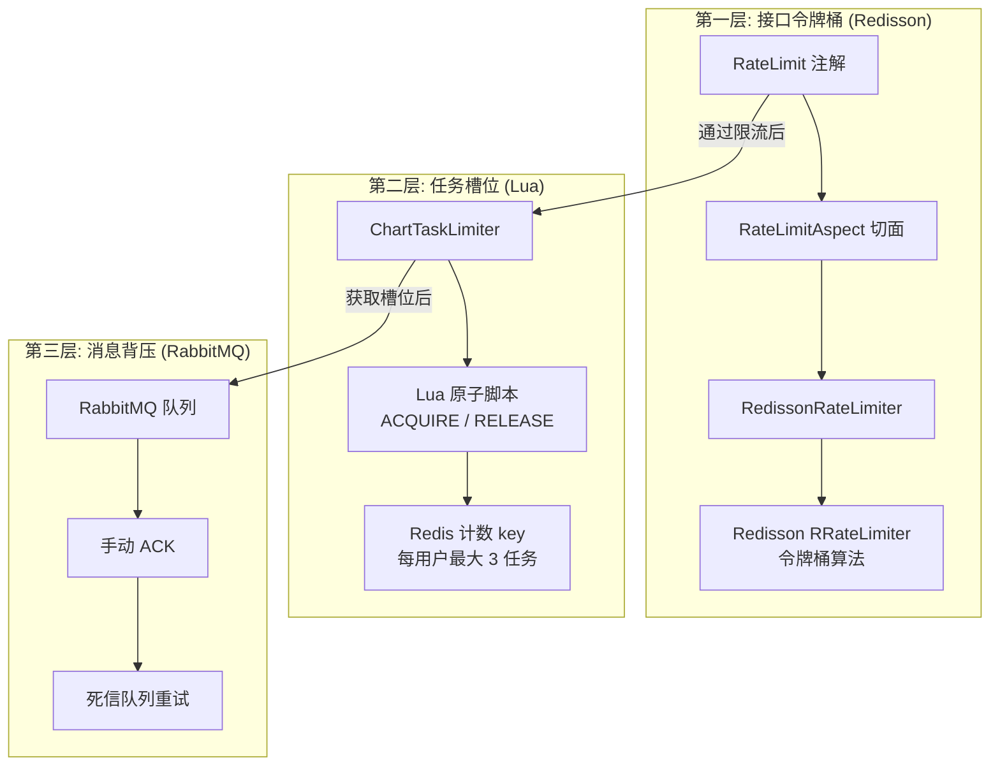
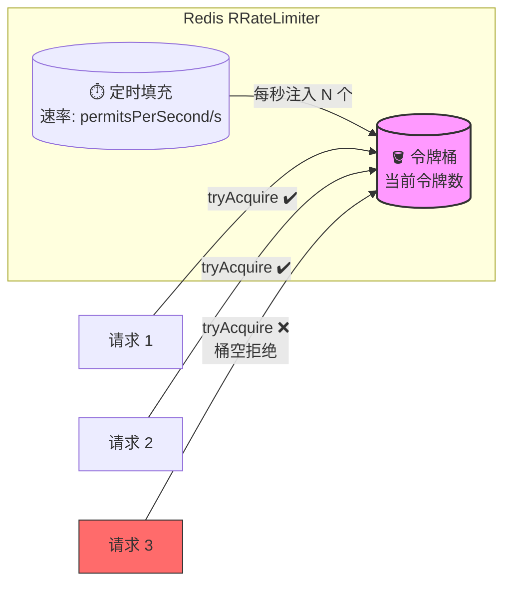
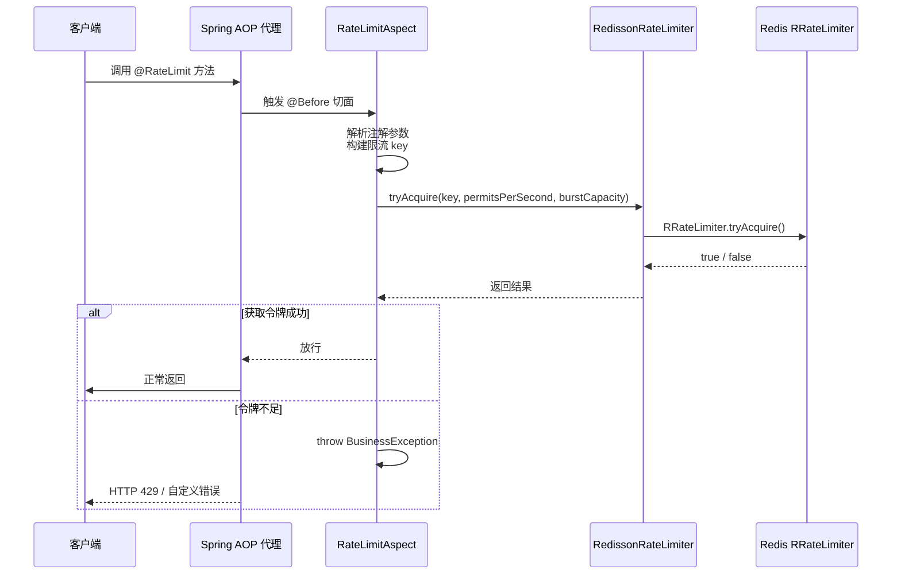

在 AI 驱动的智能 BI 系统中，图表生成接口调用 DeepSeek AI 模型，属于典型的高成本、低并发操作。如果用户短时间内发起大量请求，不仅可能导致 AI API 费用飙升，更会压垮后端线程池和消息队列。为此，系统基于 **Redisson RRateLimiter** 实现了一套完整的分布式令牌桶限流方案，涵盖从 Redis 连接配置、限流管理器、声明式注解到管理监控的全链路。

## 架构全景：三层限流防线

整个限流体系由三个独立但协同的层组成，分别对应不同维度的资源保护：



第一层（令牌桶）负责"拒绝过快请求"，第二层（任务槽位）负责"控制并发深度"，第三层（消息队列）负责"缓冲消费压力"。三层协作，从接口入口到任务执行形成完整的流控闭环。

Sources: [RedissonRateLimiter](lunesnow-IntelligentBI-backend/src/main/java/com/lunesnow/manager/RedissonRateLimiter.java#L1-L184), [ChartTaskLimiter](lunesnow-IntelligentBI-backend/src/main/java/com/lunesnow/manager/ChartTaskLimiter.java#L1-L160)

## Redisson 客户端配置

限流器的底层依赖是 Redisson 客户端，它通过 `RedissonClient` 接口提供对 Redis 的高级抽象，包括分布式锁、信号量、`RRateLimiter` 等数据结构。系统采用单节点 Redis 模式，配置如下：

| 配置项 | 值 | 说明 |
|--------|------|------|
| `address` | `redis://${host}:${port}` | 从 `application.yml` 读取 |
| `database` | `1` | 与 Spring Session 的 Redis database 2 隔离 |
| `connectionPoolSize` | `10` | 最大连接数 |
| `connectionMinimumIdleSize` | `5` | 最小空闲连接 |
| `connectTimeout` | `5000ms` | 连接超时 |
| `timeout` | `3000ms` | 读写超时 |
| `retryAttempts` | `3` | 失败重试次数 |
| `retryInterval` | `1500ms` | 重试间隔 |

关键设计决策是将 **Redisson 与 Spring Session 使用不同的 Redis database**：限流数据存储在 db 1，Session 数据存储在 db 2。这一隔离策略确保限流器的网络抖动不会影响用户登录状态，反之亦然——即使 Session Redis 不可用，限流器依然能独立工作。

Sources: [RedissonConfig](lunesnow-IntelligentBI-backend/src/main/java/com/lunesnow/config/RedissonConfig.java#L1-L48), [application.yml](lunesnow-IntelligentBI-backend/src/main/resources/application.yml#L16-L31)

## 核心：RedissonRateLimiter 令牌桶管理器

`RedissonRateLimiter` 是整个限流体系的核心组件，它封装了 Redisson 的 `RRateLimiter`，提供四个关键操作：**令牌获取**、**状态查询**、**单 key 重置**和**批量重置**。

### 令牌桶算法本质

令牌桶算法的核心思想是"匀速发放、可突发消费"：一个桶以固定的速率（`permitsPerSecond`）持续注入令牌，桶容量（`burstCapacity`）限制最大积压量。每个请求到达时从桶中取走一个令牌，如果桶空则请求被拒绝。



与漏桶算法的"平滑输出"不同，令牌桶允许短时间内的突发流量——只要桶中有足够的积压令牌，可以一次性消耗多个。这在图表生成场景中非常适用：用户偶尔的快速操作不应被惩罚，但持续的滥用必须被拦截。

### API 设计

`tryAcquire` 方法的参数设计体现了令牌桶的三个核心维度：

```java
public boolean tryAcquire(String key, double permitsPerSecond, double burstCapacity)
```

- **key**：限流标识，可以是用户 ID、IP 或方法全限定名
- **permitsPerSecond**：令牌注入速率，决定了长期平均请求数
- **burstCapacity**：桶容量，决定了短时突发上限

`trySetRate` 的语义是"只设置一次"——如果 Redis 中已存在该 key 的限流器配置，后续调用会被忽略。这一设计避免了重复设置覆盖，也意味着配置一旦生效，只能通过重置（`delete`）来更新。

### 降级策略

当 Redisson 与 Redis 通信发生异常时，`tryAcquire` 返回 `true`（放行请求）。这是一种"有损可用性"的降级设计——限流组件宁可误放也不误杀，避免因限流器自身故障导致正常业务中断。日志记录异常详情，便于运维人员定位修复。

Sources: [RedissonRateLimiter](lunesnow-IntelligentBI-backend/src/main/java/com/lunesnow/manager/RedissonRateLimiter.java#L53-L100)

## 声明式限流：@RateLimit 注解与 AOP 切面

为了让限流逻辑与业务代码解耦，系统通过自定义注解 + AOP 切面实现声明式限流。开发者只需在目标方法上添加一行注解，即可获得分布式限流能力。

### 注解参数设计

```java
@Target(ElementType.METHOD)
@Retention(RetentionPolicy.RUNTIME)
public @interface RateLimit {
    String key() default "";                     // SpEL 表达式 key
    double permitsPerSecond() default 10;         // 令牌生成速率
    double burstCapacity() default 20;            // 桶容量
    LimitType limitType() default LimitType.DEFAULT; // 限流维度
    String message() default "请求过于频繁，请稍后再试"; // 提示信息
}
```

`LimitType` 枚举定义了三种限流维度，对应不同的业务场景：

| 限流类型 | 构建的 key 示例 | 适用场景 |
|----------|----------------|----------|
| `DEFAULT` | `rate_limit:com.lunesnow.controller.ChartController:getChartByAI` | 全局接口限流 |
| `IP` | `rate_limit:ip:192.168.1.1` | 防爬虫、IP 级反滥用 |
| `USER` | `rate_limit:user:10001` | 用户级频率控制 |

### AOP 切面实现

`RateLimitAspect` 通过 `@Before` 切面在所有添加 `@RateLimit` 注解的方法执行前进行拦截：



当限流触发时，切面抛出 `BusinessException`，配合 `GlobalExceptionHandler` 返回包含自定义提示信息（如"AI 图表生成请求过于频繁，请稍后再试"）的错误响应，同时通过 `LIMIT_COUNT` 原子计数器记录被限流的请求总数，用于监控告警。

### 真实场景：图表生成接口

在图表生成接口上，限流注解的使用展示了参数配置与业务语义的精确匹配：

```java
@PostMapping("/gen")
@RateLimit(
    permitsPerSecond = 2,   // 每秒最多 2 个请求
    burstCapacity = 5,      // 但允许短时并发 5 个
    limitType = LimitType.USER,
    message = "AI 图表生成请求过于频繁，请稍后再试"
)
public BaseResponse<BiResponse> getChartByAI(...) { ... }
```

这里的参数设计反映了对业务特性的深入理解：AI 图表生成平均耗时数秒，每秒 2 的速率足以覆盖大多数正常用户；`burstCapacity = 5` 允许用户在短时间内连续提交最多 5 次——比如同时处理多个数据文件——而不被误拦截；按用户限流保障了计费公平性，防止单个用户耗尽系统配额。

Sources: [RateLimit annotation](lunesnow-IntelligentBI-backend/src/main/java/com/lunesnow/annotation/RateLimit.java#L1-L61), [RateLimitAspect](lunesnow-IntelligentBI-backend/src/main/java/com/lunesnow/aop/RateLimitAspect.java#L1-L161), [ChartController](lunesnow-IntelligentBI-backend/src/main/java/com/lunesnow/controller/ChartController.java#L298-L308)

## 管理监控：RateLimitController 管理员接口

系统为管理员提供了专门的限流管理接口，允许实时查看所有限流器的状态并进行操作：

| API 端点 | 方法 | 功能 | 权限 |
|----------|------|------|------|
| `/api/rate-limit/status` | GET | 查询单个限流器状态 | 管理员 |
| `/api/rate-limit/list` | GET | 列出所有限流器 | 管理员 |
| `/api/rate-limit/reset` | POST | 重置指定限流器 | 管理员 |
| `/api/rate-limit/resetAll` | POST | 重置所有限流器 | 管理员 |

状态查询返回 `availableTokens`（当前可用令牌数），这个值是动态变化的监控指标——如果频繁接近 0，说明该限流器正处于"高压"状态，可能需要调整参数或排查异常流量。

`listAll()` 方法的实现值得注意：它通过 `getKeysByPattern("rate_limit:*")` 扫描 Redis 中所有限流相关 key，然后过滤掉 Redisson 内部维护的 `:value` 和 `:permits` 后缀 key，只显示主要限流器。这种过滤基于对 Redisson 内部数据结构的理解——RRateLimiter 在 Redis 中会存储多个 key，分别记录当前令牌数、速率配置等信息。

Sources: [RateLimitController](lunesnow-IntelligentBI-backend/src/main/java/com/lunesnow/controller/RateLimitController.java#L1-L70), [RedissonRateLimiter listAll](lunesnow-IntelligentBI-backend/src/main/java/com/lunesnow/manager/RedissonRateLimiter.java#L108-L155)

## 双层限流：令牌桶 + 任务槽位的协同

令牌桶限流器和之前介绍的 [Lua 原子脚本任务槽位](14-redis-lua-yuan-zi-jiao-ben-wu-jing-tai-tiao-jian-de-bing-fa-ren-wu-cao-wei-guan-li) 构成了系统的双层限流机制。二者在目标维度和实现方式上有显著区别：

| 特性 | RateLimit（令牌桶） | ChartTaskLimiter（任务槽位） |
|------|-------------------|---------------------------|
| 控制目标 | 控制请求频率（速率） | 控制并发任务数（容量） |
| 算法 | 令牌桶（基于 RRateLimiter） | 计数器（基于 Lua INCR/DECR） |
| 粒度 | 接口级别（user/IP/global） | 用户级别 |
| 超出后果 | 直接拒绝，抛出异常 | 容错：检查数据库一致性后放行或拒绝 |
| 恢复机制 | 令牌按速率自动补充 | 任务完成后手动释放 |
| 数据结构 | Redisson 分布式对象 | Redis String + Lua 脚本 |

在实际流程中，请求首先经过 `@RateLimit` 切面拦截——如果令牌桶空了，直接返回"请求过于频繁"。通过限流后，进入 `ChartTaskLimiter.tryAcquire()`——如果用户已有 3 个任务在 running/waiting 状态，则拒绝提交。两层通过不同的维度保护系统：第一层防止"太快"，第二层防止"太多"。

`ChartController.getChartByAI()` 中的容错逻辑（`L358-L378`）尤其值得注意：当 Redis 计数显示用户已满时，系统会查数据库确认是否有实际 running/waiting 任务。如果数据库记录为 0，说明 Redis 计数因某种原因（如 key 过期）出现了不一致，此时强制释放槽位后重试。这一设计应对了 Redis 计数 key 可能在任务完成但尚未释放时意外过期的情况，是典型的"以数据库为准"的一致性兜底策略。

Sources: [ChartController](lunesnow-IntelligentBI-backend/src/main/java/com/lunesnow/controller/ChartController.java#L340-L378)

## 与同类方案的对比

在分布式限流的实现方案中，令牌桶（Token Bucket）与漏桶（Leaky Bucket）、固定窗口（Fixed Window）、滑动窗口（Sliding Window）各有优劣：

| 方案 | 突发处理 | 精度 | 实现复杂度 | 本系统选择原因 |
|------|---------|------|-----------|--------------|
| 固定窗口 | 差（窗口边界突增） | 低 | 最低 | — |
| 滑动窗口 | 较好 | 中 | 中 | — |
| 漏桶 | 不允许突发 | 高 | 中 | — |
| **令牌桶** | **允许有限突发** | **高** | **低（Redisson 内置）** | **AI 生成场景适配** |

令牌桶允许有限突发的能力对 AI 图表生成场景至关重要：用户可能在短时间内上传多个数据文件（突发），但不会持续高频操作（匀速）。如果使用漏桶，合法突发会被误拦；如果使用固定窗口，窗口边界处的请求堆积会导致限流失效。

Redisson 的 `RRateLimiter` 内部通过 Lua 脚本保证了令牌获取的原子性——`tryAcquire` 对应 Redis 中的 `EVALSHA` 调用，在 Redis 单线程模型下天然无竞态条件。这与系统在任务槽位管理中"自己写 Lua 脚本"的思路一脉相承：关键计数操作必须在 Redis 服务端原子执行。

Sources: [RedissonRateLimiter](lunesnow-IntelligentBI-backend/src/main/java/com/lunesnow/manager/RedissonRateLimiter.java#L53-L100), [ChartTaskLimiter](lunesnow-IntelligentBI-backend/src/main/java/com/lunesnow/manager/ChartTaskLimiter.java#L33-L56)

---

**继续阅读**：限流注解与权限校验注解的实现一脉相承，可参考 [AOP 切面编程：@AuthCheck 权限校验与 @RateLimit 限流拦截](16-aop-qie-mian-bian-cheng-atauthcheck-quan-xian-xiao-yan-yu-atratelimit-xian-liu-lan-jie) 了解 AOP 模式的完整实现。如需了解任务槽位的 Lua 脚本实现细节，可查阅 [Redis Lua 原子脚本：无竞态条件的并发任务槽位管理](14-redis-lua-yuan-zi-jiao-ben-wu-jing-tai-tiao-jian-de-bing-fa-ren-wu-cao-wei-guan-li)。