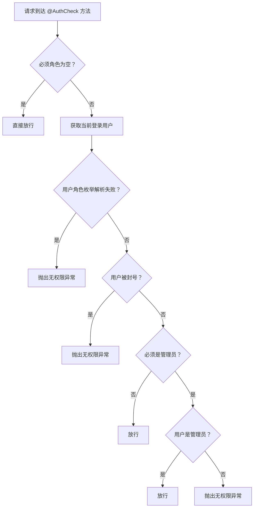
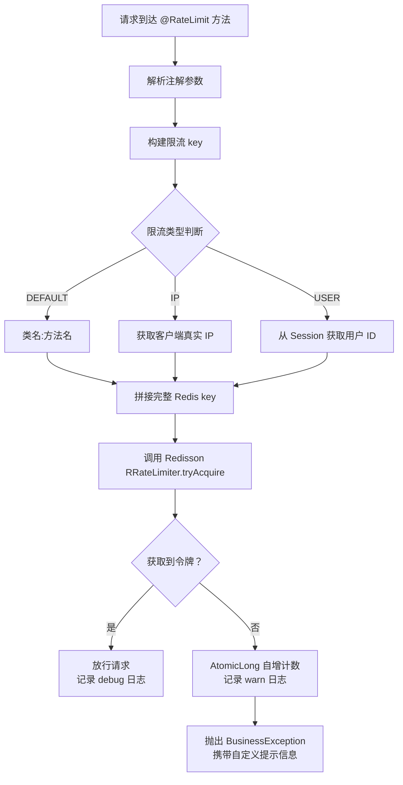

在智能 BI 系统中，横切关注点（Cross-Cutting Concerns）——如权限校验和请求限流——散落在各个业务接口中，会导致代码冗余、维护成本激增。本项目采用 Spring AOP（Aspect-Oriented Programming）将这两类通用逻辑从业务代码中抽离为独立的切面，通过声明式注解实现关注点分离，既保持了 Controller 层的简洁，又为安全策略提供了统一的管理入口。本文将深入剖析两个核心注解——`@AuthCheck` 与 `@RateLimit`——的设计思路、实现机制及其在项目中的实际应用。

## 一、权限校验切面：`@AuthCheck` 的声明式角色控制

### 1.1 注解定义：最小化声明接口

权限校验的入口是一个极简的运行时注解，只暴露一个属性：必须角色（`mustRole`），默认值为空字符串。这种设计遵循"默认放行、显式约束"原则——当 `mustRole` 为空时，切面自动放行请求，开发者只需在真正需要权限控制的接口上标注角色要求即可。

```java
@Target(ElementType.METHOD)
@Retention(RetentionPolicy.RUNTIME)
public @interface AuthCheck {
    String mustRole() default "";
}
```

Sources: [AuthCheck.java](lunesnow-IntelligentBI-backend/src/main/java/com/lunesnow/annotation/AuthCheck.java#L13-L22)

### 1.2 权限校验拦截器：基于角色枚举的四级仲裁

`AuthInterceptor` 是权限校验的执行器，使用 `@Around` 通知在目标方法执行前完成角色验证。其决策逻辑并非简单的角色字符串比对，而是通过 `UserRoleEnum` 枚举执行四级仲裁：



**仲裁流程详解**：

第一步，空角色短路。如果注解的 `mustRole` 值为空，或无法解析为有效的 `UserRoleEnum`，切面直接调用 `joinPoint.proceed()` 放行。这确保未标注角色的普通接口不受影响。

第二步，从 `RequestContextHolder` 获取当前 `HttpServletRequest`，通过 `UserService.getLoginUser(request)` 从 Session 中提取已登录用户对象。

第三步，角色枚举比对。`UserRoleEnum` 定义了三个角色值——`user`（普通用户）、`admin`（管理员）、`ban`（被封号）。拦截器首先检查用户是否被封号（`BAN`），若被封则立即抛出 `BusinessException(ErrorCode.NO_AUTH_ERROR)`，状态码 `40101`。

第四步，对要求管理员权限的接口（`mustRoleEnum == ADMIN`），验证当前用户角色是否也是 `ADMIN`。这一层检查通过枚举比较而非字符串比较，避免了大小写和拼写错误带来的安全漏洞。

Sources: [AuthInterceptor.java](lunesnow-IntelligentBI-backend/src/main/java/com/lunesnow/aop/AuthInterceptor.java#L37-L67)

### 1.3 实际应用场景

`@AuthCheck` 集中应用于管理后台接口，分布在 `UserController`、`ChartController` 和 `RateLimitController` 三个控制器中：

| 控制器 | 接口路径 | 用途 | 要求角色 |
|--------|---------|------|---------|
| `UserController` | `/user/add` | 创建用户 | `admin` |
| `UserController` | `/user/delete` | 删除用户 | `admin` |
| `UserController` | `/user/update` | 更新用户信息 | `admin` |
| `UserController` | `/user/get` | 查询用户详情 | `admin` |
| `UserController` | `/user/get/vo` | 查询用户包装类 | `admin` |
| `UserController` | `/user/list/page` | 分页用户列表 | `admin` |
| `ChartController` | `/chart/update` | 更新图表配置 | `admin` |
| `ChartController` | `/chart/get/vo` | 获取图表详情 | `admin` |
| `ChartController` | `/chart/list/page` | 分页图表列表 | `admin` |
| `RateLimitController` | `/rate-limit/status` | 查询限流状态 | `admin` |
| `RateLimitController` | `/rate-limit/list` | 限流列表 | `admin` |
| `RateLimitController` | `/rate-limit/reset` | 重置限流 | `admin` |
| `RateLimitController` | `/rate-limit/resetAll` | 批量重置限流 | `admin` |

值得注意的是，普通用户的图表操作（如 `/chart/edit`、`/chart/my/list/page/vo`）并未使用 `@AuthCheck`，而是通过 Controller 内的业务逻辑自行校验——对比当前用户 ID 与图表所属用户 ID。这种混合策略体现了"注解治理管理接口、代码治理业务权限"的分层设计思想。

Sources: [ChartController.java](lunesnow-IntelligentBI-backend/src/main/java/com/lunesnow/controller/ChartController.java#L129-L132) [UserController.java](lunesnow-IntelligentBI-backend/src/main/java/com/lunesnow/controller/UserController.java#L133-L135)

## 二、分布式限流切面：`@RateLimit` 的多维防护

### 2.1 注解定义：可配置的限流策略

`@RateLimit` 注解的设计体现了"策略可配置、类型可扩展"的思想，支持六项参数的灵活配置：

| 参数 | 类型 | 默认值 | 说明 |
|------|------|--------|------|
| `key` | `String` | `""` | 自定义限流 key（支持 SpEL 表达式预留） |
| `permitsPerSecond` | `double` | `10` | 令牌桶每秒生成的令牌数（请求速率） |
| `burstCapacity` | `double` | `20` | 令牌桶最大容量（突发流量承受能力） |
| `limitType` | `LimitType` | `DEFAULT` | 限流类型：方法级 / IP 级 / 用户级 |
| `message` | `String` | `"请求过于频繁，请稍后再试"` | 限流时返回的提示信息 |

`LimitType` 枚举是限流粒度的核心抽象，定义了三种维度的限流策略：

- **`DEFAULT`**：以"类全限定名:方法名"作为 key，控制单个接口的全局调用频率
- **`IP`**：以客户端 IP 为 key，限制单个 IP 来源的请求频率
- **`USER`**：以登录用户 ID 为 key，限制单个用户的调用频率

Sources: [RateLimit.java](lunesnow-IntelligentBI-backend/src/main/java/com/lunesnow/annotation/RateLimit.java#L12-L60)

### 2.2 限流切面实现：key 构建与令牌桶仲裁

`RateLimitAspect` 使用 `@Before` 通知，在目标方法执行前完成令牌获取。选择 `@Before` 而非 `@Around` 的原因是限流逻辑只需在方法执行前做出"放行/拒绝"的二元决策，无需包装返回值或修改执行过程，`@Before` 语义更精确、性能开销更小。

**限流流程的四个关键阶段**：



**第一阶段——Key 构建策略**：

`buildKey()` 方法以 `RATE_LIMIT_PREFIX = "rate_limit:"` 为固定前缀，根据 `limitType` 拼接中缀：

- `DEFAULT`：`rate_limit:com.lunesnow.controller.ChartController:getChartByAI`
- `IP`：`rate_limit:ip:192.168.1.1`
- `USER`：`rate_limit:user:42`

如果注解的 `key` 属性非空，还会追加自定义后缀，例如 `rate_limit:user:42:customSuffix`。这种分层 key 结构使 Redis 中的限流数据天然可分可查——管理后台可以按前缀扫描获得所有限流器状态。

**第二阶段——客户端 IP 获取**：

获取真实 IP 时，切面按规范代理链逆序读取请求头：`X-Forwarded-For` → `Proxy-Client-IP` → `WL-Proxy-Client-IP` → `getRemoteAddr()`。对于经过多层反向代理的场景，选择 IP 列表中的第一个（即客户端真实 IP），避免负载均衡器 IP 导致的限流产误伤。

**第三阶段——用户 ID 获取**：

`getUserId()` 从 Session 中获取 `user_login` 属性，转换为 `User` 对象后提取 `id.toString()`。若用户未登录，兜底返回 `"anonymous"`，确保未登录请求也能被限流覆盖。

**第四阶段——令牌桶仲裁**：

通过 `RedissonRateLimiter.tryAcquire(key, permitsPerSecond, burstCapacity)` 完成分布式令牌桶的令牌获取。`tryAcquire()` 内部首先调用 `rateLimiter.trySetRate()` 初始化限流器参数（该方法幂等，仅在首次调用时生效），然后执行 `tryAcquire()` 尝试消费一个令牌。若失败，抛出自定义 `BusinessException(ErrorCode.OPERATION_ERROR, rateLimit.message())`；异常处理器会将其转换为标准 `BaseResponse` 返回给前端。

Sources: [RateLimitAspect.java](lunesnow-IntelligentBI-backend/src/main/java/com/lunesnow/aop/RateLimitAspect.java#L46-L76) [RedissonRateLimiter.java](lunesnow-IntelligentBI-backend/src/main/java/com/lunesnow/manager/RedissonRateLimiter.java#L44-L70)

### 2.3 Redis Lua 原子脚本与 Redisson 令牌桶的引擎对比

理解项目的限流体系，需要区分两套并行的限流机制——它们分别服务于不同粒度：

| 特性 | `@RateLimit` + Redisson RRatelimiter | `ChartTaskLimiter` + Redis Lua |
|------|--------------------------------------|-------------------------------|
| **定位** | 接口防刷限流 | 并发任务槽位管理 |
| **算法** | 令牌桶（RRateLimiter） | 计数器（Lua INCR/DECR） |
| **粒度** | 方法级 / IP级 / 用户级 | 用户级（每用户最多3个并发任务） |
| **原子性保证** | Redisson 客户端内置 | 自定义 Lua 脚本 |
| **超出后的行为** | 抛异常，拒绝请求 | 拒绝提交，提示"请稍后再试" |
| **异常降级** | 限流异常时放行请求 | Redis 异常时放行请求 |
| **管理能力** | 支持查询/重置所有限流器 | 支持查询用户当前任务数 |

`@RateLimit` 面向"短时间高频请求"的防护场景——例如用户多次点击"生成图表"按钮；而 `ChartTaskLimiter` 面向"长时间并发任务"的资源配额管理——限制每个用户最多同时执行 3 个 AI 生成任务。前者控制请求速率，后者控制并发深度，两者共同构成了系统的两级限流防线。

Sources: [ChartTaskLimiter.java](lunesnow-IntelligentBI-backend/src/main/java/com/lunesnow/manager/ChartTaskLimiter.java#L32-L40)

### 2.4 实际应用：AI 图表生成的精确限流

`@RateLimit` 在项目中直接应用于 `ChartController.getChartByAI()` 方法——这是整个系统负载最高的接口，接收用户上传的文件后执行 AI 智能分析并生成 ECharts 配置。

```java
@PostMapping("/gen")
@RateLimit(
        permitsPerSecond = 2,
        burstCapacity = 5,
        limitType = RateLimit.LimitType.USER,
        message = "AI 图表生成请求过于频繁，请稍后再试"
)
public BaseResponse<BiResponse> getChartByAI(...) { ... }
```

参数配置的工程考量：

- **`permitsPerSecond = 2`**：每秒生成 2 个令牌，即稳定状态下每个用户每秒最多完成 2 次请求。这个速率与 DeepSeek API 的响应能力以及 RabbitMQ 的消费能力相匹配。
- **`burstCapacity = 5`**：桶容量 5，允许用户在短时间内突发提交最多 5 个任务——例如用户一次性上传多个文件。但超过 5 后即触发限流。
- **`limitType = USER`**：以用户 ID 为 key，保证一个用户的高频请求不会影响其他用户的服务质量（防止"噪声邻居"效应）。
- **`message`**：自定义提示语直接返回给前端，用户看到的是业务友好的"AI 图表生成请求过于频繁"而非冷冰冰的技术错误码。

该限流与后续的 `ChartTaskLimiter.tryAcquire()` 形成双层防护：`@RateLimit` 拦截秒级高频请求，`ChartTaskLimiter` 管理分钟级并发槽位，两者共同确保系统不会被单一用户的突发请求压垮。

Sources: [ChartController.java](lunesnow-IntelligentBI-backend/src/main/java/com/lunesnow/controller/ChartController.java#L308-L314)

## 三、请求日志切面：`LogInterceptor`

作为 AOP 体系的第三块拼图，`LogInterceptor` 使用 `@Around` 通知拦截所有 `com.lunesnow.controller.*` 下的方法执行，完成请求的全链路日志记录：

- **请求入口**：为每次请求生成唯一 `requestId`（UUID），记录请求路径、客户端 IP 和参数信息
- **执行计时**：通过 Spring 的 `StopWatch` 精确计时，在方法执行完成时输出耗时
- **响应出口**：日志输出 `request end, id: {}, cost: {}ms`

这个切面虽无业务逻辑，却是线上问题排查的核心工具——通过 `requestId` 可以将一次前端调用与后端全链路日志串联起来，在分布式环境中实现请求级别的追踪。

Sources: [LogInterceptor.java](lunesnow-IntelligentBI-backend/src/main/java/com/lunesnow/aop/LogInterceptor.java#L27-L52)

## 四、AOP 设计模式总结

项目的三个切面展示了 AOP 在 Web 服务中的三种典型应用模式：

| 切面 | 通知类型 | 切入点表达式 | 核心职责 | 失败模式 |
|------|---------|-------------|---------|---------|
| `AuthInterceptor` | `@Around` | `@annotation(authCheck)` | 角色授权检查 | 抛出 `NO_AUTH_ERROR`（40101） |
| `RateLimitAspect` | `@Before` | `@annotation(com.lunesnow.annotation.RateLimit)` | 分布式限流 | 抛出 `OPERATION_ERROR`（50001） |
| `LogInterceptor` | `@Around` | `execution(* com.lunesnow.controller.*.*(..))` | 请求日志追踪 | 不影响业务，正常放行 |

**设计共性**：

1. **声明式编程**：所有横切逻辑通过注解声明，业务代码零侵入。新增接口只需添加 `@AuthCheck(mustRole = "admin")` 即完成权限加固，无需修改安全基础设施。

2. **降级兜底**：限流切面在 Redisson 或 Redis 异常时返回 `true` 放行请求，而非直接拒绝（fail-open 而非 fail-close 策略），体现了"可用性优先于一致性"的设计取舍。

3. **线程安全**：`RateLimitAspect` 通过 `AtomicLong` 统计限流次数，保证在高并发场景下计数器自增的数据完整性。

4. **统一异常处理**：切面内统一抛出 `BusinessException`，由全局异常处理器捕获转换为标准 API 响应格式，确保前端始终收到结构一致的错误信息。

Sources: [AuthInterceptor.java](lunesnow-IntelligentBI-backend/src/main/java/com/lunesnow/aop/AuthInterceptor.java#L23-L68) [RateLimitAspect.java](lunesnow-IntelligentBI-backend/src/main/java/com/lunesnow/aop/RateLimitAspect.java#L28-L76)

---

**继续探索**：了解完 AOP 切面的权限与限流机制后，可以进一步查看 [Redis Lua 原子脚本：无竞态条件的并发任务槽位管理](14-redis-lua-yuan-zi-jiao-ben-wu-jing-tai-tiao-jian-de-bing-fa-ren-wu-cao-wei-guan-li) 深入了解 `ChartTaskLimiter` 的 Lua 脚本实现细节，或者阅读 [Redisson 令牌桶限流器：分布式环境下接口防刷](15-redisson-ling-pai-tong-xian-liu-qi-fen-bu-shi-huan-jing-xia-jie-kou-fang-shua) 掌握底层限流引擎的工作原理。