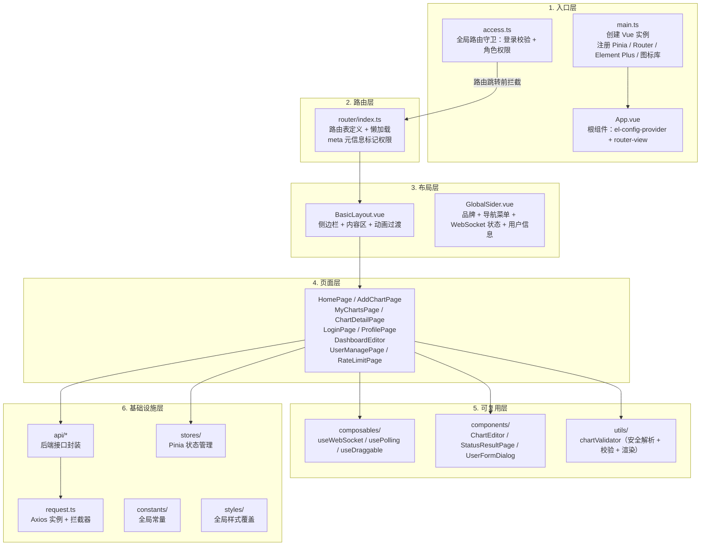
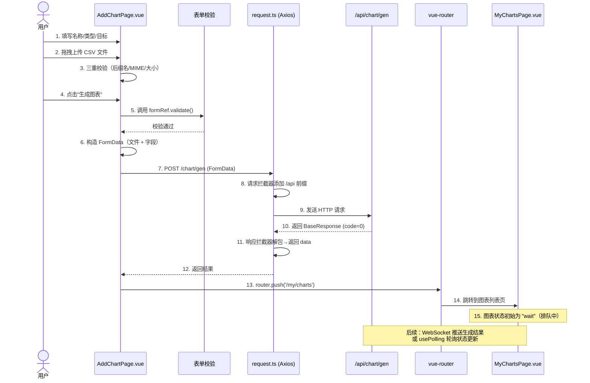

本页面系统性地拆解前端项目的整体架构，面向**初级开发者**，帮助你理解"代码放在哪里"、"路由怎么跳转"、"状态如何管理"、"API 怎么请求"这四个核心问题。读完你能对整个前端项目形成一张完整的地图，然后可以直奔具体页面或组件的源码去深入细节。

---

## 技术栈总览

本项目的技术选型定位清晰：**Vue 3 提供响应式框架基础，TypeScript 保障类型安全，Element Plus 提供企业级 UI 组件库，ECharts 承担数据可视化渲染。** 辅以 Pinia 做状态管理、Vite 做构建工具、Axios 做 HTTP 请求。

| 技术 | 版本 | 核心用途 | 文件入口 |
|------|------|---------|---------|
| Vue 3 | ^3.5.32 | 组件化 UI 框架 | `src/main.ts` |
| TypeScript | ~6.0.0 | 静态类型检查 | `tsconfig.app.json` |
| Element Plus | ^2.14.1 | 表单/表格/对话框/上传等 UI 组件 | `src/main.ts` 全局注册 |
| ECharts | ^6.1.0 | 图表渲染引擎 | 各页面按需 `import * as echarts` |
| Pinia | ^3.0.4 | 全局状态管理 | `src/stores/` |
| Vue Router | ^5.0.4 | 前端路由 | `src/router/index.ts` |
| Axios | ^1.16.1 | HTTP 请求 | `src/request.ts` |
| Vite | ^8.0.8 | 开发服务器/构建打包 | `vite.config.ts` |
| Sass | ^1.100.0 | 增强 CSS 预处理器 | `src/styles/` |

Sources: [package.json](lunesnow-IntelligentBI-frontend/package.json#L1-L53), [main.ts](lunesnow-IntelligentBI-frontend/src/main.ts#L1-L22), [vite.config.ts](lunesnow-IntelligentBI-frontend/vite.config.ts#L1-L20)

---

## 项目目录结构全图

```
src/
├── main.ts                         # 应用入口：挂载 Vue、注册插件
├── App.vue                         # 根组件（el-config-provider + router-view）
├── access.ts                       # 路由守卫：权限校验与重定向
├── request.ts                      # Axios 实例：请求/响应拦截器
│
├── api/                            # API 层 —— 所有后端接口调用
│   ├── index.ts                    #   统一导出
│   ├── typings.d.ts                #   类型定义（自动生成）
│   ├── userController.ts           #   用户登录/注册/管理
│   ├── chartController.ts          #   图表 CRUD + AI 生成
│   ├── fileController.ts           #   文件上传
│   └── rateLimitController.ts      #   限流状态查询/重置
│
├── router/
│   └── index.ts                    # 路由定义（含懒加载 + 权限元信息）
│
├── stores/
│   └── useLoginUserStore.ts        # Pinia Store：登录用户信息
│
├── layouts/
│   └── BasicLayout.vue             # 主布局（侧边栏 + 内容区 + 页面过渡动画）
│
├── components/
│   ├── layout/
│   │   └── GlobalSider.vue         # 全局侧边导航栏（菜单 + 用户信息 + 退出）
│   ├── ChartEditor.vue             # ECharts 配置在线编辑器（JSON + 实时预览）
│   ├── StatusResultPage.vue        # 空状态/错误状态展示页
│   └── UserFormDialog.vue          # 用户新增/编辑对话框
│
├── composables/                    # 可复用组合式函数
│   ├── useWebSocket.ts             #   WebSocket 连接管理（心跳 + 指数退避重连）
│   ├── usePolling.ts               #   轮询管理（指数退避 + Page Visibility）
│   └── useDraggable.ts             #   拖拽能力（CSS transform GPU 加速）
│
├── views/                          # 页面级组件（按功能模块分组）
│   ├── HomePage.vue                #   首页（统计卡片 + 最近图表）
│   ├── AddChartPage.vue            #   新建图表（表单 + 文件上传 + 校验）
│   ├── MyChartsPage.vue            #   我的图表列表（筛选 + 分页 + 重试）
│   ├── ChartDetailPage.vue         #   图表详情（三级渲染 + 筛选/导出）
│   ├── DashboardEditor.vue         #   仪表盘编辑器（拖拽画布 + 缩放）
│   ├── Error403Page.vue            #   403 无权限页
│   ├── NotFoundPage.vue            #   404 页面
│   ├── user/
│   │   ├── LoginPage.vue           #   登录页
│   │   ├── RegisterPage.vue        #   注册页
│   │   └── ProfilePage.vue         #   个人中心（编辑信息 + 更换头像）
│   └── admin/
│       ├── UserManagePage.vue      #   用户管理（表格 + 增删改）
│       ├── UserChartsPage.vue      #   用户图表审计
│       └── RateLimitPage.vue       #   限流监控与重置
│
├── constants/
│   └── index.ts                    # 全局常量（后端地址）
├── utils/
│   └── chartValidator.ts           # 图表配置安全校验（JSON 解析 + 危险字段过滤）
└── styles/
    └── global-override.scss        # Element Plus 全局样式覆盖（深色系 + 翡翠绿）
```

Sources: [get_dir_structure](lunesnow-IntelligentBI-frontend/src), [main.ts](lunesnow-IntelligentBI-frontend/src/main.ts#L1-L22)

---

## 架构分层与职责边界

将受端项目分为六个层次，每一层都有清晰的职责范围：



**数据流向说明**：页面（Views）调用 API 层发请求 → Axios 拦截器处理 token/错误 → 后端返回数据 → 存入 Pinia Store 或组件本地状态 → 驱动视图渲染。WebSocket 推送的数据直接更新组件状态并显示通知。

Sources: [App.vue](lunesnow-IntelligentBI-frontend/src/App.vue#L1-L36), [access.ts](lunesnow-IntelligentBI-frontend/src/access.ts#L1-L40), [request.ts](lunesnow-IntelligentBI-frontend/src/request.ts#L1-L66)

---

## 各层详解

### 6.1 入口层：应用启动与插件注册

`main.ts` 是应用的唯一入口，按顺序执行以下操作：

1. **创建 Vue 应用实例** `createApp(App)`
2. **全局注册 Element Plus 图标**：遍历 `@element-plus/icons-vue` 的所有导出，注册为全局组件，这样在模板中可以直接用 `<el-icon><HomeFilled /></el-icon>`
3. **注册 Pinia**：`app.use(createPinia())` — 状态管理
4. **注册 Vue Router**：`app.use(router)` — 路由系统
5. **注册 Element Plus**：`app.use(ElementPlus)` — UI 组件库
6. **挂载到 DOM**：`app.mount('#app')`

`App.vue` 结构简洁：外层用 `<el-config-provider>` 统一控制组件尺寸，内层只放 `<router-view />`。这意味着**整个应用就是一个路由驱动的单页应用**，所有页面内容都是通过路由切换渲染的。

Sources: [main.ts](lunesnow-IntelligentBI-frontend/src/main.ts#L1-L22), [App.vue](lunesnow-IntelligentBI-frontend/src/App.vue#L1-L36)

### 6.2 路由层：两级路由设计与懒加载

路由系统采用**嵌套路由**设计，将所有需要登录的页面放在 `BasicLayout` 子路由中：

| 路由路径 | 页面 | 权限 | 说明 |
|---------|------|------|------|
| `/` | HomePage | 需登录 | 首页仪表盘 |
| `/add/chart` | AddChartPage | 需登录 | 新建图表 |
| `/my/charts` | MyChartsPage | 需登录 | 图表列表 |
| `/chart/detail/:id` | ChartDetailPage | 需登录 | 图表详情 |
| `/dashboard/editor` | DashboardEditor | 需登录 | 仪表盘编辑器 |
| `/profile` | ProfilePage | 需登录 | 个人中心 |
| `/admin/userManage` | UserManagePage | 需登录 + admin | 用户管理 |
| `/admin/userCharts/:userId` | UserChartsPage | 需登录 + admin | 用户图表审计 |
| `/admin/rateLimit` | RateLimitPage | 需登录 + admin | 限流管理 |
| `/user/login` | LoginPage | 无需登录 | 登录页 |
| `/user/register` | RegisterPage | 无需登录 | 注册页 |
| `/403` | Error403Page | 无需登录 | 无权限页面 |
| `/:pathMatch(.*)*` | NotFoundPage | 无需登录 | 404 页面 |

**懒加载**：所有页面组件使用 `() => import('@/views/...')` 动态导入，Vite 会自动代码分割，只有访问对应路由时才加载该页面的 JS 文件。

**路由守卫**（`access.ts`）在每次路由跳转前执行三步检查：
1. 目标路由是否需要登录（`meta.requiresAuth`）
2. 若需要登录，检查 Pinia Store 中是否有用户信息；如果用户名为"未登录"，则调用 `fetchLoginUser()` 尝试从后端通过 Cookie 恢复会话
3. 若需要管理员权限（`meta.requiresAdmin`），检查 `userRole` 是否为 `admin`

Sources: [router/index.ts](lunesnow-IntelligentBI-frontend/src/router/index.ts#L1-L94), [access.ts](lunesnow-IntelligentBI-frontend/src/access.ts#L1-L40)

### 6.3 布局层：侧边栏 + 内容区 + WebSocket 状态

`BasicLayout.vue` 使用 Element Plus 的 `el-container` + `el-aside` + `el-main` 搭建经典后台布局。亮点设计：

- **粘性侧边栏**：`position: sticky; top: 0; height: 100vh` — 侧边栏固定，内容区独立滚动
- **页面过渡动画**：使用 Vue 的 `<transition>` 组件实现 `opacity 0.15s` 淡入淡出效果
- **WebSocket 状态初始化**：在布局层调用 `useWebSocket()` 建立连接，将 `connected` 响应式状态传给 `GlobalSider` 以显示实时连接指示灯

`GlobalSider.vue` 承载了所有导航逻辑：
- **品牌区**：显示应用 Logo 名称 + WebSocket 连接状态指示灯（绿色圆点 + "实时连接中"）
- **导航菜单**：根据用户角色动态过滤菜单项（admin 能看到"用户管理"和"限流管理"）
- **用户信息**：底部显示用户头像（首字母或图片）+ 角色标签 + 退出按钮

Sources: [BasicLayout.vue](lunesnow-IntelligentBI-frontend/src/layouts/BasicLayout.vue#L1-L68), [GlobalSider.vue](lunesnow-IntelligentBI-frontend/src/components/layout/GlobalSider.vue#L1-L200)

### 6.4 页面层：功能页面概览

十个主要页面，每个页面承担一个独立功能模块：

**首页**（`HomePage.vue`）展示了 Bento 风格的统计卡片——动画数字展示图表总数/成功数/进行中/成功率，下方是最近图表列表，点击可跳转详情。

**新建图表**（`AddChartPage.vue`）是核心交互页面，包含：
- 双列表单布局：左侧填写图表名称、类型、分析目标；右侧拖拽上传 Excel/CSV
- **文件上传三重校验**：后缀名校验 → MIME 类型校验（防止改后缀绕过）→ 文件大小校验（最大 2MB）
- 提交时构造 `FormData` 发送 POST 请求到 `/chart/gen`

**我的图表**（`MyChartsPage.vue`）提供完整的图表管理功能：多条件筛选（名称/类型）、排序（创建时间/名称/类型）、分页展示，支持一键重试失败图表。

**图表详情**（`ChartDetailPage.vue`）是数据消费核心页面：
- **三级渲染容错**：`ECharts` 渲染 → `dangerouslySetInnerHTML` 备选 → 文字分析结果兜底
- **安全筛选**：获取列名 → 用户选择过滤条件 → 服务端过滤查询
- **多种导出**：PNG / SVG / JSON

**仪表盘编辑器**（`DashboardEditor.vue`）实现可拖拽 + 可缩放 + 无限画布，使用 `transform: translate` + `scale` 实现 GPU 加速渲染（见[可拖拽仪表盘编辑器](20-ke-tuo-zhuai-yi-biao-pan-bian-ji-qi-css-transform-gpu-jia-su-wu-xian-hua-bu-yu-bu-ju-chi-jiu-hua)）。

**管理后台**（`UserManagePage.vue`、`UserChartsPage.vue`、`RateLimitPage.vue`）提供用户 CRUD、图表审计和限流监控能力。

Sources: [AddChartPage.vue](lunesnow-IntelligentBI-frontend/src/views/AddChartPage.vue#L1-L200), [HomePage.vue](lunesnow-IntelligentBI-frontend/src/views/HomePage.vue#L1-L80), [MyChartsPage.vue](lunesnow-IntelligentBI-frontend/src/views/MyChartsPage.vue#L1-L80)

### 6.5 可复用层：Composables、组件与工具函数

**三个核心组合式函数（Composables）**：

| Hook | 核心能力 | 使用场景 |
|------|---------|---------|
| `useWebSocket` | 自动连接 + 指数退避重连（最多 5 次） + 30s 心跳保活 + 组件卸载自动断开 | 布局层建立连接，接收图表生成结果推送 |
| `usePolling` | 可配置轮询间隔 + 指数退避（失败时 1.5x 递增至 30s 上限） + Page Visibility API 暂停/恢复 | 异步任务状态跟踪（图表生成进度） |
| `useDraggable` | 鼠标拖拽 + `transform: translate` GPU 加速 + `willChange` 优化提示 + `userSelect: none` 防选中 | 仪表盘卡片拖拽、画布平移 |

**可复用组件**：
- `ChartEditor.vue`：对话框中加载 ECharts 配置编辑界面，左侧多行文本编辑器 + 右侧实时预览
- `StatusResultPage.vue`：统一状态展示页（403/404），插槽式设计
- `UserFormDialog.vue`：用户新增/编辑对话框，内联表单校验

**工具函数**（`chartValidator.ts`）承担**安全渲染**关键职责：
1. `safeParseChartConfig` — 三级解析尝试：JSON.parse → 移除`option=`前缀 → new Function（仅对象字面量）
2. `filterDangerousFields` — 递归过滤 `__proto__`、`constructor`、`prototype`、`eval` 等危险字段，防止原型链污染
3. `validateEChartsOption` — 校验是否包含 `series`/`dataset`、series 是否为非空数组
4. `safeRenderChart` — 组合解析 + 校验 + 渲染三步流程

Sources: [useWebSocket.ts](lunesnow-IntelligentBI-frontend/src/composables/useWebSocket.ts#L1-L165), [usePolling.ts](lunesnow-IntelligentBI-frontend/src/composables/usePolling.ts#L1-L149), [useDraggable.ts](lunesnow-IntelligentBI-frontend/src/composables/useDraggable.ts#L1-L140), [chartValidator.ts](lunesnow-IntelligentBI-frontend/src/utils/chartValidator.ts#L1-L167)

### 6.6 基础设施层：API 封装、请求、状态与样式

**API 层**（`src/api/`）的代码并非手写，而是通过 `openapi2ts.config.ts` 从后端 **Swagger/OpenAPI 文档自动生成**。运行时执行 `npm run openapi2ts`，它会读取 `http://localhost:8088/api/v3/api-docs` 的接口定义，自动生成带类型注解的 TypeScript 函数和 `typings.d.ts` 类型定义。这意味着**前后端接口保持同步**，后端新增或修改接口只需重新生成即可。

**Axios 请求封装**（`request.ts`）包含三层处理：
1. **请求拦截器**：自动为 URL 添加 `/api` 前缀
2. **响应拦截器**：解包 `BaseResponse`（直接返回 `data` 字段），统一错误处理（40100 未登录、非 0 状态码）
3. **类型覆盖**：将 `myAxios` 的类型签名覆盖为 `(url, config) => Promise<T>`，避免 `AxiosResponse` 嵌套

**状态管理**（`useLoginUserStore.ts`）使用 Pinia 的 Composition API 风格，管理用户信息和登录状态，提供 `setLoginUser` 和 `fetchLoginUser` 两个方法。

**样式体系**（`global-override.scss`）通过 CSS 变量覆盖 Element Plus 的默认颜色系统，将主色从 Element Plus 默认的蓝色改为**深色系（`#18181b`）+ 翡翠绿（`#10b981`）**点缀，并统一调整了按钮、输入框、卡片、对话框等组件的圆角（8-12px）和悬浮效果。

Sources: [request.ts](lunesnow-IntelligentBI-frontend/src/request.ts#L1-L66), [useLoginUserStore.ts](lunesnow-IntelligentBI-frontend/src/stores/useLoginUserStore.ts#L1-L27), [openapi2ts.config.ts](lunesnow-IntelligentBI-frontend/openapi2ts.config.ts#L1-L8), [global-override.scss](lunesnow-IntelligentBI-frontend/src/styles/global-override.scss#L1-L200)

---

## 典型请求链路：前端完整数据流

以"新建图表"操作为例，展示完整的前端数据流：



Sources: [AddChartPage.vue](lunesnow-IntelligentBI-frontend/src/views/AddChartPage.vue#L80-L200), [request.ts](lunesnow-IntelligentBI-frontend/src/request.ts#L1-L66)

---

## 开发工作流与代码生成

对于初级开发者，了解以下两个开发流程能快速上手：

**1. 后端接口变更时的操作步骤**

后端修改了接口 → 启动后端服务 → 在前端项目根目录执行 `npm run openapi2ts` → `src/api/` 下的 `.ts` 文件和 `typings.d.ts` 自动更新 → 在页面中使用新接口（类型提示自动生效）。

**2. 本地开发命令**

| 命令 | 用途 |
|------|------|
| `npm run dev` | 启动 Vite 开发服务器（端口 5174） |
| `npm run build` | 类型检查 + 生产构建 |
| `npm run lint` | 代码检查（oxlint + eslint）并自动修复 |
| `npm run format` | Prettier 格式化 |
| `npm run openapi2ts` | 从后端 Swagger 自动生成 API 代码 |

Sources: [package.json](lunesnow-IntelligentBI-frontend/package.json#L1-L53), [openapi2ts.config.ts](lunesnow-IntelligentBI-frontend/openapi2ts.config.ts#L1-L8), [vite.config.ts](lunesnow-IntelligentBI-frontend/vite.config.ts#L1-L20)

---

## 设计模式总结

将整个前端架构中反复出现的几个设计模式提炼如下：

| 模式 | 体现位置 | 解决的核心问题 |
|------|---------|--------------|
| **组合式函数 (Composables)** | `useWebSocket` / `usePolling` / `useDraggable` | 将状态逻辑抽离出组件，实现跨页面复用 |
| **自动代码生成** | `openapi2ts.config.ts` → API 层 | 前后端接口同步，消除手写 API 的类型错误 |
| **拦截器模式** | Axios 请求/响应拦截器 | 统一处理 API 前缀添加、登录状态检测、错误提示 |
| **路由守卫** | `access.ts` beforeEach | 集中化权限校验逻辑，避免每个页面单独判断登录/角色 |
| **三级容错渲染** | `ChartDetailPage.vue` + `chartValidator.ts` | 从 AI 返回的不确定格式中安全提取 ECharts 配置 |
| **自适应退避** | `usePolling` + `useWebSocket` 重连逻辑 | 网络不稳定时自动降低请求频率，避免服务器压力 |
| **CSS 变量覆盖** | `global-override.scss` | 不改动 Element Plus 源码即可实现全局主题定制 |

Sources: 综合以上所有文件分析得出。

---

## 阅读路径推荐

掌握了本页的架构全局后，你可以根据感兴趣的方向继续深入：

- **想知道"用户如何创建一张图表"的完整交互流程？** → [图表创建页面](18-tu-biao-chuang-jian-ye-mian-biao-dan-xiao-yan-tuo-zhuai-shang-chuan-yu-yi-bu-ren-wu-zhuang-tai-gen-zong)
- **想了解 WebSocket 实时推送的前端实现细节？** → [WebSocket 客户端封装](19-websocket-ke-hu-duan-feng-zhuang-zhi-shu-tui-bi-zhong-lian-xin-tiao-bao-huo-yu-zu-jian-xie-zai-qing-li)
- **对仪表盘拖拽的底层实现感兴趣？** → [可拖拽仪表盘编辑器](20-ke-tuo-zhuai-yi-biao-pan-bian-ji-qi-css-transform-gpu-jia-su-wu-xian-hua-bu-yu-bu-ju-chi-jiu-hua)
- **想了解轮询策略如何在不浪费资源的前提下跟踪任务进度？** → [轮询策略优化](22-lun-xun-ce-lue-you-hua-zhi-shu-tui-bi-suan-fa-yu-page-visibility-api-zan-ting-hui-fu)
- **对后端如何支持前端请求感兴趣？** → [系统架构全景](5-xi-tong-jia-gou-quan-jing-spring-boot-3-hou-duan-vue-3-qian-duan-yi-bu-xiao-xi-qu-dong)