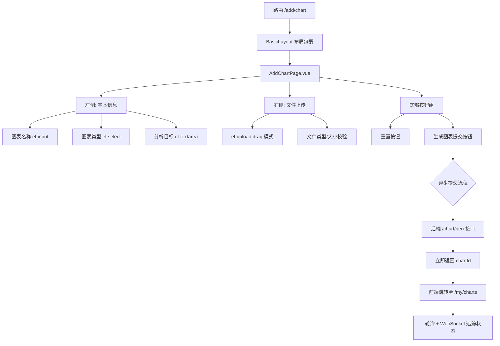
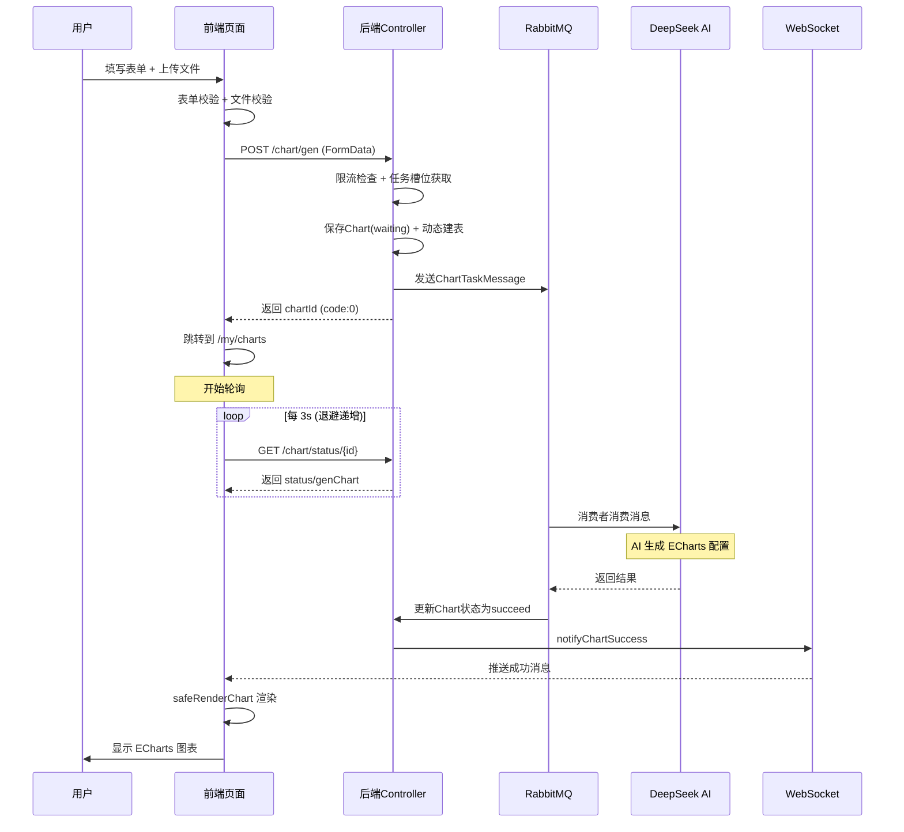

图表创建页面是用户与 AI 智能分析功能交互的核心入口。用户通过该页面上传数据文件、设定分析目标并提交任务，随后系统以异步消息驱动的方式在后台完成图表生成，最终通过 WebSocket 实时推送与轮询策略相结合的方式将结果反馈给用户。页面涉及三个核心技术主题：Element Plus 表单校验体系的专业化配置、拖拽上传组件的多重防御性校验，以及从前端提交到后端异步消费再到状态追踪的完整任务生命周期管理。

Sources: [AddChartPage.vue](lunesnow-IntelligentBI-frontend/src/views/AddChartPage.vue#L1-L89), [MyChartsPage.vue](lunesnow-IntelligentBI-frontend/src/views/MyChartsPage.vue#L1-L139)

## 路由注册与页面架构

该页面注册在 `/add/chart` 路径下，作为需要登录认证的布局内子路由，懒加载方式引入组件 `AddChartPage.vue`。页面采用双栏栅格布局：左侧聚焦"基本信息"表单，右侧提供文件上传区域，底部放置操作按钮组。



Sources: [router/index.ts](lunesnow-IntelligentBI-frontend/src/router/index.ts#L18-L22), [AddChartPage.vue](lunesnow-IntelligentBI-frontend/src/views/AddChartPage.vue#L14-L86)

## 表单校验体系：声明式规则与交互反馈

表单校验采用 Element Plus 的 `el-form` 与 `el-form-item` 组件组合，通过 `rules` 属性声明校验规则，`ref` 引用在提交时程序化触发校验。

| 字段 | 校验规则 | 触发时机 | 错误提示 |
|------|---------|---------|---------|
| `name` | `required: true` | `blur` | "请输入图表名称" |
| `chartType` | `required: true` | `change` | "请选择图表类型" |
| `goal` | `required: true` | `blur` | "请输入分析目标" |

三种字段采用不同的触发时机设计：`name` 和 `goal` 在失焦时检验，符合用户填写后切换字段的自然操作习惯；`chartType` 在 `change` 时检验，因为选择器在值变更时即可立即反馈，无需等到失焦。`goal` 字段额外设置了 `maxlength="200"` 属性，在输入层面就限制了分析目标的字符上限，避免用户输入超长文本。

提交时，`handleSubmit` 方法在 `formRef.value.validate()` 回调中执行——只有全部字段通过校验才会继续后续的文件检查与请求发送，确保提交数据的完整性。

Sources: [AddChartPage.vue](lunesnow-IntelligentBI-frontend/src/views/AddChartPage.vue#L13-L16), [AddChartPage.vue](lunesnow-IntelligentBI-frontend/src/views/AddChartPage.vue#L101-L117), [AddChartPage.vue](lunesnow-IntelligentBI-frontend/src/views/AddChartPage.vue#L174-L207)

## 拖拽上传组件：三层防御性文件校验

上传区域使用 `el-upload` 组件的 `drag` 模式，支持拖拽和点击两种文件选择方式。后端的文件校验（在 ChartController 中通过 `ThrowUtils.throwIf` 执行）与前端校验形成双层防护。前端在前置拦截阶段承担了三个层次的校验：

### 第一层：后缀名白名单校验

```typescript
const ALLOWED_TYPES = ['.xlsx', '.xls', '.csv']
// 通过文件扩展名判断
const ext = file.name.substring(file.name.lastIndexOf('.')).toLowerCase()
if (!ALLOWED_TYPES.includes(ext)) { /* 拒绝 */ }
```

### 第二层：MIME Type 深度校验

校验文件的 MIME type 是否与声称的后缀匹配，防止攻击者通过修改文件后缀绕过限制：

```typescript
const ALLOWED_MIME = [
  'application/vnd.openxmlformats-officedocument.spreadsheetml.sheet', // .xlsx
  'application/vnd.ms-excel', // .xls
  'text/csv',  'application/csv', // .csv
]
if (file.type && !ALLOWED_MIME.includes(file.type)) { /* 拒绝 */ }
```

这里使用 `file.type &&` 条件是因为某些浏览器环境下 `file.type` 可能为空字符串，此时跳过 MIME 校验以避免误拦截。

### 第三层：文件大小与空文件校验

```typescript
const MAX_SIZE = 2 * 1024 * 1024 // 2MB
if (file.size === 0) { /* 拒绝空文件 */ }
if (file.size > MAX_SIZE) { /* 拒绝超限文件 */ }
```

后端在 `ChartController.getChartByAI()` 中做了完全一致的三层校验（空文件检查、大小上限 2MB、后缀白名单 `xlsx/xls/csv`），形成前后端双重验证体系。所有校验失败的处理都调用 `uploadRef.value?.clearFiles()` 清除已选择的文件，确保 UI 状态与校验结果一致。

文件移除操作通过 `handleRemove` 方法处理，调用 `ElMessageBox.confirm` 二次确认后才重置 `selectedFile` 为 `null`，防止误删。

Sources: [AddChartPage.vue](lunesnow-IntelligentBI-frontend/src/views/AddChartPage.vue#L119-L171), [ChartController.java](lunesnow-IntelligentBI-backend/src/main/java/com/lunesnow/controller/ChartController.java#L321-L335)

## 异步任务提交流程：从表单提交到消息队列

当用户点击"生成图表"按钮并全部校验通过后，系统启动一套完整的异步任务提交流程，涉及前端请求 → 后端接收 → 任务队列三个环节。

### 前端提交逻辑

提交函数将文件与表单字段打包为 `FormData`，通过 `POST /chart/gen` 发送：

```typescript
const formDataFile = new FormData()
formDataFile.append('file', selectedFile.value)
formDataFile.append('name', form.name)
formDataFile.append('chartType', form.chartType)
formDataFile.append('goal', form.goal)
const res = await myAxios('/chart/gen', { method: 'POST', data: formDataFile })
```

使用 `FormData` 而非 `application/json` 编码的原因是该接口接收 `multipart/form-data` 格式，`file` 字段为 `@RequestPart`，其他字段为 `@RequestParam`。提交后若后端返回 `code === 0`，页面立即跳转到 `/my/charts`，用户即刻进入"我的图表"列表页查看任务状态。

### 后端接收与任务调度

`/chart/gen` 控制器方法按照以下顺序执行，每一步都有明确的错误处理边界：

| 步骤 | 操作 | 错误处理 |
|------|------|---------|
| 1. 前置校验 | 参数非空、文件大小/后缀 | `ThrowUtils.throwIf` 抛出 BusinessException |
| 2. 限流检查 | `@RateLimit` AOP 拦截令牌桶 | AOP 抛异常阻止请求进入 |
| 3. 任务槽位 | `chartTaskLimiter.tryAcquire(userId)` 原子性检查 | 返回 false 时抛异常 | 
| 4. 数据保存 | 数据库写入状态为 `waiting` 的 Chart 记录 | 写入失败抛 SYSTEM_ERROR |
| 5. 动态建表 | 基于 CSV 数据创建以 chartId 命名的数据表 | 异常回滚 |
| 6. 消息投递 | RabbitMQ 发送 `ChartTaskMessage` | 投递失败标记任务为 failed |

其中限流与任务槽位是两层不同粒度的并发控制：`@RateLimit` 限制所有用户的 API 请求频次（每秒 2 个、突发 5 个），`ChartTaskLimiter` 限制单个用户的任务堆积数量（最多 3 个 running/waiting 任务）。任务槽位的原子操作通过 Redis Lua 脚本实现 check-and-increment 的原子性。

消息投递失败时，控制器捕获异常并将 Chart 状态标记为 `failed`，execMessage 设为 "系统繁忙，请稍后重试"，确保任务状态不会永久卡在 `waiting`。

Sources: [AddChartPage.vue](lunesnow-IntelligentBI-frontend/src/views/AddChartPage.vue#L186-L199), [ChartController.java](lunesnow-IntelligentBI-backend/src/main/java/com/lunesnow/controller/ChartController.java#L308-L390), [ChartTaskLimiter.java](lunesnow-IntelligentBI-backend/src/main/java/com/lunesnow/manager/ChartTaskLimiter.java#L88-L112)

## 异步任务状态跟踪：轮询 + WebSocket 实时通知

任务提交后的状态跟踪是一个"轮询保底 + WebSocket 加速"的双通道模式，共同确保用户能及时获取任务状态变更。

### 状态模型

Chart 实体的 `status` 字段定义了四个清晰的状态：

```
waiting → running → succeed
                  → failed
```

- `waiting`：任务已提交到 RabbitMQ，等待消费者处理
- `running`：消费者开始执行，调用 DeepSeek AI
- `succeed`：AI 响应解析验证通过，genChart/genResult 已写入
- `failed`：AI 调用失败或响应校验未通过

### 轮询机制（保底通道）

`MyChartsPage.vue` 使用 `usePolling` composable 实现基于指数退避的轮询策略。核心逻辑在 `pollCallback` 函数中：

1. 过滤出 `tableData` 中所有 `status === 'waiting' || status === 'running'` 的图表
2. 如果不存在 pending 图表，返回 `true` 停止轮询
3. 逐个调用 `GET /chart/status/{id}` 获取最新状态
4. 当某个图表状态变为 `succeed` 时，立即通过 `safeRenderChart` 进行 ECharts 渲染

轮询参数配置体现了"快速发现 + 优雅降级"的设计哲学：

| 参数 | 值 | 说明 |
|------|-----|------|
| 初始间隔 | 3000ms | 任务预期在 10-30 秒完成，3 秒轮询足够灵敏 |
| 最大间隔 | 30000ms | 防止网络故障时无限制退避 |
| 退避系数 | 1.5 | 每次失败后间隔等比放大：3s → 4.5s → 6.75s → ... → 30s |

同时，`usePolling` 集成了 Page Visibility API：当用户切换到其他标签页时暂停轮询，返回页面时立即重新请求并重置间隔为初始值，避免后台标签页浪费请求资源。

### WebSocket 通知（实时通道）

当消费者（ChartMessageConsumer）完成（或失败）图表生成后，通过 `ChartWebSocketHandler` 向用户推送实时通知：

- **成功通知**：`{"type":"success","chartId":...,"chartName":"...","message":"图表生成成功"}`
- **失败通知**：`{"type":"failure","chartId":...,"chartName":"...","message":"图表生成失败: ..."}`

前端 `useWebSocket` Hook 在收到消息后通过 `ElMessage.success/error` 显示弹窗提示，并将消息推入 `messages` 响应式数组供组件响应。WebSocket 连接在组件卸载时自动关闭，避免了内存泄漏。



Sources: [MyChartsPage.vue](lunesnow-IntelligentBI-frontend/src/views/MyChartsPage.vue#L289-L325), [usePolling.ts](lunesnow-IntelligentBI-frontend/src/composables/usePolling.ts#L23-L148), [ChartWebSocketHandler.java](lunesnow-IntelligentBI-backend/src/main/java/com/lunesnow/websocket/ChartWebSocketHandler.java#L108-L125), [useWebSocket.ts](lunesnow-IntelligentBI-frontend/src/composables/useWebSocket.ts#L64-L88)

## 失败重试与错误降级

对于失败状态（`failed`）的图表，`MyChartsPage` 提供了"重新生成"按钮，调用 `POST /chart/retry/{id}` 接口。后端重置图表状态为 `waiting`，清空 `genChart`/`genResult`/`execMessage` 字段，然后重新发送消息到 RabbitMQ。

### 死信队列的最终处理

当消费者的业务逻辑抛出异常（如 AI 调用超时、AI 响应格式错误），执行 `channel.basicNack(deliveryTag, false, false)` 将消息拒绝且不重新入队——消息自动进入死信队列。`handleDeadLetter` 方法消费死信队列时，根据当前图表状态做四种差异化处理：

| 图表状态 | 处理逻辑 |
|---------|---------|
| 图表已删除 (`null`) | 忽略消息，不产生告警 |
| 已成功 (`succeed`) | 忽略（用户已手动重试成功） |
| 重新生成中 (`waiting/running`) | 暂存，等待下次重试结果 |
| 仍为失败 (`failed`) | 记录告警日志，后续可接入钉钉/邮件通知 |

Sources: [ChartController.java](lunesnow-IntelligentBI-backend/src/main/java/com/lunesnow/controller/ChartController.java#L395-L433), [ChartMessageConsumer.java](lunesnow-IntelligentBI-backend/src/main/java/com/lunesnow/mq/ChartMessageConsumer.java#L208-L238)

## 重置流程与 UX 细节

"重置"按钮调用 `handleReset` 方法，将表单三个字段清空、清除已选文件、重置校验状态。特别值得注意的是调用顺序：先清空 `form` 数据，再清空 `uploadRef` 的文件列表，最后调用 `formRef.value?.resetFields()`，因为 `resetFields` 会将表单值重置到初始值而非空值，所以在调用之前需要先手动清除数据。

页面整体采用响应式布局：在 `max-width: 768px` 时，双栏栅格切换为单栏，padding 相应缩小，确保移动端浏览体验。

Sources: [AddChartPage.vue](lunesnow-IntelligentBI-frontend/src/views/AddChartPage.vue#L209-L216), [AddChartPage.vue](lunesnow-IntelligentBI-frontend/src/views/AddChartPage.vue#L366-L375)

## 相关页面导航

- 了解提交后的图表列表展示与轮询逻辑详情：[我的图表页面 → MyChartsPage](4-qian-duan-ye-mian-dao-hang-shou-ye-tu-biao-chuang-jian-yi-biao-pan-yu-hou-tai-guan-li)
- 了解后端控制器完整的校验与异步提交逻辑：[图表生成控制器](7-tu-biao-sheng-cheng-kong-zhi-qi-wen-jian-xiao-yan-dong-tai-jian-biao-ren-wu-xian-liu-yu-yi-bu-ti-jiao)
- 了解 RabbitMQ 消息队列如何保障任务可靠投递：[RabbitMQ 消息队列](8-rabbitmq-xiao-xi-dui-lie-ke-kao-tou-di-shou-dong-ack-yu-si-xin-dui-lie-zhong-shi-ji-zhi)
- 了解 WebSocket 推送的完整实现：[WebSocket 实时推送](10-websocket-shi-shi-tui-song-concurrenthashmap-hui-hua-guan-li-xin-tiao-jian-ce-yu-zai-xian-zhuang-tai)
- 了解轮询策略的指数退避算法：[轮询策略优化](22-lun-xun-ce-lue-you-hua-zhi-shu-tui-bi-suan-fa-yu-page-visibility-api-zan-ting-hui-fu)