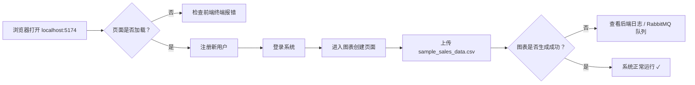

本文档面向**初次接触本项目的开发者**，提供从零开始搭建本地开发环境的完整指南。你将按顺序完成：环境依赖安装 → 基础设施启动（MySQL / Redis / RabbitMQ）→ 后端配置与启动 → 前端配置与启动 → 验证系统是否正常运行。整个流程预计耗时 **30~60 分钟**（取决于网络下载速度）。

---

## 1. 前置环境要求

在克隆代码之前，请确认你的开发机器已安装以下软件。括号内为项目实际验证过的版本，低于该版本可能引发兼容性问题。

| 依赖 | 最低版本 | 用途 | 验证命令 |
|------|---------|------|---------|
| JDK | 17+（项目使用 17） | 后端 Spring Boot 3 运行环境 | `java -version` |
| Node.js | 20+（package.json 要求 ^20.19.0） | 前端 Vite 构建与运行 | `node -v` |
| npm | 10+（随 Node.js 附带） | 前端依赖管理 | `npm -v` |
| MySQL | 8.0+ | 持久化图表与用户数据 | `mysql --version` |
| Redis | 7.0+ | Session 存储、限流计数器、任务槽位管理 | `redis-cli ping` |
| RabbitMQ | 3.12+ | 异步图表生成任务的消息队列 | 管理页面 `http://localhost:15672` |
| Maven | 3.8+（或使用项目自带的 `mvnw`） | 后端依赖管理与构建 | `mvn --version` |

> **提示**：项目根目录下提供了 Maven Wrapper（`mvnw` / `mvnw.cmd`），如果你本地未安装 Maven，可以直接使用 `./mvnw`（Linux/Mac）或 `mvnw.cmd`（Windows）替代 `mvn` 命令。Sources: [pom.xml](lunesnow-IntelligentBI-backend/pom.xml#L8-L13)

---

## 2. 项目结构速览

在开始配置前，先了解项目的顶层布局有助于后续操作时定位文件：

```
lunesnow-Intelligent BI/
├── lunesnow-IntelligentBI-backend/    # 后端（Spring Boot 3 + MyBatis-Plus）
│   ├── pom.xml                        # Maven 依赖声明
│   ├── Dockerfile                     # Docker 构建文件（生产部署用）
│   ├── sql/
│   │   └── create_chart_table.sql     # ★ 数据库建表脚本（必须执行）
│   ├── src/main/resources/
│   │   ├── application.yml            # 公共配置（数据源、Redis、RabbitMQ 等）
│   │   └── application-local.yml      # ★ 本地敏感配置（需自行创建，已 gitignore）
│   └── .env.example                   # 环境变量参考模板
│
├── lunesnow-IntelligentBI-frontend/   # 前端（Vue 3 + TypeScript + Vite）
│   ├── package.json                   # npm 依赖与脚本
│   ├── vite.config.ts                 # Vite 配置（端口 5174）
│   └── src/                           # 源代码
│
├── sample_sales_data.csv              # 测试用的示例销售数据文件
├── README.md                          # 项目总览 README
└── architecture.png                   # 系统架构图
```

Sources: 项目目录结构如上

---

## 3. 基础设施启动

项目依赖三个中间件服务：MySQL、Redis、RabbitMQ。请根据你的操作系统选择合适的方式启动它们。

### 3.1 MySQL 8.0+ 配置

**步骤 1：创建数据库**

```sql
-- 登录 MySQL
mysql -u root -p

-- 创建项目专用数据库
CREATE DATABASE IF NOT EXISTS `lunesnow-intelligent bi`
  DEFAULT CHARACTER SET utf8mb4
  DEFAULT COLLATE utf8mb4_unicode_ci;

-- 确认创建成功
SHOW DATABASES;
```

**步骤 2：执行建表脚本**

```bash
# 方式一：直接通过 MySQL 客户端导入
mysql -u root -p "lunesnow-intelligent bi" < lunesnow-IntelligentBI-backend/sql/create_chart_table.sql

# 方式二：登录后使用 source 命令
mysql -u root -p
use `lunesnow-intelligent bi`;
source lunesnow-IntelligentBI-backend/sql/create_chart_table.sql;
```

脚本会创建 `chart` 表（图表信息表）及其完整字段定义。若表已存在，`alter table` 语句会通过 `if not exists` 安全地补全缺失字段。Sources: [create_chart_table.sql](lunesnow-IntelligentBI-backend/sql/create_chart_table.sql#L1-L34)

> **注意**：数据库名中包含空格，在 SQL 中必须使用反引号包裹。项目配置中使用的也是带空格的数据库名，请保持一致。Sources: [application.yml](lunesnow-IntelligentBI-backend/src/main/resources/application.yml#L12)

### 3.2 Redis 7.0+ 启动

Redis 用于三个核心场景：
1. **Session 存储**：使用 `spring-session-data-redis` 实现分布式 Session，默认超时 30 天
2. **并发任务限流**：通过 Redis Lua 原子脚本实现无竞态条件的任务槽位管理
3. **令牌桶限流**：Redisson 基于 Redis 实现分布式令牌桶

```bash
# 默认启动（端口 6379）
redis-server

# 如需自定义密码，启动时指定
redis-server --requirepass your_password
```

项目默认使用 Redis 的 `db2` 存储 Session，`db1` 存储限流数据。Sources: [application.yml](lunesnow-IntelligentBI-backend/src/main/resources/application.yml#L18-L22)

### 3.3 RabbitMQ 3.12+ 启动

RabbitMQ 是异步图表生成管道的核心——前端上传文件后，后端将任务投递到队列，消费者异步调用 DeepSeek AI 生成图表。

```bash
# 默认启动（管理页面端口 15672，AMQP 端口 5672）
rabbitmq-server

# 访问管理控制台
# http://localhost:15672  （默认账号：guest / guest）
```

项目默认使用 guest/guest 账号连接本地 RabbitMQ。Sources: [application.yml](lunesnow-IntelligentBI-backend/src/main/resources/application.yml#L27-L32)

### 3.4（可选）Elasticsearch

`application.yml` 中 Elasticsearch 配置默认注释，项目当前版本未强制启用 ES。如需开启全文搜索功能，取消注释并配置：

```yaml
elasticsearch:
  uris: http://localhost:9200
  username: ${ES_USERNAME:}
  password: ${ES_PASSWORD:}
```

对应的索引 mapping 参考 [`sql/post_es_mapping.json`](lunesnow-IntelligentBI-backend/sql/post_es_mapping.json)。

---

## 4. 后端启动（Spring Boot 3）

### 4.1 创建本地配置文件

由于 `application-local.yml` 包含数据库密码和 AI API Key 等敏感信息，它已被加入 `.gitignore`，**不会**提交到版本控制系统。你需要手动创建此文件。Sources: [.gitignore](lunesnow-IntelligentBI-backend/.gitignore#L136-L138)

参照 `.env.example` 的提示，在 `lunesnow-IntelligentBI-backend/src/main/resources/` 目录下创建 `application-local.yml`：

```yaml
# application-local.yml — 本地开发配置
spring:
  datasource:
    url: jdbc:mysql://localhost:3306/lunesnow-intelligent bi
    username: root
    password: 你的MySQL密码

  data:
    redis:
      host: localhost
      port: 6379
      database: 2
      password: 你的Redis密码（若无密码则删除此行）

  rabbitmq:
    host: localhost
    port: 5672
    username: guest
    password: guest

deepseek:
  api-key: sk-你的DeepSeek API密钥
```

> **DeepSeek API Key 获取**：访问 [platform.deepseek.com](https://platform.deepseek.com) 注册账号，在 API Keys 页面创建密钥。DeepSeek 提供免费额度，足以完成本地开发测试。

### 4.2 关于 `MainApplication` 的说明

`MainApplication.java` 中有一行关键注解：

```java
@SpringBootApplication(exclude = {RedisAutoConfiguration.class})
```

这个 `exclude` 是 Spring Boot 初始化模板自带的占位，注释写着 *"如需开启 Redis，须移除 exclude 中的内容"*。但本项目的 **Session 和限流功能均依赖 Redis**，所以保持现状即可——Redisson 和 `spring-session-data-redis` 不依赖 `RedisAutoConfiguration`，它们通过独立的自动配置类初始化。请**不要移除**这个 exclude，否则会导致 `RedisTemplate` 与 Redisson 的 `RedisClient` 冲突。Sources: [MainApplication.java](lunesnow-IntelligentBI-backend/src/main/java/com/lunesnow/MainApplication.java#L12-L15)

### 4.3 启动后端

```bash
cd lunesnow-IntelligentBI-backend

# 方式一：使用 Maven Wrapper（推荐，无需本地安装 Maven）
mvnw.cmd spring-boot:run

# 方式二：使用本地 Maven
mvn spring-boot:run

# 方式三：先打包再运行
mvn clean package -DskipTests
java -jar target/springboot-init-0.0.1-SNAPSHOT.jar
```

**启动成功的标志**：控制台输出类似以下内容，且无异常堆栈：

```
2025-XX-XX 12:00:00.000  INFO 12345 --- [main] com.lunesnow.MainApplication            : Started MainApplication in 8.12 seconds
```

后端默认监听 `http://localhost:8088/api`，可以通过以下接口验证：

```bash
# 健康检查（应返回 200 和 JSON 响应）
curl http://localhost:8088/api/user/current
```

### 4.4 访问 Swagger 接口文档

项目集成了 Knife4j（Swagger 的增强版），启动后端后访问：

```
http://localhost:8088/api/doc.html
```

接口文档页面会列出所有 Controller 的接口定义，包括请求参数和响应格式，是开发调试时的重要参考。Sources: [application.yml](lunesnow-IntelligentBI-backend/src/main/resources/application.yml#L70-L80)

---

## 5. 前端启动（Vue 3 + Vite）

### 5.1 安装依赖

```bash
cd lunesnow-IntelligentBI-frontend

# 使用 npm 安装依赖
npm install
```

> **注意**：前端依赖较大（Element Plus、ECharts 等），首次安装可能需要 2~5 分钟。如果遇到网络问题，可配置 npm 镜像：`npm config set registry https://registry.npmmirror.com`。

### 5.2 启动开发服务器

```bash
npm run dev
```

Vite 开发服务器默认在 **`http://localhost:5174`** 启动（由 `vite.config.ts` 的 `strictPort: true` 固定）。Sources: [vite.config.ts](lunesnow-IntelligentBI-frontend/vite.config.ts#L10-L12)

**启动成功的标志**：

```
  VITE v8.x.x  ready in xxx ms

  ➜  Local:   http://localhost:5174/
  ➜  Network: http://192.168.x.x:5174/
```

### 5.3 前端代理配置说明

前端通过 `request.ts` 中封装的 Axios 实例与后端通信，请求地址为相对路径 `/api/...`。在开发环境下，Vite 会自动将 `/api` 前缀的请求代理到后端地址 `http://localhost:8088`（此代理行为在 Vite 配置中声明，或由 `openapi2ts.config.ts` 生成接口定义时指定）。因此前端代码中**不需要**硬编码后端地址。

---

## 6. 验证系统运行

完成上述步骤后，按以下流程验证各模块是否正常协作：



### 6.1 分步验证清单

| 验证步骤 | 预期结果 | 失败排查方向 |
|---------|---------|------------|
| `http://localhost:5174` 访问 | 显示登录页面，无白屏/404 | 检查前端控制台报错；确认端口 5174 未被占用 |
| 点击「去注册」→ 填写用户名/密码/确认密码 → 提交 | 注册成功并跳转到登录页 | 检查后端日志中 SQL 错误；确认 MySQL 数据库已创建 |
| 使用注册的账号登录 | 登录成功，跳转到首页仪表盘 | 检查 Redis 是否正常运行（Session 依赖 Redis） |
| 进入「创建图表」页面 | 表单正常显示，支持文件拖拽上传 | 检查浏览器控制台是否有 JS 错误 |
| 选择 `sample_sales_data.csv`，填写分析目标，提交 | 页面显示「等待中」状态，几秒后变更为「成功」并展示图表 | 检查 RabbitMQ 队列状态；检查 DeepSeek API Key 是否有效；查看后端日志中的异常信息 |
| 访问 `http://localhost:8088/api/doc.html` | 显示 Knife4j 接口文档页面 | 检查后端是否启动成功 |

**测试数据**：项目根目录下的 `sample_sales_data.csv` 是一份示例销售数据，包含日期、产品、销售额等字段，可直接用于测试图表生成功能。

---

## 7. 常见问题排查

### 问题 1：后端启动报错 "Access denied for user"

```
Caused by: java.sql.SQLException: Access denied for user 'root'@'localhost'
```

**原因**：`application-local.yml` 中数据库用户名或密码错误。

**解决**：检查 `application-local.yml` 中的 `spring.datasource.password` 是否与 MySQL 实际密码一致。注意该文件在 `.gitignore` 中，不会被 git 追踪，请确认你创建的路径正确。

### 问题 2：后端启动报错 "Redis connection refused"

```
Caused by: io.lettuce.core.RedisConnectionException: Unable to connect to localhost:6379
```

**原因**：Redis 服务未启动或端口/密码不匹配。

**解决**：
1. 执行 `redis-cli ping`，确认 Redis 返回 `PONG`
2. 检查 `application-local.yml` 中 Redis 的 `host`、`port`、`password` 配置

### 问题 3：前端请求接口返回 403

**原因**：未登录或 Session 过期。

**解决**：
1. 先在页面中完成登录操作
2. 检查浏览器开发者工具的 Application → Cookies 中是否存在 JSESSIONID
3. 确认 Redis 服务正常运行（Session 存储在 Redis 中）

### 问题 4：图表生成后一直显示「等待中」

**原因**：RabbitMQ 消费者未正常处理消息。

**解决**：
1. 访问 `http://localhost:15672`（RabbitMQ 管理页面），查看队列中是否有消息堆积
2. 检查后端日志中是否有 `Channel shutdown` 或 `AMQP connection error` 异常
3. 确认 DeepSeek API Key 有效且未过期

### 问题 5：前端报错 "Failed to resolve import"

**原因**：npm 依赖未完整安装。

**解决**：
```bash
cd lunesnow-IntelligentBI-frontend
rm -rf node_modules package-lock.json
npm install
```

---

## 8. 下一步学习路径

完成本地环境搭建后，建议按以下顺序深入理解系统：

**先理解全貌**：
- [系统架构全景：Spring Boot 3 后端 + Vue 3 前端 + 异步消息驱动](5-xi-tong-jia-gou-quan-jing-spring-boot-3-hou-duan-vue-3-qian-duan-yi-bu-xiao-xi-qu-dong) — 了解各模块如何协作
- [完整数据流水线：从上传 CSV/Excel 到 ECharts 图表的全链路追踪](6-wan-zheng-shu-ju-liu-shui-xian-cong-shang-chuan-csv-excel-dao-echarts-tu-biao-de-quan-lian-lu-zhui-zong) — 追踪一次图表请求的完整生命周期

**再深入核心模块**：
- [图表生成控制器：文件校验、动态建表、任务限流与异步提交](7-tu-biao-sheng-cheng-kong-zhi-qi-wen-jian-xiao-yan-dong-tai-jian-biao-ren-wu-xian-liu-yu-yi-bu-ti-jiao) — 后端入口逻辑
- [RabbitMQ 消息队列：可靠投递、手动 ACK 与死信队列重试机制](8-rabbitmq-xiao-xi-dui-lie-ke-kao-tou-di-shou-dong-ack-yu-si-xin-dui-lie-zhong-shi-ji-zhi) — 异步处理核心
- [DeepSeek AI 集成：Prompt 工程与 ECharts 配置智能生成](9-deepseek-ai-ji-cheng-prompt-gong-cheng-yu-echarts-pei-zhi-zhi-neng-sheng-cheng) — AI 图表生成逻辑
- [WebSocket 实时推送：ConcurrentHashMap 会话管理、心跳检测与在线状态](10-websocket-shi-shi-tui-song-concurrenthashmap-hui-hua-guan-li-xin-tiao-jian-ce-yu-zai-xian-zhuang-tai) — 实时状态推送

**查看 API 概览**：
- [API 接口一览：从图表生成到管理后台](3-api-jie-kou-lan-cong-tu-biao-sheng-cheng-dao-guan-li-hou-tai) — 所有后端接口速查表
- [前端页面导航：首页、图表创建、仪表盘与后台管理](4-qian-duan-ye-mian-dao-hang-shou-ye-tu-biao-chuang-jian-yi-biao-pan-yu-hou-tai-guan-li) — 前端页面路由一览