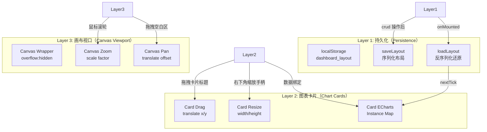
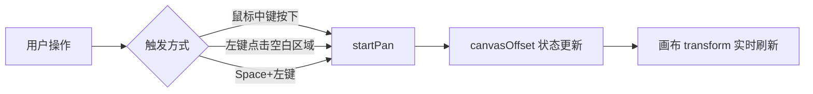
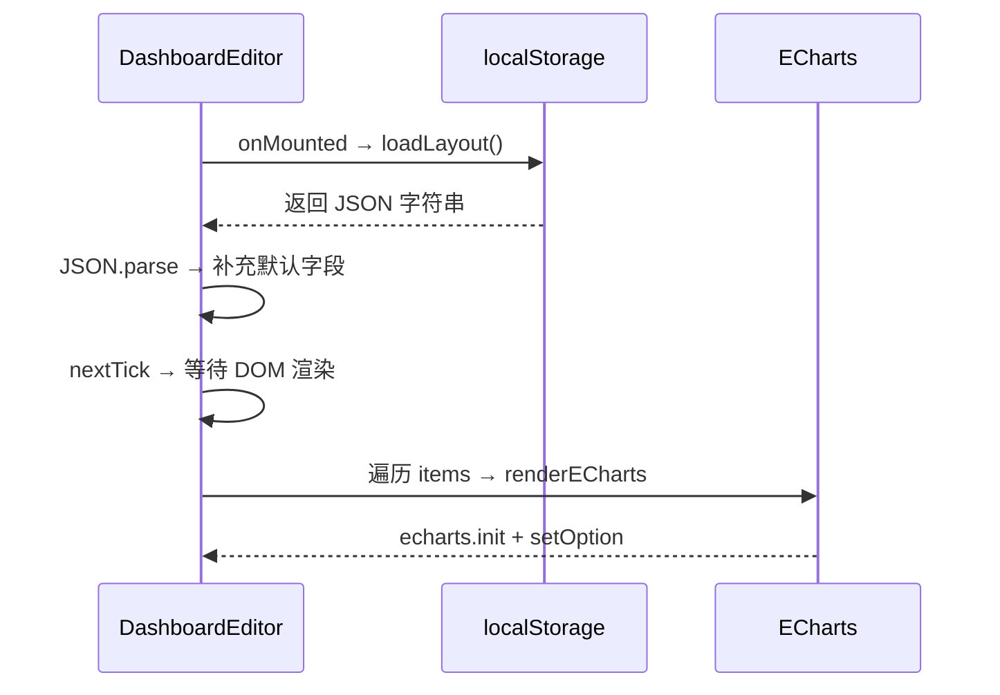

仪表盘编辑器是本系统前端架构中最具交互复杂度的功能模块，它实现了**完全基于 CSS transform 的拖拽系统**，在不依赖任何第三方拖拽库（如 vuedraggable、interact.js）的前提下，独立完成了图表卡片的自由拖拽、缩放、无限画布平移/缩放以及布局的 localStorage 持久化。整个模块仅由两个核心文件构成：`DashboardEditor.vue`（视图层 + 业务逻辑）和 `useDraggable.ts`（可复用的拖拽 Hook），体现了 Vue 3 Composition API 模式下"轻依赖、重自制"的设计哲学。

Sources: [DashboardEditor.vue](lunesnow-IntelligentBI-frontend/src/views/DashboardEditor.vue#L1-L853), [useDraggable.ts](lunesnow-IntelligentBI-frontend/src/composables/useDraggable.ts#L1-L139)

## 架构全景：三层操作模型

仪表盘编辑器的交互模型可抽象为三个独立的操作层次，每层拥有专属的事件处理链和状态管理：



**操作层次说明**：第一层为画布视口控制（平移与缩放），第二层为图表卡片操作（拖拽移动与尺寸缩放），第三层为布局持久化（自动保存与恢复）。三个层次之间通过**缩放比例（canvasZoom）** 耦合——拖拽和缩放的增量计算都需要除以当前缩放值，以确保在缩放状态下操作精度不受影响。

Sources: [DashboardEditor.vue#L164-L173](lunesnow-IntelligentBI-frontend/src/views/DashboardEditor.vue#L164-L173), [DashboardEditor.vue#L200-L281](lunesnow-IntelligentBI-frontend/src/views/DashboardEditor.vue#L200-L281)

## CSS transform GPU 加速：零重排的渲染架构

整个拖拽系统严格遵循 **"只动 transform，不动 top/left"** 的渲染原则，这是实现 60fps 流畅交互的关键决策。

### 核心机制

拖拽 Hook `useDraggable.ts` 通过三点设计确保 GPU 合成层独立：

1. **`will-change: transform` 提示**：在 `bind()` 方法中主动设置 `el.style.willChange = 'transform'`，告知浏览器提前为该元素创建独立的合成层（compositing layer），将后续的 transform 变化交由 GPU 处理，完全绕过主线程的布局（Layout）和绘制（Paint）阶段。

2. **`transform: translate()` 定位**：所有位置更新仅操作 `translate(x, y)`，不触发任何几何属性（top/left/margin/padding）的回流。CSS transform 的变更只触发合成（Composite），这是渲染管道中最轻量的一环。

3. **全局事件委托**：`mousedown` 绑定在目标元素，`mousemove` 和 `mouseup` 绑定在 `document` 上。这种模式避免了在拖拽过程中频繁触发父元素的鼠标事件，同时确保即使鼠标移出元素边界也能持续跟踪拖拽。

```typescript
// useDraggable.ts — 核心更新逻辑
const updatePosition = () => {
  if (!targetEl) return
  targetEl.style.transform = `translate(${x.value}px, ${y.value}px)`
}
// 绑定时的优化提示
const bind = (el: HTMLElement) => {
  targetEl = el
  el.style.cursor = 'grab'
  el.style.willChange = 'transform'  // GPU 合成层提示
  el.addEventListener('mousedown', handleMouseDown)
  updatePosition()
}
```

Sources: [useDraggable.ts#L47-L51](lunesnow-IntelligentBI-frontend/src/composables/useDraggable.ts#L47-L51), [useDraggable.ts#L107-L114](lunesnow-IntelligentBI-frontend/src/composables/useDraggable.ts#L107-L114)

### 为什么不用 top/left？

若要对比两种实现方式的性能差异，可以从浏览器渲染管道的角度分析：

| 属性 | 触发管道阶段 | GPU 参与度 | 每帧开销 |
|------|-------------|-----------|---------|
| `top`/`left` | Layout → Paint → Composite | 低（需重新计算布局树） | 高 |
| `transform: translate()` | Composite only | 高（直接在合成层操作） | 极低 |

仪表盘编辑器的设计明确选择了 transform route，这在大规模多卡片场景（10+ 图表卡片同时存在于画布上）中尤为关键——每个卡片的拖拽不会引发其他卡片的重排。

Sources: [useDraggable.ts#L1-L3](lunesnow-IntelligentBI-frontend/src/composables/useDraggable.ts#L1-L3)

## 无限画布：缩放与平移的数学变换

"无限"画布的实现本质上是**通过数学变换模拟无限空间**。画布的实际 DOM 尺寸为固定值（4000×3000px），但通过缩放（scale）和平移（translate）的组合变换，用户在视觉上可以获得远超出这个范围的操作空间。

### 三入口平移机制

画布平移支持三种触发方式，设计上兼顾了不同用户的使用习惯：



代码实现上，`onCanvasMouseDown` 方法通过 `isClickOnCard()` 判断点击目标是否在卡片区域内，仅当点击画布空白区域时才启动平移，避免与卡片拖拽冲突：

```typescript
const onCanvasMouseDown = (e: MouseEvent) => {
  if (e.button === 1) {        // 中键直接平移
    startPan(e); return
  }
  if (e.button === 0 && !isClickOnCard(e.target as HTMLElement)) {
    startPan(e)                // 左键 + 空白区域
  }
}
```

Sources: [DashboardEditor.vue#L284-L313](lunesnow-IntelligentBI-frontend/src/views/DashboardEditor.vue#L284-L313)

### 以鼠标位置为中心的缩放

滚轮缩放采用**以鼠标指针位置为中心**的变换策略，这是用户体验的关键细节。如果不做位置补偿，缩放操作会将画布左上角作为固定点，导致用户需要反复平移才能聚焦目标区域。

```typescript
const onCanvasWheel = (e: WheelEvent) => {
  // 计算鼠标在 wrapper 内的位置
  const mouseX = e.clientX - rect.left
  const mouseY = e.clientY - rect.top
  
  const ratio = newZoom / oldZoom
  // 补偿偏移量，使鼠标位置在缩放后保持不变
  canvasOffset.value.x = mouseX - (mouseX - canvasOffset.value.x) * ratio
  canvasOffset.value.y = mouseY - (mouseY - canvasOffset.value.y) * ratio
}
```

**数学原理**：设鼠标在画布坐标系的点为 P，缩放前偏移量为 O，缩放倍数为 Z。缩放后若要保持 P 在视口中的位置不变，新的偏移量 O' 需满足 `(P - O) * Z_old = (P - O') * Z_new`，解得 `O' = P - (P - O) * (Z_new / Z_old)`。

缩放范围被限制在 `0.2x ~ 3x` 之间，步长为 `0.08`，确保缩放操作平缓可控。`fitView()` 方法则通过计算所有卡片的包围盒，自动选择合适的缩放比例使全部卡片居中可见。

Sources: [DashboardEditor.vue#L334-L355](lunesnow-IntelligentBI-frontend/src/views/DashboardEditor.vue#L334-L355), [DashboardEditor.vue#L364-L391](lunesnow-IntelligentBI-frontend/src/views/DashboardEditor.vue#L364-L391)

## 图表卡片：拖拽、缩放与 ECharts 渲染

### 卡片拖拽（带缩放补偿）

与 `useDraggable.ts` 的通用拖拽不同，DashboardEditor 中的卡片拖拽需要考虑**画布缩放比例**：当画布缩放为 0.5x 时，鼠标移动 100px 对应卡片应移动 200px（以卡片自身的坐标空间计）。

```typescript
const onDragMove = (e: MouseEvent) => {
  const { item, startX, startY, startItemX, startItemY } = dragState
  const zoom = canvasZoom.value
  item.x = startItemX + (e.clientX - startX) / zoom
  item.y = startItemY + (e.clientY - startY) / zoom
}
```

这里的除法 `(e.clientX - startX) / zoom` 是关键：它将屏幕像素增量转换为画布坐标空间中的增量。当 `zoom < 1`（缩小）时，增量放大，使卡片移动幅度匹配视觉预期。

### 卡片缩放（右下角手柄）

右下角的 `resize-handle` 实现单向缩放（右下方向），`onResizeMove` 同样进行缩放补偿。缩放后的图表需要调用 `instance.resize()` 通知 ECharts 重新适配容器尺寸：

```typescript
const onResizeEnd = () => {
  // 缩放后重新渲染图表
  const instance = chartInstances.get(item.id)
  instance?.resize()
}
```

最小尺寸限制为 `200×150px`，防止卡片被缩小到不可用状态。卡片的 CSS 设置了 `will-change: transform`，与拖拽 Hook 的 GPU 加速策略保持一致。

Sources: [DashboardEditor.vue#L217-L224](lunesnow-IntelligentBI-frontend/src/views/DashboardEditor.vue#L217-L224), [DashboardEditor.vue#L256-L274](lunesnow-IntelligentBI-frontend/src/views/DashboardEditor.vue#L256-L274)

### ECharts 实例管理

所有 ECharts 实例通过 `Map<string, echarts.ECharts>` 集中管理（`chartInstances`），这是确保组件卸载时正确释放资源的关键设计：

| 生命周期事件 | 处理逻辑 |
|-------------|---------|
| **添加图表** | `nextTick` 后 `echarts.init(dom)` → `setOption(option)` → 存入 Map |
| **移除图表** | `instance.dispose()` → 从 Map 删除 → 从数组移除 |
| **缩放结束** | `instance.resize()`（ECharts 内置自适应） |
| **窗口 resize** | 遍历 Map 全部调用 `resize()` |
| **组件卸载** | 遍历 Map 全部 `dispose()` → `clear()` |

图表配置的解析使用了 `safeParseChartConfig`（来自 `chartValidator.ts`），该函数支持三重解析容错（JSON → 清除前缀 → new Function），并对 `__proto__`、`constructor`、`eval` 等危险字段进行递归过滤，防止 AI 生成的配置内容引入 XSS 或原型链污染风险。

Sources: [DashboardEditor.vue#L162-L163](lunesnow-IntelligentBI-frontend/src/views/DashboardEditor.vue#L162-L163), [DashboardEditor.vue#L559-L575](lunesnow-IntelligentBI-frontend/src/views/DashboardEditor.vue#L559-L575), [chartValidator.ts#L17-L27](lunesnow-IntelligentBI-frontend/src/utils/chartValidator.ts#L17-L27)

## 布局持久化：localStorage 序列化与还原

### 存储策略

仪表盘布局使用 **localStorage** 进行持久化，存储键为 `dashboard_layout`。每次 CRUD 操作后自动调用 `saveLayout()`：

```typescript
const saveLayout = () => {
  const data = dashboardCharts.value.map((d) => ({
    id: d.id, chartId: d.chartId, name: d.name,
    type: d.type, genChart: d.genChart,
    x: d.x, y: d.y, width: d.width, height: d.height,
  }))
  localStorage.setItem(STORAGE_KEY, JSON.stringify(data))
}
```

注意序列化时**排除**了运行时状态字段 `isDragging` 和 `isResizing`，保持了存储数据的纯净性。同时 `genChart`（ECharts 完整配置 JSON）也被序列化存储，这意味图表配置被完整缓存在前端，即使后端图表数据发生变化，仪表盘仍能展示缓存中的配置。

**还原时机与流程**：



### 数据安全性考量

虽然 localStorage 是纯前端存储，不存在后端数据库的 SQL 注入风险，但 `genChart` 字段存储的是 AI 生成的 ECharts 配置，其内容不可完全信任。还原时的渲染链路经过 `safeParseChartConfig` 的危险字段过滤，确保即使存储的配置被污染，渲染时也能阻断恶意代码执行。

Sources: [DashboardEditor.vue#L512-L552](lunesnow-IntelligentBI-frontend/src/views/DashboardEditor.vue#L512-L552)

## 图表选择与添加

### 数据加载

仪表盘通过 `listMyChartVoByPage` API 加载当前用户已创建的图表列表，仅允许添加 `status === 'succeed'` 且 `genChart` 不为空的图表。重复添加检测通过 `isAdded(chartId)` 实现：

```typescript
const isAdded = (chartId?: number) => {
  if (!chartId) return false
  return dashboardCharts.value.some((d) => d.chartId === chartId)
}
```

### 位置自动计算

新添加的图表位置采用网格化布局防止重叠：每行 3 列，列间距 380px，行间距 320px，内外边距 40px。这种"简单网格 + 自由拖拽"的组合设计方案优于纯网格锁定，既保证了初始布局的有序性，又赋予了用户后续自由调整的能力。

```typescript
const col = count % 3
const row = Math.floor(count / 3)
const newX = 40 + col * 380
const newY = 40 + row * 320
```

Sources: [DashboardEditor.vue#L393-L441](lunesnow-IntelligentBI-frontend/src/views/DashboardEditor.vue#L393-L441)

## 设计决策总结与对比

| 决策点 | 本系统方案 | 替代方案 | 选择理由 |
|-------|-----------|---------|---------|
| **拖拽实现** | 原生 mousedown/move/up + CSS transform | vuedraggable / interact.js | 零外部依赖，精确控制缩放补偿逻辑 |
| **画布大小** | 固定 4000×3000 + zoom/pan 变换 | 动态扩展 DOM 尺寸 | 避免 DOM 膨胀，变换计算在 GPU 层完成 |
| **布局存储** | localStorage | 后端 API 存储 | 零网络延迟，离线可用；但跨设备不可同步 |
| **图表配置来源** | 本地缓存 genChart | 每次从后端拉取 | 避免网络请求，提升加载速度 |
| **缩放模式** | transform-origin 0 0 + 偏移补偿 | CSS zoom / 更改视口尺寸 | transform 保持 GPU 加速，兼容 ECharts 渲染 |

Sources: [DashboardEditor.vue#L675-L681](lunesnow-IntelligentBI-frontend/src/views/DashboardEditor.vue#L675-L681), [useDraggable.ts#L34-L139](lunesnow-IntelligentBI-frontend/src/composables/useDraggable.ts#L34-L139)

## 路由与入口

仪表盘编辑器注册在 `/dashboard/editor` 路由下，组件名为 `dashboardEditor`，位于 `BasicLayout` 的子路由中，与首页、图表创建页面等并列：

```typescript
{
  path: 'dashboard/editor',
  name: 'dashboardEditor',
  component: () => import('@/views/DashboardEditor.vue'),
}
```

与其他页面不同，仪表盘编辑器采用**全屏模式**（`height: 100vh; display: flex; flex-direction: column`），不继承布局组件的侧边栏和页头，从而最大化可视画布面积。

Sources: [router/index.ts#L57-L60](lunesnow-IntelligentBI-frontend/src/router/index.ts#L57-L60), [DashboardEditor.vue#L596-L601](lunesnow-IntelligentBI-frontend/src/views/DashboardEditor.vue#L596-L601)

---

**相关页面导航**：
- 学习图表在仪表盘中的渲染基础：`[图表在线编辑器：JSON 实时编辑、ECharts 安全渲染与危险字段过滤](21-tu-biao-zai-xian-bian-ji-qi-json-shi-shi-bian-ji-echarts-an-quan-xuan-ran-yu-wei-xian-zi-duan-guo-lu)` 详细介绍了 `safeParseChartConfig` 的三重容错解析与危险字段过滤机制
- 了解图表创建后的异步状态跟踪：`[图表创建页面：表单校验、拖拽上传与异步任务状态跟踪](18-tu-biao-chuang-jian-ye-mian-biao-dan-xiao-yan-tuo-zhuai-shang-chuan-yu-yi-bu-ren-wu-zhuang-tai-gen-zong)`
- WebSocket 推送的实时图表状态更新可参考 `[WebSocket 客户端封装：指数退避重连、心跳保活与组件卸载清理](19-websocket-ke-hu-duan-feng-zhuang-zhi-shu-tui-bi-zhong-lian-xin-tiao-bao-huo-yu-zu-jian-xie-zai-qing-li)`