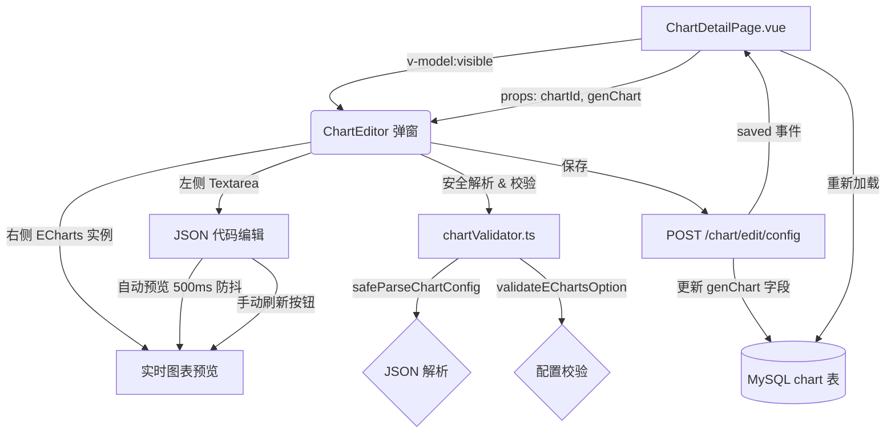
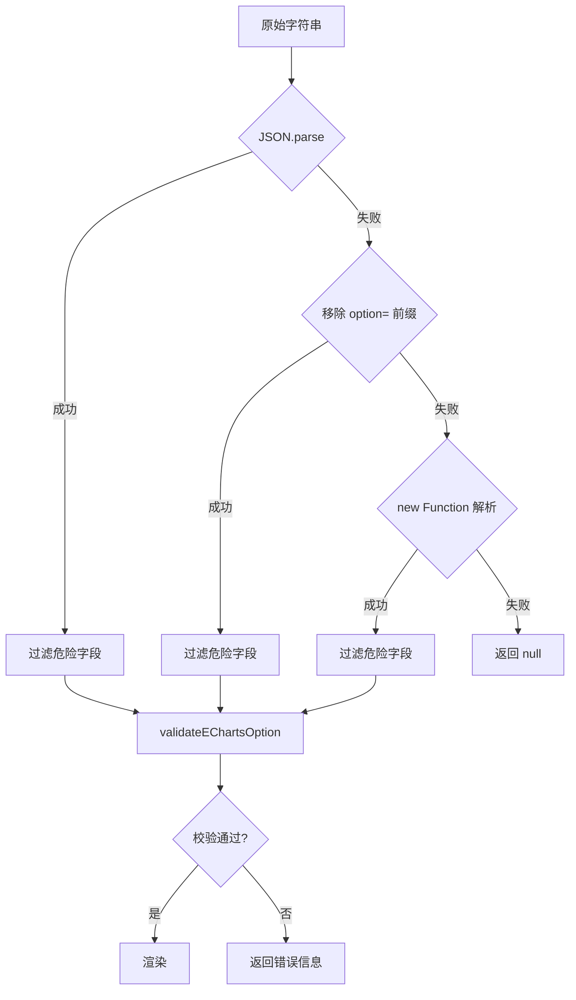

图表在线编辑器是一个嵌入 `ChartDetailPage.vue` 详情页的弹窗组件，允许用户在 AI 自动生成图表后，对 ECharts 配置进行**手动微调、实时预览和安全保存**。它位于 AI 生成结果与最终展示之间，为核心数据流提供了一层人工干预的灵活性。编辑器由三大功能模块构成：`ChartEditor.vue` 弹窗组件提供 UI 交互，`chartValidator.ts` 工具库提供安全解析与校验，后端 `POST /chart/edit/config` 接口提供配置持久化。

Sources: [ChartEditor.vue](lunesnow-IntelligentBI-frontend/src/components/ChartEditor.vue#L1-L281) | [chartValidator.ts](lunesnow-IntelligentBI-frontend/src/utils/chartValidator.ts#L1-L167) | [ChartController.java](lunesnow-IntelligentBI-backend/src/main/java/com/lunesnow/controller/ChartController.java#L274-L304)

## 一、编辑器架构：左右分栏实时编辑

编辑器以 `el-dialog` 弹窗形式存在，由 `ChartDetailPage.vue` 通过 `v-model:visible` 控制显隐，接收 `chartId` 和 `genChart`（当前 ECharts JSON 字符串）作为 props，在用户保存后通过 `saved` 事件通知父组件重新加载数据。其界面采用**左编辑、右预览**的双栏布局，中间无分隔条，各占 50% 宽度。

**左侧编辑面板**使用原生 `<textarea>` 并施加深色背景（`#18181b`）和等宽字体（`SF Mono / Consolas / Monaco`），聚焦时自动获取输入焦点。500 毫秒防抖的 `watch(code)` 自动触发预览——用户输入停止后自动在右侧渲染。右侧**实时预览面板**使用 ECharts 实例渲染图表，顶部附带"刷新"按钮，用于在自动预览因异步问题中断时手动触发渲染。底部是错误提示区域，采用 `el-alert type="error"` 展示包括 JSON 解析错误、配置校验失败、ECharts 渲染异常在内的所有错误信息。

Sources: [ChartEditor.vue](lunesnow-IntelligentBI-frontend/src/components/ChartEditor.vue#L1-L135) | [ChartDetailPage.vue](lunesnow-IntelligentBI-frontend/src/views/ChartDetailPage.vue#L153-L160)

## 二、安全配置解析器：三层回退解析 + 递归危险字段过滤

`chartValidator.ts` 是整个编辑器安全性的核心——它承担着将**不可信的 AI 生成配置**安全转换为可执行的 ECharts Option 对象的责任。这种不可信来自两个维度：AI 可能输出格式不标准的配置（如 JavaScript 对象字面量而非严格 JSON），也可能包含恶意的原型链污染代码。

`safeParseChartConfig()` 函数设计了三层回退解析策略。**第一层**直接调用 `JSON.parse()` 处理标准 JSON 格式；如果失败，**第二层**尝试移除 `let option =`、`var option =` 等赋值前缀后再解析；**第三层**使用 `new Function('return ' + trimmed)()` 解析 JavaScript 对象字面量（如 `{ xAxis: {...} }`，手动编写时常见）。第三层的 `new Function` 调用本身有安全风险，但 `safeParseChartConfig` 的返回值会经过 `filterDangerousFields()` 递归清洗，确保恶意属性被彻底剥离。

`filterDangerousFields()` 函数递归遍历解析后的对象树，对每个对象的 key 进行白名单校验——硬编码定义的危险字段列表包括 `__proto__`、`constructor`、`prototype`、`eval`、`Function`、`setTimeout`、`setInterval`、`fetch`、`XMLHttpRequest`。匹配到的 key 直接跳过而不复制到新对象中。对于数组，则递归处理每个元素。这实际上是防御性深拷贝 + 属性过滤的组合，从根本上防止了原型链污染攻击。

Sources: [chartValidator.ts](lunesnow-IntelligentBI-frontend/src/utils/chartValidator.ts#L1-L91)

## 三、配置校验规则：必要字段约束与结构完整性检查

安全解析后的配置对象还需通过 `validateEChartsOption()` 的校验才能进入渲染流程。校验规则分为四层，从数据类型到结构完整性逐级加深：

| 校验层级 | 规则 | 示例错误信息 |
|----------|------|-------------|
| **基本类型** | 非 null / undefined，且为对象类型 | "图表配置为空" / "图表配置格式错误" |
| **必要字段** | 必须包含 `series`、`data`、`dataset` 三者之一 | "缺少必要的数据配置（series/data/dataset）" |
| **数组约束** | `series` 存在时必须为数组且非空 | "series 配置格式错误，应为数组" / "series 配置为空" |
| **类型定义** | `series` 中至少有一项包含 `type` 字段 | "series 中缺少 type 定义" |

**特别设计**：校验允许 `data` 或 `dataset` 替代 `series`，这覆盖了 ECharts 的数据驱动配置模式（如纯 `dataset` 驱动的场景），以及对 `data` 进行直接赋值的简单情况。所有校验失败都会返回明确的 `ValidationResult` 对象（`{ valid: boolean, error?: string }`），由上层 UI 展示给用户。

Sources: [chartValidator.ts](lunesnow-IntelligentBI-frontend/src/utils/chartValidator.ts#L93-L130)

## 四、渲染执行器：从解析到渲染的完整管道

`safeRenderChart()` 函数将解析、校验、渲染三个步骤封装为一个可组合的管道函数。它接收原始字符串和一个回调函数 `renderFn: (option: any) => void`，先执行 `safeParseChartConfig` 解析 JSON，若失败返回错误；再执行 `validateEChartsOption` 校验结构，若失败返回错误；最后将 Option 传入 `renderFn` 执行实际渲染，并用 try/catch 捕获 ECharts 渲染异常。

在 `ChartDetailPage.vue` 中，`renderChart()` 函数是 `safeRenderChart` 的标准使用者：

1. 获取 DOM 容器 `#detailChart`
2. 通过 `echarts.getInstanceByDom(chartDom)` 检测并清理已存在的旧实例——这是关键的内存泄漏预防措施
3. 调用 `safeRenderChart(chart.value.genChart, callback)` ——回调中创建新 ECharts 实例并调用 `chartInstance.setOption(updatedOption)`
4. 注册 `window.resize` 事件监听器，用于自适应布局
5. 在 `onUnmounted` 时清理 resize 监听器并 dispose 图表实例

一个值得注意的细节：`renderChart` 并非直接使用原始 ECharts 配置，而是调用 `updateChartWithData(option, tableData.value)` 将图表配置的 `dataset.source`、各 `series[].data` 以及 `xAxis.data` 替换为**当前筛选后的本地数据**。这意味着筛选后的图表重绘不依赖后端。`updateChartWithData` 内部对不同图表类型采用不同的数据映射策略——饼图取第一列为 name、第二列为 value；散点图取前两个数值列为坐标；柱状图/折线图则取非分类列的数值列作为数据。

Sources: [chartValidator.ts](lunesnow-IntelligentBI-frontend/src/utils/chartValidator.ts#L132-L167) | [ChartDetailPage.vue](lunesnow-IntelligentBI-frontend/src/views/ChartDetailPage.vue#L143-L210) | [ChartDetailPage.vue](lunesnow-IntelligentBI-frontend/src/views/ChartDetailPage.vue#L410-L460)

## 五、后端配置持久化：精准字段更新与权限校验

后端 `POST /chart/edit/config` 接口（`ChartController` 第 274-304 行）的设计体现了**最小权限和精准更新**原则。请求体 `ChartEditConfigRequest` 仅包含两个字段：`id`（Long）和 `genChart`（String）。三个关键设计：

- **权限校验**：通过 `chartService.getById(id)` 获取原始记录，比较 `userId` 与当前登录用户 ID，管理员可编辑任意图表
- **精准更新**：不复制整个 chart 对象，而是创建新 Chart 实例，仅 `setId(id)` 和 `setGenChart(genChart)` 后调用 `updateById`——MyBatis-Plus 的乐观更新机制确保其他字段不会被覆盖
- **参数拒绝**：`StringUtils.isBlank(genChart)` 校验空字符串，`id <= 0` 校验非法 ID，拒绝无效请求

前端 `editChartConfig()` API 调用后如果成功，`ChartEditor` 组件通过 `emit('saved')` 通知 `ChartDetailPage.vue` 调用 `loadChartData()` 重新拉取最新的 `genChart` 并渲染。

Sources: [ChartController.java](lunesnow-IntelligentBI-backend/src/main/java/com/lunesnow/controller/ChartController.java#L274-L304) | [ChartEditConfigRequest.java](lunesnow-IntelligentBI-backend/src/main/java/com/lunesnow/model/dto/chart/ChartEditConfigRequest.java#L1-L24) | [api/chartController.ts](lunesnow-IntelligentBI-frontend/src/api/chartController.ts#L44-L55)

## 六、错误边界与资源清理

编辑器层叠了多层错误处理机制，形成从深层到表层的完整兜底链。

最底层是 **ECharts 渲染异常捕获**：`handlePreview()` 中 `chartInstance.setOption(option)` 包裹在 try/catch 中，捕获 ECharts 的渲染异常并展示。往上一层是 `ChartEditor.vue` 的 `onErrorCaptured` 钩子——这是 Vue 3 的组件错误边界机制，捕获子组件（如 textarea 或 ECharts 渲染过程）的未处理异常，将其转换为 `errorMsg` 显示在弹窗底部，并返回 `false` 阻止错误向上冒泡导致整个页面崩溃。

`ChartDetailPage.vue` 也有自己的 `onErrorCaptured` 钩子，作为第二道防线：它将错误记录到 `componentError` ref，页面模板检测到 `componentError` 后渲染一个**错误兜底界面**（包含错误信息文本和"重新加载"按钮），而非让整个页面白屏。用户点击"重新加载"会调用 `handlePageRetry` 清空错误状态并重新执行 `loadChartData()`。

资源清理方面，两个组件在 `onUnmounted` 时都进行了严格的清理：`ChartEditor.vue` dispose 图表实例并清除防抖定时器；`ChartDetailPage.vue` 移除 resize 监听器并 dispose 图表实例。这确保了在 SPA 路由切换场景下不会发生 ECharts 实例泄漏或内存残留。

Sources: [ChartEditor.vue](lunesnow-IntelligentBI-frontend/src/components/ChartEditor.vue#L53-L61) | [ChartDetailPage.vue](lunesnow-IntelligentBI-frontend/src/views/ChartDetailPage.vue#L36-L41) | [ChartDetailPage.vue](lunesnow-IntelligentBI-frontend/src/views/ChartDetailPage.vue#L102-L108) | [ChartDetailPage.vue](lunesnow-IntelligentBI-frontend/src/views/ChartDetailPage.vue#L756-L770)

## 七、功能全景总览

以下表格从功能维度汇总了编辑器的所有能力及其代码分布：

| 功能 | 实现位置 | 关键行为 |
|------|---------|---------|
| JSON 文本编辑 | `ChartEditor.vue` `<textarea>` 深色主题 | 自动聚焦，等宽字体，无语法高亮（保持轻量） |
| 自动实时预览 | `ChartEditor.vue` `watch(code)` + 500ms debounce | 输入停止后自动渲染，节省高频触发开销 |
| 手动刷新预览 | `ChartEditor.vue` `handlePreview()` | 配合右侧"刷新"按钮，覆盖自动预览未触发的边界情况 |
| 三级安全解析 | `chartValidator.ts` `safeParseChartConfig()` | JSON → 去前缀 → new Function，逐级回退 |
| 危险字段过滤 | `chartValidator.ts` `filterDangerousFields()` | 递归移除 `__proto__`、`eval`、`Function` 等 9 个关键字 |
| 配置结构化校验 | `chartValidator.ts` `validateEChartsOption()` | 非空 → 必要字段 → 数组类型 → type 定义 |
| 配置持久化保存 | 后端 `POST /chart/edit/config` | 精准更新 genChart 字段，权限校验 |
| 筛选后图表更新 | `ChartDetailPage.vue` `updateChartWithData()` | 本地数据替换（dataset.source / series.data），不请求后端 |
| 导出 PNG/SVG/JSON | `ChartDetailPage.vue` `handleExport()` | 使用 ECharts API `getDataURL()` + Blob 下载 |
| 错误边界兜底 | 双层 `onErrorCaptured` | 编辑器内显示错误提示 + 详情页显示重试界面 |
| 资源自动清理 | 双组件 `onUnmounted` | dispose 图表实例、移除 resize 监听、清除定时器 |

Sources: 汇总自上述所有源文件

## 下一步探索

图表在线编辑器是前端核心交互组件中承上启下的一环。建议按以下路径继续阅读以理解完整的图表生命周期：

- 如果想了解**图表最初是如何由 AI 生成**，请参阅 [DeepSeek AI 集成：Prompt 工程与 ECharts 配置智能生成](9-deepseek-ai-ji-cheng-prompt-gong-cheng-yu-echarts-pei-zhi-zhi-neng-sheng-cheng)
- 如果想了解**详情页如何跟踪异步状态和轮询等待 AI 结果**，请参阅 [轮询策略优化：指数退避算法与 Page Visibility API 暂停/恢复](22-lun-xun-ce-lue-you-hua-zhi-shu-tui-bi-suan-fa-yu-page-visibility-api-zan-ting-hui-fu)
- 如果想了解**详情页如何嵌入可拖拽仪表盘**（图表编辑器也可作为仪表盘中的图表编辑入口），请参阅 [可拖拽仪表盘编辑器：CSS transform GPU 加速、无限画布与布局持久化](20-ke-tuo-zhuai-yi-biao-pan-bian-ji-qi-css-transform-gpu-jia-su-wu-xian-hua-bu-yu-bu-ju-chi-jiu-hua)
- 如果想了解**后端对图表生成的异步消息驱动和重试机制**，请参阅 [RabbitMQ 消息队列：可靠投递、手动 ACK 与死信队列重试机制](8-rabbitmq-xiao-xi-dui-lie-ke-kao-tou-di-shou-dong-ack-yu-si-xin-dui-lie-zhong-shi-ji-zhi)