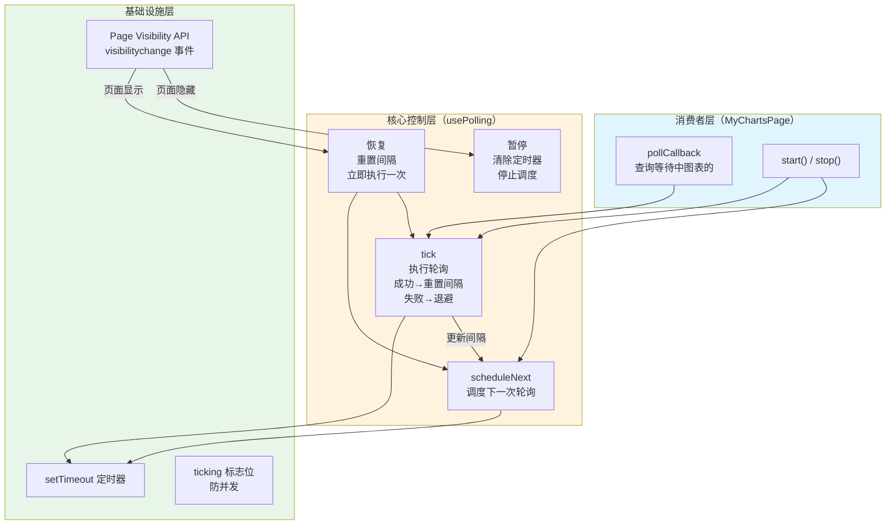

## 设计动机：为什么 WebSocket 之外还需要轮询

在本项目的架构中，[WebSocket 实时推送](10-websocket-shi-shi-tui-song-concurrenthashmap-hui-hua-guan-li-xin-tiao-jian-ce-yu-zai-xian-zhuang-tai)承担了图表生成完成时的即时通知职责——后端 AI 任务完成后，通过 `ChartWebSocketHandler.sendToUser()` 将结果推送到前端。然而，WebSocket 通知存在一个关键的**送达可靠性缺口**：当用户打开"我的图表"列表页面时，页面上展示的可能是多个历史图表，其中部分图表可能处于 `waiting`（排队中）或 `running`（生成中）状态。如果用户在此页面刷新浏览器、或 WebSocket 在图表生成过程中短暂断开，WebSocket 推送的消息就会丢失。

轮询（Polling）机制正是为了填补这个缺口而存在。它作为 WebSocket 推送的**兜底策略**，在页面加载后定期向服务端查询图表状态，确保用户始终能看到最新的图表生成进度。WebSocket 负责"即时通知"，轮询负责"状态同步"——两者互补而非替代。

Sources: [lunesnow-IntelligentBI-frontend/src/composables/usePolling.ts](lunesnow-IntelligentBI-frontend/src/composables/usePolling.ts#L1-L30), [lunesnow-IntelligentBI-frontend/src/views/MyChartsPage.vue](lunesnow-IntelligentBI-frontend/src/views/MyChartsPage.vue#L288-L318)

## 整体架构：通用轮询 Hook 的设计分层

`usePolling` 是一个基于 Vue 3 组合式 API 封装的可复用 Hook，对外暴露简洁的 `start` / `stop` 控制接口，内部管理定时器的调度、间隔的动态调整、页面可见性监听与并发防护。其架构可分为三个核心层次：



**消费者层**（以 `MyChartsPage.vue` 为例）负责定义 `pollCallback`—— 一个返回 `Promise<boolean>` 的异步函数，返回 `true` 表示停止轮询，返回 `false` 表示继续。**核心控制层**根据回调的执行结果动态调整下一次轮询间隔。**基础设施层**提供定时器调度、并发防护和页面可见性检测能力。

Sources: [lunesnow-IntelligentBI-frontend/src/composables/usePolling.ts](lunesnow-IntelligentBI-frontend/src/composables/usePolling.ts#L23-L30), [lunesnow-IntelligentBI-frontend/src/views/MyChartsPage.vue](lunesnow-IntelligentBI-frontend/src/views/MyChartsPage.vue#L320-L325)

## 指数退避算法：从快速轮询到保守等待的自适应策略

### 核心机制

传统的固定间隔轮询存在两难困境：间隔太短，服务端压力大且浪费带宽；间隔太长，用户等待状态更新的延迟过高。指数退避算法通过**动态调整轮询间隔**来解决这个矛盾——当请求成功时保持快速轮询，当请求失败时逐步放慢节奏。

实现代码的核心逻辑如下：

```typescript
// 回调成功（返回 false），重置间隔，保持快速轮询
currentInterval.value = interval

// 回调失败时退避
currentInterval.value = Math.min(currentInterval.value * backoff, maxInterval)
```

其中 `backoff` 为退避系数（默认 1.5），`maxInterval` 为最大间隔上限（默认 30 秒）。当请求成功时，`currentInterval` 立即重置回初始值 `interval`（默认 3 秒），系统以最快频率继续轮询；当请求失败（网络错误或服务端异常）时，`currentInterval` 以乘法系数增长，直到达到 `maxInterval` 上限。

### 退避序列推演

假设配置为默认值 `{ interval: 3000, maxInterval: 30000, backoff: 1.5 }`，连续失败的场景下间隔变化如下：

| 失败次数 | 退避计算 | 当前间隔 | 请求节奏 |
|----------|----------|----------|----------|
| 0（首次） | — | 3,000 ms | 快速 |
| 1 | `3000 * 1.5` | 4,500 ms | 适中的 |
| 2 | `4500 * 1.5` | 6,750 ms | 略慢 |
| 3 | `6750 * 1.5` | 10,125 ms | 较慢 |
| 4 | `10125 * 1.5` | 15,187 ms | 慢速 |
| 5 | `15187 * 1.5` | 22,781 ms | 很慢 |
| 6 | `22781 * 1.5` | 30,000 ms（触顶） | 最慢 |
| 7+ | `Math.min(..., 30000)` | 30,000 ms（维持） | 最慢 |

一旦某次请求成功，`currentInterval` 立即重置为 3,000 ms，系统回到快速轮询状态。这种**成功即重置**的设计意味着：只要服务端恢复正常，客户端会迅速恢复高频轮询，用户体验无缝衔接。

### 与 WebSocket 重连退避的对比

本项目的 [WebSocket 客户端封装](19-websocket-ke-hu-duan-feng-zhuang-zhi-shu-tui-bi-zhong-lian-xin-tiao-bao-huo-yu-zu-jian-xie-zai-qing-li) 也实现了指数退避重连策略，但两者在核心理念上存在关键差异：

| 维度 | 轮询退避（usePolling） | WebSocket 重连退避（useWebSocket） |
|------|----------------------|-----------------------------------|
| **触发条件** | 请求成功→重置；请求失败→退避 | 连接关闭→退避重连 |
| **退避方向** | 双向：可加速也可减速 | 单向：只减速不加速 |
| **基础公式** | `current * backoff` | `1000 * 2^count` |
| **控制信号** | 回调的 Promise 状态 | 连接断开事件 |
| **重置时机** | 每次回调成功立即重置 | 每次连接成功立即重置 |
| **终止条件** | 回调返回 `true` | 达到最大重试次数（5 次） |

轮询的退避机制**同时处理成功和失败两种信号**，而 WebSocket 重连只响应失败信号——因为连接建立本身没有"成功退避"的需求。

Sources: [lunesnow-IntelligentBI-frontend/src/composables/usePolling.ts](lunesnow-IntelligentBI-frontend/src/composables/usePolling.ts#L58-L64), [lunesnow-IntelligentBI-frontend/src/composables/useWebSocket.ts](lunesnow-IntelligentBI-frontend/src/composables/useWebSocket.ts#L90-L104)

## Page Visibility API 集成：零浪费的暂停与恢复

### 问题背景

用户可能同时打开多个浏览器标签页。假设用户在"我的图表"页面提交了一个图表生成任务，然后切换到其他标签页工作。如果轮询机制不受限制地继续运行，会产生大量**无意义的 HTTP 请求**——因为用户看不到通知弹窗、看不到页面更新，但这些请求仍然消耗服务端资源和用户带宽。更糟糕的是，如果用户离开页面数小时，数千次无意义的轮询请求会显著增加服务端负载。

### 实现方案

Page Visibility API 通过 `document.hidden` 属性和 `visibilitychange` 事件，让前端代码能够感知页面的可见性变化。`usePolling` 在 `onMounted` 生命周期注册事件监听：

```typescript
const handleVisibilityChange = () => {
  const wasVisible = isPageVisible.value
  isPageVisible.value = !document.hidden
  if (!isPageVisible.value) {
    pause()
  } else {
    resume()
  }
}

onMounted(() => {
  document.addEventListener('visibilitychange', handleVisibilityChange)
})
```

**暂停**（页面隐藏时）：清除所有待执行的 `setTimeout` 定时器，但保留 `isRunning = true` 的状态标记，确保恢复时能正确继续。

```typescript
const pause = () => {
  if (timer.value) {
    clearTimeout(timer.value)
    timer.value = undefined
  }
}
```

**恢复**（页面显示时）：将 `currentInterval` 重置为初始值，并立即执行一次查询，然后恢复定时调度。

```typescript
const resume = () => {
  if (isRunning.value && !timer.value) {
    currentInterval.value = interval  // 重置间隔
    tick().then(() => {              // 立即执行一次
      scheduleNext()                // 恢复调度
    })
  }
}
```

恢复时**重置间隔至初始值**是一个精心设计的选择——用户在页面可见的瞬间看到的是最新状态，而不是等待退避后的慢速间隔。`isRunning.value && !timer.value` 的守卫条件确保只有"正在运行但暂停中"的状态才会触发恢复，避免了重复调度。

### 安全性保障

`tick()` 函数也内置了页面可见性检查作为第二道防线：

```typescript
const tick = async () => {
  if (!isPageVisible.value || ticking) {
    return  // 双重保障：不可见或不执行
  }
  // ...
}
```

即使某个 `tick` 在页面隐藏前已进入调度队列，执行时也会被 `isPageVisible` 检查拦截，确保页面不可见时不会有任何网络请求发出。

Sources: [lunesnow-IntelligentBI-frontend/src/composables/usePolling.ts](lunesnow-IntelligentBI-frontend/src/composables/usePolling.ts#L98-L135)

## 并发防护：ticking 标志位的必要性

在异步 JavaScript 环境中，`setTimeout` 回调的执行时间无法精确控制。考虑如下竞态场景：某次轮询请求因网络延迟耗时 15 秒才完成，而默认轮询间隔仅为 3 秒——这意味着在第一次请求尚未返回时，第二次调度已经触发，形成了**请求堆积**。

`ticking` 标志位解决的就是这个问题：

```typescript
let ticking = false

const tick = async () => {
  if (ticking) return      // 已有正在执行的请求，跳过
  ticking = true
  try {
    await callback()        // 等待回调完成
  } finally {
    ticking = false         // 必须确保释放锁
  }
}
```

这是一个**非阻塞的互斥锁**：当某个 `tick` 正在执行时，所有后续的 `tick` 调用都会被直接跳过，不会进入等待队列。这避免了请求堆积和回调重入问题。`finally` 块确保无论回调成功还是失败，标志位都会被释放——这是 JavaScript 异步编程中的关键实践，防止异常导致永久锁死。

需要注意的是，`ticking` 是模块级普通变量而非 `ref` 响应式变量，因为它的作用域完全在 `usePolling` 内部，不需要被 Vue 的响应式系统追踪组件渲染。

Sources: [lunesnow-IntelligentBI-frontend/src/composables/usePolling.ts](lunesnow-IntelligentBI-frontend/src/composables/usePolling.ts#L30-L68)

## 消费者集成：MyChartsPage 中的轮询实践

`MyChartsPage.vue` 是 `usePolling` 的实际消费者，展示了如何将通用轮询 Hook 应用于具体业务场景。

### 回调函数设计

```typescript
const pollCallback = async (): Promise<boolean> => {
  // 1. 过滤出所有待处理的图表
  const pendingCharts = tableData.value.filter(
    (c) => c.status === 'waiting' || c.status === 'running',
  )
  // 2. 如果没有待处理图表，通知轮询停止
  if (pendingCharts.length === 0) return true

  // 3. 逐个查询状态
  for (const chart of pendingCharts) {
    const res = await getChartStatus({ id: chart.id })
    if (res.data) {
      chart.status = res.data.status
      chart.genChart = res.data.genChart
      // 4. 生成完成 → 渲染图表
      if (res.data.status === 'succeed' && res.data.genChart) {
        await nextTick()
        renderChart(chart)
      }
    }
  }
  return false  // 继续轮询
}
```

回调的返回值驱动整个退避行为：
- 返回 `true`：所有图表都已处理完成，轮询自动停止
- 返回 `false`：仍有图表待处理，重置间隔并继续轮询
- 抛出异常：触发退避逻辑，间隔以 1.5 倍增长

### Hook 实例化与生命周期绑定

```typescript
const { start: startPolling, stop: stopPolling } = usePolling(pollCallback, {
  interval: 3000,    // 初始 3 秒
  maxInterval: 30000, // 最大 30 秒
  backoff: 1.5,      // 退避系数
})

onMounted(() => {
  loadChartList()       // 加载图表列表
  // loadChartList 内部调用 startPolling()
})

onUnmounted(() => {
  stopPolling()          // 停止轮询
  chartObserver.value?.disconnect()
  resizeHandlers.value.forEach(h => window.removeEventListener('resize', h))
})
```

`loadChartList()` 在列表加载完毕后调用 `startPolling()`，`onUnmounted` 中调用 `stopPolling()`。这种**加载时启动、卸载时停止**的模式确保了轮询的生命周期与组件严格绑定，不会在组件销毁后残留定时器。

Sources: [lunesnow-IntelligentBI-frontend/src/views/MyChartsPage.vue](lunesnow-IntelligentBI-frontend/src/views/MyChartsPage.vue#L288-L353), [lunesnow-IntelligentBI-frontend/src/views/MyChartsPage.vue](lunesnow-IntelligentBI-frontend/src/views/MyChartsPage.vue#L441-L451)

## 生命周期完整性：组件的自我清理

`usePolling` 在内部通过 Vue 3 的生命周期钩子实现了完整的自我清理：

```typescript
onMounted(() => {
  document.addEventListener('visibilitychange', handleVisibilityChange)
})

onUnmounted(() => {
  stop()    // 停止轮询 + 清除定时器
  document.removeEventListener('visibilitychange', handleVisibilityChange)
})
```

`stop()` 方法执行两个动作：将 `isRunning` 置为 `false` 以阻止 `scheduleNext` 继续调度，同时 `clearTimeout` 清除当前待执行的定时器：

```typescript
const stop = () => {
  isRunning.value = false
  if (timer.value) {
    clearTimeout(timer.value)
    timer.value = undefined
  }
}
```

这种**双重清理**机制确保了无论轮询处于何种状态（调度中、执行中、暂停中），组件卸载时都能干净地释放所有资源，不会产生内存泄漏或悬浮的网络请求。

Sources: [lunesnow-IntelligentBI-frontend/src/composables/usePolling.ts](lunesnow-IntelligentBI-frontend/src/composables/usePolling.ts#L132-L148)

## 最佳实践与配置指南

### 参数调优建议

| 参数 | 默认值 | 适用场景 | 推荐调整策略 |
|------|--------|----------|-------------|
| `interval` | 3000 ms | 图表生成周期通常 10-60 秒 | 生成越快应越小 |
| `maxInterval` | 30000 ms | 服务端可能短暂不可用 | 服务端越稳定应越大 |
| `backoff` | 1.5 | 通用场景 | 网络越不稳定应越大 |

### 使用准则

1. **回调必须返回布尔值**：`true` 停止轮询，`false` 继续轮询。如果回调不返回任何值，系统会默认继续轮询，可能导致不必要的请求
2. **回调中的异常处理**：`usePolling` 会捕获回调抛出的异常并自动退避，但建议回调内部对预期的业务错误（如图表 ID 不存在）进行静默处理，只有真正的网络/服务端异常才让其传播
3. **不要手动管理定时器**：`usePolling` 完全接管了 `setTimeout`/`clearTimeout` 的调度，消费者不应在外部操作定时器，以免干扰内部状态机
4. **WebSocket + 轮询双轨并行**：WebSocket 用于即时通知，轮询用于页面刷新后的状态同步。如果 WebSocket 连接正常，轮询仅作为兜底；如果 WebSocket 断连，轮询保证用户仍然能看到进度更新

Sources: [lunesnow-IntelligentBI-frontend/src/composables/usePolling.ts](lunesnow-IntelligentBI-frontend/src/composables/usePolling.ts#L23-L30), [lunesnow-IntelligentBI-frontend/src/views/MyChartsPage.vue](lunesnow-IntelligentBI-frontend/src/views/MyChartsPage.vue#L288-L318)

## 下一步阅读

- [WebSocket 客户端封装：指数退避重连、心跳保活与组件卸载清理](19-websocket-ke-hu-duan-feng-zhuang-zhi-shu-tui-bi-zhong-lian-xin-tiao-bao-huo-yu-zu-jian-xie-zai-qing-li)：了解轮询的"孪生兄弟"——WebSocket 的指数退避策略
- [图表创建页面：表单校验、拖拽上传与异步任务状态跟踪](18-tu-biao-chuang-jian-ye-mian-biao-dan-xiao-yan-tuo-zhuai-shang-chuan-yu-yi-bu-ren-wu-zhuang-tai-gen-zong)：了解图表提交流程的完整链路
- [性能优化全景：消息可靠投递、动态分表、拖拽 60fps 与无效请求减少 60%](25-xing-neng-you-hua-quan-jing-xiao-xi-ke-kao-tou-di-dong-tai-fen-biao-tuo-zhuai-60fps-yu-wu-xiao-qing-qiu-jian-shao-60)：轮询策略优化在整体性能优化中的定位