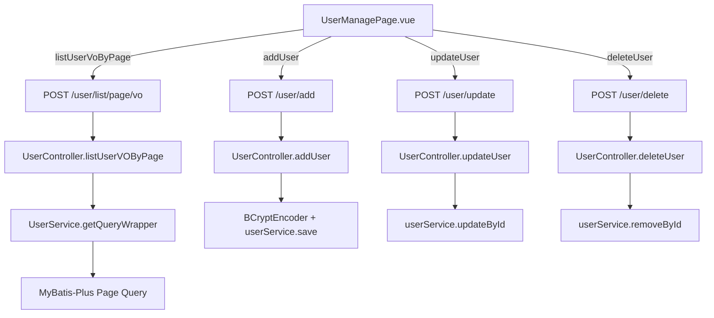

管理后台是 Intelligent BI 系统的运维中枢，面向**管理员角色**提供三个核心管控维度：用户账户的生命周期管理、全平台图表的审计与干预、分布式限流器的实时监控与重置。三个模块以角色权限为护栏，以数据可视化呈现状态，共同构成生产环境不可或缺的治理能力。整个后台的访问入口由前端路由 `requiresAdmin` 元信息配合 `access.ts` 的守卫逻辑统一拦截，后端通过 `@AuthCheck(mustRole = "admin")` AOP 切面二次校验，形成双重安全屏障。

Sources: [router/index.ts](lunesnow-IntelligentBI-frontend/src/router/index.ts#L38-L52), [access.ts](lunesnow-IntelligentBI-frontend/src/access.ts#L25-L33), [AuthInterceptor.java](lunesnow-IntelligentBI-backend/src/main/java/com/lunesnow/aop/AuthInterceptor.java#L33-L66)

## 用户管理：账户全生命周期管控

用户管理模块提供对平台所有用户账户的 **CRUD 操作能力**，涵盖创建、查询、编辑、删除四个标准操作，并以分页表格的形式呈现用户列表。



**前端组件协作**：`UserManagePage.vue` 是主页面，内嵌 `UserFormDialog.vue` 作为新增/编辑用户的弹窗组件。当管理员点击"新建用户"或行内"编辑"按钮时，UserFormDialog 弹出表单，包含用户名、账号、角色三个字段。角色通过 Element Plus 的 `<el-select>` 下拉框选择 `user`（普通用户）或 `admin`（管理员）。表单提交时，编辑操作调用 `updateUser()` API 发送 `POST /user/update`，新建操作调用 `addUser()` API 发送 `POST /user/add`。删除操作则先通过 `ElMessageBox.confirm()` 弹出确认对话框，确认后调用 `deleteUser()` API。

Sources: [UserManagePage.vue](lunesnow-IntelligentBI-frontend/src/views/admin/UserManagePage.vue#L1-L198), [UserFormDialog.vue](lunesnow-IntelligentBI-frontend/src/components/UserFormDialog.vue#L1-L98), [userController.ts](lunesnow-IntelligentBI-frontend/src/api/userController.ts#L1-L155)

**后端权限校验链**：四个管理接口均标注 `@AuthCheck(mustRole = UserConstant.ADMIN_ROLE)`。`AuthInterceptor` 切面在方法执行前拦截，从 `ServletRequestAttributes` 中提取当前 HTTP 请求，调用 `userService.getLoginUser(request)` 从 Session 获取登录用户，然后校验 `userRole` 是否为 `"admin"`。如果角色不匹配或用户被封号（`BAN` 角色），直接抛出 `NO_AUTH_ERROR` 异常，由 `GlobalExceptionHandler` 统一返回 403 响应。`addUser` 方法中，新用户的密码使用 BCryptPasswordEncoder 加密存储，默认密码为 `"12345678"`，确保安全最佳实践落地。

Sources: [UserController.java](lunesnow-IntelligentBI-backend/src/main/java/com/lunesnow/controller/UserController.java#L1-L288), [AuthInterceptor.java](lunesnow-IntelligentBI-backend/src/main/java/com/lunesnow/aop/AuthInterceptor.java#L42-L66), [UserConstant.java](lunesnow-IntelligentBI-backend/src/main/java/com/lunesnow/constant/UserConstant.java#L1-L32)

**查询与脱敏**：用户列表采用 MyBatis-Plus 分页查询，`UserServiceImpl.getQueryWrapper()` 根据 `UserQueryRequest` 动态拼接查询条件——支持按 ID 精确匹配、按用户名模糊搜索、按角色筛选，并通过 `SqlUtils.validSortField()` 白名单校验排序字段，防止 SQL 注入。`UserVO` 视图对象在返回时剔除了密码字段（`userPassword`），仅暴露 `id`、`userName`、`userAccount`、`userRole`、`createTime` 等安全信息。

Sources: [UserServiceImpl.java](lunesnow-IntelligentBI-backend/src/main/java/com/lunesnow/service/impl/UserServiceImpl.java#L200-L237), [UserVO.java](lunesnow-IntelligentBI-backend/src/main/java/com/lunesnow/model/vo/UserVO.java)

## 图表审计：跨用户图表查看与运维干预

图表审计模块允许管理员按用户维度查看该用户创建的所有图表，提供状态追踪、详情查看、失败重试和强制删除等运维操作。

**数据流架构**：`UserChartsPage.vue` 通过路由参数 `userId` 接收目标用户 ID，调用 `listChartVoByPage()` 请求 `POST /chart/list/page/vo`，传入 `userId` 作为筛选条件。后端 `ChartServiceImpl.getChartVOPage()` 使用**批量用户查询策略**解决 N+1 问题——先提取当前页所有图表的 `userId` 集合，调用 `userService.listByIds()` 一次性查询所有关联用户，再按 ID 分组为 `Map<Long, List<User>>`，在 Chart → ChartVO 转换时直接从 Map 中查找填充，将原本每次循环都查询数据库的 O(n) 降低为两次查询。该模式在管理后台的用户-图表关联查询中效果显著。

Sources: [UserChartsPage.vue](lunesnow-IntelligentBI-frontend/src/views/admin/UserChartsPage.vue#L1-L204), [ChartServiceImpl.java](lunesnow-IntelligentBI-backend/src/main/java/com/lunesnow/service/impl/ChartServiceImpl.java#L100-L153), [ChartController.java](lunesnow-IntelligentBI-backend/src/main/java/com/lunesnow/controller/ChartController.java#L99-L113)

**状态可视化与运维操作**：表格中图表状态通过 `<el-tag>` 组件以不同颜色呈现——`succeed`（绿色/成功）、`failed`（红色/失败）、`running`（黄色/生成中）、`waiting`（灰色/排队中）。管理员可以对 `failed` 状态的图表执行"重试"操作：调用 `POST /chart/retry/{id}` 重置图表状态为 `waiting`，清除已有的 `genChart` 和 `genResult`，再重新发送 RabbitMQ 消息触发异步生成流程。删除图表时，后端 `ChartController.deleteChart()` 不仅执行 `chartService.removeById()` 删除 MySQL 中的图表记录，还会调用 `chartDataService.dropTable(id)` 删除该图表对应的动态数据表，实现数据的完整清理。

Sources: [ChartController.java](lunesnow-IntelligentBI-backend/src/main/java/com/lunesnow/controller/ChartController.java#L52-L74), [ChartController.java](lunesnow-IntelligentBI-backend/src/main/java/com/lunesnow/controller/ChartController.java#L400-L450)

**管理员专属接口**：除审计视图外，`ChartController` 还为管理员提供了 `POST /chart/list/page`（分页获取原始 Chart 实体）、`GET /chart/get/vo`（按 ID 获取 ChartVO 封装）两个管理员专用接口。管理员还可以通过 `POST /chart/update` 直接修改图表记录的任意字段，这在生产数据修复场景下尤为重要。

Sources: [ChartController.java](lunesnow-IntelligentBI-backend/src/main/java/com/lunesnow/controller/ChartController.java#L76-L113)

## 分布式限流监控：Redisson 令牌桶运行时可视化

分布式限流监控模块是管理后台最具技术深度的功能，它提供了对 Redisson `RRateLimiter` 运行时的**实时可视化**和**运维干预**能力。该模块由 `RateLimitPage.vue` 前端页面和 `RateLimitController` + `RedissonRateLimiter` 后端组成。

```mermaid
graph TB
    subgraph "治理层 Admin Dashboard"
        RLP[RateLimitPage.vue]
    end
    
    subgraph "监控接口 RateLimitController"
        GRL[GET /rate-limit/status]
        LAL[GET /rate-limit/list]
        RRL[POST /rate-limit/reset]
        RAL[POST /rate-limit/resetAll]
    end
    
    subgraph "限流引擎 RedissonRateLimiter"
        RM[RedissonRateLimiter Manager]
        RL1[RRateLimiter: rate_limit:user:123]
        RL2[RRateLimiter: rate_limit:ip:192.168.*]
        RL3[RRateLimiter: rate_limit:method:xxx]
    end
    
    subgraph "运行时限流 AOP"
        RLA[RateLimitAspect]
        RT[Redis Token Bucket]
    end
    
    RLP --> GRL & LAL
    RLP --> RRL & RAL
    GRL --> RM --> RL1 & RL2 & RL3
    LAL --> RM -->|scan rate_limit:*| RL1 & RL2 & RL3
    RRL --> RM -->|rateLimiter.delete| RL1
    RAL --> RM -->|batch delete| RL1 & RL2 & RL3
    
    RLA -->|@Before| RT
    RT -->|tryAcquire| RM
    
    subgraph "注解驱动"
        RC[@RateLimit annotation]
        CC[ChartController.gen]
    end
    CC -.->|@RateLimit 2/s, burst 5| RC
    RC --> RLA
```

**限流器的运行时探测**：`RedissonRateLimiter` 通过 `getStatus(key)` 方法探测单个限流器的状态——调用 `RRateLimiter.availablePermits()` 获取当前剩余令牌数，如果限流器未初始化则返回 `exists: false`。`listAll()` 方法使用 `redissonClient.getKeys().getKeysByPattern("rate_limit:*")` 扫描 Redis 中所有以 `rate_limit:` 为前缀的 key，过滤掉 Redisson 内部使用的 `:value` 和 `:permits` 后缀 key，对每个有效主 key 解析 `type`（user/ip/method）和 `identifier`，组装成结构化列表返回。这要求限流 key 命名严格遵循 `rate_limit:{type}:{identifier}` 的约定格式。

Sources: [RedissonRateLimiter.java](lunesnow-IntelligentBI-backend/src/main/java/com/lunesnow/manager/RedissonRateLimiter.java#L80-L120)

**运维干预能力**：`RateLimitController` 暴露四个管理接口，全部受 `@AuthCheck(mustRole = ADMIN_ROLE)` 保护：
- `GET /rate-limit/status?key=...`：查询单个限流器的当前状态（是否存在、剩余令牌数）
- `GET /rate-limit/list`：列出 Redis 中所有活跃的限流器状态
- `POST /rate-limit/reset?key=...`：删除指定限流器（底层调用 `RRateLimiter.delete()`）
- `POST /rate-limit/resetAll`：批量删除所有 `rate_limit:*` 前缀的 key

重置操作的核心逻辑是调用 Redisson 的 `delete()` 方法移除 Redis 中的限流器数据结构，下次请求到达 `RateLimitAspect` 时会通过 `trySetRate()` 重新初始化限流器，从而"清零"令牌桶。这在生产环境中用于应对误触发限流或紧急恢复的场景。

Sources: [RateLimitController.java](lunesnow-IntelligentBI-backend/src/main/java/com/lunesnow/controller/RateLimitController.java#L1-L70), [RedissonRateLimiter.java](lunesnow-IntelligentBI-backend/src/main/java/com/lunesnow/manager/RedissonRateLimiter.java#L60-L75)

**前端交互体验**：`RateLimitPage.vue` 设计了三个功能区域——顶部查询区支持按用户 ID 或 IP 地址输入查询特定限流器状态；中部状态卡片以网格布局展示查询结果（key、是否存在、剩余令牌数）；底部列表区通过表格展示 Redis 中所有活跃限流记录，每行显示类型标签（用户/IP 标签区分）、标识符（mono 字体展示原始 key）、剩余令牌数及查看/重置操作按钮。管理员可以通过"全部重置"按钮一键清空所有限流器状态，该操作在 `ElMessageBox.confirm()` 二次确认后才执行，防止误操作。

Sources: [RateLimitPage.vue](lunesnow-IntelligentBI-frontend/src/views/admin/RateLimitPage.vue#L1-L415)

**限流系统全景**：整个分布式限流系统由三个层次构成——底层是 `RedissonRateLimiter` 基于 Redisson `RRateLimiter` 的令牌桶实现（分布式、无竞态条件）；中间层是 `RateLimitAspect` AOP 切面，通过 `@Before` 拦截标注 `@RateLimit` 注解的方法，根据 `limitType`（DEFAULT/IP/USER）动态构建限流 key（如 `rate_limit:user:2064277865772695554`），再调用 `RedissonRateLimiter.tryAcquire()` 判断是否放行；顶层是注解声明，如图表生成接口标注 `@RateLimit(permitsPerSecond = 2, burstCapacity = 5, limitType = USER)`，限制单个用户每秒最多 2 次 AI 图表生成请求、突发容量 5 个。管理员监控面板则从外部观测整个限流系统的运行状态，形成"声明-执行-监控-干预"的完整闭环。

Sources: [RateLimit.java](lunesnow-IntelligentBI-backend/src/main/java/com/lunesnow/annotation/RateLimit.java#L1-L61), [RateLimitAspect.java](lunesnow-IntelligentBI-backend/src/main/java/com/lunesnow/aop/RateLimitAspect.java#L30-L100), [ChartController.java](lunesnow-IntelligentBI-backend/src/main/java/com/lunesnow/controller/ChartController.java#L242-L247)

## 权限守卫体系与路由设计

管理后台的安全体系采用**前端路由守卫 + 后端 AOP 切面**的双层校验架构。前端 `access.ts` 在 `router.beforeEach` 中检查目标路由的 `meta.requiresAdmin` 标志，如果为 `true` 则验证 `loginUserStore.loginUser.userRole === 'admin'`，不满足则重定向到 `/403` 页面。后端 `AuthInterceptor` 对标注了 `@AuthCheck(mustRole = "admin")` 的方法进行二次校验，从 Session 中获取登录用户对象，验证其 `userRole` 是否为 `"admin"`。后端还对被封号（`BAN`）的用户做额外拦截，确保即使前端绕过守卫，后端也能阻断请求。

Sources: [access.ts](lunesnow-IntelligentBI-frontend/src/access.ts#L1-L40), [GlobalSider.vue](lunesnow-IntelligentBI-frontend/src/components/layout/GlobalSider.vue#L77-L94)

路由设计上，三个管理页面均嵌套在 `BasicLayout` 布局内，共享侧边栏导航，侧边栏通过 `loginUserStore.loginUser?.userRole === 'admin'` 条件判断是否显示"用户管理"和"限流管理"菜单项。这种设计使得普通用户登录后侧边栏自动隐藏管理入口，管理员则完整可见。

| 功能模块 | 前端路由 | 后端 Controller | 核心 API |
|---------|---------|----------------|---------|
| 用户管理 | `/admin/userManage` | `UserController` | `POST /user/list/page/vo`, `POST /user/add`, `POST /user/update`, `POST /user/delete` |
| 图表审计 | `/admin/userCharts/:userId` | `ChartController` | `POST /chart/list/page/vo`, `POST /chart/retry/{id}`, `POST /chart/delete` |
| 限流监控 | `/admin/rateLimit` | `RateLimitController` | `GET /rate-limit/status`, `GET /rate-limit/list`, `POST /rate-limit/reset`, `POST /rate-limit/resetAll` |

Sources: [router/index.ts](lunesnow-IntelligentBI-frontend/src/router/index.ts#L35-L55), [GlobalSider.vue](lunesnow-IntelligentBI-frontend/src/components/layout/GlobalSider.vue#L84-L94)

## 延伸阅读

管理后台是运维治理能力的集中体现。建议按以下路径继续深入：

- 理解后台权限校验的底层实现，参考 [AOP 切面编程：@AuthCheck 权限校验与 @RateLimit 限流拦截](16-aop-qie-mian-bian-cheng-atauthcheck-quan-xian-xiao-yan-yu-atratelimit-xian-liu-lan-jie)，了解 `AuthInterceptor` 和 `RateLimitAspect` 的完整拦截流程
- 深入了解限流系统的数据来源，参考 [Redisson 令牌桶限流器：分布式环境下接口防刷](15-redisson-ling-pai-tong-xian-liu-qi-fen-bu-shi-huan-jing-xia-jie-kou-fang-shua) 和 [Redis Lua 原子脚本：无竞态条件的并发任务槽位管理](14-redis-lua-yuan-zi-jiao-ben-wu-jing-tai-tiao-jian-de-bing-fa-ren-wu-cao-wei-guan-li)，掌握分布式限流的两种不同实现策略
- 探索前台用户如何查看自己图表的统计分析，参考 [图表创建页面：表单校验、拖拽上传与异步任务状态跟踪](18-tu-biao-chuang-jian-ye-mian-biao-dan-xiao-yan-tuo-zhuai-shang-chuan-yu-yi-bu-ren-wu-zhuang-tai-gen-zong)
- 理解全系统的安全设计全景，参考 [安全最佳实践：BCrypt 密码哈希、Session 鉴权、三级容错渲染与防爬虫](24-an-quan-zui-jia-shi-jian-bcrypt-mi-ma-ha-xi-session-jian-quan-san-ji-rong-cuo-xuan-ran-yu-fang-pa-chong)