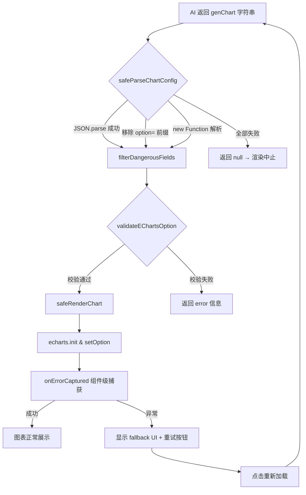

本页深入解析智能 BI 系统的四重安全防线：密码存储的安全基座 BCrypt、基于 Servlet Session + Redis 的有状态鉴权体系、前端 ECharts 渲染的三级容错机制，以及覆盖 API 层和限流层的防爬虫策略。这些安全实践共同构建了一个从客户端到服务端、从存储到传输的纵深防御体系。

---

## BCrypt 密码哈希：不可逆加密的安全基座

系统采用 **BCryptPasswordEncoder** 作为唯一的密码编码器，这是 Spring Security 框架提供的强哈希实现。BCrypt 的核心优势在于其**自适应计算强度**——通过内置的 salt（随机盐值）和可配置的 work factor（工作因子），使得暴力破解的成本随硬件发展而线性增长。

在 SecurityConfig 中，密码编码器被声明为 Spring Bean：

```java
@Bean
public PasswordEncoder passwordEncoder() {
    return new BCryptPasswordEncoder();
}
```
Sources: [SecurityConfig.java](lunesnow-IntelligentBI-backend/src/main/java/com/lunesnow/config/SecurityConfig.java#L23-L26)

UserServiceImpl 内部维护了一个静态的 `PASSWORD_ENCODER` 实例，用于注册加密和登录验证两个核心场景。用户在注册时，服务首先校验参数合法性（账号不少于 4 位、密码不少于 8 位、两次密码一致），然后通过 `synchronized (userAccount.intern())` 确保账号唯一性检查的原子性。通过校验后，调用 `PASSWORD_ENCODER.encode(userPassword)` 生成不可逆的哈希密文，存入数据库。登录时则调用 `PASSWORD_ENCODER.matches(rawPassword, encodedPassword)` 验证明文与密文的匹配关系——整个过程**密码明文永远不会以可逆形式存储或传输**。

```java
// 注册加密
String encryptPassword = PASSWORD_ENCODER.encode(userPassword);

// 登录验证
if (!PASSWORD_ENCODER.matches(userPassword, user.getUserPassword())) {
    throw new BusinessException(ErrorCode.PARAMS_ERROR, "用户不存在或密码错误");
}
```
Sources: [UserServiceImpl.java](lunesnow-IntelligentBI-backend/src/main/java/com/lunesnow/service/impl/UserServiceImpl.java#L52-L53)

值得注意的设计细节是：管理员在后台创建用户时，也会使用 `new BCryptPasswordEncoder().encode(defaultPassword)` 加密默认密码 "12345678"，确保所有入库的密码都经过同等级别的哈希处理，不存在明文入口。

Sources: [UserController.java](lunesnow-IntelligentBI-backend/src/main/java/com/lunesnow/controller/UserController.java#L89-L91)

---

## Session 鉴权：基于 Redis 的有状态会话管理

系统采用 **HttpSession + Redis** 的有状态鉴权方案。不同于 JWT 的无状态模式，Session 方式将用户状态存储在服务端，客户端仅持有 session cookie，在减少客户端复杂度的同时提供了更强的会话控制能力（如被动登出、会话过期等）。

### 会话存储配置

在 `application.yml` 中，Session 被配置为使用 Redis 存储，1800 秒（30 天）超时：

```yaml
spring:
  session:
    store-type: redis
    timeout: 2592000
server:
  servlet:
    session:
      cookie:
        max-age: 2592000
```
Sources: [application.yml](lunesnow-IntelligentBI-backend/src/main/resources/application.yml#L31-L35)

将 Session 存储在 Redis 中的好处是：**服务重启不丢失登录态**、**多实例部署时可共享会话**、天然支持过期自动清理。

### 登录态写入与校验流程

登录成功时，UserServiceImpl 将完整的 User 对象注入 Session：

```java
request.getSession().setAttribute(USER_LOGIN_STATE, user);
```
Sources: [UserServiceImpl.java](lunesnow-IntelligentBI-backend/src/main/java/com/lunesnow/service/impl/UserServiceImpl.java#L93)

`USER_LOGIN_STATE` 定义在 `UserConstant` 中，值为 `"user_login"`，是全局统一的 Session Key。

Sources: [UserConstant.java](lunesnow-IntelligentBI-backend/src/main/java/com/lunesnow/constant/UserConstant.java#L11)

获取当前登录用户时，`getLoginUser()` 方法执行**双重校验**：先从 Session 中取出 user 对象做非空判断，再从数据库重新查询以获取最新数据（如角色变更、账号封禁等状态）。这种"Session 判断存在性 + 数据库验证有效性"的组合检查，兼顾了性能与安全性。

```java
public User getLoginUser(HttpServletRequest request) {
    Object userObj = request.getSession().getAttribute(USER_LOGIN_STATE);
    User currentUser = (User) userObj;
    if (currentUser == null || currentUser.getId() == null) {
        throw new BusinessException(ErrorCode.NOT_LOGIN_ERROR);
    }
    long userId = currentUser.getId();
    currentUser = this.getById(userId); // 从数据库重新查询
    if (currentUser == null) {
        throw new BusinessException(ErrorCode.NOT_LOGIN_ERROR);
    }
    return currentUser;
}
```
Sources: [UserServiceImpl.java](lunesnow-IntelligentBI-backend/src/main/java/com/lunesnow/service/impl/UserServiceImpl.java#L101-L120)

注销时，移除 Session 中的登录态：

```java
request.getSession().removeAttribute(USER_LOGIN_STATE);
```
Sources: [UserServiceImpl.java](lunesnow-IntelligentBI-backend/src/main/java/com/lunesnow/service/impl/UserServiceImpl.java#L147)

### AOP 权限校验

`@AuthCheck` 注解配合 `AuthInterceptor` 切面，实现了声明式的权限控制。注解只包含一个 `mustRole` 属性，由 AuthInterceptor 在运行时解析：

- 如果注解未指定角色（`mustRole` 为空），直接放行
- 如果指定了角色，校验当前用户角色与要求角色是否匹配
- 封号（`BAN`）用户直接拒绝所有需要权限的访问

```java
@Around("@annotation(authCheck)")
public Object doInterceptor(ProceedingJoinPoint joinPoint, AuthCheck authCheck) throws Throwable {
    String mustRole = authCheck.mustRole();
    HttpServletRequest request = ((ServletRequestAttributes) requestAttributes).getRequest();
    User loginUser = userService.getLoginUser(request);
    // ...角色校验逻辑...
}
```
Sources: [AuthInterceptor.java](lunesnow-IntelligentBI-backend/src/main/java/com/lunesnow/aop/AuthInterceptor.java#L29-L50)

### 前端路由守卫

前端通过 `access.ts` 配合 Vue Router 的 `beforeEach` 守卫实现访问控制。路由定义中通过 `meta.requiresAuth` 和 `meta.requiresAdmin` 标记需要登录或管理员权限的页面。守卫执行流程如下：

1. 检查目标路由是否需要登录（`requiresAuth`）
2. 如果需要，尝试从后端恢复登录会话（调用 `fetchLoginUser()`）
3. 恢复失败则跳转登录页，附带 `redirect` 参数用于登录后回跳
4. 对标注 `requiresAdmin` 的路由，额外校验 `userRole !== 'admin'`

```typescript
router.beforeEach(async (to, from, next) => {
  const loginUserStore = useLoginUserStore()
  if (!to.matched.some((record) => record.meta.requiresAuth)) {
    next(); return
  }
  if (loginUserStore.loginUser.userName === '未登录') {
    try { await loginUserStore.fetchLoginUser() } catch (e) {}
  }
  if (loginUserStore.loginUser.userName === '未登录') {
    next(`/user/login?redirect=${to.fullPath}`); return
  }
  // ...管理员权限校验...
})
```
Sources: [access.ts](lunesnow-IntelligentBI-frontend/src/access.ts#L1-L40)

---

## 三级容错渲染：从 AI 生成到 ECharts 展示的安全管道

AI 生成的 ECharts 配置本质上是不可信的——模型可能输出格式错误的 JSON、包含危险属性，甚至因上下文污染而产生恶意结构。系统设计了**三级容错机制**，在解析、校验、渲染三个阶段层层过滤，确保任何异常都不会扩散到用户界面。

### 第一级：安全解析（safeParseChartConfig）

`safeParseChartConfig` 函数尝试三种解析策略，逐级降级：

| 策略 | 描述 | 应用场景 |
|------|------|----------|
| `JSON.parse` | 标准 JSON 解析 | AI 输出标准格式 |
| 移除 `option = ` 前缀 | 去掉 JS 变量赋值后再解析 | AI 输出了带声明的代码块 |
| `new Function('return ' + raw)` | 解析 JS 对象字面量 | AI 输出了非 JSON 的 JS 对象 |

```typescript
export function safeParseChartConfig(raw: string | null | undefined): any | null {
  // 第一次尝试：JSON.parse
  try { return filterDangerousFields(JSON.parse(trimmed)) } catch {}
  // 第二次尝试：移除 option = 前缀
  try { return filterDangerousFields(JSON.parse(cleaned)) } catch {}
  // 第三次尝试：new Function
  try { return filterDangerousFields(new Function('return ' + trimmed)()) } catch {}
  return null
}
```
Sources: [chartValidator.ts](lunesnow-IntelligentBI-frontend/src/utils/chartValidator.ts#L43-L67)

值得注意的是，每次解析成功后，结果都会经过 `filterDangerousFields` 函数递归过滤。该函数维护了一个危险字段黑名单，包括 `__proto__`、`constructor`、`prototype`、`eval`、`Function`、`setTimeout` 等，从源头防止原型链污染和代码注入。

```typescript
const DANGEROUS_FIELDS = [
  '__proto__', 'constructor', 'prototype',
  'eval', 'Function', 'setTimeout', 'setInterval',
  'fetch', 'XMLHttpRequest',
]
```
Sources: [chartValidator.ts](lunesnow-IntelligentBI-frontend/src/utils/chartValidator.ts#L25-L31)

### 第二级：配置校验（validateEChartsOption）

解析成功后，`validateEChartsOption` 对配置进行结构性校验：

- 检查配置是否为非空对象
- 验证 `series`/`data`/`dataset` 三者至少存在其一（保证有数据可渲染）
- 校验 `series` 为数组且至少包含一个元素
- 确认系列中至少有一个定义了 `type` 字段（如 `'bar'`、`'line'`）

```typescript
export function validateEChartsOption(option: any): ValidationResult {
  if (!option.series && !option.data && !option.dataset) {
    return { valid: false, error: '缺少必要的数据配置' }
  }
  if (option.series && !Array.isArray(option.series)) {
    return { valid: false, error: 'series 配置格式错误' }
  }
  // ...
}
```
Sources: [chartValidator.ts](lunesnow-IntelligentBI-frontend/src/utils/chartValidator.ts#L107-L130)

### 第三级：渲染容错与组件级错误兜底

渲染层采用双重防护：

**图表渲染异常捕获**：`safeRenderChart` 将解析、校验、渲染三步封装为原子操作，任何步骤失败都返回结构化的 `{ success, error }`，不会抛出未处理异常。

**Vue 组件错误边界**：`ChartDetailPage` 和 `ChartEditor` 均使用 `onErrorCaptured` 钩子拦截子组件渲染错误。当图表渲染过程中发生任何异常时，错误被捕获并存入 `componentError` 状态，触发兜底 UI 的展示：

```vue
<div v-if="componentError" class="error-fallback">
  <el-icon :size="64" color="#f56c6c"><CircleCloseFilled /></el-icon>
  <h3>页面渲染出错</h3>
  <p class="error-message">{{ componentError.message }}</p>
  <el-button type="primary" @click="handlePageRetry">
    重新加载
  </el-button>
</div>
```
Sources: [ChartDetailPage.vue](lunesnow-IntelligentBI-frontend/src/views/ChartDetailPage.vue#L4-L13)

`handlePageRetry` 重置错误状态并重新加载数据，给用户提供了自主恢复的路径。

### 容错渲染架构全景



---

## 防爬虫：API 层与限流层的协同防御

系统的防爬虫策略没有采用 IP 黑名单等被动手段，而是通过**速率限制 + 分页限制 + 认证绑定**的组合方式，从源头控制数据采集的效率。

### 分页大小硬限制

在 `ChartController` 的分页查询接口中，`size` 参数被硬性限制为不超过 20：

```java
// 限制爬虫
ThrowUtils.throwIf(size > 20, ErrorCode.PARAMS_ERROR);
```
Sources: [ChartController.java](lunesnow-IntelligentBI-backend/src/main/java/com/lunesnow/controller/ChartController.java#L196-L197)

这个限制覆盖了两个关键接口：`listChartVOByPage`（全量列表）和 `listMyChartVOByPage`（个人列表）。爬虫无法通过放大 `pageSize` 来减少请求次数，必须高频调用，从而增加了被限流的概率。

### 分布式速率限制（@RateLimit）

`@RateLimit` 注解基于 Redisson 的 `RRateLimiter`（令牌桶实现）提供了三种粒度的限流：

| 限流类型 | 限流 Key 构成 | 适用场景 |
|----------|---------------|----------|
| `DEFAULT` | 方法全限定名 | 全局接口防刷 |
| `IP` | 客户端 IP 地址 | 匿名爬虫 |
| `USER` | 登录用户 ID | 用户级请求控制 |

以 AI 图表生成接口为例：

```java
@PostMapping("/gen")
@RateLimit(
    permitsPerSecond = 2,
    burstCapacity = 5,
    limitType = RateLimit.LimitType.USER,
    message = "AI 图表生成请求过于频繁，请稍后再试"
)
public BaseResponse<BiResponse> getChartByAI(...) { ... }
```
Sources: [ChartController.java](lunesnow-IntelligentBI-backend/src/main/java/com/lunesnow/controller/ChartController.java#L269-L277)

此配置意味着每个用户每秒最多生成 2 个图表，突发容量不超过 5 个。令牌桶算法的优势在于允许短时突发的同时维持长期速率约束——爬虫无法通过瞬间高并发绕过限制。

`RateLimitAspect` 通过 AOP 在方法执行前进行拦截，使用 `redissonRateLimiter.tryAcquire()` 检查令牌可用性。当被限流时，抛出的 `BusinessException` 经 `GlobalExceptionHandler` 统一处理后返回友好的错误信息。

Sources: [RateLimitAspect.java](lunesnow-IntelligentBI-backend/src/main/java/com/lunesnow/aop/RateLimitAspect.java#L37-L54)

### 并发任务槽位限制

与速率限制互补的是**并发任务槽位**机制。`ChartTaskLimiter` 基于 Redis Lua 原子脚本管理每个用户同时进行的图表生成任务数量。在 `getChartByAI` 方法中，检查逻辑如下：

```java
if (!chartTaskLimiter.tryAcquire(loginUser.getId())) {
    // 安全检查：如果数据库中没有 running/waiting 任务，说明 Redis 不一致，强制释放
    long runningCount = chartService.count(...);
    if (runningCount == 0) {
        chartTaskLimiter.release(loginUser.getId());
        // 重新尝试获取
    } else {
        throw new BusinessException(ErrorCode.OPERATION_ERROR, "您当前有任务正在执行");
    }
}
```
Sources: [ChartController.java](lunesnow-IntelligentBI-backend/src/main/java/com/lunesnow/controller/ChartController.java#L309-L319)

这种"Redis 计数 + 数据库校验"的双重确认模式，不仅防止了任务超载，也解决了 Redis 计数可能因异常而漂移的问题。

### 认证与授权闭环

系统通过三层认证拦截形成了完整的防护闭环：

1. **Session 层**：`userService.getLoginUser(request)` 在几乎所有受保护接口中调用，未登录直接抛出 `NOT_LOGIN_ERROR`
2. **AOP 层**：`@AuthCheck` 注解在管理端接口上按角色过滤
3. **前端路由层**：Vue Router 的 `beforeEach` 守卫拦截未授权导航

此外，axios 请求拦截器会在收到 `40100` 错误码时（后端定义的未登录错误码），自动拦截并拒绝未经身份验证的请求继续流转。

```typescript
if (code === 40100 && !requestPath.includes('user/get/login')) {
    return Promise.reject(new Error('请先登录'))
}
```
Sources: [request.ts](lunesnow-IntelligentBI-frontend/src/request.ts#L35-L36)

### 安全体系联动关系

```mermaid
flowchart LR
    subgraph 防爬虫策略
        A[分页 size ≤ 20] --> B[增加请求频次]
        C[令牌桶限流] --> D[控制单位时间请求量]
        E[任务槽位限制] --> F[控制并发任务数]
    end
    
    subgraph 认证鉴权
        G[Session 登录态] --> H[身份识别]
        I[@AuthCheck 注解] --> J[角色校验]
        K[路由守卫] --> L[前端访问控制]
    end
    
    subgraph 渲染安全
        M[safeParseChartConfig] --> N[危险字段过滤]
        O[validateEChartsOption] --> P[结构校验]
        Q[onErrorCaptured] --> R[组件级容错]
    end
    
    H --> C
    H --> E
    B --> C
```

---

## 进阶阅读建议

了解完系统的安全架构后，以下页面可以帮你继续深入：

- [Redis Lua 原子脚本：无竞态条件的并发任务槽位管理](14-redis-lua-yuan-zi-jiao-ben-wu-jing-tai-tiao-jian-de-bing-fa-ren-wu-cao-wei-guan-li) — 深入并发任务限制的底层实现
- [Redisson 令牌桶限流器：分布式环境下接口防刷](15-redisson-ling-pai-tong-xian-liu-qi-fen-bu-shi-huan-jing-xia-jie-kou-fang-shua) — 限流器的配置与监控
- [AOP 切面编程：@AuthCheck 权限校验与 @RateLimit 限流拦截](16-aop-qie-mian-bian-cheng-atauthcheck-quan-xian-xiao-yan-yu-atratelimit-xian-liu-lan-jie) — 切面实现细节
- [图表在线编辑器：JSON 实时编辑、ECharts 安全渲染与危险字段过滤](21-tu-biao-zai-xian-bian-ji-qi-json-shi-shi-bian-ji-echarts-an-quan-xuan-ran-yu-wei-xian-zi-duan-guo-lu) — 容错渲染的前端全貌
- [SQL 注入防护：列名白名单校验与安全查询构建](13-sql-zhu-ru-fang-hu-lie-ming-bai-ming-dan-xiao-yan-yu-an-quan-cha-xun-gou-jian) — 数据层的安全实践