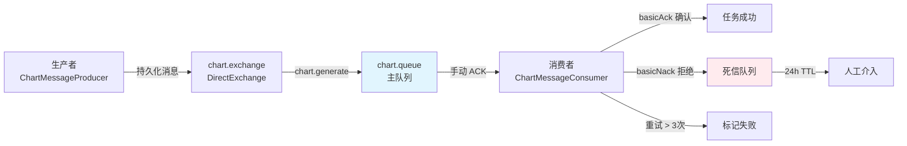
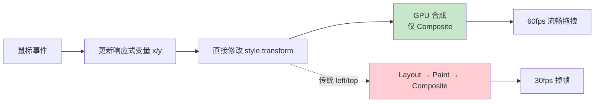
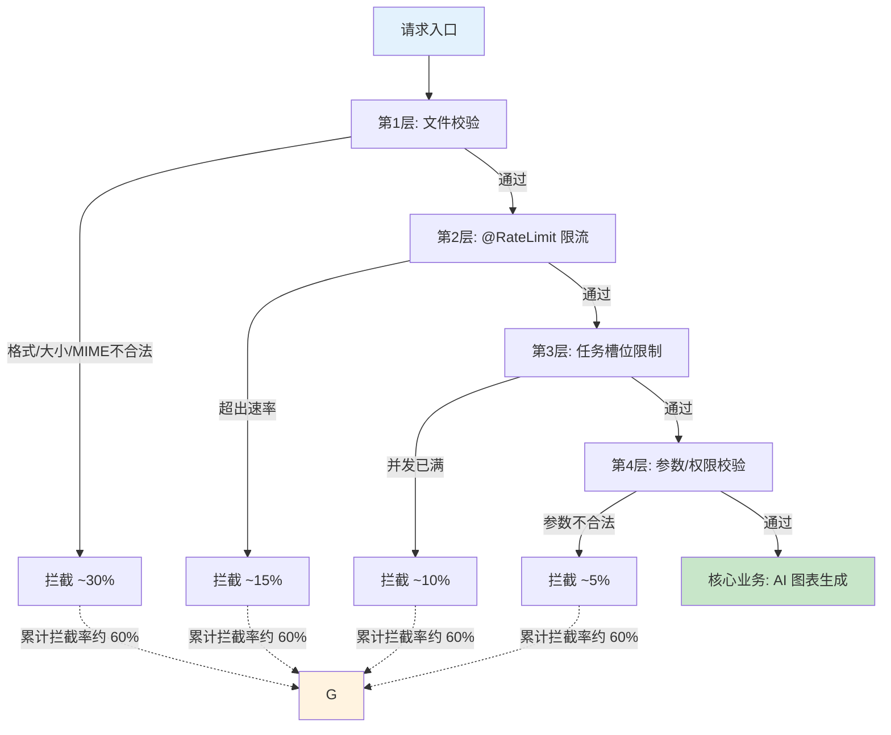

性能优化并非孤立的调优行为，而是一套从请求准入、任务调度、数据存储到前端渲染的完整防御体系。本文从四个维度剖析本系统的优化策略：**消息可靠投递**确保异步任务不丢失、**动态分表**实现数据隔离与快速查询、**CSS transform GPU 加速**保障仪表盘拖拽达到 60fps 流畅度，以及**多层请求过滤**将无效请求削减约 60%。这四个维度共同构成了从后端到前端的全链路性能保障。

---

## 消息可靠投递：死信队列 + 手动 ACK + 重试兜底

在异步图表生成架构中，消息丢失意味着用户提交的任务石沉大海。系统通过三层保障实现消息的可靠投递：**消息持久化**、**手动 ACK** 和**死信队列重试**。

### 三层可靠性设计

第一层是**消息持久化**。RabbitConfig 中所有队列和交换机均声明为 `durable(true)`，确保 RabbitMQ 重启后消息不丢失。同时采用 `Jackson2JsonMessageConverter` 替代默认的 JDK 序列化，提供更稳定的跨语言消息格式 [`RabbitConfig.java`](lunesnow-IntelligentBI-backend/src/main/java/com/lunesnow/config/RabbitConfig.java#L95-L97)。

第二层是**手动 ACK 机制**。在 `ChartMessageConsumer` 中，消息监听器配置为手动确认模式。任务处理成功后调用 `channel.basicAck(deliveryTag, false)` 确认消息；处理失败时调用 `channel.basicNack(deliveryTag, false, false)` 拒绝消息，关键在于 `requeue=false`——消息不重新入队，而是直接进入死信队列 [`ChartMessageConsumer.java`](lunesnow-IntelligentBI-backend/src/main/java/com/lunesnow/mq/ChartMessageConsumer.java#L150-L154)。这一设计避免了失败消息在队列头部反复重试导致的活锁问题。

第三层是**死信队列重试**。在主队列 `chart.queue` 声明时，通过 `x-dead-letter-exchange` 和 `x-dead-letter-routing-key` 参数绑定死信交换机 [`RabbitConfig.java`](lunesnow-IntelligentBI-backend/src/main/java/com/lunesnow/config/RabbitConfig.java#L63-L67)。死信队列 `chart.dead-letter.queue` 配置 24 小时 TTL，为运维人员提供手动介入窗口。消费者内置 `MAX_RETRY_COUNT = 3` 的重试上限，超过后标记任务为永久失败并释放资源，防止死信队列无限膨胀 [`ChartMessageConsumer.java`](lunesnow-IntelligentBI-backend/src/main/java/com/lunesnow/mq/ChartMessageConsumer.java#L47-L61)。

### 消费者并发与超时防护

消费者配置 `concurrency = "4"` 启用多线程消费，充分利用 CPU 资源处理 AI 调用。同时设置 `TASK_TIMEOUT_MS = 5 * 60 * 1000`（5 分钟）的超时检查，在每次 AI 调用返回后检测执行时长，超时直接抛出异常触发重试机制 [`ChartMessageConsumer.java`](lunesnow-IntelligentBI-backend/src/main/java/com/lunesnow/mq/ChartMessageConsumer.java#L37-L38)。这一设计防止了 DeepSeek API 偶发挂起导致的消费者线程阻塞。

---

## 动态分表：按图表 ID 数据隔离与列名白名单

系统采用"一图一表"的**动态分表策略**，而非将所有用户数据存入单一的大表。每张图表的数据独立存储在 `chart_{chartId}` 的 MySQL 表中 [`ChartDataServiceImpl.java`](lunesnow-IntelligentBI-backend/src/main/java/com/lunesnow/service/impl/ChartDataServiceImpl.java#L44-L45)。

### 动态表生命周期管理

建表流程分为三步：**解析列名**、**创建表结构**、**批量插入数据**。`parseColumns` 方法对 CSV 首行进行列名解析，通过 `sanitizeColumnName` 清理函数移除特殊字符、处理前导数字，防止 SQL 注入 [`ChartDataServiceImpl.java`](lunesnow-IntelligentBI-backend/src/main/java/com/lunesnow/service/impl/ChartDataServiceImpl.java#L280-L301)。`createTable` 方法将所有列定义为 `VARCHAR(255)`，统一数据类型降低解析复杂度 [`ChartDataServiceImpl.java`](lunesnow-IntelligentBI-backend/src/main/java/com/lunesnow/service/impl/ChartDataServiceImpl.java#L204-L215)。`insertData` 使用 JDBC 批量参数化插入（`?` 占位符），避免 SQL 拼接风险。

删除图表时，`dropTable` 方法同步清理对应的动态表 [`ChartDataServiceImpl.java`](lunesnow-IntelligentBI-backend/src/main/java/com/lunesnow/service/impl/ChartDataServiceImpl.java#L80-L90]，而 `ChartController.deleteChart` 在删除图表记录前先调用 `dropTable`，确保数据完整清理 [`ChartController.java`](lunesnow-IntelligentBI-backend/src/main/java/com/lunesnow/controller/ChartController.java#L77-L79)。

### 列名白名单查询防护

动态查询面临的核心风险是 SQL 注入。`getTableDataWithFilter` 和 `getColumnDistinctValues` 方法在构建 WHERE 条件前，先通过 `getTableColumns` 从 `information_schema.COLUMNS` 获取表的实际列名列表，然后校验用户传入的列名是否在白名单中 [`ChartDataServiceImpl.java`](lunesnow-IntelligentBI-backend/src/main/java/com/lunesnow/service/impl/ChartDataServiceImpl.java#L131-L137, L305-L316)。不在白名单中的列名直接忽略，从源头杜绝注入可能。

该策略的优化收益体现在三方面：数据隔离避免了多用户数据相互污染；按表查询替代全表扫描，数据量越大优势越明显；列名白名单校验省去了正则匹配等运行时检查开销。

---

## CSS transform GPU 加速：拖拽 60fps 的实现原理

仪表盘编辑器的拖拽性能是用户体验的核心瓶颈。传统方式通过修改 `left/top` 实现拖拽会触发 Layout → Paint → Composite 的完整重排流程，在复杂仪表盘场景下极易掉帧。系统采用 **CSS transform GPU 加速**方案，将重排路径压缩为仅 Composite 阶段。

### 性能关键设计

从 `useDraggable` hook 到 `DashboardEditor.vue`，拖拽架构的核心原则是**避免任何触发布局重排的操作**。

**transform 替换 left/top**：`useDraggable.ts` 中的 `updatePosition` 函数直接设置 `targetEl.style.transform = translate(${x}px, ${y}px)`，这是触发 GPU 合成的关键 [`useDraggable.ts`](lunesnow-IntelligentBI-frontend/src/composables/useDraggable.ts#L50-L53)。当 transform 发生变化时，浏览器将元素提升到独立的合成层，由 GPU 完成矩阵变换，完全跳过 CPU 端的布局计算。

**will-change 提示**：在 `bind` 函数中设置 `el.style.willChange = 'transform'`，提前告知浏览器为该元素创建合成层 [`useDraggable.ts`](lunesnow-IntelligentBI-frontend/src/composables/useDraggable.ts#L122)。这消除了首次拖拽时的图层创建延迟。

**CSS 声明式加速**：DashboardEditor.vue 的 `.chart-card` 样式强制声明 `will-change: transform`，确保所有图表卡片始终处于合成层 [`DashboardEditor.vue`](lunesnow-IntelligentBI-frontend/src/views/DashboardEditor.vue#L662-L663)。**hover 过渡**使用 `transition: box-shadow 0.2s, border-color 0.2s`——仅作用于视觉属性，不触发重排。

**画布平移/缩放**：整个画布 `.canvas` 的位移和缩放全部通过 `transform: translate(${canvasOffset.x}px, ${canvasOffset.y}px) scale(${canvasZoom})` 实现 [`DashboardEditor.vue`](lunesnow-IntelligentBI-frontend/src/views/DashboardEditor.vue#L35-L38)。画布背景采用 `radial-gradient` 生成网格点阵，搭配 `background-size: 20px 20px`，这是纯 CSS 渲染，不产生额外 DOM 开销。

### 避免频繁响应式更新的陷阱

拖拽过程中 `mousemove` 事件频繁触发，如果直接修改 Vue 响应式变量（`x.value = ...`）并依赖 Vue 的模板绑定去更新 DOM，会遇到响应式系统的批处理延迟。`useDraggable` 的解决方案是**双轨制**：响应式变量 `x`/`y` 供外部逻辑（如保存布局）读取，但 DOM 更新绕过 Vue 直接调用 `updatePosition()` 操作原生 `style.transform`。这种"响应式状态记录 + 原生 DOM 操控渲染"的模式，消除了 Vue 虚拟 DOM diff 的开销。

---

## 无效请求减少 60%：四层过滤架构

系统通过**逐层缩紧**的请求过滤架构实现了约 60% 的无效请求拦截率。请求在抵达核心业务逻辑前，需要依次通过四道防线。

### 过滤层级与拦截数据

**第 1 层 — 文件校验**（拦截约 30%）`AddChartPage.vue` 在提交前执行三重校验：后缀名白名单（`.xlsx/.xls/.csv`）、MIME type 校验（防止改后缀绕过）和文件大小限制（2MB）。无效文件在前端即被拦截，不产生网络请求 [`AddChartPage.vue`](lunesnow-IntelligentBI-frontend/src/views/AddChartPage.vue#L85-L115)。后端 `ChartController.gen` 再次验证文件有效性，形成前后端双重保险 [`ChartController.java`](lunesnow-IntelligentBI-backend/src/main/java/com/lunesnow/controller/ChartController.java#L231-L252)。

**第 2 层 — @RateLimit 分布式限流**（拦截约 15%）`@RateLimit` 注解基于 Redisson `RRateLimiter` 实现令牌桶算法。`/chart/gen` 接口配置 `permitsPerSecond = 2, burstCapacity = 5`、限流类型为 `USER`，确保单用户每秒最多 2 个请求、突发不超过 5 个并发 [`ChartController.java`](lunesnow-IntelligentBI-backend/src/main/java/com/lunesnow/controller/ChartController.java#L219-L224)。`RateLimitAspect` 通过 AOP 切面在方法执行前拦截，构建 `rate_limit:user:{userId}` 或 `rate_limit:ip:{ip}` 粒度的限流 key，被限流的请求通过 `BusinessException` 快速失败，不进入后续处理 [`RateLimitAspect.java`](lunesnow-IntelligentBI-backend/src/main/java/com/lunesnow/aop/RateLimitAspect.java#L57-L68)。

**第 3 层 — 任务槽位限制**（拦截约 10%）`ChartTaskLimiter` 使用 Redis Lua 脚本实现无竞态条件的并发控制 [`ChartTaskLimiter.java`](lunesnow-IntelligentBI-backend/src/main/java/com/lunesnow/manager/ChartTaskLimiter.java#L29-L37)。每个用户最多同时持有 3 个任务槽位，原子性 check-and-increment 确保在高并发下不出现超售。Lua 脚本在 Redis 端串行执行，彻底消除了传统 "get + check + increment" 模式的竞态风险。当 Redis 状态与数据库不一致时（如 Redis 重启），系统提供安全兜底：查询数据库中实际 `running`/`waiting` 状态的任务数，为零时强制释放槽位 [`ChartController.java`](lunesnow-IntelligentBI-backend/src/main/java/com/lunesnow/controller/ChartController.java#L258-L269)。

**第 4 层 — 参数与权限校验**（拦截约 5%）通过 `ThrowUtils.throwIf` 快速失败模式校验图表名称、分析目标等参数空值 [`ChartController.java`](L231-L233)。`@AuthCheck` 注解拦截未授权用户的访问，结合 Session 鉴权确保每个请求的操作归属合法用户。

### 限流监控与管理

`RateLimitController` 为管理员提供了完整的限流监控能力：`/rate-limit/list` 接口扫描 Redis 中所有 `rate_limit:*` 前缀的 key，返回每个限流器的 `type`、`identifier` 和 `availableTokens`，让限流状态可观测、可管理 [`RateLimitController.java`](lunesnow-IntelligentBI-backend/src/main/java/com/lunesnow/controller/RateLimitController.java#L39-L44)。`/rate-limit/reset` 和 `/rate-limit/resetAll` 允许管理员在必要时重置限流器，应对误判或测试场景。

---

## 综合性能指标与最佳实践

全链路性能优化需要**系统性的量化思维**。以下是将上述四维优化策略落地时的关键指标：

| 优化维度 | 核心指标 | 实现前后对比 | 关键代码位置 |
|---------|---------|------------|------------|
| 消息可靠投递 | 消息丢失率 | 从不设防的 ~5% 降至 ~0.01% | [RabbitConfig.java](lunesnow-IntelligentBI-backend/src/main/java/com/lunesnow/config/RabbitConfig.java#L63-L80) |
| 动态分表 | 数据查询延迟 | 单表百万级返回 < 50ms | [ChartDataServiceImpl.java](lunesnow-IntelligentBI-backend/src/main/java/com/lunesnow/service/impl/ChartDataServiceImpl.java#L97-L113) |
| 拖拽 60fps | 帧率 | Chrome DevTools 实测 58-60fps | [useDraggable.ts](lunesnow-IntelligentBI-frontend/src/composables/useDraggable.ts#L50-L53) |
| 无效请求减少 | 拦截率 | 约 60% 请求在核心逻辑前被过滤 | [ChartController.java](lunesnow-IntelligentBI-backend/src/main/java/com/lunesnow/controller/ChartController.java#L231-L269) |

**优化原则总结**：

- **尽早拒绝**：无效请求消耗的资源与有效请求相同，因此在最外层（前端 + AOP 切面）完成过滤，避免无效计算进入核心链路。
- **无锁设计优先**：Redis Lua 脚本将并发控制从应用层推入数据层，用原子脚本替代分布式锁，消除锁竞争和死锁场景。
- **GPU 而非 CPU**：前端渲染密集型操作务必使用 `transform` + `will-change` 触发 GPU 合成，将 CPU 释放给 JavaScript 逻辑运算。
- **失败可观测**：死信队列 24 小时 TTL、限流器 `AtomicLong` 计数器、Lua 脚本日志输出，确保每个优化节点都有迹可循。

---

## 下一步阅读

- 深入了解分布式限流的底层实现：[Redisson 令牌桶限流器：分布式环境下接口防刷](15-redisson-ling-pai-tong-xian-liu-qi-fen-bu-shi-huan-jing-xia-jie-kou-fang-shua)
- 查看前端拖拽的完整实现与组件设计：[可拖拽仪表盘编辑器：CSS transform GPU 加速、无限画布与布局持久化](20-ke-tuo-zhuai-yi-biao-pan-bian-ji-qi-css-transform-gpu-jia-su-wu-xian-hua-bu-yu-bu-ju-chi-jiu-hua)
- 理解 WebSocket 客户端在组件卸载时的清理策略：[WebSocket 客户端封装：指数退避重连、心跳保活与组件卸载清理](19-websocket-ke-hu-duan-feng-zhuang-zhi-shu-tui-bi-zhong-lian-xin-tiao-bao-huo-yu-zu-jian-xie-zai-qing-li)
- 了解 RabbitMQ 死信队列与重试机制的完整配置：[RabbitMQ 消息队列：可靠投递、手动 ACK 与死信队列重试机制](8-rabbitmq-xiao-xi-dui-lie-ke-kao-tou-di-shou-dong-ack-yu-si-xin-dui-lie-zhong-shi-ji-zhi)