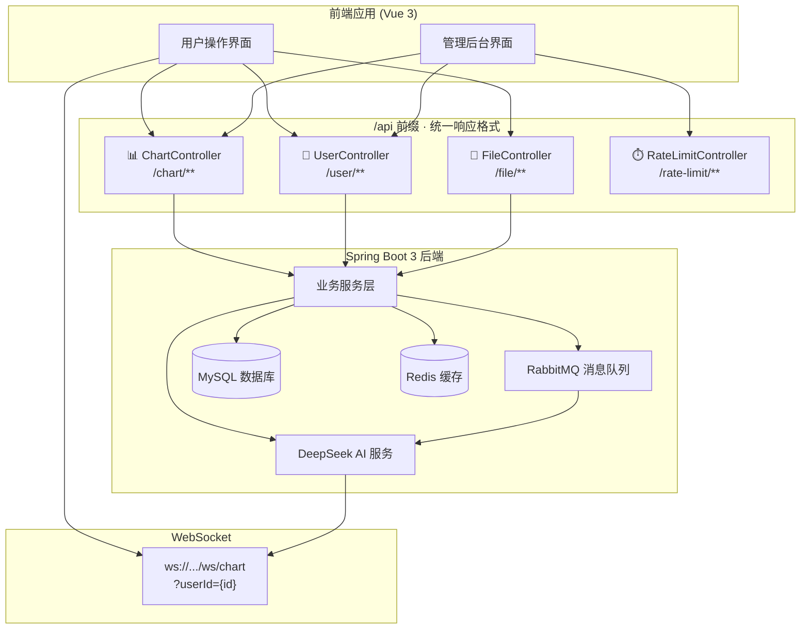

**目标读者**：前端开发者和系统集成初学者  
**当前角色**：快速索引所有后端 API 端点的参考指南

本页全景式列出智能 BI 系统后端暴露的全部 HTTP API 和 WebSocket 端点。系统采用统一的 `BaseResponse<T>` 响应格式（`{ code: int, data: T, message: string }`），成功时 `code = 0`；错误码涵盖 `40000`（参数错误）、`40100`（未登录）、`40101`（无权限）、`40300`（禁止访问）、`40400`（数据不存在）、`50000`（系统异常）、`50001`（操作失败）。前端的 Axios 实例自动为请求路径添加 `/api` 前缀，开发环境指向 `http://localhost:8088`，生产环境指向 `https://lunesnow-IntelligentBI-frontend.vercel.app`。  
Sources: [BaseResponse.java](lunesnow-IntelligentBI-backend/src/main/java/com/lunesnow/common/BaseResponse.java#L1-L35), [ErrorCode.java](lunesnow-IntelligentBI-backend/src/main/java/com/lunesnow/common/ErrorCode.java#L1-L43), [request.ts](lunesnow-IntelligentBI-frontend/src/request.ts#L1-L66), [index.ts](lunesnow-IntelligentBI-frontend/src/constants/index.ts#L1-L10)

## API 全景架构

在深入每个端点之前，先通过一张架构总览图理解四个控制器模块在整个系统中的定位：



上图展示了**四个 REST 控制器 + 一个 WebSocket 端点**的分工格局：ChartController 是业务核心（图表生成需要文件上传、消息队列、AI 调用等多个环节的串联），UserController 负责登录态和权限管理，FileController 处理文件上传的本地持久化，RateLimitController 为管理员提供分布式限流的监控面板。WebSocket 端点在 AI 任务完成后实时推送结果给对应前端。  
Sources: [ChartController.java](lunesnow-IntelligentBI-backend/src/main/java/com/lunesnow/controller/ChartController.java#L1-L549), [UserController.java](lunesnow-IntelligentBI-backend/src/main/java/com/lunesnow/controller/UserController.java#L1-L288), [FileController.java](lunesnow-IntelligentBI-backend/src/main/java/com/lunesnow/controller/FileController.java#L1-L104), [RateLimitController.java](lunesnow-IntelligentBI-backend/src/main/java/com/lunesnow/controller/RateLimitController.java#L1-L70)

## 一、图表核心 API（/chart/**）— 智能 BI 的业务中枢

ChartController 是整个系统最复杂的控制器，承载了**图表 CRUD、AI 分析生成、任务状态轮询、原始数据查询**四条功能线。所有端点均需要登录态（除少数管理员专用操作外）。

### 1.1 图表 CRUD 操作

**POST /chart/add** — 创建图表记录（仅保存元数据，不触发 AI 分析）。请求体为 `ChartAddRequest`，包含 `name`（图表名称）、`goal`（分析目标）、`chartData`（可选的原始数据）、`chartType`（图表类型如柱状图、折线图）。返回新图表的 `id`（Long 类型）。

**POST /chart/delete** — 删除图表。请求体为 `DeleteRequest`，包含 `id`。执行时会调用 `chartDataService.dropTable(id)` 同步删除与该图表关联的动态数据表，实现数据隔离的彻底清理。仅图表所有者或管理员可操作。

**POST /chart/update** — 更新图表（仅管理员）。请求体为 `ChartUpdateRequest`，包含 `id` 及需更新的字段。执行前通过 `validChart` 方法进行参数校验。

**GET /chart/get/vo** — 根据 `id` 查询图表的脱敏视图 `ChartVO`（仅管理员）。`ChartVO` 相比 `Chart` 实体隐藏了 `chartData`（原始 CSV 数据）字段，增加了 `user`（创建者信息）。

**POST /chart/list/page** — 管理员分页查询全部图表。请求体为 `ChartQueryRequest`（继承 `PageRequest`，包含 `current`、`pageSize`、`sortField`、`sortOrder` 及查询条件字段）。返回 `Page<Chart>` 分页对象。

**POST /chart/list/page/vo** — 分页查询图表视图（普通用户可访问）。**安全限制**：`pageSize` 不得超过 20，防止爬虫批量抓取。

**POST /chart/my/list/page/vo** — 查询**当前登录用户**自己的图表列表。自动注入 `userId` 到查询条件中。

**POST /chart/edit** — 编辑自己的图表（仅图表所有者或管理员）。校验通过后调用 `updateById`。

**POST /chart/edit/config** — **独立编辑 ECharts 配置**。请求体为 `ChartEditConfigRequest`，只接收 `id` 和 `genChart`（ECharts JSON 字符串）两个字段。此接口专门为[图表在线编辑器](21-tu-biao-zai-xian-bian-ji-qi-json-shi-shi-bian-ji-echarts-an-quan-xuan-ran-yu-wei-xian-zi-duan-guo-lu)提供，避免覆盖其他字段。

**GET /chart/statistics** — 获取当前用户的图表统计数据。返回 `ChartStatisticsVO`，包含：`totalCount`（总数）、`successCount`（成功数）、`failedCount`（失败数）、`runningCount`（running + waiting 状态数）、`successRate`（成功率百分比）和 `recentCharts`（最近 5 条图表）。
Sources: [ChartController.java](lunesnow-IntelligentBI-backend/src/main/java/com/lunesnow/controller/ChartController.java#L1-L250), [ChartAddRequest.java](lunesnow-IntelligentBI-backend/src/main/java/com/lunesnow/model/dto/chart/ChartAddRequest.java#L1-L36), [ChartEditConfigRequest.java](lunesnow-IntelligentBI-backend/src/main/java/com/lunesnow/model/dto/chart/ChartEditConfigRequest.java#L1-L24), [ChartVO.java](lunesnow-IntelligentBI-backend/src/main/java/com/lunesnow/model/vo/ChartVO.java#L1-L101), [ChartStatisticsVO.java](lunesnow-IntelligentBI-backend/src/main/java/com/lunesnow/model/vo/ChartStatisticsVO.java#L1-L46)

### 1.2 AI 生成与任务管理 — 核心业务流

这是整个系统最关键的一组 API，涉及文件上传 → 数据入库 → 异步消息 → AI 分析 → 实时推送的完整链路。

**POST /chart/gen** — **AI 智能生成图表**（核心端点）。这是一个 `multipart/form-data` POST 请求，参数如下：

| 参数名 | 类型 | 说明 |
|--------|------|------|
| `file` | MultipartFile | 数据文件，支持 xlsx、xls、csv，最大 2MB |
| `name` | String | 图表名称 |
| `chartType` | String | 图表类型（如 bar、line、pie） |
| `goal` | String | 分析目标/需求描述 |

该端点被 `@RateLimit` 注解保护（每秒 2 个请求，突发容量 5 个），限流级别为 `LimitType.USER`（按用户维度限流）。执行流程分为四步：

1. **前置校验**：文件大小、后缀、用户是否有空闲任务槽位（通过 `ChartTaskLimiter` + Redis Lua 原子脚本实现，详见 [Redis Lua 原子脚本](14-redis-lua-yuan-zi-jiao-ben-wu-jing-tai-tiao-jian-de-bing-fa-ren-wu-cao-wei-guan-li)）
2. **CSV 转换和数据库写入**：调用 `ExcelUtils.excelToCsv` 将上传文件转为 CSV 字符串，同时保存图表记录（状态为 `waiting`），再调用 `chartDataService.createTableFromCsv` 为该图表动态创建独立数据表
3. **异步消息投递**：通过 `ChartMessageProducer` 向 RabbitMQ 发送图表任务消息，详见 [RabbitMQ 消息队列](8-rabbitmq-xiao-xi-dui-lie-ke-kao-tou-di-shou-dong-ack-yu-si-xin-dui-lie-zhong-shi-ji-zai)
4. **立即返回**：返回 `BiResponse`，包含 `chartId`，前端凭此 ID 轮询任务状态或等待 WebSocket 推送

**POST /chart/retry/{id}** — **重新生成失败的图表**。仅允许 `status == "failed"` 的图表重试。过程：重置状态为 `waiting`，清空 `genChart`、`genResult`、`execMessage`，重新向 RabbitMQ 发送消息。

**GET /chart/status/{id}** — **查询图表任务状态**。返回 `BiResponse`，包含 `status`（waiting/running/succeed/failed）、`execMessage`（失败原因）、`genChart`（生成的 ECharts 配置 JSON）和 `genResult`（分析结论）。前端结合[轮询策略优化](22-lun-xun-ce-lue-you-hua-zhi-shu-tui-bi-suan-fa-yu-page-visibility-api-zan-ting-hui-fu)和 [WebSocket 客户端封装](19-websocket-ke-hu-duan-feng-zhuang-zhi-shu-tui-bi-zhong-lian-xin-tiao-bao-huo-yu-zu-jian-xie-zai-qing-li)两种方式获取生成结果。
Sources: [ChartController.java](lunesnow-IntelligentBI-backend/src/main/java/com/lunesnow/controller/ChartController.java#L250-L450), [BiResponse.java](lunesnow-IntelligentBI-backend/src/main/java/com/lunesnow/model/vo/BiResponse.java#L1-L26)

### 1.3 图表原始数据查询

这组 API 用于在图表创建后查询存储在独立动态表中的原始数据，支持筛选和去重值获取。

**GET /chart/get/data/{chartId}** — 获取图表原始数据。返回 `List<Map<String, String>>`，每行数据以 Map 形式呈现。通过 `chartDataService.getTableData(chartId)` 查询该图表对应的动态表，详见[动态数据分表策略](11-dong-tai-shu-ju-fen-biao-ce-lue-an-tu-biao-id-zi-dong-jian-biao-yu-shu-ju-ge-chi)。

**POST /chart/get/data/{chartId}/filter** — 带筛选条件的数据查询。请求体为 `Map<String, String>` 格式的筛选条件（键为列名，值为筛选值）。后端使用[列名白名单校验](13-sql-zhu-ru-fang-hu-lie-ming-bai-ming-dan-xiao-yan-yu-an-quan-cha-xun-gou-jian)防止 SQL 注入。

**GET /chart/get/data/{chartId}/column/{columnName}** — 获取指定列的**唯一值列表**，用于前端下拉筛选器的选项填充。例如获取某一列的枚举值集合。

以上三个端点均进行**权限校验**：仅图表所有者或管理员可以访问。
Sources: [ChartController.java](lunesnow-IntelligentBI-backend/src/main/java/com/lunesnow/controller/ChartController.java#L450-L549)

## 二、用户认证与权限 API（/user/ **）— 鉴权基础

UserController 分为**登录相关**和**用户管理**两大模块。系统使用 Session 鉴权机制（`SessionCreationPolicy.IF_REQUIRED`），登录成功后用户信息存储于服务端 Session，前端通过 `withCredentials: true`（已在 Axios 实例中配置）自动携带 Cookie。

### 2.1 登录注册（无需鉴权）

| 端点 | 方法 | 说明 | 请求体关键字段 |
|------|------|------|----------------|
| `/user/register` | POST | 用户注册 | `userAccount`, `userPassword`, `checkPassword` |
| `/user/login` | POST | 用户登录 | `userAccount`, `userPassword` |
| `/user/logout` | POST | 用户注销 | — |
| `/user/get/login` | GET | 获取当前登录用户 | — |

注册时后端使用 `BCryptPasswordEncoder` 对密码进行哈希加密。登录成功后返回 `LoginUserVO`（脱敏视图，包含 `id`、`userName`、`userAvatar`、`userRole`、`createTime`）。`/user/get/login` 是前端判断登录态的关键端点，响应拦截器特别处理了此路径的 40100 异常。  
Sources: [UserController.java](lunesnow-IntelligentBI-backend/src/main/java/com/lunesnow/controller/UserController.java#L1-L120), [LoginUserVO.java](lunesnow-IntelligentBI-backend/src/main/java/com/lunesnow/model/vo/LoginUserVO.java#L1-L46)

### 2.2 用户管理（管理员专用）

| 端点 | 方法 | 权限 | 说明 |
|------|------|------|------|
| `/user/add` | POST | ADMIN | 新增用户，默认密码 `12345678` |
| `/user/delete` | POST | ADMIN | 删除用户 |
| `/user/update` | POST | ADMIN | 更新用户信息（含角色） |
| `/user/get` | GET | ADMIN | 根据 `id` 查询用户 |
| `/user/get/vo` | GET | ADMIN | 根据 `id` 查询用户脱敏视图 |
| `/user/list/page` | POST | ADMIN | 分页查询用户列表 |
| `/user/list/page/vo` | POST | — | 分页查询用户脱敏视图（`pageSize` 限制 ≤ 20） |

管理员接口统一使用 `@AuthCheck(mustRole = UserConstant.ADMIN_ROLE)` 注解进行权限校验，详见 [AOP 切面编程](16-aop-qie-mian-bian-cheng-atauthcheck-quan-xian-xiao-yan-yu-atratelimit-xian-liu-lan-jie)。

### 2.3 个人信息管理

**POST /user/update/my** — 当前用户更新自己的个人信息。`UserUpdateMyRequest` 仅包含 `userName` 和 `userAvatar` 两个字段，用户不能自行修改账号或角色。  
Sources: [UserController.java](lunesnow-IntelligentBI-backend/src/main/java/com/lunesnow/controller/UserController.java#L200-L288)

## 三、文件上传 API（/file/upload）— 通用文件服务

`FileController` 只暴露一个端点：

**POST /file/upload** — 通用文件上传。参数为 `MultipartFile (file)` + `UploadFileRequest (biz)`。

`biz` 参数决定业务类型和校验规则：

| 业务类型 | 文件大小限制 | 允许的后缀 |
|----------|-------------|-----------|
| `USER_AVATAR` | ≤ 1MB | jpeg, jpg, svg, png, webp |
| 其他 | ≤ 10MB | jpeg, jpg, png, gif, webp, svg, pdf, doc, docx, xls, xlsx, ppt, pptx, txt, csv, json |

文件保存到本地临时目录（`java.io.tmpdir`），命名为 `{userId}-{UUID}-{原始文件名}`。文件名经过 `replaceAll("[\\\\/]", "")` 处理以防御路径遍历攻击。返回值为文件的本地路径字符串。

> **注意**：AI 图表生成（`/chart/gen`）内部通过 `ExcelUtils.excelToCsv` 直接解析上传的 `MultipartFile`，不走此文件上传接口。此接口主要用于其他场景（如用户头像上传）。
Sources: [FileController.java](lunesnow-IntelligentBI-backend/src/main/java/com/lunesnow/controller/FileController.java#L1-L104), [FileUploadBizEnum.java](lunesnow-IntelligentBI-backend/src/main/java/com/lunesnow/model/enums/FileUploadBizEnum.java)

## 四、限流管理 API（/rate-limit/**）— 管理员监控面板

`RateLimitController` 提供对分布式限流器的运行时监控能力，所有端点都需要 ADMIN 权限：

| 端点 | 方法 | 说明 |
|------|------|------|
| `/rate-limit/status` | GET | 查询指定 `key` 的限流状态（当前令牌数、速率等） |
| `/rate-limit/list` | GET | 列出所有活跃的限流器状态 |
| `/rate-limit/reset` | POST | 重置指定 `key` 的限流器 |
| `/rate-limit/resetAll` | POST | 重置所有限流器 |

这组 API 服务于[管理后台的分布式限流监控](23-guan-li-hou-tai-yong-hu-guan-li-tu-biao-shen-ji-yu-fen-bu-shi-xian-liu-jian-kong)功能，底层基于 Redisson 的 `RRateLimiter` 实现，详见 [Redisson 令牌桶限流器](15-redisson-ling-pai-tong-xian-liu-qi-fen-bu-shi-huan-jing-xia-jie-kou-fang-shua)。
Sources: [RateLimitController.java](lunesnow-IntelligentBI-backend/src/main/java/com/lunesnow/controller/RateLimitController.java#L1-L70)

## 五、WebSocket 实时推送端点

除了 REST API，系统还提供一个 WebSocket 端点用于**异步任务完成后的实时通知**：

**ws://localhost:8088/api/ws/chart?userId={userId}**

客户端建立连接后，服务端通过 `ConcurrentHashMap` 管理用户 Session 映射。连接建立时从 URL 参数中提取 `userId`，无效则拒绝连接。支持心跳检测（客户端发送 `ping`，服务端回复 `pong`）。任务完成时推送 JSON 消息格式：

```json
// 生成成功
{"type":"success","chartId":123,"chartName":"销售分析","message":"图表生成成功"}

// 生成失败
{"type":"failure","chartId":123,"chartName":"销售分析","message":"图表生成失败: AI 服务超时"}
```

关于 WebSocket 的详细机制（会话管理、心跳检测、在线状态查询）请参考 [WebSocket 实时推送](10-websocket-shi-shi-tui-song-concurrenthashmap-hui-hua-guan-li-xin-tiao-jian-ce-yu-zai-xian-zhuang-tai)。前端的重连策略和生命周期管理详见 [WebSocket 客户端封装](19-websocket-ke-hu-duan-feng-zhuang-zhi-shu-tui-bi-zhong-lian-xin-tiao-bao-huo-yu-zu-jian-xie-zai-qing-li)。
Sources: [ChartWebSocketHandler.java](lunesnow-IntelligentBI-backend/src/main/java/com/lunesnow/websocket/ChartWebSocketHandler.java#L1-L162), [WebSocketConfig.java](lunesnow-IntelligentBI-backend/src/main/java/com/lunesnow/config/WebSocketConfig.java#L1-L33)

## API 端点速查表

| 分类 | 端点路径 | 方法 | 权限 | 核心功能 |
|------|---------|------|------|---------|
| 图表 | `/chart/gen` | POST | 登录 | **AI 生成图表**（核心入口，含限流） |
| 图表 | `/chart/status/{id}` | GET | 登录 | 查询任务状态（轮询用） |
| 图表 | `/chart/retry/{id}` | POST | 登录 | 重新生成失败图表 |
| 图表 | `/chart/add` | POST | 登录 | 创建图表元数据 |
| 图表 | `/chart/delete` | POST | 登录 | 删除图表及关联数据表 |
| 图表 | `/chart/edit` | POST | 登录 | 编辑图表基本信息 |
| 图表 | `/chart/edit/config` | POST | 登录 | **编辑 ECharts 配置** |
| 图表 | `/chart/my/list/page/vo` | POST | 登录 | 我的图表列表 |
| 图表 | `/chart/list/page/vo` | POST | 登录 | 全部图表列表（限 20 条） |
| 图表 | `/chart/list/page` | POST | 管理员 | 管理员图表列表 |
| 图表 | `/chart/get/vo` | GET | 管理员 | 获取图表详情 |
| 图表 | `/chart/update` | POST | 管理员 | 更新图表（管理员） |
| 图表 | `/chart/statistics` | GET | 登录 | 我的图表统计 |
| 图表 | `/chart/get/data/{chartId}` | GET | 登录 | 原始数据查询 |
| 图表 | `/chart/get/data/{chartId}/filter` | POST | 登录 | 筛选数据查询 |
| 图表 | `/chart/get/data/{chartId}/column/{col}` | GET | 登录 | 列唯一值列表 |
| 用户 | `/user/register` | POST | 公开 | 用户注册 |
| 用户 | `/user/login` | POST | 公开 | 用户登录 |
| 用户 | `/user/logout` | POST | 登录 | 用户注销 |
| 用户 | `/user/get/login` | GET | 登录 | 获取当前用户 |
| 用户 | `/user/update/my` | POST | 登录 | 修改个人信息 |
| 用户 | `/user/list/page/vo` | POST | 登录 | 用户列表（限 20 条） |
| 用户 | `/user/add` | POST | 管理员 | 新增用户 |
| 用户 | `/user/delete` | POST | 管理员 | 删除用户 |
| 用户 | `/user/update` | POST | 管理员 | 更新用户 |
| 用户 | `/user/get` | GET | 管理员 | 查询用户 |
| 用户 | `/user/list/page` | POST | 管理员 | 管理员用户列表 |
| 文件 | `/file/upload` | POST | 登录 | 文件上传（通用） |
| 限流 | `/rate-limit/status` | GET | 管理员 | 限流状态查询 |
| 限流 | `/rate-limit/list` | GET | 管理员 | 所有限流列表 |
| 限流 | `/rate-limit/reset` | POST | 管理员 | 重置限流 |
| 限流 | `/rate-limit/resetAll` | POST | 管理员 | 批量重置限流 |
| 实时 | `ws://.../ws/chart` | WS | 登录 | **实时结果推送** |

## 建议阅读顺序

理解 API 接口后，建议按照以下路径深入系统细节：

1. **业务完整链路**：先阅读[完整数据流水线](6-wan-zheng-shu-ju-liu-shui-xian-cong-shang-chuan-csv-excel-dao-echarts-tu-biao-de-quan-lian-lu-zhui-zong)，理解 `/chart/gen` 背后从文件上传到 ECharts 渲染的完整流转过程
2. **异步处理核心**：接着深入[图表生成控制器](7-tu-biao-sheng-cheng-kong-zhi-qi-wen-jian-xiao-yan-dong-tai-jian-biao-ren-wu-xian-liu-yu-yi-bu-ti-jiao)了解任务限流与提交的详细逻辑
3. **AI 集成细节**：查看 [DeepSeek AI 集成](9-deepseek-ai-ji-cheng-prompt-gong-cheng-yu-echarts-pei-zhi-zhi-neng-sheng-cheng)了解 Prompt 工程如何驱动图表配置生成
4. **安全机制**：阅读 [SQL 注入防护](13-sql-zhu-ru-fang-hu-lie-ming-bai-ming-dan-xiao-yan-yu-an-quan-cha-xun-gou-jian)理解数据查询端点的安全设计，以及 [AOP 切面编程](16-aop-qie-mian-bian-cheng-atauthcheck-quan-xian-xiao-yan-yu-atratelimit-xian-liu-lan-jie)了解权限注解的实现