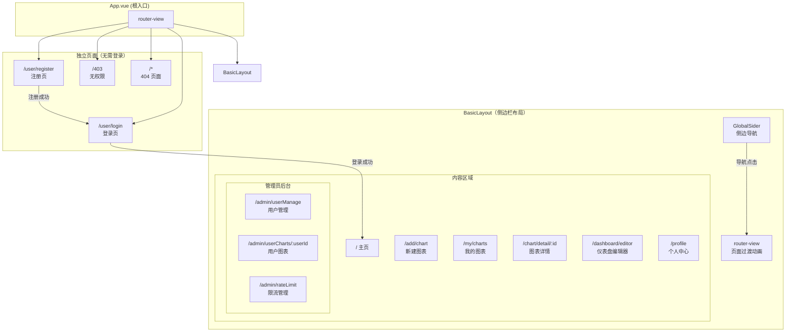

该系统前端是一个基于 Vue 3 + TypeScript + Element Plus 的单页应用（SPA），采用声明式路由和权限守卫来组织所有页面。从登录到图表创建，从个人仪表盘到管理后台，整个应用的页面导航遵循一条清晰的主线：**未登录用户只能访问认证页面，登录后通过侧边栏导航进入各功能模块，管理员额外拥有后台管理入口**。本文档将逐页介绍每个路由对应的页面职责、布局结构和核心交互。

Sources: [router/index.ts](lunesnow-IntelligentBI-frontend/src/router/index.ts#L1-L94)

## 页面架构全景

应用路由分为两大层级：**带侧边栏的布局内路由**（需要登录）和 **独立页面**（无需登录）。前者包裹在 `BasicLayout` 组件中，后者是单独的空白页面。路由守卫通过 `access.ts` 实现三层拦截：未登录用户自动跳转登录页（携带 `redirect` 参数以便登录后回到原页面）、无管理员权限的用户访问后台路由时跳转 403 页面、其余情况正常放行。

Sources: [access.ts](lunesnow-IntelligentBI-frontend/src/access.ts#L1-L40), [BasicLayout.vue](lunesnow-IntelligentBI-frontend/src/layouts/BasicLayout.vue#L1-L68)



**路由守卫逻辑**：`router.beforeEach` 在每次导航前执行——如果是无需认证的页面（登录、注册、403、404）直接放行；否则从 `useLoginUserStore` 中检查登录状态，若用户名为默认值「未登录」则尝试通过后端 Session 恢复登录会话（Cookie 机制），恢复失败则重定向到 `/user/login?redirect=目标路径`；对于标记了 `requiresAdmin` 的路由，额外校验 `userRole === 'admin'`，不满足则跳转 `/403`。

Sources: [access.ts](lunesnow-IntelligentBI-frontend/src/access.ts#L8-L40), [router/index.ts](lunesnow-IntelligentBI-frontend/src/router/index.ts#L11-L73)

## 路由与页面对照表

| 路由路径 | 页面名称 | 所属布局 | 权限要求 | 页面职责 |
|---|---|---|---|---|
| `/` | 主页（HomePage） | BasicLayout | 登录 | 欢迎区 + 统计数据 + 最近图表 |
| `/add/chart` | 新建图表（AddChartPage） | BasicLayout | 登录 | 表单校验 + 拖拽上传 + AI 提交 |
| `/my/charts` | 我的图表（MyChartsPage） | BasicLayout | 登录 | 搜索/分页/状态轮询 |
| `/chart/detail/:id` | 图表详情（ChartDetailPage） | BasicLayout | 登录 | 图表渲染 + 数据筛选 + 导出 |
| `/dashboard/editor` | 仪表盘编辑器（DashboardEditor） | BasicLayout | 登录 | 拖拽布局 + 无限画布 |
| `/profile` | 个人中心（ProfilePage） | BasicLayout | 登录 | 头像/用户名编辑 |
| `/admin/userManage` | 用户管理（UserManagePage） | BasicLayout | admin | 用户 CRUD |
| `/admin/userCharts/:userId` | 用户图表（UserChartsPage） | BasicLayout | admin | 查看特定用户的图表 |
| `/admin/rateLimit` | 限流管理（RateLimitPage） | BasicLayout | admin | 限流状态查询/重置 |
| `/user/login` | 登录页（LoginPage） | 独立 | 无 | 账号密码登录 |
| `/user/register` | 注册页（RegisterPage） | 独立 | 无 | 账号注册 |
| `/403` | 无权限（Error403Page） | 独立 | 无 | 权限不足提示 |
| `/:pathMatch(.*)*` | 404（NotFoundPage） | 独立 | 无 | 路由未匹配 |

Sources: [router/index.ts](lunesnow-IntelligentBI-frontend/src/router/index.ts#L11-L94)

## 页面详细说明

### 认证入口：登录与注册

登录页和注册页共享同一个双栏卡片布局：左侧为深色品牌展示区，展示产品名称「Intelligent BI」、品牌标语「数据驱动每一个决策」以及三项功能亮点；右侧为表单操作区。登录页提供账号/密码输入框，支持 `enter` 键快捷提交，登录成功后根据角色分别跳转——普通用户去主页 `/`，管理员去 `/admin/userManage`。注册页在登录页基础上增加「确认密码」字段，并内置密码一致性校验。两个页面底部都包含通往对方的链接，形成完整的认证闭环。

Sources: [LoginPage.vue](lunesnow-IntelligentBI-frontend/src/views/user/LoginPage.vue#L1-L330), [RegisterPage.vue](lunesnow-IntelligentBI-frontend/src/views/user/RegisterPage.vue#L1-L345)

### 主页：数据驾驶舱

主页 `/` 是用户登录后最先看到的页面，包含三个核心区域。**顶部欢迎区**（Hero 区）动态显示当前用户名，右侧提供一个突出的「新建图表」按钮，引导用户执行核心操作。**统计数据区**采用不对称布局——左侧大卡片展示「图表总数」（带数字入场动画效果），右侧三个小卡片分别展示「成功」「进行中」「成功率」指标，所有数字通过 `requestAnimationFrame` 缓动函数实现平滑计数动画。**最近生成区**采用 Bento 风格的卡片网格，每张卡片展示图表的缩略 ECharts 渲染、类型标签和创建时间，点击卡片进入详情页；空状态时显示引导性的空态插图和「创建第一个图表」按钮；加载过程中展示骨架屏（skeleton）占位。

Sources: [HomePage.vue](lunesnow-IntelligentBI-frontend/src/views/HomePage.vue#L1-L845)

### 图表创建：表单校验与异步提交

新建图表页 `/add/chart` 采用左右分栏的表单布局。左侧「基本信息」包含三个必填字段——图表名称（文本输入）、图表类型（下拉选择：折线图/柱状图/饼图/散点图/雷达图）、分析目标（多行文本，最长 200 字）。右侧「数据文件」区提供 Element Plus 的拖拽上传组件（`el-upload`），支持 `.xlsx` / `.xls` / `.csv` 格式，最大 2MB。文件校验分三层执行：**后缀名校验**（白名单过滤）、**MIME type 校验**（防止改后缀绕过）、**文件大小校验**（非空且不超过限制），任一校验失败则清除文件并给出错误提示。提交时通过 `FormData` 将文件与表单字段一起发送至 `/chart/gen` 接口，后端返回后跳转到「我的图表」页面由用户跟踪生成进度。

Sources: [AddChartPage.vue](lunesnow-IntelligentBI-frontend/src/views/AddChartPage.vue#L1-L377)

### 我的图表：搜索筛选与异步状态轮询

「我的图表」页 `/my/charts` 是用户管理图表的中心。顶部筛选栏支持按图表名称搜索、按图表类型筛选、按排序字段（创建时间等）和排序方式（升序/降序）组合查询。主体区域以卡片网格展示每个图表，每张卡片包含：图表头部（名称 + 类型标签 + 操作按钮），图表内容区根据状态有三种渲染——`waiting`/`running` 显示旋转加载图标和「AI 正在生成图表，请稍候」提示、`succeed` 通过 `safeRenderChart` 安全渲染 ECharts、`failed` 显示错误图标和 `execMessage` 错误信息。卡片底部展示状态标签（排队中/生成中/已完成/生成失败）和创建时间。列表支持分页（每页 10/20/50/100 条）和跳转。**关键机制**：页面通过 `usePolling` composable 对进行中的图表执行指数退避轮询，自动更新状态直至完成。

Sources: [MyChartsPage.vue](lunesnow-IntelligentBI-frontend/src/views/MyChartsPage.vue#L1-L701)

### 图表详情：渲染、数据筛选与导出

图表详情页 `/chart/detail/:id` 是单图表深度查看页面，包含四个从上至下的卡片区域。**基础信息卡片**展示图表名称、类型（彩色标签）、状态和创建时间。**图表展示卡片**最为核心——成功状态下的图表通过 ECharts 实例渲染并支持交互式筛选：用户可展开筛选面板，系统自动分析数据列类型（日期列提供日期范围选择器、数值列提供最小值/最大值范围输入、文本列提供可搜索的下拉选择），筛选后图表和数据表格同步更新。卡片头部工具栏提供「导出」下拉菜单（支持 PNG/SVG 图片导出和 JSON 配置导出）和「编辑配置」按钮（打开在线 JSON 编辑器直接修改 ECharts 配置）。**分析结果卡片**展示 AI 给出的文字分析结论。**原始数据卡片**以 Element Plus 表格（`el-table`）呈现数据并支持分页。

Sources: [ChartDetailPage.vue](lunesnow-IntelligentBI-frontend/src/views/ChartDetailPage.vue#L1-L912)

### 仪表盘编辑器：拖拽布局与无限画布

仪表盘编辑器 `/dashboard/editor` 提供一个自由布局的可视化画布。顶部工具栏包含：左侧标题与操作提示、中间的缩放控件（适应画布/重置视图/百分比显示）、右侧的「添加图表」按钮与「清空」按钮。画布采用 **CSS `transform: translate()` + `scale()` 实现 GPU 加速**，支持三种交互：按住空白区域拖拽平移画布、滚轮缩放画布、直接拖拽图表卡片改变位置。每张卡片左上角有拖拽手柄和名称，右下角有缩放手柄，右上角有刷新和删除按钮。通过「添加图表」弹出的对话框，用户可从已有图表列表中选择要展示的图表（已添加的标记为灰色「已添加」状态）。布局数据通过 `localStorage` 持久化（`STORAGE_KEY = 'dashboard_layout'`），刷新页面后自动恢复。

Sources: [DashboardEditor.vue](lunesnow-IntelligentBI-frontend/src/views/DashboardEditor.vue#L1-L853)

### 个人中心：头像上传与资料编辑

个人中心 `/profile` 采用左右布局。左侧头像卡片展示当前用户头像（或首字母占位），鼠标悬停显示「更换头像」蒙层，点击触发文件选择器，上传后自动调用 `/file/upload` 接口并将返回的 URL 更新到用户资料和 Store 中。右侧编辑表单允许修改用户名（2-20 字符校验），底部只读区域展示账号、角色和用户 ID。

Sources: [ProfilePage.vue](lunesnow-IntelligentBI-frontend/src/views/user/ProfilePage.vue#L1-L452)

### 管理员后台：用户管理、图表审计与限流监控

管理员后台包含三个专门页面，通过侧边栏中的「用户管理」和「限流管理」菜单项进入（普通用户看不到这些入口）。

**用户管理页** `/admin/userManage` 以表格展示所有用户（ID/用户名/账号/角色/创建时间），支持新建用户（弹出 `UserFormDialog` 组件）、编辑、删除和「查看图表」操作。点击「图表」按钮跳转到该用户的图表审计页。

**用户图表审计页** `/admin/userCharts/:userId` 展示指定用户的所有图表记录，表格包含图表名称、分析目标（溢出提示）、类型、状态（带颜色标签）、创建时间和操作按钮（查看详情/失败重试/删除），让管理员可以审核和干预用户的图表生成。

**限流管理页** `/admin/rateLimit` 提供分布式限流状态的可视化管理。上半部分允许按用户 ID 或 IP 地址查询限流状态，显示 Key、是否存在、剩余令牌数；支持「重置限流」操作。下半部分以表格展示全部限流记录（类型/标识/剩余令牌），支持单条重置和「全部重置」，方便运维人员在限流误触发时快速恢复。

Sources: [UserManagePage.vue](lunesnow-IntelligentBI-frontend/src/views/admin/UserManagePage.vue#L1-L198), [UserChartsPage.vue](lunesnow-IntelligentBI-frontend/src/views/admin/UserChartsPage.vue#L1-L204), [RateLimitPage.vue](lunesnow-IntelligentBI-frontend/src/views/admin/RateLimitPage.vue#L1-L415)

### 侧边栏导航：品牌、菜单与用户

`GlobalSider` 组件是贯穿所有布局内页面的导航骨架，包含三个垂直区域。**顶部品牌区**展示产品 Logo 和名称「Intelligent BI」，下方显示 WebSocket 实时连接状态（绿色圆点表示「实时连接中」，灰色表示「离线」）。**中间导航菜单**根据用户角色动态过滤：普通用户看到 4 个菜单项（主页/添加图表/我的图表/仪表盘），管理员额外看到 2 项（用户管理/限流管理）。当前激活的路由路径高亮显示。**底部用户区**展示头像和用户名，点击进入个人中心，右侧提供退出登录按钮（调用 `/user/logout` 接口后清空 Store 并跳转登录页）。

Sources: [GlobalSider.vue](lunesnow-IntelligentBI-frontend/src/components/layout/GlobalSider.vue#L1-L325)

## 导航流程总结

从用户首次访问到深度使用，整个导航路径可概括为以下主线：

```
访问系统 → 登录/注册 → 主页（查看统计与最近图表）
                         ├── 新建图表（上传文件 → 提交 → 跳转我的图表）
                         ├── 我的图表（筛选/查看状态 → 点击进入详情）
                         ├── 仪表盘（添加已生成图表 → 自由布局）
                         └── 个人中心（编辑资料）
管理员额外：
                         ├── 用户管理（管理账户 → 查看具体用户的图表）
                         └── 限流管理（查询/重置限流状态）
```

每条路径都经过路由守卫的权限验证和侧边栏的导航引导，确保用户在正确的上下文内完成操作。

## 继续阅读

本文档定位为入门级导航概览。如果你希望深入了解各页面的实现原理，建议按以下顺序进阶阅读：

- [前端项目架构：Vue 3 + TypeScript + Element Plus + ECharts](17-qian-duan-xiang-mu-jia-gou-vue-3-typescript-element-plus-echarts) —— 了解技术选型与项目组织
- [图表创建页面：表单校验、拖拽上传与异步任务状态跟踪](18-tu-biao-chuang-jian-ye-mian-biao-dan-xiao-yan-tuo-zhuai-shang-chuan-yu-yi-bu-ren-wu-zhuang-tai-gen-zong) —— 深入新建图表页的完整交互流程
- [可拖拽仪表盘编辑器：CSS transform GPU 加速、无限画布与布局持久化](20-ke-tuo-zhuai-yi-biao-pan-bian-ji-qi-css-transform-gpu-jia-su-wu-xian-hua-bu-yu-bu-ju-chi-jiu-hua) —— 仪表盘编辑器的技术细节
- [管理后台：用户管理、图表审计与分布式限流监控](23-guan-li-hou-tai-yong-hu-guan-li-tu-biao-shen-ji-yu-fen-bu-shi-xian-liu-jian-kong) —— 后台管理功能的完整解读