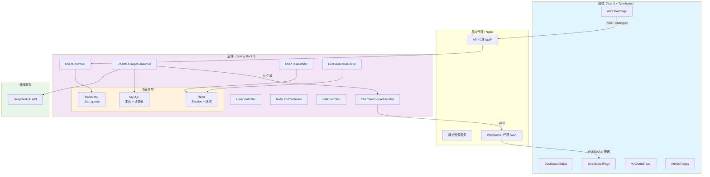
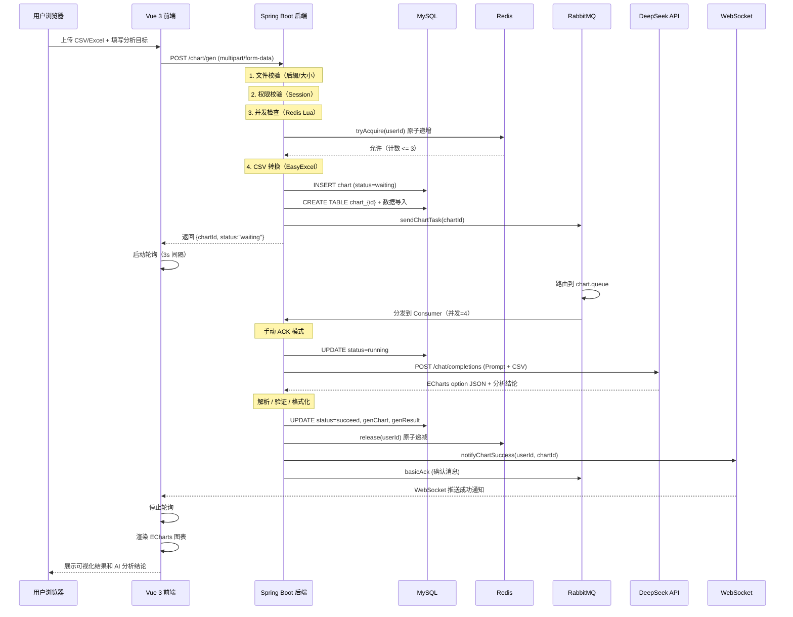

本文面向了解 Spring Boot 和 Vue 基础概念的开发者，旨在呈现本项目的整体架构设计——从全局拓扑到各层协作关系，帮助你在后续深入阅读各模块文档前建立起清晰的心智模型。

---

## 一、架构总览：三层拓扑与异步消息驱动的数据管道

本系统采用经典的**前后端分离 + 异步消息驱动**架构，整体分为三个核心层次：

| 层次 | 技术栈 | 核心职责 |
|------|--------|----------|
| **前端展示层** | Vue 3 + TypeScript + Element Plus + ECharts + Pinia | 用户交互、图表渲染、实时状态展示 |
| **后端服务层** | Spring Boot 3.3.0 + Java 17 + MyBatis-Plus + Spring Security | 业务逻辑、文件解析、AI 集成、权限校验 |
| **中间件层** | MySQL + Redis + RabbitMQ + WebSocket | 数据持久化、分布式限流/锁、异步消息、实时推送 |

三层之间的数据流动方向如下：前端发起图表生成请求 → 后端校验并写入数据库 → 消息进入 RabbitMQ 异步处理 → AI 生成结果后通过 WebSocket 实时推送至前端。这个"请求-异步-推送"的模式是理解整个系统架构的关键。

Sources: [pom.xml](lunesnow-IntelligentBI-backend/pom.xml#L1-L60), [application.yml](lunesnow-IntelligentBI-backend/src/main/resources/application.yml#L1-L92)



**图解说明**：上图展示了系统的三层拓扑。前端通过 HTTP 与后端通信，后端通过 RabbitMQ 解耦同步请求与异步 AI 处理，处理完成后通过 WebSocket 反向推送结果。Redis 承担 Session 存储、分布式限流和并发任务槽位管理三重职责。

Sources: [MainApplication.java](lunesnow-IntelligentBI-backend/src/main/java/com/lunesnow/MainApplication.java#L1-L25), [ChartController.java](lunesnow-IntelligentBI-backend/src/main/java/com/lunesnow/controller/ChartController.java#L49-L52)

---

## 二、前端架构：组件化路由 + 可组合式逻辑

### 2.1 项目结构

前端采用 Vue 3 的组合式 API（Composition API）风格，代码按功能模块组织：

```
frontend/src/
├── views/          # 页面级组件（路由对应）
├── components/     # 可复用组件（ChartEditor, StatusResultPage）
├── composables/    # 可组合逻辑（useWebSocket, usePolling, useDraggable）
├── stores/         # Pinia 状态管理（useLoginUserStore）
├── api/            # OpenAPI 自动生成的 API 层
├── router/         # 路由配置（含登录守卫）
└── layouts/        # 布局组件（BasicLayout + GlobalSider）
```

前端没有使用重量级的状态管理方案，而是选择 **Pinia** 管理登录用户信息这一个全局状态，其他组件状态通过 Vue 的 `ref`/`reactive` 在局部管理。

Sources: [package.json](lunesnow-IntelligentBI-frontend/package.json#L18-L27), [router/index.ts](lunesnow-IntelligentBI-frontend/src/router/index.ts#L1-L93)

### 2.2 路由架构与访问控制

路由表设计为两层嵌套结构：

| 路由层级 | 访问要求 | 页面 |
|----------|----------|------|
| `/`（BasicLayout） | 需登录 | HomePage, AddChart, MyCharts, ChartDetail, DashboardEditor |
| `/admin/*`（BasicLayout） | 需 admin 角色 | UserManage, UserCharts, RateLimit |
| `/user/*`（独立） | 无需登录 | Login, Register |
| `/403`、`/:pathMatch(.*)*` | 无需登录 | 错误页面 |

访问控制由 `access.ts` 中的路由守卫统一处理。守卫的逻辑流程是：首次加载时通过 `fetchLoginUser()` 从 Session 恢复登录状态；若尝试恢复后仍未登录，重定向至登录页并携带 `redirect` 参数；管理员页面额外校验 `userRole === 'admin'`。

Sources: [access.ts](lunesnow-IntelligentBI-frontend/src/access.ts#L5-L39), [router/index.ts](lunesnow-IntelligentBI-frontend/src/router/index.ts#L64-L85)

### 2.3 可组合逻辑层（Composables）

前端将跨组件复用的有状态逻辑封装为三个 composable：

**useWebSocket**：封装原生 WebSocket，支持指数退避重连（最多 5 次，初始延迟 1s，翻倍至上限 30s）、30 秒心跳保活、组件卸载时自动断开。收到的消息按 `type`（success/failure/info）自动触发 Element Plus 通知弹窗。

**usePolling**：封装轮询逻辑，支持指数退避（初始 3s，系数 1.5，上限 30s），利用 Page Visibility API 在页面不可见时暂停轮询、恢复时重置间隔并立即请求一次。

**useDraggable**：仪表盘拖拽功能，基于 CSS transform 实现 GPU 加速的拖拽渲染。

Sources: [useWebSocket.ts](lunesnow-IntelligentBI-frontend/src/composables/useWebSocket.ts#L1-L165), [usePolling.ts](lunesnow-IntelligentBI-frontend/src/composables/usePolling.ts#L1-L149)

### 2.4 API 层与请求封装

API 调用层通过 `@umijs/openapi` 从后端 Swagger/Knife4j 接口文档自动生成 TypeScript 类型定义和请求函数，位于 `src/api/` 目录。自定义的 Axios 实例封装在 `request.ts` 中，配置了 `withCredentials: true` 以携带 Session Cookie，并实现了全局的请求/响应拦截器——响应拦截器将 BaseResponse 解包，非 0 的 code 直接触发 Promise.reject。

Sources: [request.ts](lunesnow-IntelligentBI-frontend/src/request.ts#L11-L65), [chartController.ts](lunesnow-IntelligentBI-frontend/src/api/chartController.ts#L1-L200)

---

## 三、后端架构：分层清晰的 Spring Boot 3 应用

### 3.1 包结构全景

后端按职责划分为 16 个包，遵循分层架构原则：

```
backend/src/main/java/com/lunesnow/
├── annotation/      # 自定义注解（@AuthCheck, @RateLimit）
├── aop/             # 切面实现（权限校验、限流、日志）
├── config/          # 配置类（RabbitMQ, Redis, WebSocket, Security, Redisson, DeepSeek）
├── controller/      # 控制器层（Chart, User, File, RateLimit）
├── service/         # 服务层接口与实现（Chart, ChartData, User）
├── mapper/          # MyBatis-Plus Mapper
├── model/           # 数据模型（entity, dto, vo, enums）
├── mq/              # RabbitMQ 生产者和消费者
├── websocket/       # WebSocket 处理器
├── manager/         # 管理器（分布式限流、任务并发控制）
├── common/          # 通用工具（BaseResponse, ErrorCode, ResultUtils）
├── exception/       # 全局异常处理
├── utils/           # 工具类（ExcelUtils, SqlUtils）
├── constant/        # 常量定义
└── generate/        # 代码生成器
```

Sources: [MainApplication.java](lunesnow-IntelligentBI-backend/src/main/java/com/lunesnow/MainApplication.java#L14-L18)

### 3.2 配置体系与环境管理

Spring Boot 3 的配置采用**双文件 + 环境变量**的策略：

| 配置来源 | 作用 | 关键配置项 |
|----------|------|-----------|
| `application.yml` | 公共配置 | 数据库连接、Redis、RabbitMQ、Redisson、MyBatis-Plus、Knife4j |
| `application-local.yml` | 本地覆盖 | 开发环境特定配置（被 `spring.profiles.active` 激活） |
| 环境变量 | 敏感信息注入 | `DB_USERNAME`、`REDIS_HOST`、`RABBITMQ_HOST`、`DEEPSEEK_API_KEY` |

配置文件中采用了多处**降级默认值**设计——环境变量未设置时使用本地开发默认值（`${VAR:default}` 语法），确保本地开发无需额外配置即可运行。所有中间件连接信息统一通过环境变量注入，便于区分开发/测试/生产环境。

Sources: [application.yml](lunesnow-IntelligentBI-backend/src/main/resources/application.yml#L1-L92)

### 3.3 Security 配置策略

`SecurityConfig` 采用**最小化侵入**策略——禁用 CSRF、禁用表单登录和 HTTP Basic、允许所有请求通过，仅保留 `BCryptPasswordEncoder` 用于密码加密。系统的认证和授权完全由自定义 Session 机制和 AOP 切面管理，而非 Spring Security 的标准过滤器链。这种设计在简化架构的同时，将认证逻辑完全置于业务代码的可控范围内。

Sources: [SecurityConfig.java](lunesnow-IntelligentBI-backend/src/main/java/com/lunesnow/config/SecurityConfig.java#L1-L39)

---

## 四、中间件层：异步消息、实时推送与分布式控制

### 4.1 RabbitMQ：异步任务调度中枢

RabbitMQ 是系统异步能力的核心。配置了**一个主交换机 + 一个死信交换机**的双交换机架构：

| 组件 | 名称 | 类型 | 说明 |
|------|------|------|------|
| 主交换机 | `chart.exchange` | Direct | 持久化，接收图表生成任务 |
| 主队列 | `chart.queue` | — | 绑定死信交换机，TTL=60s |
| 死信交换机 | `chart.dead-letter.exchange` | Direct | 持久化，处理失败消息 |
| 死信队列 | `chart.dead-letter.queue` | — | TTL=24h，到期自动删除 |

消息的流转路径是：`Controller 生产消息 → chart.exchange → chart.queue → Consumer 消费`。当消费失败（抛出异常）时，Consumer 执行 `channel.basicNack(deliveryTag, false, false)`，消息不重新入队，而是流入死信交换机 → 死信队列。Consumer 并发度为 4（`concurrency = "4"`），消息体使用 JSON 序列化替代默认的 JDK 序列化。

Sources: [RabbitConfig.java](lunesnow-IntelligentBI-backend/src/main/java/com/lunesnow/config/RabbitConfig.java#L20-L127), [ChartMessageConsumer.java](lunesnow-IntelligentBI-backend/src/main/java/com/lunesnow/mq/ChartMessageConsumer.java#L51-L189)

### 4.2 WebSocket：实时结果推送

WebSocket 端点注册在 `/ws/chart`，采用 Spring WebSocket 原生 API。会话管理使用**双 ConcurrentHashMap** 结构：

```
USER_SESSIONS:  用户 ID  → WebSocket Session（正向索引）
SESSION_USER_MAP: Session ID → 用户 ID（反向索引，用于清理时定位）
```

连接建立时从 URL 查询参数中提取 `userId`，无效 userId 直接拒绝连接。连接关闭时通过反向索引清理所有映射。Consumer 在处理完 AI 生成任务后，调用 `chartWebSocketHandler.notifyChartSuccess/failure()` 向用户推送 JSON 格式的通知消息。客户端的心跳检测通过 ping/pong 文本消息实现。

Sources: [ChartWebSocketHandler.java](lunesnow-IntelligentBI-backend/src/main/java/com/lunesnow/websocket/ChartWebSocketHandler.java#L20-L100), [WebSocketConfig.java](lunesnow-IntelligentBI-backend/src/main/java/com/lunesnow/config/WebSocketConfig.java#L15-L32)

### 4.3 Redis 的双重角色

Redis 在本系统中承担两个独立但同样关键的职责：

**Session 存储**——通过 `spring.session.store-type: redis` 将用户登录 Session 存储在 Redis 中，支持多实例部署时的 Session 共享。Session 超时时间设置为 30 天（2592000 秒）。

**分布式控制**——通过两个 Manager 组件实现：
- `ChartTaskLimiter`：使用 Redis Lua 原子脚本实现每用户最大 3 个并发任务的控制。ACQUIRE 脚本检查当前计数 < MAX，原子性 INCR；RELEASE 脚本安全递减，计数归零时 DEL key。Redis 异常时降级放行。
- `RedissonRateLimiter`：基于 Redisson 的 RRateLimiter 实现令牌桶分布式限流。支持按 IP 或按用户维度限流，提供 `getStatus`、`reset`、`listAll` 等管理接口。

Sources: [ChartTaskLimiter.java](lunesnow-IntelligentBI-backend/src/main/java/com/lunesnow/manager/ChartTaskLimiter.java#L19-L159), [RedissonRateLimiter.java](lunesnow-IntelligentBI-backend/src/main/java/com/lunesnow/manager/RedissonRateLimiter.java#L24-L183)

### 4.4 AOP 切面层：声明式横切关注点

系统通过三个自定义注解和对应的 AOP 切面，将安全横切逻辑与业务逻辑解耦：

| 注解 | 切面 | 拦截目标 | 处理逻辑 |
|------|------|----------|----------|
| `@AuthCheck` | AuthInterceptor | 管理后台接口 | 从 Session 获取用户角色，校验管理员权限 |
| `@RateLimit` | RateLimitAspect | `POST /chart/gen` | 构建限流 key（IP/用户），调用 Redisson 令牌桶 |
| — | LogInterceptor | 所有 Controller | 记录请求路径、参数、耗时 |

`@RateLimit` 注解支持三种限流维度：`IP`（按客户端 IP）、`USER`（按登录用户 ID）、默认（按方法全限定名）。限流 key 的格式为 `rate_limit:{type}:{identifier}`，通过 AOP 的 `@Before` 注解在方法执行前拦截。

Sources: [AuthInterceptor.java](lunesnow-IntelligentBI-backend/src/main/java/com/lunesnow/aop/AuthInterceptor.java#L23-L68), [RateLimitAspect.java](lunesnow-IntelligentBI-backend/src/main/java/com/lunesnow/aop/RateLimitAspect.java#L28-L161)

---

## 五、数据持久化：主表 + 动态分表策略

### 5.1 主表（Chart）

`chart` 表是系统的核心实体表，记录图表的元数据、状态和 AI 生成结果。关键字段设计：

| 字段 | 类型 | 说明 |
|------|------|------|
| `chartData` | varchar(2048) | 上传文件的 CSV 原始数据（<=2KB 阈值） |
| `genChart` | text | AI 生成的 ECharts option JSON 配置 |
| `genResult` | text | AI 生成的数据分析结论 |
| `status` | varchar(128) | 任务状态：waiting → running → succeed/failed |
| `waitTime` | int | 等待时间（从创建到开始执行，毫秒） |
| `runningTime` | int | AI 执行时长（毫秒） |

状态机设计为四态流转：`waiting`（初始状态）→ `running`（Consumer 开始处理）→ `succeed`（AI 生成成功）或 `failed`（执行异常）。`waitTime` 和 `runningTime` 字段用于后续性能监控。

Sources: [create_chart_table.sql](lunesnow-IntelligentBI-backend/sql/create_chart_table.sql#L8-L26)

### 5.2 动态数据表（chart_{id}）

每个图表对应一张独立的数据库表，表名格式为 `chart_{chartId}`。`ChartDataService` 负责在图表创建时将 CSV 数据动态建表，列名直接取自 CSV 第一行（即 Excel 表头），每行数据作为一条记录插入。图表删除时自动 DROP 对应的动态表。这种设计实现了不同图表之间的**数据完全隔离**——每个图表的数据结构可以完全不同（取决于上传文件），互不干扰。

Sources: [ChartDataServiceImpl.java](lunesnow-IntelligentBI-backend/src/main/java/com/lunesnow/service/impl/ChartDataServiceImpl.java#L26-L72), [ChartDataService.java](lunesnow-IntelligentBI-backend/src/main/java/com/lunesnow/service/ChartDataService.java#L12-L55)

---

## 六、数据流水线：从上传到渲染的完整链路

理解系统的关键在于掌握数据在前后端和中间件之间的流转顺序。下面是一次典型的图表生成请求的生命周期：



**关键设计点**：
- 前端在收到 WebSocket 推送前依赖**轮询作为备份机制**，确保即使 WebSocket 异常也不会丢失状态更新
- 数据库状态更新与消息确认的顺序是：**先更新 DB → 再 ACK 消息**，确保消息确认前状态已持久化
- Redis 任务计数的 release 操作在 Consumer 中执行，确保无论成功或失败都会被释放

Sources: [ChartController.java](lunesnow-IntelligentBI-backend/src/main/java/com/lunesnow/controller/ChartController.java#L308-L390), [ChartMessageConsumer.java](lunesnow-IntelligentBI-backend/src/main/java/com/lunesnow/mq/ChartMessageConsumer.java#L51-L189)

---

## 七、技术选型决策与设计哲学

本系统的技术选型体现了几个核心设计原则：

**同步请求与异步处理的解耦**——用户上传文件后立即获得响应（包含 chartId），避免长时间的 HTTP 连接占用。AI 生成过程在 RabbitMQ Consumer 中异步完成，错误重试由死信队列自动管理，不需要用户等待或重试。

**多层限流形成安全纵深**——接口层使用 Redisson 令牌桶（防刷），并发任务层使用 Redis Lua 脚本（防资源耗尽），两者互补。限流异常时均采用**降级放行**策略，优先保证可用性。

**实时推送与轮询的双通道保障**——WebSocket 提供低延迟的实时用户体验，轮询作为 WebSocket 异常时的保底方案。轮询采用指数退避和 Page Visibility API 优化，减少无效请求约 60%。

**数据隔离与安全**——每个图表独立建表（chart_{id}），通过列名白名单校验防止 SQL 注入，通过 Session + Redis 实现无状态鉴权，通过 BCrypt 加密密码。

Sources: [ChartTaskLimiter.java](lunesnow-IntelligentBI-backend/src/main/java/com/lunesnow/manager/ChartTaskLimiter.java#L32-L56), [RedissonRateLimiter.java](lunesnow-IntelligentBI-backend/src/main/java/com/lunesnow/manager/RedissonRateLimiter.java#L44-L70)

---

## 八、架构图补充说明

本文中的架构图采用了分层展示方式，该图的核心阅读视角是**从用户请求出发，沿数据流动方向逐层追踪**：

1. **最上层（Client）** 代表用户浏览器中运行的 Vue 3 SPA 应用，包含所有视图页面
2. **中间层（Gateway + Backend + Middleware）** 代表后端服务集群，其中 Backend 框内展示了 Controller → RabbitMQ → Consumer → WebSocket 的关键路径
3. **最下层（External）** 代表外部 AI 服务，是本系统智能能力的来源

图表中的箭头方向代表数据流动方向，虚线代表的 WebSocket 连接是反向推送通道，HTTP 请求是正向通道，这种双向通信模式是系统实现实时体验的技术基础。

---

## 下一步阅读建议

理解全景架构后，建议按以下路径深入探索各模块：

- **数据流水线追踪**：[完整数据流水线：从上传 CSV/Excel 到 ECharts 图表的全链路追踪](6-wan-zheng-shu-ju-liu-shui-xian-cong-shang-chuan-csv-excel-dao-echarts-tu-biao-de-quan-lian-lu-zhui-zong)
- **后端核心链路**：从 [图表生成控制器](7-tu-biao-sheng-cheng-kong-zhi-qi-wen-jian-xiao-yan-dong-tai-jian-biao-ren-wu-xian-liu-yu-yi-bu-ti-jiao) 开始，依次阅读 [RabbitMQ 消息队列](8-rabbitmq-xiao-xi-dui-lie-ke-kao-tou-di-shou-dong-ack-yu-si-xin-dui-lie-zhong-shi-ji-zhi)、[DeepSeek AI 集成](9-deepseek-ai-ji-cheng-prompt-gong-cheng-yu-echarts-pei-zhi-zhi-neng-sheng-cheng)、[WebSocket 实时推送](10-websocket-shi-shi-tui-song-concurrenthashmap-hui-hua-guan-li-xin-tiao-jian-ce-yu-zai-xian-zhuang-tai)
- **限流与并发控制**：[Redis Lua 原子脚本](14-redis-lua-yuan-zi-jiao-ben-wu-jing-tai-tiao-jian-de-bing-fa-ren-wu-cao-wei-guan-li)、[Redisson 令牌桶限流器](15-redisson-ling-pai-tong-xian-liu-qi-fen-bu-shi-huan-jing-xia-jie-kou-fang-shua)、[AOP 切面编程](16-aop-qie-mian-bian-cheng-atauthcheck-quan-xian-xiao-yan-yu-atratelimit-xian-liu-lan-jie)
- **前端核心**：[前端项目架构](17-qian-duan-xiang-mu-jia-gou-vue-3-typescript-element-plus-echarts)、[图表创建页面](18-tu-biao-chuang-jian-ye-mian-biao-dan-xiao-yan-tuo-zhuai-shang-chuan-yu-yi-bu-ren-wu-zhuang-tai-gen-zong)、[WebSocket 客户端封装](19-websocket-ke-hu-duan-feng-zhuang-zhi-shu-tui-bi-zhong-lian-xin-tiao-bao-huo-yu-zu-jian-xie-zai-qing-li)