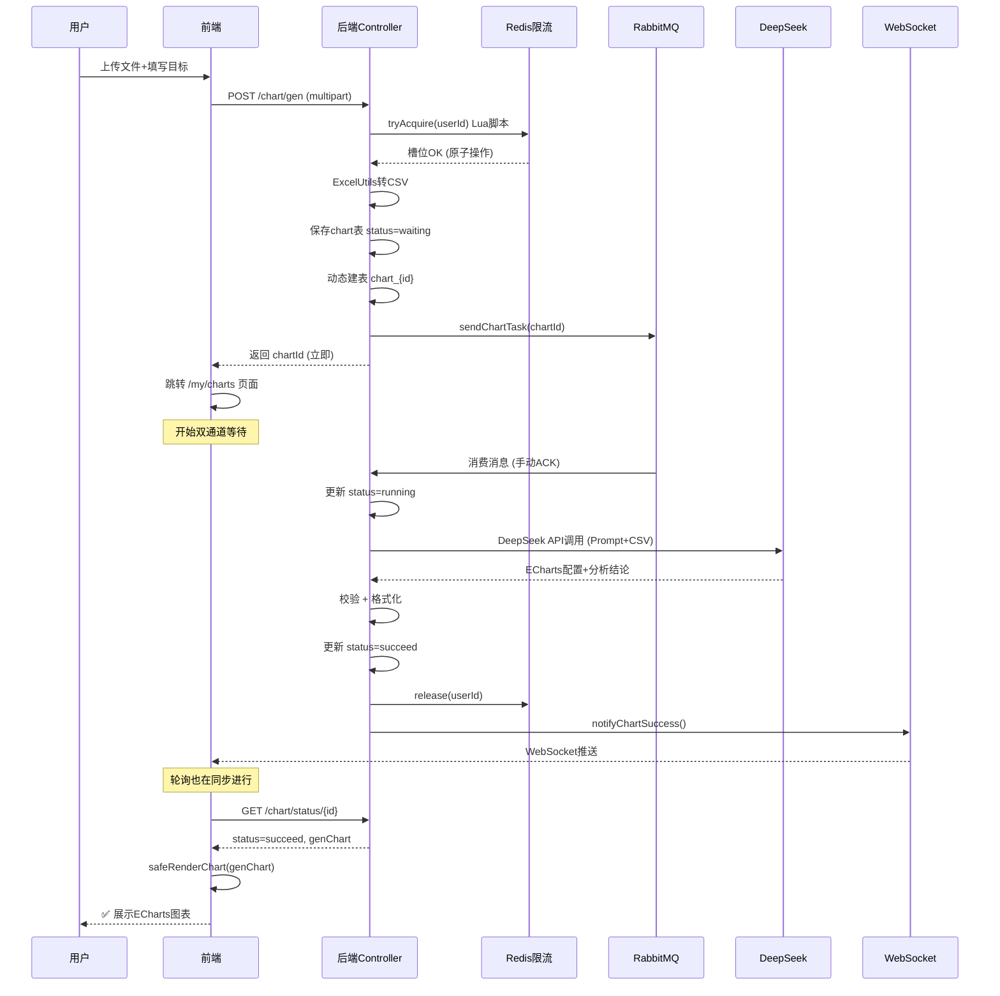

本文跟踪一次典型的"上传数据 → AI 生成图表"操作，逐层揭示数据在前后端、消息队列、AI 模型和 WebSocket 之间的完整流动路径。理解这条链路，是掌握本系统架构精髓的关键一步。

## 数据流水线总览

下图展示了一次完整的图表生成请求所经过的全部节点，每条连线代表一个明确的数据传输步骤：

```mermaid
flowchart TB
    User(["👤 用户"]) -->|"1. 上传文件 + 填写目标"| FE["前端：AddChartPage.vue"]

    FE -->|"2. POST /chart/gen (multipart)"| CTRL["ChartController<br/>#getChartByAI()"]

    CTRL -->|"3. 校验文件 (大小/后缀/MIME)"| VALID{"校验通过？"}
    VALID -->|否| ERR["返回错误信息"]
    VALID -->|是| LIMIT

    subgraph LIMIT["限流层"]
        CTRL -->|"4. Redis Lua 原子脚本"| RLIMIT["ChartTaskLimiter<br/>tryAcquire(userId)"]
        RLIMIT -->|"槽位不足"| LERR["抛出异常"]
        RLIMIT -->|"槽位充足"| PARSE
    end

    subgraph PARSE["文件解析层"]
        PARSE2["ExcelUtils<br/>excelToCsv()"] -->|"EasyExcel 解析 xlsx<br/>或直接读取 csv"| CSV["CSV 字符串"]
    end

    CSV -->|"5. 保存原始 CSV"| DB1[(MySQL: chart 表<br/>status=waiting)]
    CSV -->|"6. 动态建表"| DATA["ChartDataService<br/>createTableFromCsv()"]
    DATA -->|"创建 chart_{id} 表"| DB2[(MySQL: chart_{id} 动态表)]

    CTRL -->|"7. 发送 MQ 消息"| PROD["ChartMessageProducer<br/>sendChartTask(chartId)"]
    PROD -->|"8. RabbitMQ 交换器"| EXCHANGE["chart.exchange"]
    EXCHANGE -->|"路由键 chart.generate"| QUEUE["chart.queue"]

    QUEUE -->|"9. 消费者 (4并发)"| CONS["ChartMessageConsumer<br/>handleChartTask()"]
    CONS -->|"10. 更新 status=running"| DB3[(MySQL: chart 表)]
    CONS -->|"11. 构造 Prompt"| PROMPT["分析目标 + CSV 数据"]
    PROMPT -->|"12. 调用 DeepSeek API"| AI["DeepSeek AI<br/>deepseek-v4-flash"]
    AI -->|"13. 返回 ECharts 配置"| RESP["解析 AI 响应<br/>提取 genChart + genResult"]

    RESP -->|"14. 更新 status=succeed"| DB4[(MySQL: chart 表)]
    RESP -->|"15. 释放 Redis 槽位"| REL["ChartTaskLimiter<br/>release(userId)"]
    RESP -->|"16. WebSocket 推送"| WS["ChartWebSocketHandler<br/>notifyChartSuccess()"]
    WS -->|"17. 通知前端"| FEWS["前端 WebSocket 客户端<br/>使用 useWebSocket Hook"]

    DB4 -->|"18. 轮询 GET /chart/status/{id}"| POLL["usePolling Hook<br/>指数退避 + Page Visibility"]
    POLL -->|"19. 取回 genChart"| RENDER["安全渲染 ECharts<br/>chartValidator.ts"]

    RENDER -->|"20. 展示用户"| DONE["✅ ECharts 图表展示"]

    style DONE fill:#90EE90,stroke:#333
    style ERR fill:#FFB6C1,stroke:#333
    style LERR fill:#FFB6C1,stroke:#333
```

这条流水线由 **5 个核心阶段**构成，下面逐阶段展开。

## 阶段一：前端提交 — 文件校验与表单验证

入口是 `AddChartPage.vue`，用户在表单中填写图表名称、类型和分析目标，并通过拖拽或点击选择文件。

**前端校验三道防线**（位于 `handleFileChange` 方法）：
1. **后缀名校验**：仅允许 `xlsx`、`xls`、`csv` 三种格式
2. **MIME type 校验**：即使攻击者修改文件后缀，MIME 类型不匹配也会被拦截
3. **文件大小校验**：上限 2MB，且拒绝空文件

校验通过后，`handleSubmit` 方法将文件连同表单参数封装为 `FormData`，通过 `POST /chart/gen` 提交到后端。

```typescript
// AddChartPage.vue 中的关键提交逻辑
const formDataFile = new FormData()
formDataFile.append('file', selectedFile.value)
formDataFile.append('name', form.name)
formDataFile.append('chartType', form.chartType)
formDataFile.append('goal', form.goal)

const res = await myAxios('/chart/gen', {
  method: 'POST',
  data: formDataFile,
})
```

提交成功后，页面立即跳转到 `/my/charts`，进入异步等待阶段。

Sources: [AddChartPage.vue](lunesnow-IntelligentBI-frontend/src/views/AddChartPage.vue#L100-L200)

## 阶段二：后端入口 — 三重校验与异步提交

`ChartController.getChartByAI()` 是后端入口，它在接受请求后依次执行三个关键步骤，全部通过后才进入异步流程：

### 2.1 参数与权限校验

后端重复验证文件后缀、大小、是否为空，确保安全。同时获取当前登录用户信息，绑定图表归属。

```java
// 文件后缀白名单校验
final List<String> allowedSuffixes = Arrays.asList("xlsx", "xls", "csv");
ThrowUtils.throwIf(!allowedSuffixes.contains(fileSuffix), ...);
```

Sources: [ChartController.java](lunesnow-IntelligentBI-backend/src/main/java/com/lunesnow/controller/ChartController.java#L236-L260)

### 2.2 并发任务限流（Redis Lua 原子脚本）

在保存任何数据之前，系统使用 **Redis Lua 脚本** 原子性地检查该用户当前运行中的任务数。每用户最多同时处理 **3 个**任务。

```lua
-- ChartTaskLimiter 使用的 Lua 脚本（简化）
local current = tonumber(redis.call('GET', KEYS[1]) or '0')
if current < tonumber(ARGV[1]) then
  local newVal = redis.call('INCR', KEYS[1])
  redis.call('EXPIRE', KEYS[1], tonumber(ARGV[2]))
  return newVal
else
  return 0
end
```

使用 Lua 脚本而非 `get + check + incr` 三个独立操作，保证了在高并发下不会出现竞态条件。如果 Redis 宕机，限流器自动降级放行（熔断保护）。

Sources: [ChartTaskLimiter.java](lunesnow-IntelligentBI-backend/src/main/java/com/lunesnow/manager/ChartTaskLimiter.java#L30-L60)

### 2.3 文件解析与数据持久化

通过限流后，后端按顺序完成以下操作：

| 步骤 | 操作 | 方法 | 产出 |
|------|------|------|------|
| ① | 文件转 CSV | `ExcelUtils.excelToCsv()` | CSV 字符串 |
| ② | 保存图表记录 | `chartService.save(chart)` | 数据库 `chart` 表，`status=waiting` |
| ③ | 动态建表 | `chartDataService.createTableFromCsv()` | 数据库 `chart_{id}` 动态表 |
| ④ | 发送 MQ 消息 | `chartMessageProducer.sendChartTask()` | RabbitMQ 消息 |

**步骤①详解**：`ExcelUtils.excelToCsv()` 根据文件后缀走不同分支：
- CSV 文件：直接读取字节流，转为 UTF-8 字符串
- Excel 文件：使用 **EasyExcel** 库以流式方式读取，转换为 CSV 格式（第一行为列名，后续为数据行）

**步骤③详解**：`ChartDataServiceImpl.createTableFromCsv()` 会解析 CSV 的第一行作为列名，根据列数动态 `CREATE TABLE chart_{id}`，然后将每一行数据 `INSERT` 进去。表名固定为 `chart_{chartId}`，实现数据按图表隔离。如果解析过程中发现列名冲突或列数过多，自动清理已创建的表并抛出异常。

Sources: [ChartController.java](lunesnow-IntelligentBI-backend/src/main/java/com/lunesnow/controller/ChartController.java#L262-L293); [ExcelUtils.java](lunesnow-IntelligentBI-backend/src/main/java/com/lunesnow/utils/ExcelUtils.java#L27-L81); [ChartDataServiceImpl.java](lunesnow-IntelligentBI-backend/src/main/java/com/lunesnow/service/impl/ChartDataServiceImpl.java#L1-L80)

### 2.4 立即返回 chartId（异步模式的核心）

与同步处理不同，控制器在发送 MQ 消息后立即返回 `BiResponse`（仅包含 `chartId`），让前端可以跳到"等待"页面，无需长时间阻塞 HTTP 连接。

```java
// 立即返回 chartId
BiResponse biResponse = new BiResponse();
biResponse.setChartId(chartId);
return ResultUtils.success(biResponse);
```

如果 MQ 消息发送失败（如 RabbitMQ 宕机），系统会捕获异常并将图表状态标记为 `failed`，而不是让任务无声消失。

Sources: [ChartController.java](lunesnow-IntelligentBI-backend/src/main/java/com/lunesnow/controller/ChartController.java#L295-L310)

## 阶段三：消息队列 — RabbitMQ 可靠投递与异步消费

### 3.1 消息结构

`ChartMessageProducer` 将 `ChartTaskMessage` 发送到 `chart.exchange` 交换机，通过路由键 `chart.generate` 进入 `chart.queue` 队列。消息体中包含：

```java
public class ChartTaskMessage implements Serializable {
    private Long chartId;      // 图表 ID
    private String messageId;  // UUID，用于去重
    private int retryCount;    // 重试次数，初始为 0
}
```

Sources: [ChartTaskMessage.java](lunesnow-IntelligentBI-backend/src/main/java/com/lunesnow/model/dto/chart/ChartTaskMessage.java#L1-L33); [ChartMessageProducer.java](lunesnow-IntelligentBI-backend/src/main/java/com/lunesnow/mq/ChartMessageProducer.java#L1-L48)

### 3.2 死信队列架构

`RabbitConfig` 配置了一个完整的主-死信队列体系：

| 组件 | 名称 | 作用 |
|------|------|------|
| 主交换机 | `chart.exchange` | 接收生产者发送的消息 |
| 主队列 | `chart.queue` | 待消费的图表生成任务 |
| 死信交换机 | `chart.dead-letter.exchange` | 接收消费失败的消息 |
| 死信队列 | `chart.dead-letter.queue` | 存储反复失败的任务（24h TTL） |

主队列通过参数 `x-dead-letter-exchange` 绑定死信交换机。当消费者 `basicNack`（且 `requeue=false`）时，消息自动转入死信队列。

Sources: [RabbitConfig.java](lunesnow-IntelligentBI-backend/src/main/java/com/lunesnow/config/RabbitConfig.java#L1-L128)

### 3.3 消费者处理流程

`ChartMessageConsumer` 以 **4 个并发线程**消费 `chart.queue`，采用**手动 ACK** 模式：

```
收到消息
  │
  ├─ 重试次数 ≥ 3？→ 标记 failed，释放槽位，basicAck（不入死信）
  │
  ├─ 更新 status = running，记录等待时间
  │
  ├─ 构造 Prompt（分析目标 + CSV 数据）
  │
  ├─ 调用 DeepSeek API
  │     │
  │     ├─ 成功 → 解析 AI 响应 → 校验结果 → 更新 succeed
  │     │             → 释放 Redis 槽位
  │     │             → WebSocket 推送成功通知
  │     │             → basicAck
  │     │
  │     └─ 失败 → 更新 failed
  │                 → 释放 Redis 槽位
  │                 → WebSocket 推送失败通知
  │                 → basicNack（requeue=false → 进入死信队列）
  │
  └─ 超时（>5分钟）→ 抛出异常 → 同上失败处理
```

**关键设计**：
- 最大重试 3 次，超过后不再重新入队
- 死信消费者 `handleDeadLetter()` 会检查图表当前状态：若已成功或已删除则忽略；若仍为 `failed` 则触发告警
- 任务槽位无论成功失败都会释放，避免用户被"永久锁定"

Sources: [ChartMessageConsumer.java](lunesnow-IntelligentBI-backend/src/main/java/com/lunesnow/mq/ChartMessageConsumer.java#L1-L265)

## 阶段四：AI 集成 — Prompt 工程与结果解析

### 4.1 Prompt 构造

系统构造一个结构化的 Prompt，包含**系统提示**和**用户输入**两部分：

**系统提示** 定义 AI 的角色和输出格式约束：
```
你是一个数据分析师和前端开发专家...
请根据这两部分内容，按照以下指定格式生成内容...
【【【【【
{前端 Echarts V5 的 option 配置对象js代码...}
【【【【【
{明确的数据分析结论、越详细越好...}
```

**用户输入** 包含分析目标和 CSV 原始数据：
```
分析需求：
分析各季度销售额变化趋势，请使用折线图
原始数据：
季度,销售额,利润
Q1,100000,20000
Q2,120000,25000
...
```

Sources: [ChartMessageConsumer.java](lunesnow-IntelligentBI-backend/src/main/java/com/lunesnow/mq/ChartMessageConsumer.java#L100-L130)

### 4.2 AI 调用与响应解析

`DeepSeekUtils.generateContent()` 通过 RestTemplate 调用 DeepSeek API（模型 `deepseek-v4-flash`），使用 Bearer Token 认证。收到响应后：

1. 从 `choices[0].message.content` 提取文本
2. 按 `【【【【【` 分隔符拆分，第一部分为 ECharts 配置，第二部分为分析结论
3. 清理配置文本：移除 ` ```javascript ` 等 Markdown 标记，去除 `let option =` 前缀和末尾分号
4. 调用 `validateAiResult()` 进行有效性检查（非空、包含必要字段、结论长度 ≥ 10）

Sources: [DeepSeekUtils.java](lunesnow-IntelligentBI-backend/src/main/java/com/lunesnow/config/DeepSeekUtils.java#L1-L67); [ChartMessageConsumer.java](lunesnow-IntelligentBI-backend/src/main/java/com/lunesnow/mq/ChartMessageConsumer.java#L135-L160)

## 阶段五：实时通知与前端渲染

### 5.1 双通道通知机制

后端处理完成后，前端通过 **两条路径** 获知状态变化：

| 通道 | 触发时机 | 优点 | 缺点 |
|------|----------|------|------|
| **WebSocket 推送** | Consumer 完成时立即推送 | 实时性强，毫秒级 | 连接可能断开 |
| **HTTP 轮询** | MyChartsPage 定时调用 `GET /chart/status/{id}` | 可靠，无连接依赖 | 有延迟（3s 初始间隔） |

**WebSocket 通道**：`ChartWebSocketHandler` 维护一个 `ConcurrentHashMap<Long, WebSocketSession>` 映射用户 ID 到会话。Consumer 完成后调用 `notifyChartSuccess()` 或 `notifyChartFailure()` 方法推送 JSON 消息。前端 `useWebSocket` Hook 在收到消息后显示 ElMessage 通知，并自动更新视图。

**轮询通道**：`usePolling` Hook 使用**指数退避**策略（初始 3 秒，最大 30 秒，退避系数 1.5），结合 **Page Visibility API** 在页面不可见时暂停轮询，可见时恢复，降低无效网络请求。

```typescript
// 指数退避核心逻辑
currentInterval.value = Math.min(currentInterval.value * backoff, maxInterval)
// backoff=1.5, maxInterval=30000
// 失败序列: 3s → 4.5s → 6.75s → 10.125s → 15.187s → 22.78s → 30s (稳定)
```

Sources: [ChartWebSocketHandler.java](lunesnow-IntelligentBI-backend/src/main/java/com/lunesnow/websocket/ChartWebSocketHandler.java#L1-L162); [usePolling.ts](lunesnow-IntelligentBI-frontend/src/composables/usePolling.ts#L1-L149); [useWebSocket.ts](lunesnow-IntelligentBI-frontend/src/composables/useWebSocket.ts#L1-L165)

### 5.2 ECharts 安全渲染

前端取回 `genChart` 字符串后，通过 `safeRenderChart()` 经过三层安全防线：

```
genChart 原始字符串
  │
  ├─ 第一层：JSON.parse() 尝试标准解析
  │
  ├─ 第二层：移除 "let option =" 前缀后 JSON.parse()
  │
  ├─ 第三层：new Function("return " + 字符串)()
  │
  ├─ 危险字段过滤：移除 __proto__、constructor、eval 等
  │
  ├─ 配置校验：检查 series、type 等必要字段
  │
  └─ 执行渲染：echarts.init() + setOption(option)
```

这种**三级容错解析**策略覆盖了 AI 可能输出的各种格式变体，同时 `filterDangerousFields()` 函数递归移除了可能引发原型链污染的字段，确保即使 AI 输出了恶意代码也无法执行。

Sources: [chartValidator.ts](lunesnow-IntelligentBI-frontend/src/utils/chartValidator.ts#L1-L167)

### 5.3 懒加载渲染优化

`MyChartsPage.vue` 中的图表渲染使用了 **IntersectionObserver** 实现懒加载：

```typescript
chartObserver.value = new IntersectionObserver(
  (entries) => {
    entries.forEach((entry) => {
      if (entry.isIntersecting) {
        const chartId = entry.target.id.replace('chart-', '')
        const chart = tableData.value.find((c) => String(c.id) === chartId)
        if (chart) renderChart(chart)
        chartObserver.value?.unobserve(entry.target)
      }
    })
  },
  { rootMargin: '200px' },
)
```

只有进入视口（含 200px 预加载区域）的图表才会初始化 ECharts 实例，大幅减少首屏渲染压力和内存占用。当图表重新查询到 `succeed` 状态时，通过 `nextTick()` 确保 DOM 更新后再执行渲染。

Sources: [MyChartsPage.vue](lunesnow-IntelligentBI-frontend/src/views/MyChartsPage.vue#L150-L280)

## 完整生命周期时序总结



## 异常场景说明

| 异常场景 | 检测层 | 处理方式 |
|----------|--------|----------|
| 文件格式错误 | 前端后缀+MIME + 后端双重校验 | 返回明确错误提示 |
| 文件过大 (>2MB) | 前端 + 后端 | 拒绝请求 |
| 并发任务超限 | Redis Lua 脚本 | 返回"请稍后再试" |
| MQ 发送失败 | 生产者 try-catch | 更新 status=failed |
| AI 调用超时 | 消费者 5 分钟超时检测 | 标记 failed，进入死信队列 |
| AI 返回无效结果 | `validateAiResult()` | 抛出异常，同上处理 |
| 死信队列积累 | `handleDeadLetter()` | 检查状态，触发告警 |
| WebSocket 断连 | 前端指数退避重连 | 自动恢复，最多 5 次 |
| 轮询失败 | `usePolling` catch 分支 | 退避间隔后自动重试 |

Sources: [ChartController.java](lunesnow-IntelligentBI-backend/src/main/java/com/lunesnow/controller/ChartController.java#L236-L310); [ChartTaskLimiter.java](lunesnow-IntelligentBI-backend/src/main/java/com/lunesnow/manager/ChartTaskLimiter.java#L30-L80); [ChartMessageConsumer.java](lunesnow-IntelligentBI-backend/src/main/java/com/lunesnow/mq/ChartMessageConsumer.java#L50-L200)

## 下一步阅读

这条流水线涉及的技术深度广泛，建议按以下路径深入阅读：

- **[图表生成控制器：文件校验、动态建表、任务限流与异步提交](7-tu-biao-sheng-cheng-kong-zhi-qi-wen-jian-xiao-yan-dong-tai-jian-biao-ren-wu-xian-liu-yu-yi-bu-ti-jiao)** — 深入了解 Controller 层的参数校验、限流和异步提交逻辑
- **[RabbitMQ 消息队列：可靠投递、手动 ACK 与死信队列重试机制](8-rabbitmq-xiao-xi-dui-lie-ke-kao-tou-di-shou-dong-ack-yu-si-xin-dui-lie-zhong-shi-ji-zhi)** — 详细了解消息队列的高可用设计
- **[DeepSeek AI 集成：Prompt 工程与 ECharts 配置智能生成](9-deepseek-ai-ji-cheng-prompt-gong-cheng-yu-echarts-pei-zhi-zhi-neng-sheng-cheng)** — 深入 AI Prompt 设计与响应解析
- **[WebSocket 实时推送：ConcurrentHashMap 会话管理、心跳检测与在线状态](10-websocket-shi-shi-tui-song-concurrenthashmap-hui-hua-guan-li-xin-tiao-jian-ce-yu-zai-xian-zhuang-tai)** — 深入了解实时推送机制
- **[轮询策略优化：指数退避算法与 Page Visibility API 暂停/恢复](22-lun-xun-ce-lue-you-hua-zhi-shu-tui-bi-suan-fa-yu-page-visibility-api-zan-ting-hui-fu)** — 详细了解前端轮询优化设计
- **[Redis Lua 原子脚本：无竞态条件的并发任务槽位管理](14-redis-lua-yuan-zi-jiao-ben-wu-jing-tai-tiao-jian-de-bing-fa-ren-wu-cao-wei-guan-li)** — 深入 Lua 脚本的并发控制原理
- **[动态数据分表策略：按图表 ID 自动建表与数据隔离](11-dong-tai-shu-ju-fen-biao-ce-lue-an-tu-biao-id-zi-dong-jian-biao-yu-shu-ju-ge-chi)** — 深入了解动态建表与数据隔离设计
- **[Excel/CSV 文件解析：EasyExcel 读取与 CSV 格式转换](12-excel-csv-wen-jian-jie-xi-easyexcel-du-qu-yu-csv-ge-shi-zhuan-huan)** — 详细了解文件解析实现细节