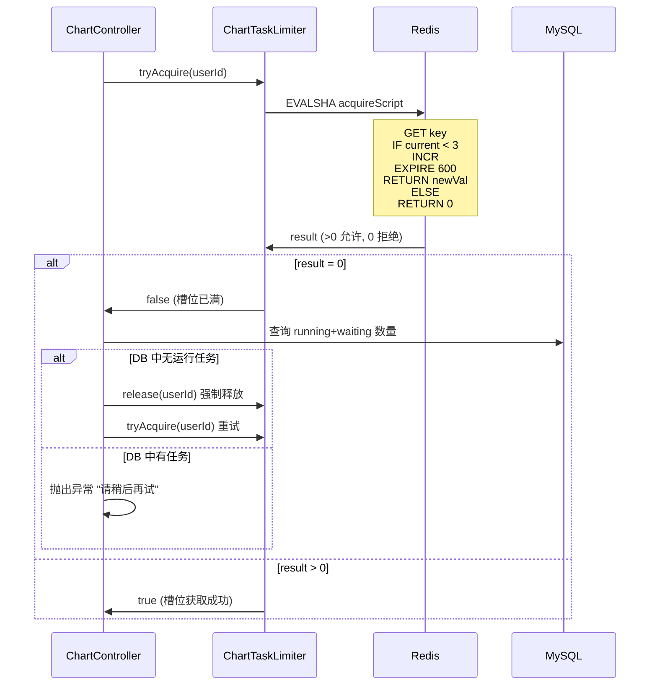

`ChartController` 是智能 BI 系统的核心入口，它承接了用户从上传数据文件到触发 AI 图表生成的完整链路。该控制器围绕 `POST /chart/gen` 端点（以及辅助的 `POST /chart/retry/{id}`、`GET /chart/status/{id}`）构建了四层防护与处理逻辑：文件校验保障输入合法性、动态建表实现数据隔离、双层限流防止资源滥用、异步消息提交将耗时任务解耦到 RabbitMQ。理解这四层架构是如何串联的，是掌握整个后端系统的关键。

## 四层安全架构总览

在深入代码之前，先整体审视 `POST /chart/gen` 端点的处理流水线，它由前置校验、数据持久化、任务限流和异步投递四个阶段组成。

```mermaid
flowchart TB
    subgraph Client[客户端]
        A[上传文件 + 参数]
    end

    subgraph Layer1[第一层：文件校验]
        B[参数非空校验]
        C[文件大小 ≤ 2MB]
        D[后缀白名单 xlsx/xls/csv]
    end

    subgraph Layer2[第二层：任务槽位限流]
        E[ChartTaskLimiter<br/>Redis Lua 原子脚本]
        F[每用户最多 3 个并发任务]
        G{一致性校验<br/>Redis vs 数据库}
    end

    subgraph Layer3[第三层：数据预处理]
        H[ExcelUtils.excelToCsv]
        I[创建图表记录 status=waiting]
        J[ChartDataService.createTableFromCsv<br/>动态建表 chart_{id}]
    end

    subgraph Layer4[第四层：异步投递]
        K[ChartMessageProducer.sendChartTask]
        L{RabbitMQ 发送成功？}
        M[返回 chartId 给前端]
        N[更新状态为 failed]
    end

    A --> B --> C --> D
    D --> E
    E --> F
    F --> G
    G --> H --> I --> J
    J --> K --> L
    L -- 是 --> M
    L -- 否 --> N

    style Layer1 fill:#e1f5fe
    style Layer2 fill:#fff3e0
    style Layer3 fill:#e8f5e9
    style Layer4 fill:#f3e5f5
```

从图中可以看出，用户请求依次通过文件校验层、任务槽位限流层、数据预处理层，最终进入异步投递层。后三层构成了一个"先校验、再持久化、后投递"的可靠链式处理模型。
Sources: [ChartController.java](lunesnow-IntelligentBI-backend/src/main/java/com/lunesnow/controller/ChartController.java#L277-L360)

## 第一层：文件校验 — 四道防线

控制器在接收 `MultipartFile` 后的第一时间执行了四道校验检查，每一道都对应特定的防御场景。

**第一道防线：参数非空校验**。`name`（图表名称）和 `goal`（分析目标）必须非空，`multipartFile` 不能为空。这是最基础的输入检查，拦截参数缺失导致的后续异常。
Sources: [ChartController.java](lunesnow-IntelligentBI-backend/src/main/java/com/lunesnow/controller/ChartController.java#L288-L289)

**第二道防线：文件大小上限 2MB**。通过 `multipartFile.getSize() > 1024 * 1024 * 2` 检查，防止超大文件挤占内存和带宽。这在处理 Excel 解析时尤为重要——EasyExcel 虽然支持流式读取，但整体数据仍需加载到 JVM 堆中。
Sources: [ChartController.java](lunesnow-IntelligentBI-backend/src/main/java/com/lunesnow/controller/ChartController.java#L292-L295)

**第三道防线：空文件检测**。`multipartFile.getSize() == 0` 的校验排除了内容为空但名字合法的"空壳文件"，避免后续 CSV 转换时出现空行解析异常。
Sources: [ChartController.java](lunesnow-IntelligentBI-backend/src/main/java/com/lunesnow/controller/ChartController.java#L296-L297)

**第四道防线：文件后缀白名单**。使用 `hutool` 的 `FileUtil.getSuffix` 提取后缀后，仅允许 `xlsx`、`xls`、`csv` 三种格式，其他后缀直接拒绝。这是一种白名单防御策略——相比黑名单过滤，白名单将攻击面缩小到已知安全的格式范围内。
Sources: [ChartController.java](lunesnow-IntelligentBI-backend/src/main/java/com/lunesnow/controller/ChartController.java#L298-L301)

| 校验维度 | 阈值/规则 | 防御目标 | 异常代码 |
|----------|-----------|----------|----------|
| 参数非空 | name, goal, file 均不能空 | 参数缺失 | `PARAMS_ERROR` |
| 文件大小 | ≤ 2MB | 内存/带宽滥用 | `PARAMS_ERROR` |
| 空文件 | > 0 bytes | 无效数据提交 | `PARAMS_ERROR` |
| 文件后缀 | xlsx, xls, csv 白名单 | 恶意文件注入 | `PARAMS_ERROR` |

Sources: [ChartController.java](lunesnow-IntelligentBI-backend/src/main/java/com/lunesnow/controller/ChartController.java#L288-L301)

## 第二层：任务限流 — 双引擎驱动

限流层是系统在高并发场景下的核心保护机制，它由两个独立的限流引擎协同工作：**API 入口限流**（防接口滥用）和**任务槽位限流**（防资源耗尽）。两者的关系与分工如下表所示：

| 维度 | API 入口限流 (@RateLimit) | 任务槽位限流 (ChartTaskLimiter) |
|------|--------------------------|----------------------------------|
| 实现方式 | Redisson 令牌桶 + AOP 切面 | Redis Lua 原子脚本 |
| 限流粒度 | 全局/用户/IP 级别 | 每个用户 |
| 限制目标 | 请求到达速率 | 并发任务数量 |
| 核心参数 | 2 permits/sec, burst=5 | 每用户最多 3 个任务 |
| 主要作用 | 防止恶意高频请求打满系统 | 防止单用户提交过多任务拖垮 AI 服务 |
| 降级策略 | Redis 异常时放行 | Redis 异常时放行 |

Sources: [ChartController.java](lunesnow-IntelligentBI-backend/src/main/java/com/lunesnow/controller/ChartController.java#L278-L285) + [ChartTaskLimiter.java](lunesnow-IntelligentBI-backend/src/main/java/com/lunesnow/manager/ChartTaskLimiter.java#L1-L160) + [RateLimitAspect.java](lunesnow-IntelligentBI-backend/src/main/java/com/lunesnow/aop/RateLimitAspect.java#L1-L161)

### API 入口限流 — @RateLimit 注解

`@RateLimit` 注解通过 AOP 切面拦截 `POST /chart/gen` 请求。该注解配置了 `permitsPerSecond = 2`（每秒 2 个令牌）、`burstCapacity = 5`（桶容量 5）、`limitType = USER`（按用户限流）。每次请求到达时，切面根据当前用户 ID 构建 Redis key（`rate_limit:user:{userId}`），然后调用 `RedissonRateLimiter.tryAcquire()` 尝试获取一个令牌。若桶内令牌不足，直接抛出 `BusinessException` 并返回限流提示信息。
Sources: [RateLimitAspect.java](lunesnow-IntelligentBI-backend/src/main/java/com/lunesnow/aop/RateLimitAspect.java#L40-L63) + [RedissonRateLimiter.java](lunesnow-IntelligentBI-backend/src/main/java/com/lunesnow/manager/RedissonRateLimiter.java#L47-L68)

### 任务槽位限流 — ChartTaskLimiter

API 限流通过后，并不代表用户一定可以提交任务——还需要检查该用户当前是否有空闲的"任务槽位"。这是 `ChartTaskLimiter` 的职责，它使用两个 Redis Lua 脚本实现原子性的槽位获取与释放。

**Lua 脚本 ACQUIRE**：执行 `GET` 获取当前计数，若 `current < MAX_TASKS（3）` 则 `INCR` 并设置过期时间（600 秒），返回递增后的值；否则返回 0 表示拒绝。**Lua 脚本 RELEASE**：执行 `DECR` 递减，若减后 ≤ 0 则 `DEL` 清理 key。关键在于这两条 Lua 脚本将"读-判断-写"三个操作压缩为一次 Redis 原子调用，彻底消除了传统的 `get + if + incr` 模式下的竞态条件。
Sources: [ChartTaskLimiter.java](lunesnow-IntelligentBI-backend/src/main/java/com/lunesnow/manager/ChartTaskLimiter.java#L29-L48)



槽位限流存在一个边界场景：Redis 中的计数可能因过期时间不一致而与数据库实际状态产生偏差（例如 Redis key 在任务仍在执行时被 TTL 过期清理）。控制器的安全设计在此处体现——当 `tryAcquire` 返回 false 时，不会直接拒绝，而是先查询数据库中该用户 `running` 或 `waiting` 状态的任务数。若数据库中没有运行中的任务，说明 Redis 计数存在脏数据，则主动调用 `release` 释放槽位，再重新尝试获取。这个"一致性校验 + 自愈"机制是整个限流设计中最精妙的部分。
Sources: [ChartController.java](lunesnow-IntelligentBI-backend/src/main/java/com/lunesnow/controller/ChartController.java#L303-L316)

## 第三层：动态建表与数据隔离

任务槽位获取成功后，系统将上传的数据文件转换为结构化数据并持久化。这一层包含三个关键步骤，其执行顺序是关键——必须先保存数据库记录（获取 chartId），才能以该 ID 创建对应的动态表。

### 3.1 CSV 格式归一化

`ExcelUtils.excelToCsv()` 将用户上传的 Excel 或 CSV 文件统一转换为逗号分隔的文本格式。对于 CSV 文件，直接以 UTF-8 编码读取原内容；对于 Excel 文件（xlsx/xls），通过 EasyExcel 解析为 `List<Map<Integer, String>>` 结构，再将第一行作为表头、后续行作为数据行拼接为 CSV 字符串。这种格式归一化策略的好处在于——后续的 AI 模型调用和数据库建表均以 CSV 为统一输入，屏蔽了不同文件格式的差异。
Sources: [ExcelUtils.java](lunesnow-IntelligentBI-backend/src/main/java/com/lunesnow/utils/ExcelUtils.java#L22-L81)

### 3.2 图表记录预创建

在调用 AI 之前，先将一条 `status = "waiting"` 的图表记录写入MySQL。这一步至关重要——它生成了图表的唯一 ID，并让前端可以立即获得该 ID 用于后续的轮询查询。记录中的 `chartData` 字段保存了完整的 CSV 数据，以便在重试或重新生成时无需用户重新上传文件。
Sources: [ChartController.java](lunesnow-IntelligentBI-backend/src/main/java/com/lunesnow/controller/ChartController.java#L320-L329)

### 3.3 动态表 chart_{id} 创建

`ChartDataService.createTableFromCsv()` 根据 chartId 动态创建 MySQL 表 `chart_{chartId}`，其建表逻辑包含三个部分：

**列名解析与清洗**：对 CSV 头部分割后的每个列名执行 `sanitizeColumnName()` 过滤，保留字母、数字、中文和下划线，将危险字符替换为下划线；若列名以数字开头，则添加 `col_` 前缀。这本质是一种列名白名单过滤——虽然建表语句中列名通过反引号包裹防止注入，但 `sanitizeColumnName` 额外提供了深度防御。

**建表语句**：`CREATE TABLE IF NOT EXISTS chart_{id} (col1 VARCHAR(255), col2 VARCHAR(255), ...) ENGINE=InnoDB DEFAULT CHARSET=utf8mb4`。所有列统一使用 VARCHAR(255) 类型，牺牲了列类型精度但换来了建表逻辑的无状态通用性。

**数据批量插入**：使用预编译 SQL `INSERT INTO ... VALUES (?, ?, ...)` 一次性批量插入数据，列数与 CSV 列数动态对齐，值数量不足时自动补 null。
Sources: [ChartDataServiceImpl.java](lunesnow-IntelligentBI-backend/src/main/java/com/lunesnow/service/impl/ChartDataServiceImpl.java#L32-L123) + [ChartDataServiceImpl.java](lunesnow-IntelligentBI-backend/src/main/java/com/lunesnow/service/impl/ChartDataServiceImpl.java#L213-L237)

建表失败时有完善的回滚机制——任何异常（包括列名重复、数据行过大等）都会触发 `dropTable(chartId)` 清理已创建的表，并在日志中记录精确的错误原因。删除图表时（`POST /chart/delete`）同样会调用 `chartDataService.dropTable(id)`，确保动态表与数据库记录的生命周期一致。
Sources: [ChartDataServiceImpl.java](lunesnow-IntelligentBI-backend/src/main/java/com/lunesnow/service/impl/ChartDataServiceImpl.java#L56-L83) + [ChartController.java](lunesnow-IntelligentBI-backend/src/main/java/com/lunesnow/controller/ChartController.java#L73-L78)

## 第四层：异步投递与状态变更

数据持久化完成后，控制器并不等待 AI 生成结果，而是通过 RabbitMQ 切入异步处理模式。

### 消息投递

`ChartMessageProducer.sendChartTask(chartId)` 构造 `ChartTaskMessage` 消息（包含 chartId、UUID messageId、retryCount=0），通过 `RabbitTemplate.convertAndSend()` 发送到 `chart.exchange` 交换机，路由键为 `chart.generate`。若消息发送失败（如 RabbitMQ 服务不可用），控制器会立即将图表状态更新为 `failed`，`execMessage` 设置为"系统繁忙，请稍后重试"，并让前端及时获知失败结果。
Sources: [ChartMessageProducer.java](lunesnow-IntelligentBI-backend/src/main/java/com/lunesnow/mq/ChartMessageProducer.java#L27-L48) + [ChartController.java](lunesnow-IntelligentBI-backend/src/main/java/com/lunesnow/controller/ChartController.java#L332-L338)

### 即时响应

无论消息是否成功投递，控制器都会立即向客户端返回 `BiResponse`（仅包含 `chartId`），前端随后可通过 `GET /chart/status/{id}` 轮询获取任务的最新状态和最终生成的 ECharts 配置。这种"提交即返回、异步出结果"的模式避免了 HTTP 长连接对服务器资源的占用。
Sources: [ChartController.java](lunesnow-IntelligentBI-backend/src/main/java/com/lunesnow/controller/ChartController.java#L340-L345) + [ChartController.java](lunesnow-IntelligentBI-backend/src/main/java/com/lunesnow/controller/ChartController.java#L435-L447)

### 任务状态生命周期

从提交到完成，图表任务的完整状态变化路径如下：

```
waiting → running → succeed
   ↓                    ↓
   ↓                 failed (AI 异常/超时/解析失败)
   ↓                    ↓
   ↓                 failed (超过最大重试次数 3 次)
   ↓
failed ← 消息发送失败
```

每个状态变更都通过 `ChartService.updateById()` 持久化到 MySQL，同时 `runningTime` 和 `waitTime` 字段分别记录了各阶段的耗时——这对于后期监控任务性能、诊断 AI 调用瓶颈提供了数据基础。
Sources: [Chart.java](lunesnow-IntelligentBI-backend/src/main/java/com/lunesnow/model/entity/Chart.java#L35-L80)

### 重试机制

`POST /chart/retry/{id}` 端点专门处理生成失败的图表。它有严格的执行条件——仅允许 `status = "failed"` 且属于当前用户的图表执行重试。重试时重置 `status` 为 `waiting`，清除之前的 `genChart`、`genResult` 和 `execMessage` 字段，然后重新发送 RabbitMQ 消息。这种设计保证了失败任务的"干净重启"，不会残留上次失败的中间状态影响 AI 重新生成。
Sources: [ChartController.java](lunesnow-IntelligentBI-backend/src/main/java/com/lunesnow/controller/ChartController.java#L349-L428)

### 资源保障：槽位释放的双重路径

任务槽位的释放设计了两条独立路径，保证无论任务成功还是失败都不会造成资源泄漏。**成功路径**：`ChartMessageConsumer` 在 `succeed` 状态持久化后立即调用 `chartTaskLimiter.release(userId)`。**失败路径**：任何异常（包括超过最大重试次数、AI 调用异常、超时）在 `catch` 块中同样执行 `release`。此外，死信队列中的消息由于无法自动重试，也由消费者在判定 `retryCount >= MAX_RETRY_COUNT` 后主动释放槽位并确认消息。
Sources: [ChartMessageConsumer.java](lunesnow-IntelligentBI-backend/src/main/java/com/lunesnow/mq/ChartMessageConsumer.java#L59-L143)

## 架构决策分析

下表从架构角度总结各层关键设计决策的权衡：

| 决策 | 选择与理由 | 替代方案与放弃原因 |
|------|-----------|-------------------|
| 双层限流（API + 槽位） | API 限流防高频攻击，槽位限流控并发资源。各司其职，互不替代 | 仅用单层限流无法同时满足"防突发请求"和"控并发任务"两种需求 |
| Redis Lua 原子脚本 | 消除竞态条件，保证 check-and-increment 的原子性 | 分布式锁方案（如 Redisson Lock）虽然也能保证原子性，但锁的粒度更粗，会阻塞其他线程 |
| 动态建表 `chart_{id}` | 数据完全隔离，删除图表时可一键 DROP 清理，无数据残留 | 统一大表 + userId 筛选的方案虽然实现简单，但数据量膨胀后查询性能下降，且删除操作需要遍历筛选 |
| 状态预保存 `waiting` | 前端立即获得 chartId 开始轮询，避免在消息队列中等待期间处于"无 ID"状态 | 先发消息、消费者创建记录的模式虽然减少了数据库写入次数，但前端无法在任务未开始时就获得响应 |
| 同步转 CSV + 异步 AI | 文件解析时间短（毫秒级）同步处理；AI 调用时间长（分钟级）异步处理，资源最优化 | 全异步处理需要为文件解析也创建消息队列消息，增加不必要的延迟；全同步处理会让 HTTP 连接等待数分钟 |

## 数据查询与权限控制

除核心的图表生成链路外，控制器还提供了完整的数据查询接口。`GET /chart/get/data/{chartId}` 允许用户查看图表对应的原始数据，`POST /chart/get/data/{chartId}/filter` 支持按列名模糊筛选，`GET /chart/get/data/{chartId}/column/{columnName}` 获取某列的所有唯一值以构建筛选下拉框。这些查询接口均执行权限校验——仅图表所有者和管理员可以访问数据，且筛选条件中的列名通过 `getTableColumns()` 白名单校验，防止 SQL 注入。
Sources: [ChartController.java](lunesnow-IntelligentBI-backend/src/main/java/com/lunesnow/controller/ChartController.java#L449-L549) + [ChartDataServiceImpl.java](lunesnow-IntelligentBI-backend/src/main/java/com/lunesnow/service/impl/ChartDataServiceImpl.java#L130-L195)

## 小结

`ChartController` 是智能 BI 系统的架构枢纽，它用四层清晰的责任边界将"文件校验 → 任务限流 → 数据预处理 → 异步投递"组织成一个可观测、可恢复的处理流水线。文件校验层以多层防御策略确保输入合法性；双层限流层兼顾了接口防刷与并发资源管控；动态建表层实现了数据的天然隔离；异步投递层将耗时 AI 调用解耦至消息队列。理解这四层的协作模式，你就能把握整个后端的核心数据流向——这也是后续阅读 RabbitMQ 消息队列、DeepSeek AI 集成、WebSocket 实时推送等模块的逻辑起点。

## 下一步阅读

- [RabbitMQ 消息队列：可靠投递、手动 ACK 与死信队列重试机制](8-rabbitmq-xiao-xi-dui-lie-ke-kao-tou-di-shou-dong-ack-yu-si-xin-dui-lie-zhong-shi-ji-zhi) — 深入了解本控制器提交的异步消息如何被消费、失败后如何重试
- [DeepSeek AI 集成：Prompt 工程与 ECharts 配置智能生成](9-deepseek-ai-ji-cheng-prompt-gong-cheng-yu-echarts-pei-zhi-zhi-neng-sheng-cheng) — 追踪消息被消费后 AI 是如何将 CSV 数据转化为 ECharts 配置的
- [WebSocket 实时推送：ConcurrentHashMap 会话管理、心跳检测与在线状态](10-websocket-shi-shi-tui-song-concurrenthashmap-hui-hua-guan-li-xin-tiao-jian-ce-yu-zai-xian-zhuang-tai) — 了解任务完成后如何通过 WebSocket 主动通知前端