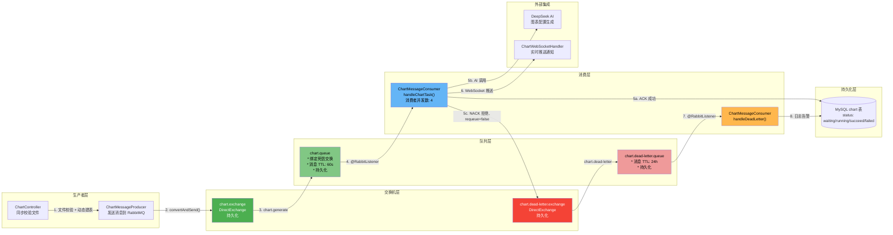

图表生成是智能 BI 系统中计算密集且耗时的核心操作——用户上传 CSV/Excel 后，系统需要通过 ECharts 配置识别目标、调用 DeepSeek AI 分析数据并生成图表配置，整个过程可能耗时 10-60 秒。如果一个用户同步等待 60 秒生成图表，不仅用户体验极差，更致命的是 Tomcat 连接池会被迅速耗尽，系统在高并发下直接雪崩。**RabbitMQ 消息队列正是系统从同步阻塞走向异步解耦的架构基石**：它将"接收请求"与"执行生成"两个阶段彻底分离，前端上传文件后立即得到响应，后端消费者从容排队处理任务，即使 AI 接口偶发超时也能通过死信队列进行优雅重试。

本页面深入剖析 RabbitMQ 在智能 BI 中的落地实践——从交换机和队列的精巧配置，到手动的消费确认与拒绝机制，再到死信队列的兜底重试与告警策略。

## 消息拓扑架构

整个 RabbitMQ 消息链路是一个**三级拓扑**：生产者 → 主交换机/主队列 → 死信交换机/死信队列。消息在正常流程中被消费确认并终结，在异常流程中被拒绝后自动投递至死信队列等待最终处理。



图中展示了完整的消息流转路径：生产者将消息投递到 `chart.exchange`，交换器根据路由键 `chart.generate` 将消息路由至 `chart.queue`；消费者从主队列拉取消息执行任务，成功则确认（ACK），**失败则拒绝（NACK）且不重新入队**，消息自动落入死信队列，由专门的处理者记录日志并告警。

Sources: [RabbitConfig.java](lunesnow-IntelligentBI-backend/src/main/java/com/lunesnow/config/RabbitConfig.java#L1-L128), [ChartMessageProducer.java](lunesnow-IntelligentBI-backend/src/main/java/com/lunesnow/mq/ChartMessageProducer.java#L1-L48), [ChartMessageConsumer.java](lunesnow-IntelligentBI-backend/src/main/java/com/lunesnow/mq/ChartMessageConsumer.java#L1-L265)

---

## 交换机与队列的精巧配置

**思考一个问题**：为什么需要死信队列？直接在消费者 catch 块中写重试逻辑不行吗？

答案是：**解耦重试策略与业务逻辑**。如果消费者在 catch 中重试 3 次，每次重试失败后的 sleep 间隔会阻塞当前线程，如果使用线程池异步重试又需要额外的存储来记录重试次数。而死信队列利用 RabbitMQ 自身的机制——消息被拒绝且不重新入队时自动路由到预先声明的死信交换机——实现了**零代码重试路由**。

### 主交换机和主队列

在 `RabbitConfig` 中，主队列通过三个关键参数与死信机制绑定：

| 参数 | 值 | 作用 |
|------|-----|------|
| `x-dead-letter-exchange` | `chart.dead-letter.exchange` | 消费失败后消息发往的死信交换机 |
| `x-dead-letter-routing-key` | `chart.dead-letter` | 死信消息的路由键 |
| `x-message-ttl` | `60000` (60 秒) | 消息在主队列中的生存时间，超时未消费自动进入死信队列（兜底策略） |

这三个参数的组合构成了架构的精髓：**`x-dead-letter-exchange` 告诉 RabbitMQ 拒绝消息时的去向，`x-dead-letter-routing-key` 定义死信队列的绑定路径，而 `x-message-ttl` 则是最后的防线——防止消息在主队列中无限积压**。

队列和交换机都设置为 `durable=true`（持久化），这意味着 RabbitMQ 重启后拓扑结构不丢失。配合 Spring AMQP 的 `Jackson2JsonMessageConverter`，消息体自动序列化为 JSON，开发者无需手写序列化/反序列化代码。

Sources: [RabbitConfig.java](lunesnow-IntelligentBI-backend/src/main/java/com/lunesnow/config/RabbitConfig.java#L44-L90)

### 死信交换机与死信队列

死信队列自身配置了 24 小时的 TTL：

```java
args.put("x-message-ttl", 24 * 60 * 60 * 1000); // 24 小时
```

这个设计隐含了一个重要的运维假设：**死信队列中的消息应在 24 小时内被人工介入处理**。如果超过 24 小时未处理，消息自动过期消失——这实际上是一个"软删除"策略，避免了数据库中的 failed 任务被无限堆积。死信队列消费端 `handleDeadLetter` 扮演的是"最终清算者"角色：它读取当前数据库中的图表状态，根据不同的状态分支做出不同反应。

Sources: [RabbitConfig.java](lunesnow-IntelligentBI-backend/src/main/java/com/lunesnow/config/RabbitConfig.java#L92-L114)

---

## 手动 ACK：从自动确认到精确控制

Spring AMQP 默认使用自动 ACK 模式——消息一旦被消费者接收并处理（无论成功与否），立即从队列中删除。这在"发后即焚"的场景下可行，但对于图表生成这种**执行结果极其重要**的任务来说，自动 ACK 意味着**AI 接口超时、数据库故障、消费者 OOM 都可能导致消息丢失**，且永远无法恢复。

本项目采用手动 ACK 模式，通过 `@RabbitListener` 注解配合 `Channel` 参数实现精确控制：

### 确认成功 — `basicAck`

```java
channel.basicAck(deliveryTag, false);
```

`deliveryTag` 是 RabbitMQ 为该信道上的每条消息分配的自增标识，`false` 表示只确认当前消息（而非之前所有未确认消息）。成功确认后，RabbitMQ 永久删除该消息。在代码中，`basicAck` 只有在**数据库状态已更新为 succeed** 且**任务槽位已释放**之后才调用，确保消费与持久化操作的最终一致性。

### 拒绝失败 — `basicNack`

```java
channel.basicNack(deliveryTag, false, false);
```

`basicNack` 的三个参数含义鲜明：`deliveryTag` 指向目标消息，第一个 `false` 表示不批量拒绝，**第二个 `false` 表示不重新入队**（即 `requeue=false`）。这个 `requeue=false` 是最关键的决定——它告诉 RabbitMQ：不要试图重新投递到原队列，直接将消息路由到 `x-dead-letter-exchange` 声明的死信交换机。

如果此处传 `true`（重新入队），则会陷入**无限重试循环**：消费者不断拉取失败消息 → 抛异常 → 重新入队 → 再次拉取。这不仅毫无意义地消耗 CPU，更严重的是会让数据库中出现大量重复的 `failed` 状态更新记录。

Sources: [ChartMessageConsumer.java](lunesnow-IntelligentBI-backend/src/main/java/com/lunesnow/mq/ChartMessageConsumer.java#L125-L128)

---

## 消费端重试控制：业务级的 3 次上限

RabbitMQ 的死信队列机制解决了"消息去哪"的问题，但没有解决"重试几次"的问题。这是因为死信队列的触发是**一次性的**——消息被拒绝一次就进入死信队列，不会自动从死信队列重新投递回主队列。因此，重试次数必须在**业务代码中自行控制**。

`ChartTaskMessage` 中设计了 `retryCount` 字段：

```java
public class ChartTaskMessage implements Serializable {
    private Long chartId;
    private String messageId;   // UUID，用于消息去重
    private int retryCount = 0;  // 重试计数
}
```

消费逻辑入口处第一件事就是检查重试次数：

```
retryCount >= MAX_RETRY_COUNT (3) → 标记 failed，释放槽位，basicAck 确认
retryCount < 3                    → 继续执行任务
```

这里有一个微妙的设计：**超过 3 次后依然调用 `basicAck` 而非 `basicNack`**。为什么？因为消息已经反复重试失败，再拒绝到死信队列也无济于事，此时应该将消息"消费掉"（不再占用队列空间），同时将失败原因持久化到数据库中，等待人工介入。**死信队列的核心价值在于"最终消息不丢失"，而非"无限循环重试"**。

Sources: [ChartMessageConsumer.java](lunesnow-IntelligentBI-backend/src/main/java/com/lunesnow/mq/ChartMessageConsumer.java#L47-L51), [ChartTaskMessage.java](lunesnow-IntelligentBI-backend/src/main/java/com/lunesnow/model/dto/chart/ChartTaskMessage.java#L1-L33)

---

## 死信队列消费：状态机驱动的分支处理

`handleDeadLetter` 方法读取数据库中的 `chart.status` 字段，根据不同状态执行四种策略：

| 数据库状态 | 消费端行为 | 核心理由 |
|-----------|-----------|----------|
| 图表已删除（`chart == null`） | 直接忽略，return | 用户可能已手动清理，死信消息无意义 |
| `succeed` | 忽略旧消息 | 用户已重新提交并成功生成，死信是旧任务的残留消息 |
| `waiting` / `running` | 暂不处理，return | 任务正在重新执行中，等待新结果 |
| `failed` | 日志告警 | 任务最终失败，需人工介入 |

这个状态机处理了一个**现实世界中很难避免的竞争条件**：用户 A 的图表任务先失败进入死信队列，同时用户 A 点击了"重新生成"按钮发送了新消息，新消息可能先于死信消息被消费并成功。此时死信消息到达 `handleDeadLetter`，如果不去检查数据库状态就直接告警，就会产生"虚假告警"。

检查 `succeed` 状态正是为了解决这个问题——**死信消息是异步的，它到达时系统的状态可能已经改变了**，必须通过数据库中**最新**的状态来决定处理策略。

Sources: [ChartMessageConsumer.java](lunesnow-IntelligentBI-backend/src/main/java/com/lunesnow/mq/ChartMessageConsumer.java#L208-L248)

---

## 消息生产与消费的完整时序

### 正常流程

```
用户上传 CSV/Excel
    │
    ▼
ChartController.genChartByAI()
    ├── 1. 校验文件格式、大小（同步）
    ├── 2. 尝试获取 Redis 任务槽位（tryAcquire）
    ├── 3. 将 CSV 数据写入 chart 表，status=waiting（同步）
    ├── 4. 根据 CSV 数据动态建表（同步）
    ├── 5. chartMessageProducer.sendChartTask(chartId) → RabbitMQ（同步）
    └── 6. 立即返回 {chartId} 给前端（同步）
                │
                ▼
ChartMessageConsumer.handleChartTask()
    ├── 1. 检查 retryCount < 3（通过）
    ├── 2. 更新 status=running + 记录等待时间
    ├── 3. 构造 AI Prompt（含分析需求 + CSV 原始数据）
    ├── 4. 调用 DeepSeekUtils.generateContent()
    ├── 5. 解析 AI 返回 → 提取 genChart + genResult
    ├── 6. 调用 validateAiResult() 验证结果有效性
    ├── 7. 更新 status=succeed + genChart + genResult + runningTime
    ├── 8. chartTaskLimiter.release(userId) → 释放任务槽位
    ├── 9. chartWebSocketHandler.notifyChartSuccess() → WebSocket 推送
    └── 10. channel.basicAck(deliveryTag, false) → 确认消息
```

### 异常流程（AI 调用失败 / 超时）

```
ChartMessageConsumer.handleChartTask()
    ├── catch (Exception e)
    │   ├── 1. 更新 status=failed + execMessage
    │   ├── 2. release(userId) → 释放任务槽位
    │   ├── 3. notifyChartFailure() → WebSocket 推送失败通知
    │   └── 4. channel.basicNack(deliveryTag, false, false)
    │                    │
    │                    ▼
    │         死信交换机 chart.dead-letter.exchange
    │                    │
    │                    ▼
    │         死信队列 chart.dead-letter.queue
    │                    │
    │                    ▼
    │   handleDeadLetter() → 根据状态分支处理
    │         ├── 图表已删除 → 忽略
    │         ├── 图表 succeed → 忽略（说明用户重新生成成功）
    │         ├── 图表 waiting/running → 暂不处理
    │         └── 图表 failed → 日志告警
    │
    ▼
用户前端收到 WebSocket 通知
    ├── 失败通知 → 显示"图表生成失败"提示
    └── 用户点击"重新生成" → 调用 retryChartGen() → 再次发送消息到 RabbitMQ
```

Sources: [ChartController.java](lunesnow-IntelligentBI-backend/src/main/java/com/lunesnow/controller/ChartController.java#L304-L370), [ChartMessageConsumer.java](lunesnow-IntelligentBI-backend/src/main/java/com/lunesnow/mq/ChartMessageConsumer.java#L85-L155), [ChartMessageProducer.java](lunesnow-IntelligentBI-backend/src/main/java/com/lunesnow/mq/ChartMessageProducer.java#L24-L47)

---

## AI 生成结果有效性验证

在确认消息之前，消费者调用了 `validateAiResult()` 方法，对 AI 返回内容进行四层校验：

```java
private void validateAiResult(String genChart, String genResult) {
    // 1. 图表配置非空
    if (genChart == null || genChart.isEmpty()) {
        throw new RuntimeException("AI 未生成有效的图表配置");
    }
    // 2. 图表配置包含 ECharts 必要字段
    if (!genChart.contains("type") && !genChart.contains("series") && !genChart.contains("data")) {
        throw new RuntimeException("缺少必要的 ECharts 配置项");
    }
    // 3. 分析结果非空
    if (genResult == null || genResult.isEmpty()) {
        throw new RuntimeException("AI 未生成有效的分析结论");
    }
    // 4. 分析结果长度检查
    if (genResult.length() < 10) {
        throw new RuntimeException("分析结论过于简短");
    }
}
```

这层校验的设计动机在于：**DeepSeek API 可能返回符合 JSON 结构但内容无意义的回复**（例如 AI 出现幻觉输出了"抱歉我不能完成这个任务"之类的文本）。如果不做校验，这些无意义的内容会直接存入数据库，前端拿到后试图渲染 ECharts 时会抛出 JavaScript 异常，给用户的感受就是"页面坏了"。

校验失败通过抛 `RuntimeException` 触发 catch 块中的 `basicNack`，将任务送入死信队列等待重试——校验失败本质上也是"任务失败"的一种，应当重试而非直接丢弃。

Sources: [ChartMessageConsumer.java](lunesnow-IntelligentBI-backend/src/main/java/com/lunesnow/mq/ChartMessageConsumer.java#L252-L265)

---

## 配置一览

RabbitMQ 的 Spring Boot 配置通过环境变量注入，所有参数均有默认值：

```yaml
spring:
  rabbitmq:
    host: ${RABBITMQ_HOST:localhost}      # 默认本地
    port: ${RABBITMQ_PORT:5672}            # 默认 5672
    username: ${RABBITMQ_USERNAME:guest}    # 默认 guest
    password: ${RABBITMQ_PASSWORD:guest}    # 默认 guest
    virtual-host: ${RABBITMQ_VHOST:/}      # 默认 /
```

消费者并发度在 `@RabbitListener` 注解中配置：

```java
@RabbitListener(queues = RabbitConfig.CHART_QUEUE, concurrency = "4")
```

`concurrency = "4"` 表示该监听器启动 4 个并发线程同时消费主队列，配合 DeepSeek AI 接口的 IO 密集型特性（网络 IO 等待时间长），4 个并发线程能够在等待 AI 响应的同时处理其他消息，有效提升吞吐量。

Sources: [application.yml](lunesnow-IntelligentBI-backend/src/main/resources/application.yml#L1-L92), [ChartMessageConsumer.java](lunesnow-IntelligentBI-backend/src/main/java/com/lunesnow/mq/ChartMessageConsumer.java#L43)

---

## 架构决策总结

本系统的 RabbitMQ 设计体现了四条核心决策原则：

**原则一：异步解耦优于同步阻塞**。将文件上传、数据写入（同步）与 AI 生成图表（异步）分离，前端接口 200ms 内即可返回，消费者的 AI 调用耗时完全与用户界面脱钩。

**原则二：死信优先于重入**。拒绝消息时设置 `requeue=false`，让消息进入死信队列而非简单重新入队，避免了无限重试循环对队列的污染。

**原则三：业务重试优于基础设施重试**。在 `ChartTaskMessage` 中记录 `retryCount`，达到上限后标记为最终失败，而非在 RabbitMQ 层面配置死信到主队列的循环路由——因为后者会让失败消息无限循环，且无法记录重试过程中的状态变化。

**原则四：最终一致性的兜底策略**。死信队列消费端是一个状态机，根据数据库中的最新状态决定处理方式，允许"先成功的消息"覆盖"后到达的死信消息"，在异步分布式系统中保证了逻辑正确性。

---

## 延伸阅读

本文是系统架构深度解析系列的一部分。现在你已经理解了消息队列如何将图表生成任务异步化，接下来建议按以下路径继续探索：

- [完整数据流水线：从上传 CSV/Excel 到 ECharts 图表的全链路追踪](6-wan-zheng-shu-ju-liu-shui-xian-cong-shang-chuan-csv-excel-dao-echarts-tu-biao-de-quan-lian-lu-zhui-zong) — 将消息队列放入全链路中理解，从用户上传到图表渲染的整体数据流
- [WebSocket 实时推送：ConcurrentHashMap 会话管理、心跳检测与在线状态](10-websocket-shi-shi-tui-song-concurrenthashmap-hui-hua-guan-li-xin-tiao-jian-ce-yu-zai-xian-zhuang-tai) — 消费者完成任务后，通过 WebSocket 实时通知前端的实现细节
- [Redis Lua 原子脚本：无竞态条件的并发任务槽位管理](14-redis-lua-yuan-zi-jiao-ben-wu-jing-tai-tiao-jian-de-bing-fa-ren-wu-cao-wei-guan-li) — 消费端使用的 `ChartTaskLimiter` 如何通过 Lua 脚本保证任务槽位的原子性
- [系统架构全景：Spring Boot 3 后端 + Vue 3 前端 + 异步消息驱动](5-xi-tong-jia-gou-quan-jing-spring-boot-3-hou-duan-vue-3-qian-duan-yi-bu-xiao-xi-qu-dong) — 回到架构全景图，将本页的内容放在整个系统中定位