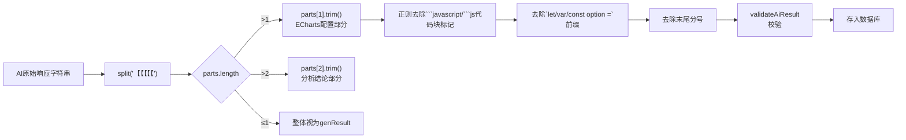
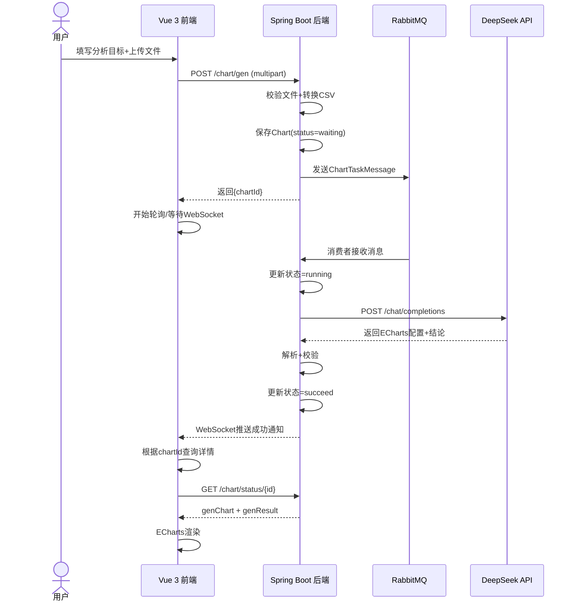

本页深入剖析系统如何将 DeepSeek AI 模型集成到智能 BI 工作流中，聚焦于 prompt 工程策略、异步 AI 调用机制以及 ECharts 配置的解析与验证。这是从原始数据到可视化图表的核心智能环节——AI 扮演"数据分析师 + 前端开发专家"的双重角色，根据用户的分析目标和 CSV 数据，自动生成可直接渲染的 ECharts 配置和详尽的分析结论。

Sources: [ChartMessageConsumer.java](lunesnow-IntelligentBI-backend/src/main/java/com/lunesnow/mq/ChartMessageConsumer.java#L1-L265), [DeepSeekUtils.java](lunesnow-IntelligentBI-backend/src/main/java/com/lunesnow/config/DeepSeekUtils.java#L1-L67)

---

## 架构全景：AI 在异步流水线中的位置

AI 调用位于图表生成流水线的末端，由 RabbitMQ 消费者异步触发。下面是 DeepSeek AI 集成在整个系统中的位置与交互方式：

```mermaid
flowchart LR
    A[用户上传文件] --> B[ChartController.getChartByAI]
    B --> C[文件校验与CSV转换]
    C --> D[保存Chart记录 status=waiting]
    D --> E[动态建表存储数据]
    E --> F[ChartMessageProducer.sendChartTask]
    F --> G[(RabbitMQ Chart Queue)]
    G --> H[ChartMessageConsumer.handleChartTask]
    H --> I[更新状态为 running]
    I --> J[构造System Prompt + User Input]
    J --> K[DeepSeekUtils.generateContent]
    K --> L((DeepSeek API))
    L --> M{API响应}
    M -- 成功 --> N[解析AI响应<br/>分隔符提取]
    N --> O[validateAiResult校验]
    O --> P[更新状态为 succeed<br/>存入 genChart + genResult]
    P --> Q[WebSocket推送成功通知]
    Q --> R[释放Redis任务槽位]
    M -- 失败 --> S[更新状态为 failed]
    S --> T[basicNack拒绝消息]
    T --> U[消息进入死信队列]
    U --> V[死信队列消费者记录告警]
```



这个架构的核心设计思路是**解耦**：控制器仅负责入参校验、文件处理和消息投递，AI 计算任务交由消费者在独立的线程池中执行。消费者配置了 concurrency=4 的并发能力，意味着最多可同时处理 4 个图表生成任务（每个任务各对应一个独立的 AI API 调用），这既利用了 DeepSeek API 的并发能力，又避免了消费者线程过度争抢系统资源。

Sources: [ChartController.java](lunesnow-IntelligentBI-backend/src/main/java/com/lunesnow/controller/ChartController.java#L320-L380), [ChartMessageConsumer.java](lunesnow-IntelligentBI-backend/src/main/java/com/lunesnow/mq/ChartMessageConsumer.java#L37-L145), [application.yml](lunesnow-IntelligentBI-backend/src/main/resources/application.yml#L72-L81)

---

## Prompt 工程：结构化指令与分隔符解析策略

### 系统提示词（System Prompt）设计

AI 生成能力的根基在于一个精心设计的系统提示词。在 `ChartMessageConsumer.handleChartTask()` 中，prompt 被构造为固定格式的指令模板：

```
你是一个数据分析师和前端开发专家，接下来我会按照以下固定格式给你提供内容：
分析需求：
{数据分析的需求或者目标}
原始数据：
{csv格式的原始数据，用,作为分隔符}
请根据这两部分内容，按照以下指定格式生成内容（此外不要输出任何多余的开头、结尾、注释）
【【【【【
{前端 Echarts V5 的 option 配置对象js代码，合理地将数据进行可视化，不要生成任何多余的内容，比如注释}
【【【【【
{明确的数据分析结论、越详细越好，不要生成多余的注释}
```

这个 prompt 的设计遵循了几个关键原则：

**角色锚定**：开头明确声明 AI 的角色是"数据分析师和前端开发专家"，这是一种经典的 prompt 工程技巧——给 AI 一个具体的身份能显著提升输出质量。数据分析师的角色确保 AI 能理解数据并提炼洞察，前端开发专家的角色确保生成的 ECharts 配置在语法和结构上正确。

**固定格式输入**：输入采用 `分析需求：` + `原始数据：` 的固定两段式结构。这种结构化的输入方式降低了 AI 误解指令的概率，让模型能够精确地定位到"目标是什么、数据是什么"这两个核心要素。

**分隔符输出约束**：输出要求使用 `【【【【【`（五个中文字符）作为分隔符，将 ECharts 配置和分析结论分开。这是一种**分隔符注入（Delimiter Injection）**技术——选择了一个极低概率在自然文本中出现的字符串作为边界标记，确保了后续解析的可靠性。

**负面约束（Negative Constraints）**：prompt 中反复强调"不要生成任何多余的内容"——包括不要注释、不要多余的开头结尾。这种负面约束减少了 AI 输出中的噪声，简化了解析逻辑。

Sources: [ChartMessageConsumer.java](lunesnow-IntelligentBI-backend/src/main/java/com/lunesnow/mq/ChartMessageConsumer.java#L68-L82)

### 用户输入（User Input）的动态构造

用户输入部分由代码动态拼装，核心代码如下：

```java
StringBuilder userInput = new StringBuilder();
userInput.append("分析需求：\n");

// 从数据库获取图表信息
Chart chartWithCsv = chartService.getById(chartId);
String userGoal = chartWithCsv.getGoal();
if (chartWithCsv.getChartType() != null && !chartWithCsv.getChartType().isEmpty()) {
    userGoal += "，请使用" + chartWithCsv.getChartType();
}
userInput.append(userGoal).append("\n");
userInput.append("原始数据：\n");
userInput.append(chartWithCsv.getChartData()).append("\n");
```

这段代码有一个值得注意的设计细节：当用户指定了 `chartType` 时，会将"请使用{图表类型}"附加到分析目标的末尾，而非作为独立参数传递。这种做法的精妙之处在于它将图表类型作为**分析需求的语义扩展**而非结构化参数，让 AI 能够根据数据类型和图表类型的组合，灵活地决定如何配置 ECharts——比如用户指定"饼图"但数据维度不匹配时，AI 可以自动进行数据聚合。

`chartData` 字段存储的是原始 CSV 字符串（通过 `ExcelUtils.excelToCsv()` 转换得到），它在 `ChartController.getChartByAI()` 中被保存到数据库，随后由消费者读取。这意味着原始数据在整个异步流水线中是以文本形式持久化在 MySQL 中的——这一设计选择意味着大数据集可能导致存储和传输开销，但对于 BI 场景下的常规文件（限制 2MB 以内），这是一个合理且简单的方案。

Sources: [ChartMessageConsumer.java](lunesnow-IntelligentBI-backend/src/main/java/com/lunesnow/mq/ChartMessageConsumer.java#L84-L93), [ExcelUtils.java](lunesnow-IntelligentBI-backend/src/main/java/com/lunesnow/utils/ExcelUtils.java#L1-L81)

---

## 响应解析：从 AI 原始输出到 ECharts 配置的转换管线

AI 的原始响应经过一条精心设计的解析管线，才能转化为系统可用的 ECharts 配置和分析结论。解析逻辑位于 `handleChartTask()` 的 try 块中：



解析管线的每一步都在处理 AI 输出的不确定性：

**步骤一：分隔符拆分** —— `aiResponse.split("【【【【【")` 以分隔符为界拆分字符串。数组长度为 1 表示 AI 未按格式输出（降级处理），长度为 2 表示仅有 ECharts 配置，长度为 3 及以上表示完整输出。当前逻辑取 `parts[1]` 作为配置、`parts[2]` 作为结论。

**步骤二：Markdown 代码块清理** —— 正则 `(?s)```(?:javascript|js)?\s*` 匹配并移除 AI 可能包裹的 Markdown 代码块标记。`(?s)` 开启单行模式（Dotall），确保 `.` 能匹配换行符。这一步解决了 AI 在不同上下文中输出代码块格式不一致的问题——有些 AI 模型默认输出 ` ```javascript ` 包裹的代码，有些则只输纯 JSON。

**步骤三：变量声明声明清理** —— `replaceFirst("^(?:let|var|const)?\\s*option\\s*=\\s*", "")` 移除 ECharts 配置前的变量声明语句。这一步处理的是 AI 可能输出 `let option = {...}` 或 `var option = {...}` 等完整 JavaScript 语句的情况，确保最终的 genChart 是纯 JSON 对象。

**步骤四：末尾分号清理** —— 如果字符串以 `;` 结尾则移除，处理 JavaScript 语句的末尾分号。

Sources: [ChartMessageConsumer.java](lunesnow-IntelligentBI-backend/src/main/java/com/lunesnow/mq/ChartMessageConsumer.java#L97-L116)

### AI 响应有效性校验（validateAiResult）

解析完成后，系统调用 `validateAiResult(genChart, genResult)` 执行四重校验：

| 校验规则 | 代码实现 | 失败处理 |
|---|---|---|
| 图表配置非空 | `genChart == null \|\| genChart.isEmpty()` | 抛 RuntimeException |
| 包含基本 ECharts 配置项 | `!genChart.contains("type") && !genChart.contains("series") && !genChart.contains("data")` | 抛 RuntimeException |
| 分析结论非空 | `genResult == null \|\| genResult.isEmpty()` | 抛 RuntimeException |
| 结论长度足够 | `genResult.length() < 10` | 抛 RuntimeException |

第二项校验的语义值得细究：它使用 `&&`（与逻辑），意味着只有当配置中**同时不包含** `type`、`series`、`data` 三个关键字段时才判定为无效。这是一种**宽松校验**策略——大多数 ECharts 配置至少会包含其中之一，这种策略降低了因严格校验而误杀合法配置的风险。

所有校验失败都通过抛出 `RuntimeException` 触发异常处理流程，最终由 catch 块将状态更新为 "failed" 并拒绝消息进入死信队列。

Sources: [ChartMessageConsumer.java](lunesnow-IntelligentBI-backend/src/main/java/com/lunesnow/mq/ChartMessageConsumer.java#L243-L265)

---

## DeepSeek API 客户端：依赖注入与配置化调用

`DeepSeekUtils` 是一个使用 Spring `@Component` 注解的工具类，封装了与 DeepSeek Chat Completions API 的 HTTP 通信：

### 关键设计决策

**构造器注入配置值**：类使用构造器注入接收 `RestTemplate`、`apiKey` 和 `baseUrl`，而非字段注入。`@Value` 注解从配置文件中读取属性：

```yaml
deepseek:
  api-key: ${DEEPSEEK_API_KEY:}
  base-url: https://api.deepseek.com
```

API 密钥通过环境变量 `DEEPSEEK_API_KEY` 注入，`.env.example` 提供了配置模板，`application-local.yml`（已被 .gitignore）储存本地开发密钥。这种多层配置策略确保了生产环境中敏感信息不会出现在代码仓库中。

**静态方法设计**：`generateContent(String systemPrompt, String userInput)` 被声明为 `static` 方法，使其可以在非注入上下文中调用（如 `ChartMessageConsumer` 中直接以 `DeepSeekUtils.generateContent(prompt, userInput)` 调用）。但注意它依赖的 `restTemplate` 也是静态字段——这种模式要求 Spring 容器在应用启动时通过构造器完成静态字段的初始化，这是一种可行的权衡方案，代价是丧失了 mock 测试的便利性。

**模型选择**：当前使用 `deepseek-v4-flash` 模型（`"model": "deepseek-v4-flash"`），且 `"stream": false` 禁用流式输出。非流式模式更适合 BI 场景下的完整 ECharts 配置生成，因为前端不需要逐步渲染。

**错误处理**：API 调用使用 try-catch 包裹，区分 `BusinessException`（业务异常直接抛出）和通用异常（包装为 SYSTEM_ERROR 抛出）。日志同时记录请求失败和异常堆栈，便于问题排查。

Sources: [DeepSeekUtils.java](lunesnow-IntelligentBI-backend/src/main/java/com/lunesnow/config/DeepSeekUtils.java#L1-L67), [application.yml](lunesnow-IntelligentBI-backend/src/main/resources/application.yml#L85-L87), [application-local.yml](lunesnow-IntelligentBI-backend/src/main/resources/application-local.yml#L16-L18), [.env.example](lunesnow-IntelligentBI-backend/.env.example#L14-L16)

---

## 异步处理与重试机制

AI 调用在异步消息消费的上下文中执行，这意味着它被多层可靠性机制保护：

### 超时保护

消费者定义了 `TASK_TIMEOUT_MS = 5 * 60 * 1000L`（5分钟）的超时阈值。在 AI 调用返回后、更新数据库之前，系统会检查耗时是否超过阈值：

```java
if (System.currentTimeMillis() - startTime > TASK_TIMEOUT_MS) {
    throw new RuntimeException("任务执行超时（超过5分钟）");
}
```

这种"事后检查"而非"事前超时控制"的设计，是考虑到 DeepSeek API 本身可能耗时较长（尤其是需要处理大量数据时）。如果采用 RestTemplate 的 connectTimeout/readTimeout，可能会过早中断正常请求。

### 重试次数限制

`ChartTaskMessage` 中的 `retryCount` 字段追踪每条消息的重试次数。消费者在进入处理逻辑前首先检查：

```java
if (message.getRetryCount() >= MAX_RETRY_COUNT) {  // MAX_RETRY_COUNT = 3
    // 标记为永久失败，不重新入队
    handleFailedTask(chartId, startTime, "超过最大重试次数(3)");
    channel.basicAck(deliveryTag, false);  // 确认消息（丢弃）
    return;
}
```

重试计数与死信队列协作：每次处理失败，消息通过 `basicNack(deliveryTag, false, false)` 被拒绝且不重新入队，自动进入死信交换机。死信队列的消费者 `handleDeadLetter()` 作为"最终处理者"，记录日志并根据图表状态决定是否告警。

### 重试 vs 重新生成

系统中存在两种"重试"语义：

1. **消息级别的重试（自动）**：由 RabbitMQ 死信队列驱动，消息被拒绝后经过 TTL（当前未设置死信 TTL，但主队列设置了可选的 60s TTL）后回到主队列。`retryCount` 从 0 递增到 MAX_RETRY_COUNT。
2. **用户触发的重新生成（手动）**：`ChartController.retryChartGen()` 允许用户对状态为 "failed" 的图表发起重新生成，它重置状态为 "waiting" 并发送一条全新的消息（retryCount=0）。

两种机制的组合意味着：AI 调用失败后最多自动重试 3 次，如果仍然失败，用户仍可手动触发重新生成。

Sources: [ChartMessageConsumer.java](lunesnow-IntelligentBI-backend/src/main/java/com/lunesnow/mq/ChartMessageConsumer.java#L41-L63), [ChartController.java](lunesnow-IntelligentBI-backend/src/main/java/com/lunesnow/controller/ChartController.java#L397-L444), [RabbitConfig.java](lunesnow-IntelligentBI-backend/src/main/java/com/lunesnow/config/RabbitConfig.java#L57-L60)

---

## 前后端交互：从提交到渲染的完整回路

DeepSeek AI 集成的最终目标，是让前端能够渲染出图表。整个过程遵循"异步提交 + 轮询/推送获取结果"的模式：



关键设计点是：**控制器在消息发送成功后立即返回 `chartId`，此时图表只是"等待处理"状态**。前端可以通过两种方式获取最终结果：
- **WebSocket 实时推送**：消费者在成功或失败时调用 `chartWebSocketHandler.notifyChartSuccess/failure()` 推送通知
- **轮询**：前端定时调用 `GET /chart/status/{id}` 查询最新状态

这种双通道通知机制确保了无论在何种网络条件下，前端都能可靠地获取到 AI 生成的结果。

Sources: [ChartController.java](lunesnow-IntelligentBI-backend/src/main/java/com/lunesnow/controller/ChartController.java#L320-L380), [ChartWebSocketHandler.java](lunesnow-IntelligentBI-backend/src/main/java/com/lunesnow/websocket/ChartWebSocketHandler.java#L103-L124)

---

## 生成内容的安全渲染

AI 生成的 ECharts 配置最终被传递给前端的 ECharts 实例进行渲染。这里存在一个潜在的安全风险：**如果 AI 生成的配置中包含恶意代码（如事件处理函数中的 XSS），直接执行可能导致安全问题**。

系统的安全策略体现在两个层面：

1. **后端过滤**：`validateAiResult()` 只做语法形式校验，不执行内容安全性过滤。后端并不对 AI 生成的 `genChart` 字符串进行深度安全检查。
2. **前端安全渲染**：前端的图表在线编辑器（在[图表在线编辑器：JSON 实时编辑、ECharts 安全渲染与危险字段过滤](21-tu-biao-zai-xian-bian-ji-qi-json-shi-shi-bian-ji-echarts-an-quan-xuan-ran-yu-wei-xian-zi-duan-guo-lu)中详细讨论）负责执行危险字段过滤。

对于自动生成的图表（非用户手动编辑），系统默认信任 AI 的输出。这种信任模型在绝大多数场景下是合理的，因为 AI 模型本身不会主动生成恶意代码。但如果系统被用于处理来自不可信来源的 AI 配置，建议在后端增加 JSON Schema 验证层，只允许 ECharts 的常规配置字段通过。

Sources: [ChartMessageConsumer.java](lunesnow-IntelligentBI-backend/src/main/java/com/lunesnow/mq/ChartMessageConsumer.java#L243-L265)

---

## 配置与部署

DeepSeek AI 集成的部署配置涉及以下维度：

| 配置项 | 位置 | 说明 |
|---|---|---|
| `deepseek.api-key` | `application.yml` / 环境变量 | DeepSeek API 密钥，通过 `${DEEPSEEK_API_KEY:}` 读取环境变量 |
| `deepseek.base-url` | `application.yml` | API 基础 URL，默认为 `https://api.deepseek.com` |
| 模型名称 | `DeepSeekUtils.java` 硬编码 | 当前为 `deepseek-v4-flash` |
| 流式输出 | `DeepSeekUtils.java` 硬编码 | `"stream": false` |
| 任务超时 | `ChartMessageConsumer.java` 硬编码 | 5 分钟（`5 * 60 * 1000L`） |
| 最大重试次数 | `ChartMessageConsumer.java` 硬编码 | 3 次 |

生产环境部署时，通过环境变量注入 `DEEPSEEK_API_KEY` 是最佳实践。`.env.example` 文件提供了配置模板供开发者参考。

Sources: [application.yml](lunesnow-IntelligentBI-backend/src/main/resources/application.yml#L85-L87), [DeepSeekUtils.java](lunesnow-IntelligentBI-backend/src/main/java/com/lunesnow/config/DeepSeekUtils.java#L35-L44), [.env.example](lunesnow-IntelligentBI-backend/.env.example#L14-L16)

---

## 总结与进阶阅读

DeepSeek AI 集成是智能 BI 系统的核心智能引擎。其设计精髓在于：通过**结构化 prompt 工程**引导 AI 输出可控格式的 ECharts 配置，通过**异步消息队列**将 AI 计算与请求处理解耦，通过**多重校验与重试机制**保障生成结果的可靠性，通过**WebSocket 实时推送**缩短用户等待感知。

建议在此页基础上进一步阅读：

- [图表生成控制器：文件校验、动态建表、任务限流与异步提交](7-tu-biao-sheng-cheng-kong-zhi-qi-wen-jian-xiao-yan-dong-tai-jian-biao-ren-wu-xian-liu-yu-yi-bu-ti-jiao)——了解 AI 调用前的完整请求处理链
- [RabbitMQ 消息队列：可靠投递、手动 ACK 与死信队列重试机制](8-rabbitmq-xiao-xi-dui-lie-ke-kao-tou-di-shou-dong-ack-yu-si-xin-dui-lie-zhong-shi-ji-zhi)——深入理解异步消息的可靠性保障
- [WebSocket 实时推送：ConcurrentHashMap 会话管理、心跳检测与在线状态](10-websocket-shi-shi-tui-song-concurrenthashmap-hui-hua-guan-li-xin-tiao-jian-ce-yu-zai-xian-zhuang-tai)——了解 AI 生成结果如何推送到前端
- [图表在线编辑器：JSON 实时编辑、ECharts 安全渲染与危险字段过滤](21-tu-biao-zai-xian-bian-ji-qi-json-shi-shi-bian-ji-echarts-an-quan-xuan-ran-yu-wei-xian-zi-duan-guo-lu)——了解前端如何安全渲染 AI 生成的配置