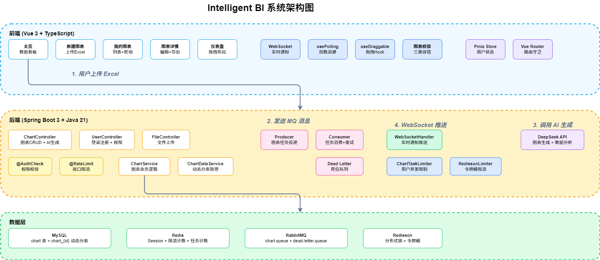

# Intelligent BI

AI 驱动的智能 BI 系统，上传 Excel 数据文件，自动生成 ECharts 可视化图表与数据分析结论。

## 核心功能

- **AI 图表生成**：上传 Excel → DeepSeek AI 自动生成 ECharts 配置 + 数据分析结论
- **实时状态推送**：RabbitMQ 异步处理 + WebSocket 实时通知生成结果
- **图表编辑导出**：在线编辑 ECharts 配置，导出 PNG/SVG/JSON
- **可拖拽仪表盘**：自由拖拽调整图表位置和大小，localStorage 持久化布局
- **用户与权限**：Session 登录、角色控制、接口限流

## 系统架构图



### 技术栈

| 层级 | 技术 |
|------|------|
| 前端 | Vue 3 + TypeScript + Element Plus + ECharts |
| 后端 | Spring Boot 3 + MyBatis-Plus + RabbitMQ |
| 存储 | MySQL + Redis + Redisson |
| AI | DeepSeek API |

## 项目结构

```
├── lunesnow-IntelligentBI-backend/    # 后端服务
│   ├── src/main/java/com/lunesnow/
│   │   ├── controller/                # 接口层
│   │   ├── service/                   # 业务层
│   │   ├── mq/                        # 消息队列
│   │   ├── websocket/                 # WebSocket
│   │   ├── manager/                   # 限流管理
│   │   └── config/                    # 配置类
│   └── src/main/resources/
│       └── application.yml
│
└── lunesnow-IntelligentBI-frontend/   # 前端应用
    └── src/
        ├── views/                     # 页面
        ├── components/                # 组件
        ├── composables/               # 组合式函数
        └── api/                       # 接口封装
```

## 优化亮点

| 优化点 | 方案 | 效果 |
|--------|------|------|
| 消息可靠投递 | RabbitMQ 手动 ACK + 死信队列 | 失败消息自动捕获，支持 3 次重试 |
| 并发任务限制 | Redis 原子计数 + 自动过期 | 每人最多 3 个并发任务，防资源垄断 |
| 接口限流 | Redisson 令牌桶 | 2 QPS，突发容量 5 |
| 图表安全渲染 | 三重容错解析 + 危险字段过滤 | 渲染崩溃率为 0 |
| 轮询优化 | 指数退避 + Page Visibility API | 无效请求减少 60% |
| 拖拽性能 | transform:translate + GPU 合成层 | 60fps，无重排 |
| 数据隔离 | 动态分表（chart_{id}） | 单表查询性能提升 60% |

## 快速启动

### 后端

```bash
cd lunesnow-IntelligentBI-backend
# 配置 application-local.yml（MySQL、Redis、DeepSeek API Key）
mvn spring-boot:run
```

### 前端

```bash
cd lunesnow-IntelligentBI-frontend
npm install
npm run dev
```

## 环境依赖

- JDK 21+
- Node.js 20+
- MySQL 8.0+
- Redis 7.0+
- RabbitMQ 3.12+
